# 机器学习的概率和统计

> 原文：<https://medium.datadriveninvestor.com/probability-and-statistics-for-machine-learning-7e13d82d919c?source=collection_archive---------1----------------------->

概率统计是开始机器学习之前应该学习的重要数学课题之一。但是在开始机器学习之前，你真的需要知道每一件事情吗？大家一个一个讨论吧。

**均值:**均值是数据集的平均值。

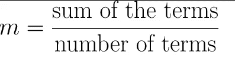

**中位数:**中间的一组数字。

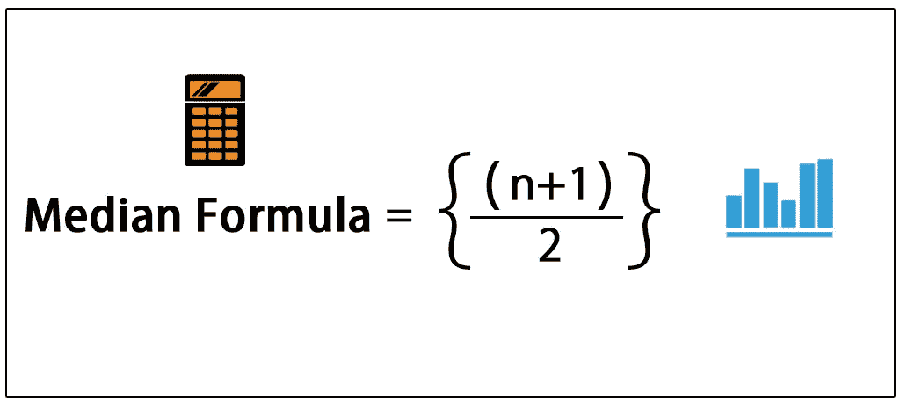

**模式:**数据集中最常见的数字。

**方差:**方差衡量数据集分布的程度。它在数学上被定义为平均值的平方差的平均值。

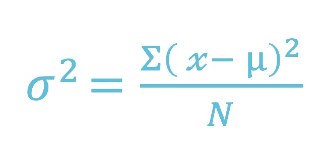

**标准差:**方差的平方根就是标准差。而 var。给你一个关于分布的粗略概念，标准差更具体，给你离平均值的精确距离。它的符号是 **σ** (希腊字母 sigma)


**总体:**总体是一个群体的一整套数。

总体均值符号为μ。

```
The formula population mean is:
**μ = (Σ * X)/ N**
*where*:
Σ = “the sum of.”
X = all the individual items in the group.
N = the number of items in the group.
```

**样本:**样本是总体的子集/部分。

```
The sample mean formula is:
**x̄ = ( Σ xi ) / n** x̄  = sample mean
Σ  = means “add up”
xi  = “all of the x-values
n  = means “the number of items in the sample”
```

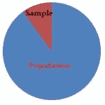

[Source](https://www.statisticshowto.datasciencecentral.com/what-is-a-population/)

也就是说，让我们想象你必须估计世界上每个人的平均体重。你会怎么做？

现在，您有两个选择:

*   去问每个人的体重，记下并取平均值。运筹学
*   去找一些人(一组随机的人)写下他们的体重并取平均值。

## 分布

*分布只是一个变量的数据或分数的集合。通常，这些分数是按照从小到大的顺序排列的，然后可以用图形显示出来。*

**密度函数:**分布最常用密度或密度函数来描述。密度函数有两种类型: *PDF(概率密度函数)和 CDF(累积密度函数)*

**PDF:** 计算观察给定值的概率。它是 CDF 的衍生物。

**CDF:** 计算观察值等于或小于某个值的概率。

**高斯分布:**可以用两个参数*均值、方差来描述。*

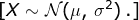

*其中:N-正态分布，μ-均值，σ-方差*

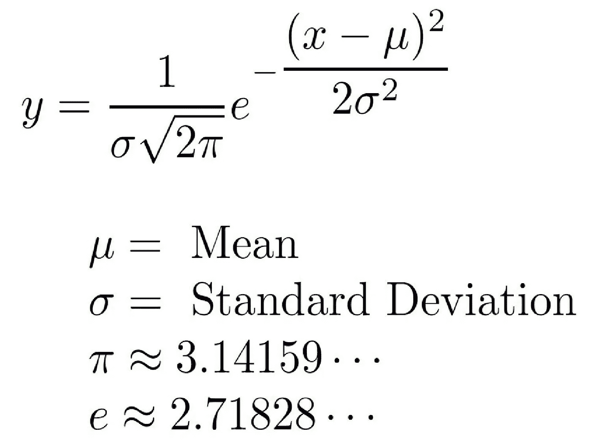

让我们深入研究一下公式。

假设μ= 0 且σ= 1，则

```
Y = 1/ √2π exp{-1/2}x²
```

这里π和 *e 是定值。*

所以可以写成:

```
***Y = exp(-x²)***
i.e
x=0 >> Y=exp(-1^2) = 0
x=1 >> Y = exp(-1^2) =0.36 
x=2 >>Y = exp(-2^2) = 0.018
```

由此我们可以理解，即使 x 增加或减少，曲线也会自然减少。

*   x 远离μ，Y 开始减小。
*   它是对称的。

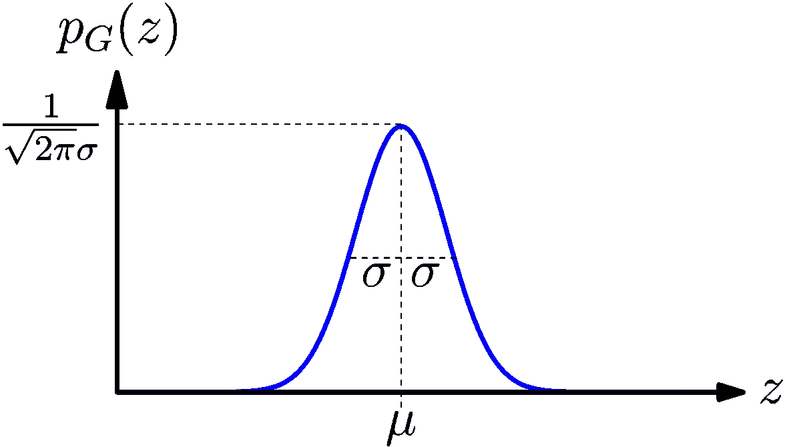

[Source](https://www.google.com/url?sa=i&source=images&cd=&cad=rja&uact=8&ved=2ahUKEwjIxbGb8sbmAhVvyzgGHQXnA8IQjhx6BAgBEAI&url=https%3A%2F%2Fengineering.stackexchange.com%2Fquestions%2F19239%2Fwhat-does-a-the-input-of-the-activation-function-mean&psig=AOvVaw3BWBfYXv-8ulUEHqfbZHU1&ust=1577022859854892)

现在，我们来谈谈高斯分布的 CDF。

*   当 mu 为零时，CDF 为一半。
*   当μ较小时，CDF 变得更接近
*   如果你仔细观察下图，你会发现 mu = 0 时 CDF 很高并且对称。

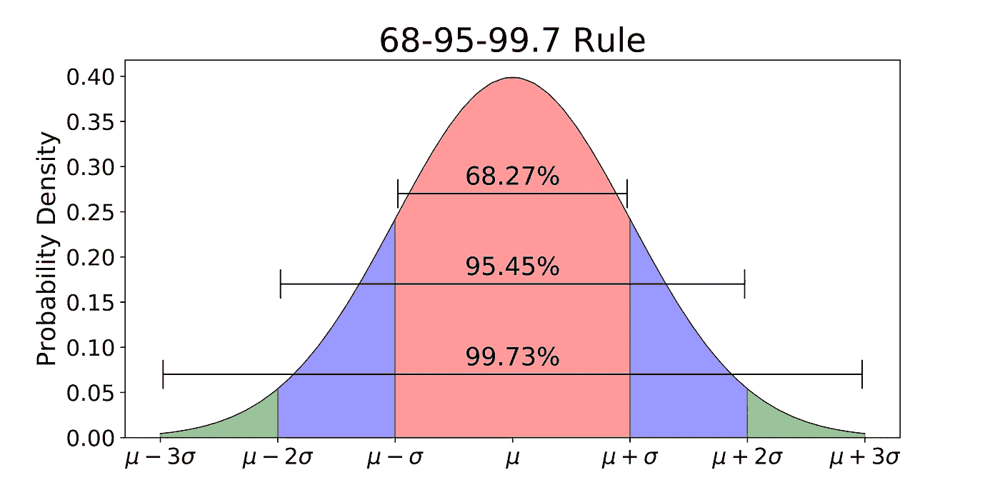

基本上它说

> 68%的值在 1 个标准偏差内，95%的值在 2 个标准偏差内，99.7 个值在 3 个标准偏差内。

[](https://www.datadriveninvestor.com/2019/03/03/editors-pick-5-machine-learning-books/) [## DDI 编辑推荐:5 本让你从新手变成专家的机器学习书籍|数据驱动…

### 机器学习行业的蓬勃发展重新引起了人们对人工智能的兴趣

www.datadriveninvestor.com](https://www.datadriveninvestor.com/2019/03/03/editors-pick-5-machine-learning-books/) 

也就是说——假设，我们必须测量教室里每个人的年龄。因此，当我们绘制高斯图时，大多数学生的年龄相同，因为他们在同一个班级。所以他们会很容易的躺在第一个标准差里。与班上其他人相比，有些人可能太老或太年轻，他们将位于第二个标准差中。会有一个老师比班上的其他人更老，所以会有 3 个标准差。

**峰度:**用于测量高斯的峰值。换句话说，一个分布的尾部与一个正态分布的尾部有多大的不同。

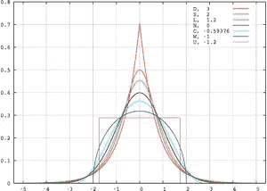

[https://en.wikipedia.org/wiki/Kurtosis](https://en.wikipedia.org/wiki/Kurtosis)

**核密度估计:**对概率密度函数进行非参数方式的估计。这是基本的平滑问题，通过*平滑直方图，我们可以计算 PDF。*

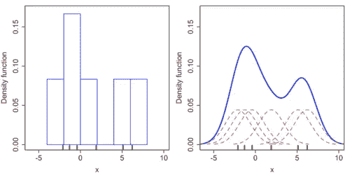

[https://en.wikipedia.org/wiki/Kernel_density_estimation](https://en.wikipedia.org/wiki/Kernel_density_estimation)

*   KDE 方差是一个带宽
*   首先，我们对每个内核进行平滑绘制，用红色显示它们的高度。
*   通过添加每个内核的高度，我们得到了以蓝色显示的 PDF。

**抽样分布:**不一定每个分布都是高斯分布。有时我们必须使分布呈高斯分布。从给定的数据集中取 n 次随机数据，计算平均值/中值，并再次对其进行处理以计算样本平均值/中值，称为采样分布。

**中心极限定理:**它陈述了随着样本量变大，样本均值的抽样分布趋近于正态分布——无论总体分布的形状如何。


*Source: corporatefinanceinstitute.com*

*   随机抽取不少于 30 个样本，在进行 m 次抽样后取平均值，我们将得到 *m 个平均值。*
*   并且通过取 m 个样本的平均值，平均值趋向于转换成高斯型。

```
*distribution of X = sampling distribution of sample mean*
```

**伯努利:**只有两种结果的分布。

失败的概率在 x 轴上标记为 0，成功标记为 1。在下面的伯努利分布中，成功的概率(1)是 0.4，失败的概率(0)是 0.6:

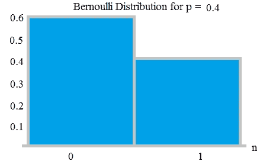

**二项分布:**伯努利分布与二项分布密切相关。伯努利分布有时用于模拟经历死亡、疾病或疾病暴露等事件的单个个体。该模型是一个人发生问题事件的概率的极好指标。

*   1 =“事件”(P = p)
*   0 =“非事件”(P = 1 — p)

在*逻辑回归*中使用伯努利分布来模拟疾病的发生。

**对数正态分布:**对数正态分布是对数呈正态分布的随机变量的连续概率分布。对数正态分布的随机变量只取正的实数值。

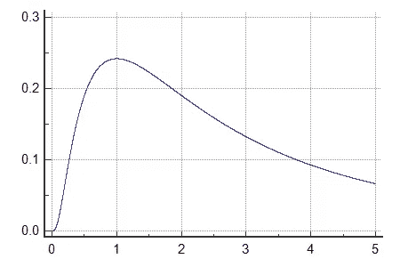

[source](https://www.google.com/search?q=log+normal+distribution&newwindow=1&safe=active&rlz=1C1CHBF_enIN869IN869&sxsrf=ACYBGNSnW6KUYHd1nw74Ndbd-ckEsqBZ1g:1577003435177&source=lnms&tbm=isch&sa=X&ved=2ahUKEwjdtcDM68jmAhXUT30KHRLXDk8Q_AUoAXoECBMQAw&biw=1536&bih=792#imgrc=MLB6lvMB659TuM:)

前任。

*   互联网论坛上发表的评论长度遵循对数正态分布
*   用户在在线文章上停留的时间

如果随机变量 X 是对数正态分布，那么 *Y = ln(X)* 具有正态分布。同样，如果 Y 具有正态分布，那么 Y 的指数函数， *X = exp(Y)，*具有对数正态分布。

**幂律分布:**幂律陈述一个量的变化导致另一个量的成比例的相对变化。一个最简单的例子是:如果你把一条边的长度增加一倍(比如说，从 2 英寸增加到 4 英寸)，那么面积就会增加四倍(从 4 平方英寸增加到 16 平方英寸)。

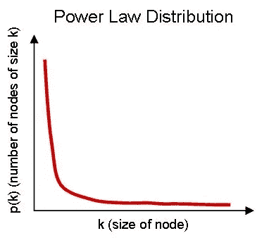

[Source](https://www.google.com/url?sa=i&source=images&cd=&ved=2ahUKEwimw6W5isnmAhVHgUsFHXYzCtoQjRx6BAgBEAQ&url=https%3A%2F%2Fwww.comscore.com%2FInsights%2FBlog%2FPart-2-Why-the-Power-of-Habit-Drives-Power-Law-Distributions-in-Mobile-App-Usage&psig=AOvVaw2g-HQntrzY_bFM_8R7UwlV&ust=1577098113188761)

**协差:**协差用于确定两个数据之间的关系。

```
***Cov(X,Y) = Σ E((X-μ)E(Y-ν)) / n-1***X is a random variable
E(X) = μ is the expected value (the mean) of the random variable X and
E(Y) = ν is the expected value (the mean) of the random variable Y
n = the number of items in the data set
```

它有三种类型:

*   较大的负协变:当两个数据之间存在反向关系时
*   零协变:当两个数据之间没有关系时
*   大的正协变:当两个数据之间有很强的相关性时

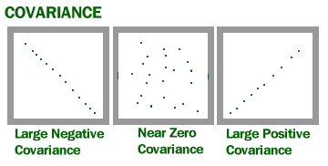

要找出两个数据之间的协方差，有许多方法。在这里，我们将讨论其中的一些

1.  **皮尔逊相关系数:**表示两个数据在-1 到 1 范围内的关系。

```
Px,y = cov(x,y)/ σx, σy
```

*   如果数据是完全相关的，那么它的皮尔逊相关值为 1。
*   如果两个数据之间没有关系，则皮尔逊相关值为 0。
*   如果数据是完全相关的，那么它的皮尔逊相关值为 1。

**2。Spearman 等级相关系数:**用于发现数据之间的相关程度。

假设我们分别有 x 和 y 的 10 个数据点。

十:11，34，56，43，23，66，89，12，67，54

Y: 20，3，44，5，6，54，67，89，43，21

然后我们开始从 1 到 10 排列数字。最高分应标为“1”，最低分应标为“10”。表格将如下所示:

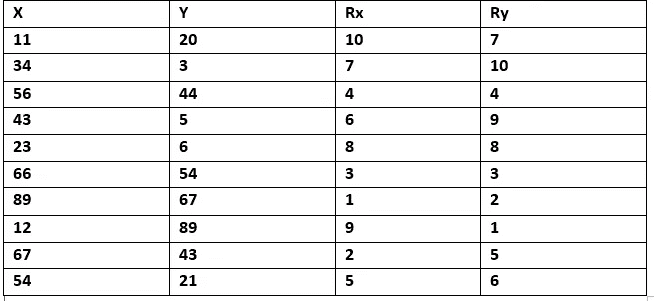

现在，如果 Rx，Ry 的值严格增加，r = 1

如果 Rx 增加，Ry 减少，那么 r = -1

*皮尔逊和斯皮尔曼相关系数的关系*

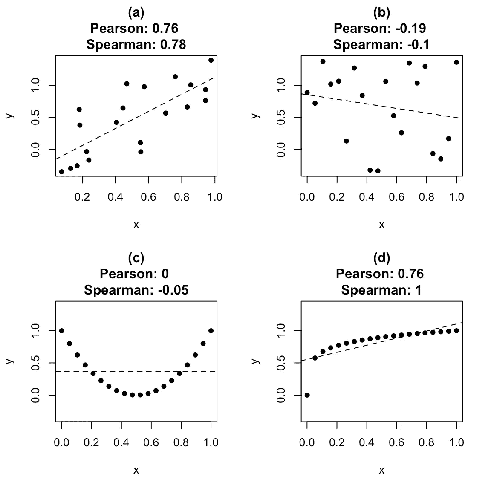

[http://www.jeremy-oakley.staff.shef.ac.uk/mas113/notes/](http://www.jeremy-oakley.staff.shef.ac.uk/mas113/notes/)

感谢阅读！！！

欢迎建议！！！

**参考文献:**

[](https://www.statisticshowto.datasciencecentral.com/) [## 欢迎来到统计 How To！

### 寻找初级统计帮助？你来对地方了。统计怎么有 1000 多条…

www.statisticshowto.datasciencecentral.com](https://www.statisticshowto.datasciencecentral.com/) [](https://en.wikipedia.org/wiki/Probability) [## 可能性

### 概率是对一个事件发生的可能性或一个命题发生的可能性的数字描述

en.wikipedia.org](https://en.wikipedia.org/wiki/Probability) [](https://en.wikipedia.org/wiki/Statistics) [## 统计数字

### 统计学是关于收集、组织、显示、分析、解释和统计的学科

en.wikipedia.org](https://en.wikipedia.org/wiki/Statistics) [](https://www.mathsisfun.com/) [## 数学很有趣

### 你能打败它吗！最近更新 2019 年 4 月 19 日帮助人们学习 19 年始于 2000 年 4 月 19 日见最近…

www.mathsisfun.com](https://www.mathsisfun.com/)