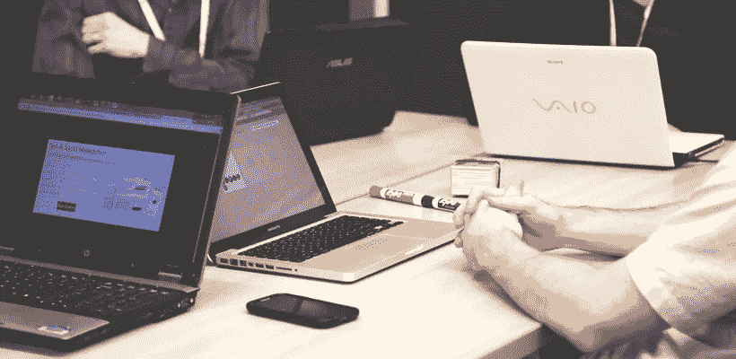

# 会议中的问题:会议不起作用的 5 个原因

> 原文：<https://medium.datadriveninvestor.com/problems-in-meetings-5-reasons-your-meetings-dont-work-ccbe5a28100c?source=collection_archive---------11----------------------->

想知道如何改进会议吗？

也许能让它们更有效？

那么，你来对地方了。

今天，我们来看看会议中的常见问题……这些问题让你的会议成为浪费时间的会议，而不是富有成效的会议。

以下是关于会议的 5 个常见抱怨，以及如何解决它们。

# 原因 1:“为什么这次会议没有取得任何进展？”

有没有在会议室里感觉时间停止了？

那你应该很熟悉这个会议投诉。

你看，没有什么比看着油漆变干更糟糕的了。

事实上，人们说比起无聊的会议，他们更喜欢这样。

但是为什么会议会在这里结束呢？

几个原因。

会议中一些最常见的问题是:

## #1:人们一直在兜圈子

你知道那是什么感觉:

听着那些不停绕圈子说话的人。

很沮丧，不是吗？

没错。这就是为什么这对你的会议来说是个大问题。

你如何让人们摆脱这种[恼人的会议习惯](https://www.getminute.com/meeting-best-practices/)？

简单:

安排会议时间。

在会议室中间放一个真正的鸡蛋计时器，这样每个人都能看到还剩多少时间。

鸡蛋计时器是干什么的？

这给你的会议带来了急需的紧迫感。

由于这种紧迫性，你的会议突然变得非常集中。

## #2:会议太长了

冗长的会议默认是有问题的。

为什么？

因为它们为散漫和不集中的工作留下了太多的空间。

相反，为你的会议安排 15-30 分钟。

这样，没有人有时间感到无聊和失去注意力。人们将继续关注会议的目的。

如果你在想:

“我们永远也做不到——我们人太多了。”

事情是这样的:

你的会议应该只包括那些[对会议](https://www.getminute.com/how-to-run-a-meeting-like-google-apple-amazon-and-facebook/)目的绝对不可或缺的人。

不要邀请其他人“以防”或不要显得粗鲁。

# 理由 2:“这次会议的目的是什么？”

会议中最大的问题之一是:

他们觉得毫无意义。

这是为什么呢？

原因如下:

## #1:信息可以通过电子邮件发送

看:

如果你花了一个小时讨论一些可以用电子邮件快速发送的东西，你的会议会觉得是浪费时间。

相反，要确保*会面*是传达这一信息的最佳方式。

简而言之，如果你希望进行任何形式的讨论，你的会议是必要的。

所以:

如果你只是单纯地通知人们一些事情，会议可能不是最好的方式。

想了解更多？阅读我们的[指南，了解召开会议的理由](https://www.getminute.com/unproductive-meetings/)。

## #2:没有明确的会议目的

现在，如果会议有一个问题，那就是:

他们没有目的。

因为许多会议缺乏目的，人们东拉西扯，他们陷入细节。

要解决这个问题:

会前决定会议目的。

会发生什么？

你的会议立刻就有了界限。

人们知道他们应该谈论什么。

而且他们不会因为看到了大局而拘泥于细节。

总的来说，你的会议立即变得更有成效。

双赢！

# 原因 3:“人们不能在办公桌前查看电子邮件吗？”

还有比这更让人沮丧的事吗？

你正在开会——你的办公桌上有紧急任务等着你。

每个人都不停地查看手机或用笔记本电脑工作。

如果会议有什么感觉的话，那就是浪费时间。

那么，你能做些什么来防止你的会议被智能手机和笔记本电脑劫持呢？

## #1:制定基本规则

首先也是最重要的:

制定清晰明确的会议规则。

这意味着:

请与会者将他们的笔记本电脑和手机放在办公桌上。

设定期望值:

当他们在开会时，他们是需要的。

如果你还在纠结这个问题，请继续读下去！

## #2:改善你的会议管理

现在:

规则是伟大的…直到人们忘记它们，一切恢复正常。

这就是为什么你作为会议主持人，需要确保你的会议得到有效的领导。

所以:

提醒人们您的会议规则。

确保他们跟随他们(并提醒他们为什么存在)。

如果你坚持这样做，你会发现你的会议效率会大大提高。

# 原因 4:“为什么我们还在谈论这个？”

无目的会议的定义是什么？

没错——反复讨论相同问题的会议。

为什么会这样？

因为没有后续系统。

人们不清楚会议上决定了什么。

没有人“拥有”行动项目。

所以在会议之间什么也做不了。你最终会有一种似曾相识的感觉，因为同样的事情会被讨论。

但是以下是如何避免最终失败的方法:

## #1:创建清晰的行动项目

首先:

你的行动项目需要清晰，以便于后续跟进。

以下是您需要包括的内容:

**#1:所有权。**谁负责完成行动项目？这些信息是至关重要的，因为如果你不定义它，任务很可能根本无法完成。

**#2:细节。**行动项目是关于什么的？尽可能具体，以避免任何误解或曲解。

**#3:截止日期。截止日期是什么时候？除非有最后期限，否则项目很可能会半途而废。**

但是行动项目是不够的。

你还需要一个跟进系统:

## #2:创建跟进系统

有了跟进系统，你就能保证你的会议行动项目得到完成。

结果呢？

你可以检查它们…并且不必在另一个会议上讨论它们。

那么一个好的跟进系统是什么样子的呢？

你的跟进系统可以简单到安排几封提醒邮件。

或者，你可以用自动化工具建立一个任务跟踪系统，比如 [Trello](https://trello.com/) 。

我们的会议工具 [Minute](https://www.getminute.com/) ，可以让你给任务添加截止日期，这样你就可以在一个地方创建并跟进它们。

想了解更多关于行动项目和跟踪它们的信息吗？[在这里阅读我们的指南。](https://www.getminute.com/nl/meeting-action-items-how-to-easily-write-and-follow-up-on-them/)

# 原因 5:“为什么没人说话？”

会议都是关于合作的。

如果你想通知与会者一些事情，并且不希望有任何互动，你可以发一封电子邮件。

因此，当会议最终成为一场单方面的独白时，你就知道出问题了。

但是你如何确保这不会发生呢？

采取以下步骤:

## #1:让说出自己的想法更容易

如果你注意到人们在你的会议上什么也没说，原因可能很简单。

说出来的门槛可能太高了。

可能是办公室动态。

可能是他们不明白你开会的目的是什么(比如说，你还没有明确目的)。

或者-也许你的会议很无聊。

不管是什么原因，最好的补救方法之一就是在你的会议中加入[破冰](https://www.getminute.com/leading-meetings-effectively/)和[其他有趣的元素](http://getminute.com/fun-meetings)。

您可以做的一些示例如下:

*   **给每个人一个任务，表示感谢。如果你在会议前给人们一个准备的机会，那么在会议中发言会容易得多。**
*   **从破冰船开始，帮助人们感到轻松。**比如:“你最喜欢你工作的什么，为什么？”
*   询问人们他们希望你的会议是什么样的。给你的同事一个机会，让他们对你的会议发表意见。

但这还不是全部。

还有一种方法可以增加会议互动。

请继续阅读，找出它是什么。

## #2:确保每个人都有机会畅所欲言

事情是这样的:

会议的参与程度取决于一个人……会议的领导者。

所以:你。

不要含糊地询问人们的意见，而是这样做:

你知道会议是如何以一个模糊的问题开始的，比如“谁想说点什么？”

不要那样做。

为每个会议参与者分配发言时间。

这个发言时间大约是 5 分钟。

如果人们没有更长的发言时间，他们就需要集中精力想说什么。

显然，你需要在会议前给他们所有的信息(议程，最好是你有的任何背景信息)来帮助他们准备。

结果，你会得到一个更具互动性的会议……会议中的问题也会更少。

# 如何安排你的会议

这就是了。

现在你知道会议中的什么问题正在破坏你的会议。

所以:

要安排你的会议，看看上面的列表。

你安排会议的第一步是什么？

请在下面留言告诉我们。

*原载于 2018 年 10 月 3 日*[*【www.getminute.com】*](https://www.getminute.com/problems-in-meetings/)*。*