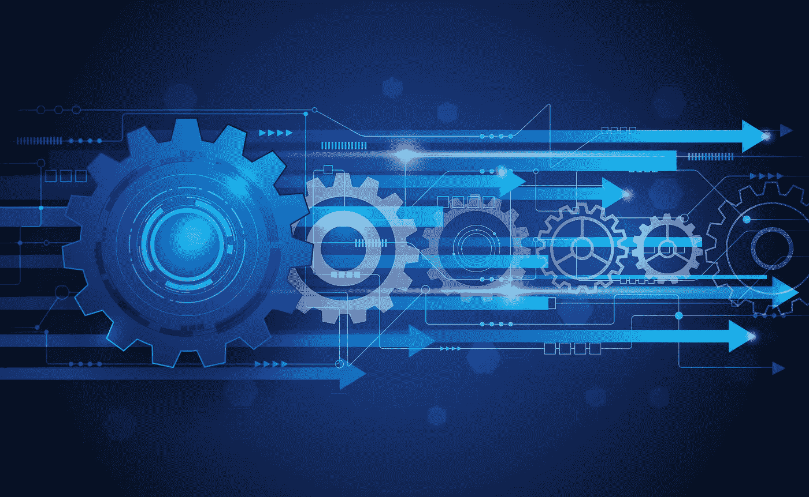

# 过程智能——现在有了机器学习和人工智能

> 原文：<https://medium.datadriveninvestor.com/process-intelligence-now-with-machine-learning-and-artificial-intelligence-867113da2a7b?source=collection_archive---------9----------------------->

人工智能(AI)和机器学习在过去几年中获得了显著的发展势头；各行各业的企业都在快速接受这项技术，采用率会进一步提高。越来越多的公司开始看到这项技术能给公司带来的积极影响。事实上， [Gartner 预测](http://www.gartner.com/imagesrv/summits/docs/na/customer-360/C360_2011_brochure_FINAL.pdf)到 2020 年，85%的客户互动将无人管理。

# 流程智能如何改变您看待业务流程的方式

传统的商业智能(BI)工具有助于提供高度概括的分析，通过利用收集的大量数据来显示关键绩效指标(KPI)，帮助流程领导者做出更明智的决策。使用 BI，您可以分析大数据并实时查看数据摘要。然而，像许多其他技术一样，它也有局限性。虽然 BI 类型的软件可以提供一些关于商业运作的洞察力，但是它总是需要一个假设来判断哪里工作的好或者不好。这意味着用户需要了解流程，并能够提出正确的问题。没有这些问题，传统的 BI 类型分析无法揭示任何东西。除此之外，流程往往相当复杂，这意味着很难获得对实际发生情况的详细解释。这是一个问题，因为 BI 可以显示操作指标，但需要由人来解释。现在的问题是，不同的人会看到相同的指标，看到不同的含义。

在这里，我想向您介绍一种新型的业务流程大数据分析:流程智能。这利用了流程挖掘、行业最佳实践分析工具、通过短信、电子邮件和 webhooks 的实时监控，以及人工智能的预测。这种技术改变了业务用户理解流程的方式。

为什么这种技术如此惊天动地，为什么我总是谈论它？因为 process intelligence 对流程在现实生活中的工作方式提供了 100%的透明度，使他们能够查明业务流程的低效之处。如今，没有任何其他软件解决方案能够如此深入地理解和监控业务流程。借助当今的过程智能解决方案，您可以看到“原样”状态，包括所有高级分析，并能够深入了解过程的粒度细节。流程智能可以解释流程中断的原因以及如何通过提供您已经拥有的“全身扫描”数据来修复它们；这种扫描为您提供了不带偏见的分析，以解决您甚至不知道自己遇到的问题。

# 人工智能增强的流程管理在数字化转型中发挥着核心作用

BPM 和 AI 的前路相当光明！有了人工智能，流程正在一个全新的层面上转变；许多企业继续决定实施人工智能来改善他们的公司。人工智能正在赋予人类智能以不断改善用户交互和流程执行。直到最近，顾问还是改善业务流程的最佳解决方案。尽管在过程理解和分析中涉及到过多的手工任务，顾问的费用是昂贵的，更不用说，作为人，他们会有自己的偏见和先入之见。利用高级流程分析的业务用户很快就会明白客观分析的好处——不再有偏见，不再有猜谜游戏。现在，您可以从已经拥有的数据中分析流程。你再也不能不知道了！

现在呈现给企业的过程流的这种客观视图为他们提供了将机器人过程自动化(RPA)引入他们的过程以创建智能自动化的机会。随着人工智能和 RPA 的结合，机器人可以不断学习新的路径，以提高性能和减少时间限制，最终实现真正的智能自动化。

# 智能自动化对持续流程改进意味着什么

智能自动化使用高级流程分析来观察历史模式，并标记人类不易察觉的未来约束。高级决策自动化功能可以基于流程挖掘算法和机器学习技术。这样就可以分析业务流程的执行，并预测流程中特定步骤可能导致的某些行为。智能自动化可以以这种方式为自动化或人工决策实时提供建议，以创建更加简化和高效的流程。

正确应用的真正智能自动化能够预测可能发生的约束，并将它们与可用资源相匹配。这意味着，你可以变得积极主动，避免潜在的瓶颈、倒退和延迟，而不是被动应对你可能遇到的问题。你可能想知道这是怎么做到的？通过利用高级流程挖掘、流程流模式检测，并将其与机器学习相结合，这些类型的技术能够指导纠正措施并实时更新机器人，从而实现自动化闭环。

如果没有智能自动化，组织将继续被动应对问题。当月度或季度报告到期时，员工将持续检查，试图找到已经完成且不能更改的问题。当像今天这样的技术存在时，思考在问题发生之前不采取行动的概念似乎就像生活在技术的“石器时代”。

那么，为什么会有人等待开始利用这种类型的技术呢？这样做的人获得了难以置信的竞争优势，包括节省时间和金钱。早期采用者体验到更好的流程执行，并继续支持流程优化。它允许高技能工人专注于更困难和耗时的工作。由于其极其复杂的技术，人工智能(AI)和机器学习现在是主流商业工具，用于包括过程智能在内的各种技术。这些技术现在正在世界各地使用。

Ryan M. Raiker, MBA

**关于作者**

Ryan Raiker 是一位有着中小型企业工作经验的资深商业顾问。Ryan 在州政府和地方政府从事项目管理工作。他学习商业分析，后来在宾夕法尼亚州切斯特的威得恩大学获得工商管理硕士学位。目前，Ryan 正专注于 TimelinePI 的品牌管理和产品开发。

与我联系:

领英:【https://www.linkedin.com/in/ryan-raiker/ 

推特:【https://twitter.com/ryraiker 