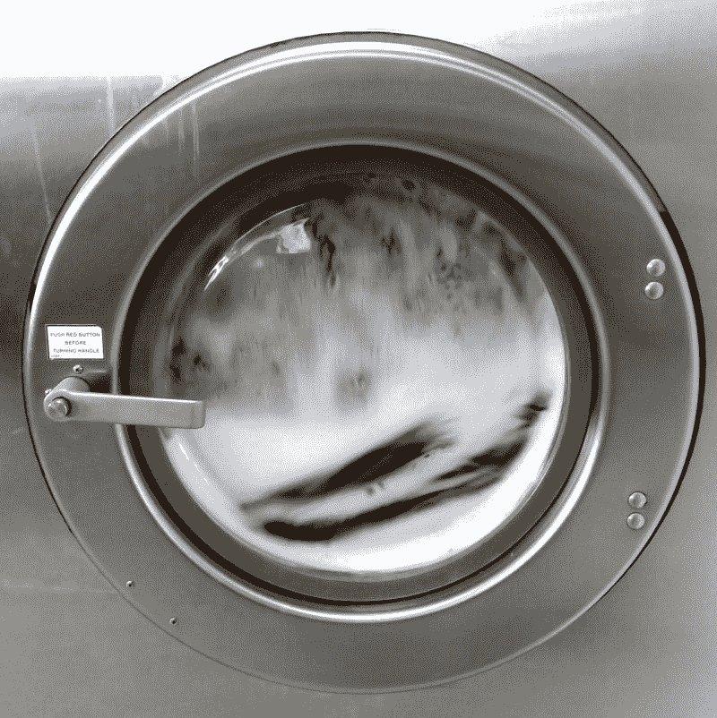

# 宝洁问传统品牌能否在 21 世纪生存？—市场疯人院

> 原文：<https://medium.datadriveninvestor.com/procter-gamble-asks-can-traditional-brands-survive-in-the-21st-century-market-mad-house-332512a17357?source=collection_archive---------11----------------------->

消费品巨头宝洁公司可以回答这个问题:“传统品牌能在 21 世纪生存吗？”

奇怪的是，像大型多人在线游戏(MMOGs)这样的数字媒体的兴起；和流媒体视频，可能是 P&G 生存的最大威胁。在大多数人都在玩*堡垒之夜*的时候，[宝洁](https://marketmadhouse.com/how-safe-is-procter-gamble/) (P & G)如何让自己的广告出现在消费者的眼球前；或者看**网飞(纳斯达克股票代码:NFLX)** ？

 [## 动态视频集营销-数据驱动的投资者

### 当话题转到创意视频时，没有人会把安德鲁和皮特这对营销组合逼到墙角。他们的悠闲…

www.datadriveninvestor.com](https://www.datadriveninvestor.com/2019/01/23/video-sets-marketing-in-motion/) 

解释一下，P&G 的传统商业模式是在大众电子媒体如广播电视和电台上赞助娱乐节目。事实上，宝洁[发明了](https://marketmadhouse.com/how-long-can-proctor-gamble-survive/)美国[肥皂剧](https://www.cincinnati.com/story/news/2017/10/04/our-history-p-g-put-soap-soap-opera/732149001/)和拉美[电视连续剧](https://en.wikipedia.org/wiki/Telenovela)来推广洗衣液。

# 品牌运作或曾经运作的方式

此外，传奇的 P&G 高管尼尔·麦克罗伊在 20 世纪 50 年代发明了现代品牌，*平衡* [揭示](https://www.thebalancesmb.com/market-research-history-brand-management-at-pandg-2297141)。

详细来说，P&G 运营品牌；如潮，如分开的生意。因此，每个品牌都有自己的广告策略和商业计划。在麦克罗伊模式下，一个特定的执行官；P&G 称之为品牌经理，负责每个品牌。

传统上，宝洁的品牌战略依赖于与零售商的密切关系以及购买巨额广告。难以置信的是，2017 年宝洁在付费媒体上花费了 27.5 亿美元， *AdWeek* [估计](https://www.adweek.com/agencies/pg-debuts-new-media-model-taking-more-work-in-house-to-give-brands-flexibility/)。G 买下所有的广告是为了让尽可能多的消费者注意到它的产品。

# 有人会看宝洁的广告吗？

不幸的是，越来越少的人在看这些广告。收视率估计显示 P&G 最受欢迎的媒体之一的收视率；广播电视正跌至谷底。

具体来说，*Dateline:NBC；【2019 年 5 月 25 日收视率最高的广播电视网节目在美国只有 298 万观众， *TVbytheNumbers* [估计](https://tvbythenumbers.zap2it.com/daily-ratings/tv-ratings-saturday-may-25-2019/)。然而，Worldometers [估计](https://www.worldometers.info/world-population/us-population/)2019 年美国人口为 3.29093 亿。*

因此，我估计不到 1%的美国人在 2019 年 5 月 25 日观看了收视率最高的网络电视节目。因此，只有不到 1%的美国人在看黄金时段的电视节目。

因此，网络电视消亡的传言并不夸张。作为大众媒体，网络电视显然已经死亡。

# 网络电视已死

同时，最受关注的网络节目 2018；NBC 的*周日夜足球，*在 2018-2019 收视季只有 1928 万观众，*截止日期* [估计](https://deadline.com/2019/05/tv-ratings-2018-2019-season-totals-viewers-demo-cbs-nbc-1202620062/)。此外，在广播电视上收视率最高的脚本节目，CBS 的《生活大爆炸》在最后一季只有 1731 万人观看。

最后，这里是 *Deadline 对 2019 年 5 月 32 日每日广播电视收视率的*估计:

## 美国广播公司——在 18 至 49 岁的成年人中收视率为 0.6%，有 482 万观众。

[**哥伦比亚广播公司**](https://marketmadhouse.com/is-cbs-cbs-the-future-of-television/) **(纽约证券交易所代码:CBS)**—18 至 49 岁年龄段成人 0.6%的收视率，478 万观众。

NBC——18 至 49 岁成年人的收视率为 0.4%，有 217 万观众。

福克斯广播网——18 至 49 岁的美国人收视率 0.4%，有 124 万观众。

CW——在 18 至 49 岁的人群中收视率为 0.2%，有 67 万观众。

如果截止日期的数字是正确的，那么在 2019 年 5 月 23 日，美国四大广播网在 18 至 49 岁的人口中拥有 1368 万观众。相反，Statista [估计](https://www.statista.com/statistics/241488/population-of-the-us-by-sex-and-age/)2017 年美国 19 岁至 49 岁的人口有 1.5045 亿。请注意，我是通过将 Statista 的估计相加得出这个数字的。

因此，在 2019 年 5 月 23 日，不到 1%的 18 至 49 岁美国人正在观看网络电视。在这种情况下，只有不到 1%的最重要的人口广告客户在当天看到了电视广告。广告商重视 18 至 49 岁的人群，因为这些人最有可能购买消费品。

# 宝洁的问题

有趣的是，网络电视的消亡只是 P&G 问题的一部分。所有不看电视的人都盯着宝洁公司看不到的数字图像。

例如，Statista [估计【2019 年 3 月，极其受欢迎的《皇室战争》射击游戏 mmog 在全球拥有 2.5 亿玩家。此外，根据 Statista 的估计，2017 年美国](https://www.statista.com/statistics/746230/fortnite-players/)[有 5360 万主机游戏玩家。另外，*综艺*](https://www.statista.com/topics/3070/us-gamers/) [估计](https://variety.com/2018/gaming/news/how-many-people-play-games-in-the-u-s-1202936332/)视频游戏现在占据了美国人 16%的休闲时间。

显然， [*Apex Legends*](https://marketmadhouse.com/is-electronic-arts-making-money/) 上没有汰渍的广告，堡垒之夜*也没有佳洁士的植入式广告。对 P 来说不幸的是，如今的年轻妈妈更有可能在玩《堡垒之夜》而不是看《综合医院》。*

# 观众看不到 P&G 的广告

更糟糕的是，美国最受欢迎的肥皂剧是*权力的游戏，而不是*勇敢与美丽的 T21——如果你从媒体关注度来判断的话。这对 P & G 来说是个问题，因为*权力的游戏*在著名的商业免费有线电视频道 HBO 上运行。**

宝洁现在面临的问题是:“在当今的媒体环境下，我们如何将我们的产品呈现在今天的观众眼前。“奇怪的是，P&G 的历史可以为这一困境提供一个解决方案。

# P&G 可以通过回到过去来生存

从历史上看，宝洁公司为广播以及后来的电视肥皂剧和其他节目的制作付费。事实上，在 20 世纪 50 年代所谓的电视黄金时代，电视网为广告商命名了热门节目，如 [*、*、](https://www.britannica.com/topic/The-Buick-Berle-Show)和*德士古明星剧院*。

P&G 可以通过赞助 MMOGs 或为其制作付费来恢复这一策略。此外，P&G 可以通过网飞、Hulu、Apple TV 或传闻中的迪士尼流媒体服务 Disney+支付电影或电视节目的制作费用。

最后，宝洁可以付钱给游戏开发商或制作人，让他们将产品植入游戏和程序中。好吧，MMOG 的潮汐很奇怪，但是它比堡垒之夜的其他东西更奇怪吗？

# 宝洁能通过积分奖励和游戏兑现吗？

在这种情况下，需要资金的游戏开发商高管可能会考虑给 P&G 的营销部门打个电话。宝洁公司可能会在下一代游戏平台如[深渊](https://www.theabyss.com/)的初期介入。

为了解释，深渊的创造者打算用以太坊令牌奖励点来吸引游戏玩家。我认为 P&G 可以通过允许游戏玩家积累积分来获得产品折扣而受益。

例如，宝洁公司可以利用《T4》深渊上的游戏来驱使消费者去它的 [P & G 店](https://www.pgshop.com)。为了推动销售，宝洁可以向玩家提供购买奖励积分；或者打折，在 P & G 店。这一策略的一个明显优势是引导年轻消费者远离亚马逊。

例如，一个游戏可能会突然说，“恭喜你刚刚在 P&G 商店杀死 12 只僵尸，赢得了一盒 Tide 的 5 美元”。

# 宝洁是价值投资吗？

因此，我认为宝洁公司在当今的数字时代会有一个光明的未来。

值得注意的是，P&G 赚了很多钱。例如，截至 2019 年 3 月 31 日，该公司季度收入为 164.62 亿美元，毛利润为 80.35 亿美元。加上宝洁公司当天公布的季度营业收入为 32.29 亿美元，净收入为 27.45 亿美元。

因此，宝洁上个季度的毛利率达到了 48.81%。此外，P&G 同期的运营现金流为 35.17 亿美元，投资现金流为 5.73 亿美元，自由现金流为 27.65 亿美元。

这使得 P&G 在上个季度末积累了 27.38 亿美元的现金和等价物，以及 70.85 亿美元的短期投资。因此，截至 3 月底，P&G 拥有 98.23 亿美元的流动资产。我认为这个数字对于一家消费品公司来说是很高的。

因此，宝洁公司有现金资助研究和下一代媒体，以扩大其在 21 世纪的市场。鉴于这些情况，我认为 P&G 是一只成长型股票。

# P&G 是一个伟大的股息股票

最后， **P & G (NYSE: PG)** 是一只很棒的分红股票。事实上，宝洁公司自 1957 年以来已经分红 62 年，Dividend.com[报道](https://www.dividend.com/dividend-stocks/consumer-goods/personal-products/pg-procter-and-gamble/)。具有讽刺意味的是，宝洁的红利始于电视的黄金时代。

股东于 2019 年 5 月 15 日收到宝洁公司的 74.6₵股息。此外，该股息比 71.7₵在 2019 年 2 月 15 日支付的股息多 2.9₵。

因此，宝洁在 2019 年 5 月 31 日提供了不断增长的股息，股息收益率为 2.83%，年化股息为 2.98 美元，股息支付率为 67.5%。

我认为市场先生在 2019 年 5 月 31 日低估了**宝洁(NYSE:PG)**105.33 美元。因此，我建议那些寻找具有巨大增长潜力的被低估收益股的人去调查宝洁。这家历史悠久的肥皂制造商在 21 世纪的数字世界里可能会有一个耀眼的未来。

*原载于 2019 年 5 月 31 日*[*https://marketmadhouse.com*](https://marketmadhouse.com/procter-gamble-asks-can-traditional-brands-survive-in-the-21st-century/)*。*

声明:文章中表达的观点和意见仅属于作者，并不一定反映数据驱动投资者的立场。