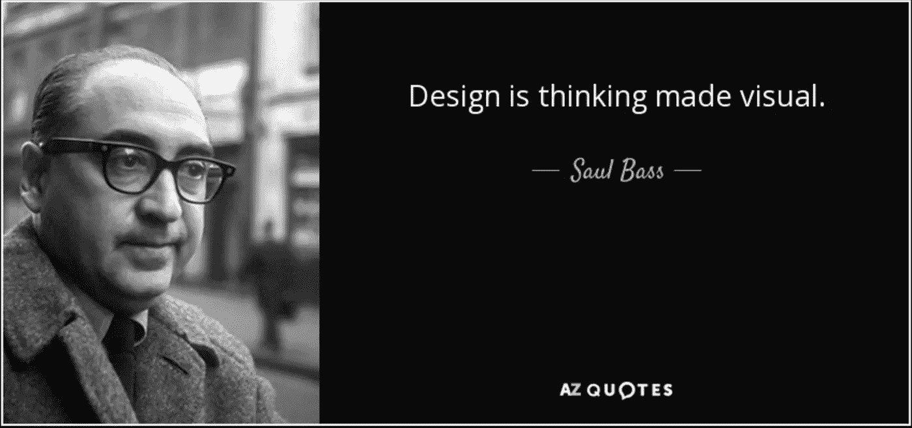
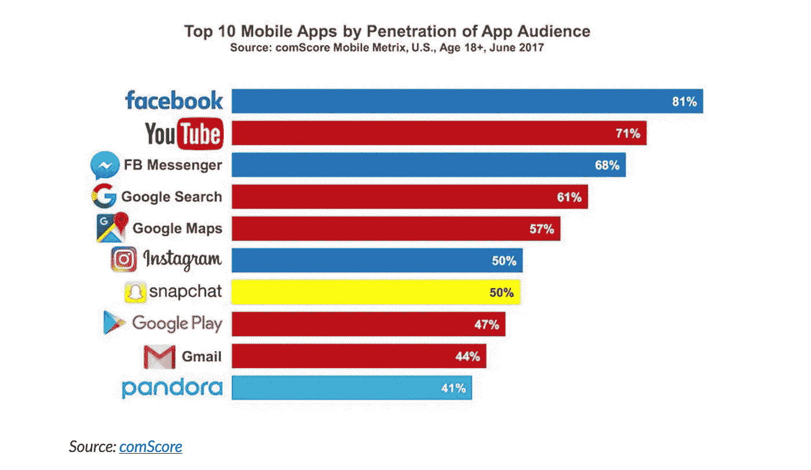
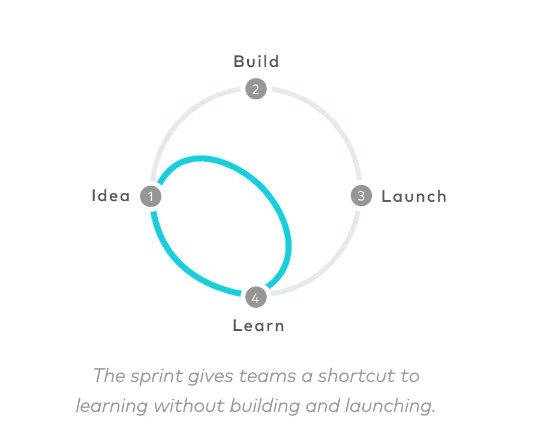

# 产品设计:过程、工具和技术

> 原文：<https://medium.datadriveninvestor.com/product-design-process-tools-and-techniques-db1b22051841?source=collection_archive---------0----------------------->

产品设计常见问题

## 这个故事的目标是:

*   如果你很想知道产品设计所涉及的一切，那么这个故事很适合你。
*   如果你在网上找到了一些关于产品概念和术语的想法，但不知道从哪里开始，那么这就是给你的。
*   如果你已经在实践产品设计技术，并想知道其他技术，那么这可能对你有所帮助。

 [## 生活在算法社会——数据驱动的投资者

### 鉴于当今最新技术扩散到我们的日常生活中，毫不夸张地说…

www.datadriveninvestor.com](https://www.datadriveninvestor.com/2018/08/17/living-in-the-algorithmic-society/) 

## 产品设计导论

Q1——它解决了什么关键问题？

无论您是在初创企业还是在大中型组织中，更快地进入市场的需求对企业来说都至关重要。当有多种想法在*中浮动时，组织今天面临的最大问题是识别并决定他们应该投资的最佳想法。*

**Q2——为什么产品设计很重要？**

新产品的实施需要一系列的活动。通常，产品会经历一些阶段，如创意产生、创意筛选、概念开发和测试、营销策略、业务分析、产品开发、测试营销和商业化。它们中的每一种都有很大的结果不确定性和相当大的相关成本。

在组织真正开始构建产品之前，从各个方面(合意性/可行性/生存能力)验证想法是至关重要的。特别是在软件产品的情况下，业务/技术每天都在变化，验证想法的决策过程必须基于将为组织提供价值的产品设计过程。

> 许多创新的新产品在市场上并不成功。一个常见的原因是:公司没有足够重视了解客户如何评估产品和做出购买决定。
> 
> -[https://Sloan review . MIT . edu/article/why-great-new-products-fail/](https://sloanreview.mit.edu/article/why-great-new-products-fail/)

**Q3-到底什么是产品设计？**

> 大多数人错误地认为设计就是它看起来的样子。人们认为这是一种装饰——设计师拿到这个盒子，然后被告知,“把它做得好看点!”！这不是我们所认为的设计。不仅仅是看起来像什么，感觉像什么。设计就是它的工作方式。—史蒂夫·乔布斯

*   一个想法的核心就是一个需要从各个方面进行批判性分析的想法。产品设计是一种让想法变得具体的方式——可以让客户/用户得到价值的东西。
*   今天可用的所有数字产品都是为了解决用户面临的关键问题而构建的。
*   我们确实为那些会使用产品的人设计，这样他们就可以实现他们的目标。
*   我们做设计，因为这是用户看到产品时注意到的第一件事。用户可以通过查看产品设计来形成对产品的看法。
*   设计不仅仅是关于颜色、布局、像素，还有更多。它是关于理解用户的旅程，他们的思维过程和满足他们的需求。

***看看你经常使用的应用/产品，问问自己“我为什么要用那些产品/应用”***

Source- [http://www.businessofapps.com/data/app-statistics/#3](http://www.businessofapps.com/data/app-statistics/#3)

## 工具和技术

**Q4-设计功能/产品需要什么工具和技术？**

设计产品的工具/技术围绕着人和他们的目标。我们为用户打造产品，帮助他们实现目标。了解我们在为谁而建设非常重要？他们为什么会使用该产品？

一些技术源于以用户为中心的设计原则:

**用户故事**

*   用户是谁？
*   他们需要什么？
*   他们为什么需要它？

**人物角色**

人物角色深入细致地描述了用户群。

例如，这个媒体发布平台有许多类别，在这些类别下创建故事。有特定兴趣的用户将进入特定的类别来探索故事。

什么类型的用户会选择付费计划，谁会选择免费订阅。对用户群的了解将引发更多的对话，这反过来将有助于理解问题，并最终有助于产品设计。

**情感思维**

再次以媒体为例，假设你发表了一个故事，你开始获得掌声，然后它在情感上与你联系起来。你感到快乐。

比方说，你做了很多艰苦的工作，写了一个故事，不希望产品丢失数据，那么这也在某种程度上与情绪有关。

用这种情感思维设计的产品通常会成功。脸书/Twitter/LinkedIn 的“喜欢”按钮是与用户建立情感联系的另一个例子。

**简单性**

> 人们认为专注意味着对你必须专注的事情说是。但完全不是这个意思。这意味着对其他上百个好主意说不。你必须仔细挑选。实际上，我为我们没有做过的事情和我做过的事情一样感到自豪。创新就是对一千件事情说不。
> 
> 史蒂夫·乔布斯

简单意味着在一个产品中做一件事，使你的产品与众不同。简单就是一直问这个问题，直到你完全被说服。

这一件事应该清楚、简明、简单地向任何人解释。

**可用性测试**

比方说你发行了一部电影，里面有喜剧、惊悚和情感场景。作为导演，你会期望你的观众对电影的制作方式有所反应。在喜剧场景中，他们应该笑，在情感场景中，他们必须动情。如果这在现实中没有发生呢！！

这意味着你的电影制作有缺陷，需要纠正。你可以将可用性测试与此联系起来。

> 可用性测试侧重于衡量人造产品满足其预期目的的能力。https://en.wikipedia.org/wiki/Usability_testing

在所有这些中，哪一个是关键的，哪一个是需要考虑的，这就由你来决定了。建议在设计过程中仔细阅读这些内容。 ***这就把我们带到了下一个问题，这些技术能多快被执行，过程应该是怎样的。***

**Q5-我们做产品设计需要什么流程？**

进行产品设计的团队的目标是:

*   快速想出一个产品原型，列出功能，设计来说明产品的功能？
*   **和**获得商业资助
*   **和**更快上市

产品设计中定义了多个过程:

*   **敏捷的 UX**
*   **精益 UX**
*   [**设计思维**](https://medium.com/@sourabhpandey05/why-startups-need-to-identify-the-real-problem-and-how-can-design-thinking-help-achieve-this-3e884f07550b)

但是在这里，我将谈论一个叫做“设计冲刺”的过程

[https://www.gv.com/sprint/](https://www.gv.com/sprint/)

## 设计冲刺快速概述

第一天:定义问题并就长期目标达成一致

第二天:学习解决方案——强调批判性思维

**第 3 天:**批评解决方案，并就符合长期目标的最佳解决方案达成一致。创建**故事板**:你原型的一步一步的计划。

第四天:把故事板变成一个**原型**。目标是专注于你的产品或服务面向客户的表面，并在一天内完成你的原型。

第五天:采访你的客户，通过观察他们对你的原型的反应来学习。

在一天结束的时候，你会知道你要走多远，你会知道下一步该做什么。

## **关于设计冲刺的快速笔记**

虽然这个过程可能会给你一种感觉，你可以很快完成事情，但如果我们不做这些事情，情况可能就不一样了:

*   在开始冲刺之前，了解你的团队中谁将成为其中的一员是很重要的。他们的理解水平和动机。
*   在第一天确定问题是可行的，因为主题专家已经给出了相关的提示，所以他们对业务、技术或市场相关的问题有所准备。
*   一个伟大的推动者是这种冲刺成功的关键，他将推动事情朝着每天的目标发展。辅导员需要知道具体的行动项目和目标。
*   谁会最终赞成或反对？虽然投票是达成共识的好方法。我们不应该忽视也讨论过的解决方案。
*   冲刺结束后会发生什么？出现了哪些可交付成果，以及如何推进执行。

## 结论

虽然我试图回答许多问题，但了解基本知识是很重要的。过程/技术可能不同，但是如果基础很强，那么产品设计必须成功。

*   像任何其他创造性工作一样，设计是一个反复的过程，需要大量的思考才能得出一个简单而有价值的解决方案。
*   设计有助于定义用户与产品的交互，以及用户与产品的交流。

**参考读数**

 [## 设计冲刺- GV

### sprint 为团队提供了一条无需构建和启动就能学习的捷径。冲刺是一个为期五天的过程…

www.gv.com](https://www.gv.com/sprint/)