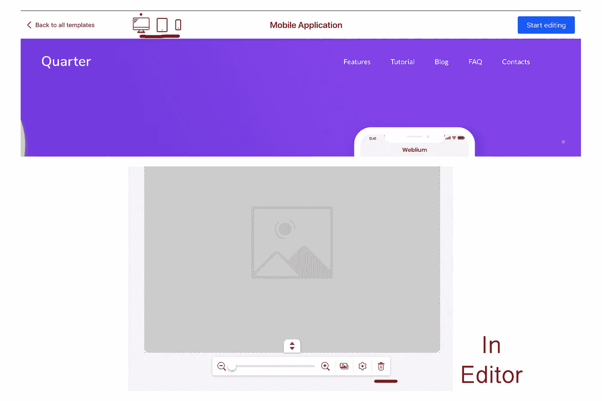

# 产品练习第 10 天，共 20 天:Weblium

> 原文：<https://medium.datadriveninvestor.com/product-exercise-day-10-of-20-weblium-a7bd33eb8a26?source=collection_archive---------15----------------------->

这是我 20 天产品挑战的第 10 天。

source — [https://weblium.com/](https://weblium.com/)

## 产品是关于什么的？

Weblium 是同类产品中的首批产品之一。这是一个由 AI(人工智能)驱动的网站构建器，用于指导设计师创建适应任何屏幕分辨率的有吸引力的网站。与其他网站构建者类似，Weblium 有几个模板供您查看和选择。当你不得不做一些小的设置来确保你的网站有一个统一和专业的外观时，人工智能就来了。对于非专业人士来说，这有时可能很难做到，但 Weblium site builder 会研究您的构建方式，并立即修复您的设计错误。

除了人工智能辅助和网站生成器，该产品还提供虚拟主机、域名、搜索引擎优化设置以及其他很酷的功能。Weblium 附带一个免费和付费的计划。有没有太多的免费计划模板，你不能自定义你的域名。只要每月 15 美元，付费计划就有免费域名、虚拟主机、SSL 证书等等。

**潜在客户**:中小型企业、营销人员、博客作者、网站设计师、摄影师、学生、求职者、模特、软件开发人员、艺术家、活动组织者、新婚夫妇

## 创作者是如何看待这个想法的？

最近，我的朋友打电话给我，抱怨她与一个流行的在线网站建设者的问题。问题在于她网站上字体显示方式的不一致性，以及它在手机分辨率上的完全变化。我从来没有使用过这个网站建设者的问题，所以我不能提供任何解决方案。作为一名软件工程师，您有时会收到这种请求。

像这样的问题在网站建设业务中非常普遍，非技术通的人在创建网站时仍然有问题。Weblium Studio 是一个专门为客户设计网站的网络工作室。创建了这么多网站后，他们意识到，从客户的角度来看，当他们需要对网站进行更改时，继续联系网站创建者是不可扩展的。因此，客户想要一个自己动手的平台，让他们能够自己建立一个网站。今天有很多网站建设者，建立另一个不会完全解决客户的问题。

今天，许多网站建设者仍然需要一些网站设计技巧，使一些专业要求设计师寻求某种形式的指导，而建立一个网站。为了解决这个问题，Weblium 必须与人工智能相结合，人工智能将理解您试图构建的内容，并在您前进时为您提供指导。某些修正，如统一的字体风格、配色方案、宽度、高度、对齐等，将由 sitebuilder 根据您的设计选择进行处理。这样你就不用担心那些小事了。

## 他们做对了什么？

为了区别于传统的网站建设者，Weblium 创造了一个全新的人工智能网站建设者市场。集成人工智能是一个巨大的卖点，这使该公司成为这一领域的先驱。

越来越多的非专业人士将被吸引使用这种产品，因为他们在创建网站时不需要监督。

在 Weblium 中，你不需要拘泥于一个模板。从其他模板引入块/部分的能力是刚刚引入市场的一个特性。该公司已经认识到，人们可以喜欢来自不同模板的不同组件，并喜欢在一个网站上借用和合并它们的方式。

该公司还推出了 Draftium，这是一种帮助设计师快速创建网站结构的原型工具。这个原型可以导出到 Weblium，转换成网站。这给客户一种将想法快速转化为现实的感觉。

## 竞争

1.  **Site Builders** : Wordpress，Weebly，Squarespace，Wix， [Bubble](https://bubble.is/) ，SiteBuilder，Shopify， [Simbla](https://www.simbla.com) ，[书签](https://www.bookmark.com/)
2.  **登陆页面构建者**:醒目、Unbounce、Instapage、[独角兽平台](https://unicornplatform.com/)
3.  **内容管理系统** : Joomla、Drupal、Kentico、DotNetNuke、Umbraco
4.  **Web 框架** : Jekyll，Laravel，Ruby on Rails，Flask，Django，Bootstrap，ASP。网

## 人们为什么喜欢这个产品？

根据评论，许多人被产品漂亮的设计所折服。编辑器真的很容易使用，从我个人的使用中，我发现你不需要寻找编辑设置，一切都在你需要的地方。此外，编辑器直观地做出所有的小改动，所以你不必担心技术细节。使用该产品后，人们证明设计时间显著减少，使他们能够比以前更快地推出产品。

对于那些想要控制的人，可以选择从头开始创建一个空白网站。就借用另一个模板而言，有相当多的模块可以添加到你的设计中，给人们提供过多的模板选项来构建他们的网站。

## 可能的改进

预览模板的实时演示需要一段时间来加载，当用户试图选择一个合适的模板时，这不是一个可以承受的时间。随着时间的推移，我相信团队会减少加载时间。

我建议添加该功能，以其他屏幕分辨率查看模板现场演示。此外，在编辑器中，我应该能够完全删除选定块中的图像元素(见下图)。

此外，我尝试使用 Draftium，我意识到当我已经注册了 Weblium 之后，还需要注册。我建议在 Draftium 和 Weblium 之间实现单点登录。

最后，我试着在谷歌上搜索“人工智能网站生成器”, weblium 没有出现。有很多竞争，Weblium 是一个很好的工具，所以需要更多的 SEO 来增加更多潜在客户的可见性。

感谢您的阅读，明天我将发布另一个产品练习，作为我 20 天日常产品挑战的一部分。