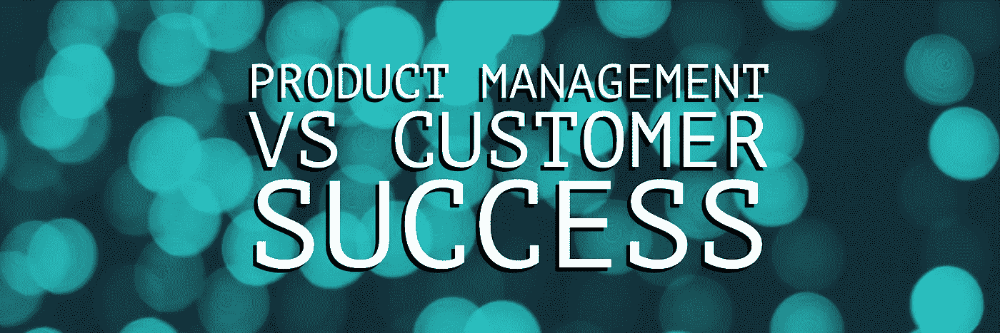

# 产品管理与客户成功。什么是什么？

> 原文：<https://medium.datadriveninvestor.com/product-management-vs-customer-success-what-is-what-98d71999efdf?source=collection_archive---------9----------------------->

LinkedIn 在他们最近的[报告](https://inc42.com/buzz/here-are-the-top-10-emerging-jobs-in-india-from-the-linkedin-report/)中提到的印度十大新兴工作中，客户成功是第六大最受欢迎的简介(在美国排名第四)。另一方面，产品管理角色在不同的组织中似乎是模糊不清的。

 [## 正在改变行业的 5 个真实世界区块链应用——数据驱动的投资者

### 除非你一直生活在岩石下，否则我相信你现在已经听说过区块链了。而区块链…

www.datadriveninvestor.com](https://www.datadriveninvestor.com/2019/02/13/5-real-world-blockchain-applications/) 

弄清楚产品管理和客户成功角色之间的相互依赖关系需要理解两者在商业中的影响。虽然项目经理角色对产品/服务的开发、旅程和提供起着至关重要的支持作用，但有明显迹象表明，专注于传播价值和体验的客户成功角色正在崛起。

# 这些角色是什么？

产品经理:

产品经理拥有交付产品/功能的“为什么、什么、什么时候”的责任和权力。作为一名决策者，项目经理确保他/她的行动围绕了解市场、根据客户需求制定计划和创建业务提案来实现目标。项目经理必须知道的几件事是:

*   环境因素:环境因素是影响产品开发的有影响力的属性。常见的环境因素有人口统计、技术、社会文化(趋势)、经济和法律。因为这些元素会不时发生变化，所以保持更新是很重要的。
*   用户研究:为了验证假设和假说，并确定目标受众的正确需求和要求，产品规划期间成功的迭代过程是进行广泛的用户研究。通过定义目标，收集和分析研究数据，以弥合用户和产品所有者之间的差距。常用的方法有调查(最初用于大样本集)、访谈、[、背景询问](https://www.atlassian.com/team-playbook/plays/contextual-inquiry)、反馈、A/B 测试和[热图](https://www.crazyegg.com/blog/understanding-using-heatmaps-studies/)。
*   原型制作:任何科技产品不可或缺的一部分是建立正确的用户体验(UX)。原型有助于通过验证产品假设使想法和概念变得可行。每个原型都可以在产品路线图中用于研究和洞察。最后，是的，它经济、快捷、简单。原型制作中使用的主要工具是视觉、原理和草图。你可以在这里阅读更多关于它的重要性[。](https://www.moldmakingtechnology.com/articles/why-is-prototyping-important)
*   分析:如今各种角色都使用分析，项目经理总是面对数字来捕捉缺点并评估决策结果。项目经理必须发现用户旅途中面临的障碍，以便简化/开发满足用户需求的功能。这里常用的工具有 Mixpanel、[、Google Analytics](https://analytics.google.com/analytics/web/) (免费认证)。
*   开发:在测试和部署产品或其开发的功能之前。项目经理参与产品路线图(区分特性的优先级)、积压工作、需求文档，并与其他团队交叉运作以构建和实现概念。
*   领导力:这通常是一个很少被提及的规则，但是任何在跨职能岗位工作的人都必须学会如何在没有权威的情况下领导。这里有一个关于这种特殊领导形式的有趣的[阅读](https://medium.com/swlh/how-to-lead-when-you-have-no-authority-9f22206356d4)。

*对项目经理角色的简单而准确的描述。关注客户需求，利用最新技术提供最佳体验，同时保持业务目标。*

# 什么是客户成功？为什么这个角色在各行各业越来越重要？

客户成功经理:

不，和“客服”不一样。客户服务主要作为组织的成本中心而存在。它在很大程度上对于快速解决问题至关重要，是一个合规的中心。客户成功是确保您的客户从您的组织中获得最大价值的结构化过程。通过成为客户忠诚度的一个组成部分，该角色已经发展成为一个部分创收部门，以增加正面口碑，实施变革以改进功能。客户成功经理必须知道:

*   锻炼需求:由于客户的需求可能(而且几乎确实)不同，客户经理必须理解所面临的确切需求。CSM 能够快速做出决策，因为他/她将与运营、交付和产品团队密切合作，整合各种改进并增强体验。
*   让客户发现价值:"*为客户和您的公司增加可持续的证明价值。*”([链接](https://www.customersuccessassociation.com/library/the-definition-of-customer-success/))。CSM 必须了解客户如何通过所提供的服务获得最大的积极成果。这包括了解完整的产品特性，尝试各种方法，最重要的是，想要提供帮助。
*   同理心:以前，顾客和员工是两个没有意识的旁观者，对球场两边的情况知之甚少。作为推动体验的人，同理心是一项关键技能。通过同理心，CSM 必须是一个有影响力的向导，增强信任，导致长期承诺。
*   分析:CSM 必须能够分析用户路线图，以便评估客户面临的痛点。通过结果，他们必须专注于利用学习和为客户建立一个平稳的过程。

*对客户的价值使组织开始思考快速收入之外的问题，以及他们保持最低流失率的需求。*

# 如果有人问，这两个角色有什么共同点？

1.  移情是打造好产品的关键。换位思考是让顾客保持微笑的关键。
2.  这两个角色都需要强大的领导能力和软技能。
3.  这两个角色都在不断地*演变*。

本文旨在讨论这些角色所涉及的内容。作为 PM/CSM，您有什么体验？你们中有人从 CSM 过渡到 PM 或者相反吗？您的组织是否将 CSM 集成到其业务中，并看到了显著的变化？。我们连线吧！