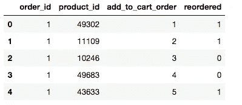
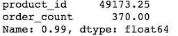
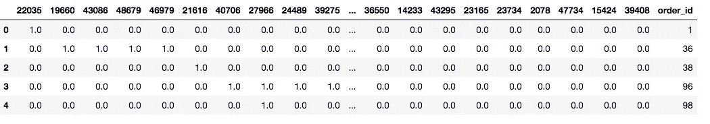
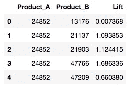
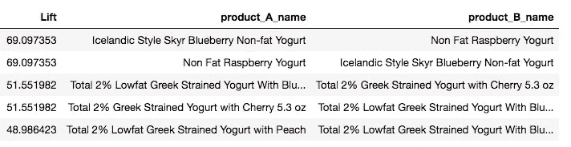
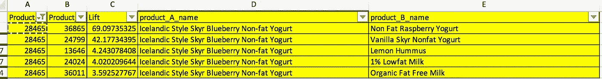

# 基于 Apriori 算法的杂货店产品推荐案例研究

> 原文：<https://medium.datadriveninvestor.com/product-recommendation-using-association-rule-mining-for-a-grocery-store-7e7feb6cd0f9?source=collection_archive---------2----------------------->

[](http://www.track.datadriveninvestor.com/1B9E)

> 如今，产品推荐是每个电子商务的核心。购物时一定要在亚马逊上看到一个“经常一起买”的板块。有几种方法可以构建推荐引擎。大多数实时推荐引擎使用复杂的概念，如协同过滤、基于内容的过滤或混合推荐系统。每种类型各有利弊。但是当涉及到产品匹配或找到一起购买的产品集时，Apriori 算法就发挥作用了。
> 
> 使用这种推荐引擎有很多好处。即使您没有客户的各种数据，您仍然可以通过使用 Apriori 算法，仅使用订单交易数据来构建引擎。

## Apriori 算法理论

Apriori 算法有三个主要部分:

*   支持
*   信心
*   电梯

**支持**

> 支持基本上是告诉如何受欢迎的项目。支持是通过订单数量或总订单数量中包含产品 B 的交易来计算的。

```
Support(B) = (Transactions containing (B))/(Total Transactions)
```

**信心**

> 信心是指如果购买了物品 A，也购买了物品 B 的可能性。它的计算方法是找出 A 和 B 一起买入的交易数，除以 A 被买入的交易总数。数学上，它可以表示为:

```
Confidence(A,B) = (Transactions containing both (A and B))/(Transactions containing A)
```

**抬起**

> `Lift(A,B)`指卖出 A 时，卖出 B 的比率增加。升力(A，B)可以通过将`Confidence(A,B)`除以`Support(B)`来计算。数学上它可以表示为:

```
Lift(A→B) = (Confidence (A,B))/(Support (B))
```

> 你可以通过观察升力值得出一些结论。提升值 1 表示产品之间没有关联。Lift 值大于 1 意味着产品可能会一起购买。假设两个产品 A 和 B 的提升值为 5，这意味着一起购买产品 A 和 B 的可能性是单独购买产品 B 的 5 倍。提升值小于 1 表明产品不太可能一起购买。

# 用 Python 实现 Apriori 算法

我使用 [kaggle](https://www.kaggle.com/psparks/instacart-market-basket-analysis) 中可用的数据实现了该算法。数据来自一家杂货店。对于这篇描述先验的文章，我只使用订单和产品数据。订单日期包含大约 13 个空白行。我对数据进行了一些过滤，以减少脚本花费的时间。您可以在完整的数据集上运行。但是如果你想在本地机器上更好地运行，你应该遵循一些数据过滤，因为这将是一个巨大的时间，至少 10-12 小时

> 导入必要的模块。

```
import pandas as pd
import numpy as np
```

> 读取数据。文件的路径是我的本地路径。可以换成你的。

```
order_product_df = pd.read_csv(‘data/order_products__train.csv’)
product_df = pd.read_csv(‘data/products.csv’)
```

> 检查两个数据框的形状。

```
print(“shape of order data = “, order_product_df.shape)
print(“shape of product data = “, product_df.shape)
```

*订单数据的形状= (1384617，4)
产品数据的形状= (49688，4)*

> 检查订单数据。

```
order_product_df.head()
```



这里，在订单数据中，我们有四列，为了简单起见，我只使用了 order_id 和 product_id。我只对重新排序的数据进行了分析。

> 过滤数据。

```
#lets do analysis for only the order which is reordered..
reorder_product = order_product_df.loc[order_product_df.reordered == 1]
print(“reorder shape = “, reorder_product.shape)
```

*重新排序形状= (555793，4)*

> 检查每件产品的订单数量

```
reorder_product_ids = pd.DataFrame({‘order_count’: reorder_product.groupby([‘product_id’])[‘order_id’].count()})
reorder_product_ids.reset_index(inplace = True)
reorder_product_ids_sort = reorder_product_ids.sort_values(by = ‘order_count’, ascending= False)
reorder_product_ids_sort['order_count'].describe()
```


对于本文的其余部分。我使用了基于订单计数排序的产品 id 列表中的前 1%产品。order_count 的临界值是 370。

> 过滤产品

```
reorder_product_ids_sort.quantile(0.99)
```



```
reorder_product_top99pct = reorder_product_ids_sort.loc[reorder_product_ids_sort.order_count > 370]
#print("product count for top 99% = ", reorder_product_top99pct.shape)
product_list_99pct = reorder_product_top99pct.product_id.unique()
reorder_product_99Pct = reorder_product.loc[reorder_product.product_id.isin(product_list_99pct)]
```

这个数据集 *reorder_product_90Pct 基本上包含了*产品在前 1%的所有订单。

> 为了分析数据，我将订单和产品组合按行排列。意味着订单和数据集行是一对一的映射。我们将产品 id 作为列。对于每一行，如果订单有产品 id，则产品列中的值为 1，否则为 0。为了更好地理解，请遵循下面的代码。
> 
> 使数据行更明智，以便更好地理解。

```
def make_dataSet_rowWise(reorder_product):
 print(“unique Product in dataset = “, len(reorder_product.product_id.unique()))
 print(“unique order_id in dataset = “, len(reorder_product.order_id.unique()))
 product_id_list = reorder_product.product_id.unique().tolist()
 product_id_list.append(‘order_id’)
 product_id_dict = {}
 i = 0

 for prod_id in product_id_list:
 product_id_dict[prod_id] = i
 i = i+1 
 product_id_df = pd.DataFrame(columns = product_id_list)
 row_list_all = []
 order_id_list = reorder_product.order_id.unique()
 i = 1
 for id in order_id_list:
 #print(i)
 i = i+1
 np_zeros = np.zeros(shape = [len(product_id_list)-1])
 ordered_product_list = reorder_product.loc[reorder_product.order_id == id][‘product_id’].tolist()
 for order_prod in ordered_product_list:
 np_zeros[product_id_dict.get(order_prod)] = 1

 row_list = np_zeros.tolist()
 row_list.append(id)
 row_list_all.append(row_list)
 return (row_list_all, product_id_list)df_row_wise = make_dataSet_rowWise(reorder_product_99Pct)
product_id_df = pd.DataFrame(df_row_wise[0], columns = df_row_wise[1])
product_id_df.head()
```



*上图是数据集的格式。这里每行代表一个 order_id，每列代表一个 product_id。如果特定订单包含 product_id，则该行中该列的相应值将被填充为 1，否则为零。*

现在在上面提到的数据集之上。我计算了上面提到的三个参数，即 ***置信度*******支持度*******提升度*******每对乘积*** *，并将其作为一个数据集。****

> **计算每对产品的提升数据。**

```
**product_map = {}
for product in product_list_99pct:
 product_map[product] = product_id_df.loc[product_id_df[product] == 1].shape[0]

total_order = product_id_df.shape[0]
product_pair_map = {}
support_rows = []for product_A in product_list_99pct:
 trans_product_A = product_map.get(product_A)
 for product_B in product_list_99pct:
 #print(“product_A = “, product_A , “ Product_B =”, product_B)
 if product_A != product_B:
 rows = []
 rows.append(product_A) 
 pair_key = str(product_A) + “#” + str(product_B)
 if product_B > product_A:
 pair_key = str(product_B) + “#” + str(product_A)
 if product_pair_map.get(pair_key) == None:
 trans_product_A_B = product_id_df.loc[(product_id_df[product_A] == 1) & (product_id_df[product_B] == 1)].shape[0]
 product_pair_map[pair_key] = trans_product_A_B
 else:
 trans_product_A_B = product_pair_map.get(pair_key)

 confidence_A_B = trans_product_A_B / trans_product_A
 support_B = product_map.get(product_B) / total_order
 lift_A_B = confidence_A_B / support_B
 rows.append(product_B)
 rows.append(lift_A_B)
 #print(rows)
 support_rows.append(rows)

lift_df = pd.DataFrame(support_rows, columns = [‘Product_A’, ‘Product_B’, ‘Lift’])
lift_df.head()**
```

****

**上图基本是显示产品数据之间的 lift 数据。现在你可以看到产品 *24852* 和 *13176 之间的升程是 0.007368。***

> **将 lift 数据与产品名称数据集合并。并且按照提升值的升序对数据进行排序。**

```
**product_A_name = lift_df.Product_A.apply(lambda x: product_df.loc[product_df.product_id == x].product_name.tolist()[0])
product_B_name = lift_df.Product_B.apply(lambda x: product_df.loc[product_df.product_id == x].product_name.tolist()[0])
lift_df[‘product_A_name’] = product_A_name
lift_df[‘product_B_name’] = product_B_namelift_df_sorted = lift_df.sort_values(by = [‘Lift’], ascending= False)
lift_df_sorted[[‘Lift’, ‘product_A_name’, ‘product_B_name’]].head()**
```

**这里可以看到 ***冰岛风格 Skyr 蓝莓脱脂酸奶*** 和***脱脂覆盆子酸奶*** *的 lift 值****69.09****非常高。这表明这两种产品之间的可能性非常高。***

****

# **我们如何利用这一分析的结果？**

**现在你有了显示产品之间可能性的所有数据。现在，如果您想搜索某个特定产品的前 5 个推荐产品，只需过滤掉带有产品 id 或名称的数据。您将看到那些特定产品中购买频率最高的产品。**

> **这里有一个例子，我过滤了产品 ***冰岛风格 Skyr 蓝莓脱脂酸奶*** 的数据，列表显示了人们购买第一个产品时可以推荐的前 5 个产品。**

****

> **T 帽文末。希望你喜欢。如果你想出了不同的方法来做同样的分析，请随时分享。**