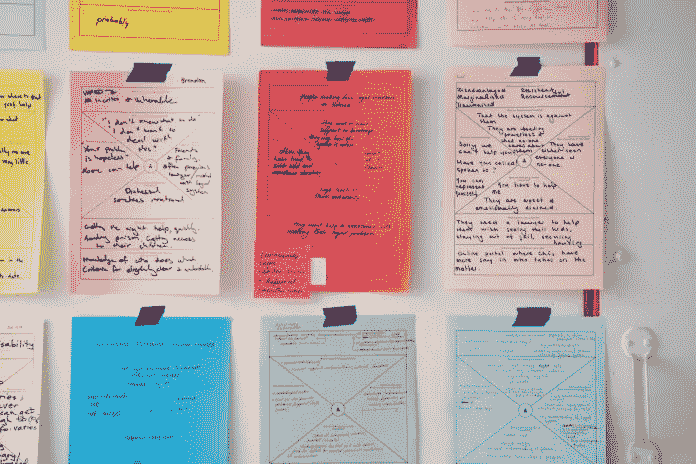

# 富有成效的悲观主义:你公司的毒药，可以拯救它

> 原文：<https://medium.datadriveninvestor.com/productive-pessimism-the-poison-in-your-company-that-could-save-it-e4b299affce0?source=collection_archive---------15----------------------->

# 悲观主义正在扼杀你公司的职业道德吗？

你应该能很快回答这个问题。

如果以下短语在你的工作场所大量出现，很可能你的[领导不知道如何恰当地控制悲观情绪](https://www.datadriveninvestor.com/2019/01/31/intermittent-micromanager-killing-business/):

*   “你让团队失望了。”
*   “在尝试了*所有的东西*之后，我们总是错过这些指标。”
*   “嗯，其他 X 公司的团队根本不和我们*合作。*

注意到什么了吗？

这些短语都没有接受负面结果，并利用它来改善。他们都是死路一条，推卸责任的主张。

换句话说:它们都不能算作生产性悲观主义。

*Photo by* [*Samuel Zeller*](https://unsplash.com/photos/_es6l-aPDA0?utm_source=unsplash&utm_medium=referral&utm_content=creditCopyText) *on* [*Unsplash*](https://unsplash.com/search/photos/meeting?utm_source=unsplash&utm_medium=referral&utm_content=creditCopyText)

# 悲观主义应该如何刺激生产率

悲观在商业中是必要的。

这就是我们不断创新、成长和改进我们人类创造的公司的原因。

然而，有生产性悲观和破坏性悲观。

也不要把这些和批评混为一谈——悲观主义不需要把其他人也牵扯进来。批评可以在成功的地方进行，而悲观主义通常只关注失败(或可能的失败)。

我们可以生气，消极，只看到事物的缺点，但仍然把它作为做好事的动力。

但这种转变是许多公司缺乏的过程，也是员工如此多非生产性行为的原因。

你也知道生产率下降意味着什么:实际改善的滞后时间很长。

让我们看看上面列表中的每一个观点，看看他们的悲观如何转化为生产力。

 [## 想知道领导是谁？请他决定。-数据驱动型投资者

### 一个有效的领导者能为组织提供的最有价值的东西之一是决策能力…

www.datadriveninvestor.com](https://www.datadriveninvestor.com/2019/01/25/want-to-know-who-the-leader-is-ask-him-to-decide/) 

# “你让团队失望了”

这是有问题的，因为它把责任推到了一个团队成员身上，使其感觉不像任何类型的"[团队。](https://medium.com/@flabstofitness/what-happens-when-you-realize-were-all-the-same-493de2d14aba)”

受到指责的员工可能只会对给他们贴上这个标签的人感到不满。

你不想为一个似乎总是贬低你努力的人服务或工作。向你认为已经建立起来的团队说再见吧。

而不是在同事(或主管…或员工…等)面前指出一个人。)，先私下向他们提出你认为你看到的问题。

允许他们*真正*感到被允许说出自己的观点，并真正倾听。

即使你似乎认为这个人在工作中什么都做不好，你实际上可能对他们的日常工作流程知之甚少。听听他们对这些有什么看法。

也不要在私下谈话中开先例，说这次会议是“因为你让团队失望了”。

# “我们什么都试过了”

不，你没有。继续找。

iPhone 改变了地球，直到 2007 年才发布。我们不可能找到我们这个物种所有的想法。

决策和头脑风暴疲劳是真实的——但是不要只是把你的文件扔向空中，休息一下，知道你的悲观是一件好事。

你对自己关心的事情吹毛求疵，如果明智地选择，这可以让公司变得更好。

不要和解。但是，也不要放弃完美的解决方案就在那里的想法。

引入其他部门、其他分支机构，甚至第三方顾问。你会解决问题的。

# “其他 X 公司不合作”

你真的试着和他们一起工作了吗？还是你只是给了他们一些信息，然后期待着事情的发生？

把太多的优点/依赖放在第三方身上，会让你有被他们杂乱无章的系统伤害的风险，如果他们有这样的系统的话(我们都有)。

但是把一个项目的混乱归咎于另一家公司只是重申了你自己的计划没有你想象的那么强大。

因为如果你不能和你自己的团队一起完成一些事情，以至于合作公司很容易加入进来，那么你的计划就有很大的缺陷。

在期待别人站出来承担责任之前，用你的精力去解决这些问题。

*Photo by* [*Daria Nepriakhina*](https://unsplash.com/photos/zoCDWPuiRuA?utm_source=unsplash&utm_medium=referral&utm_content=creditCopyText) *on* [*Unsplash*](https://unsplash.com/search/photos/innovation?utm_source=unsplash&utm_medium=referral&utm_content=creditCopyText)

# 增长心态下的悲观主义

你可能听说过卡萝尔·s·德韦克创造的[封闭与成长思维模式，但如果没有，这里简单介绍一下:](https://amzn.to/2HVMlI6)

*   封闭的心态认为事物是固有的，不可改变的；"我这次考试不及格，所以我很笨。"
*   成长心态认为事物是不断变化的，人们可以从错误/负面结果中成长；"我这次考试不及格，所以我需要为下一次考试更加努力学习。"

成长心态提供了一个可行的方法来防止消极的事情再次发生。

封闭的心态不会。

# 如果你想提高生产率——把悲观作为增长的工具，而不是封闭的借口。

这与日常生活中有多少人使用悲观主义形成了直接对比。

自嘲式幽默是悲观主义的一种形式。讽刺也是。

多亏了互联网，悲观的眼光比以往任何时候都更加普遍——我们对世界上发生的糟糕和疯狂的事情了如指掌。

但不同的是，在生活中，我们经常以此为借口:

*   是啊，她拒绝我是因为我的妖精鼻子。
*   面试我的那个人可能会说我的西装是来自 Goodwill，而*这就是我没有得到这份工作的原因。*
*   我就是喜欢新闻上又有争议的时候。

我们把生活中发生的坏事归咎于世界大事或我们难以改变的事情。

但事实上……我们对这些事情如何影响我们有更多的控制，比我们经常承认的要多。当这种转变发生时，它是强大的:

*   嗯，当我接近她时，我的态度不是最好的&我表现得很粗鲁…
*   是的，我的简历不太符合他们的要求。
*   每天都有争议——新闻需要它们来评分。他们也是生意。

同样的结局，不同的展望。

*Photo by* [*Icons8 team*](https://unsplash.com/photos/yTwXpLO5HAA?utm_source=unsplash&utm_medium=referral&utm_content=creditCopyText) *on* [*Unsplash*](https://unsplash.com/search/photos/discussion?utm_source=unsplash&utm_medium=referral&utm_content=creditCopyText)

# 要批判。悲观一点。而且:要有生产力。

尤其是如果你是公司的首席执行官或所有者，你会不断寻找提高业绩和产量的方法。

但是用负面反馈接近你的员工，尤其是如果这就是全部的*的话，只会进一步滋生你认为你可以通过解决它来减轻的无能。*

*更重要的是——不要害怕自己也接受消极的一面。你并不完美。*

*分析负面。要求并拥有它。而是制定一个行动计划并*实施。**

*老实说，也用乐观的眼光看待一切。*

*根据哈佛大学最近的一项研究，在工作场所报告高满意度的员工倾向于获得积极和消极的反馈，比例为 6:1。*

*如果你给出的负面反馈多于正面反馈，你可能会形成一个负面反馈循环。*

*事情只会变得更糟，这是因为你没有考虑如何为了公司的利益而利用你的悲观情绪。*

*浪费这样一个失败的教训是多么可耻。*

**原载于 2019 年 3 月 26 日*[*www.datadriveninvestor.com*](https://www.datadriveninvestor.com/2019/03/26/poison-in-your-company-productive-pessimism/)*。**

*Allison Wojtowecz 是一名内容创作者&是 Flabs to Fitness 品牌背后的代言人。你可以在这里注册免费食谱&健康资讯:[http://eepurl.com/cbxN4D](http://eepurl.com/cbxN4D)*