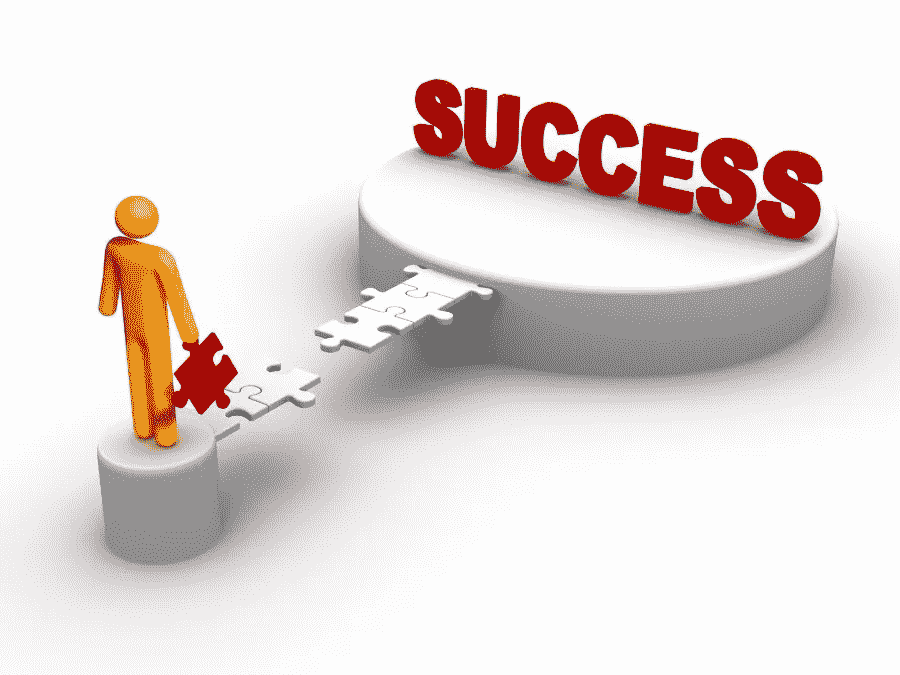

# 规划你的思维去争取成功

> 原文：<https://medium.datadriveninvestor.com/program-your-mind-to-strive-for-success-7b99bd28b25e?source=collection_archive---------13----------------------->

Image source: butviewsreview.com

# 什么阻碍了你取得成功？

1.  害怕

2.障碍

3.缺乏动力

不管你的理由是什么；决策过程从你的头脑开始。

 [## 成功人生的 25 种自我提升方式|数据驱动的投资者

### “我活得越久，学到的就越多。学的越多，体会的越多，知道的越少。”―米切尔·莱格兰德时间到…

www.datadriveninvestor.com](https://www.datadriveninvestor.com/2019/03/12/25-self-improvement-ways-for-a-successful-life/) 

例如，这里有一种情况，

如果有人在舞台上当着成千上万人的面喊你，而你却不知道自己在喊什么。

一瞬间，各种想法开始涌入你的脑海。你脑海中的那个小小的声音会开始用语言表达你，也许对你们中的一些人来说，就像是，“他/她让我们做什么？我不想去那里。”然后，也许其他一些人可能会做类似“我不想这样做，看向别处，避免目光接触，这样他/她就不会来接我了！”

这里到底发生了什么？一想到要站在舞台上面对这么多人，恐惧、怀疑和担忧就会涌上你的心头，这就是你思想力量的体现。

# 思想对你行为的影响

Image source: medicalnewstoday.com

事实上，你头脑中的想法对你采取的行动、做出的决定和经历的事情有着巨大的影响。不仅仅是在上面提到的愚蠢的情况下，很多时候，人们只是因为脑子里想的事情而错过了绝佳的机会。

# 不要让你的思想禁锢了你！

Image source: seekingmyutopia.com

人们基于糟糕的心态做出糟糕的决定。

你知道，那种自我限制的想法就像:“我做不到”，“我不够好”，或者“我没有时间和金钱。”又或许是你认为:“我不能被打扰；我明天就去做。”但是你从来没有这样做过，所以这些美妙的想法和不可思议的潜力被锁在你恐惧的头脑里。

# 如何处理自己不为人知的部分？

有时候你会崩溃，会痛苦，会感到完全孤立，孤独和失落。这是许多人都经历过的事情，但很少有人谈论。

有一个点，当你开始质疑一切，并思考这样的事情:“我在做什么，我生活的意义是什么？”

记住，越想越觉得迷茫。然后你越感到困惑，消极的阴云就会越多，让你的头脑加倍，这不会让你前进，因为你被担忧和自我限制的信念所毒害。

因此，你开始怀疑和担心一切，久而久之你变得更加消极，自我失败主义和自我破坏。这样一来，积极乐观的情绪就会完全消失。

# 让你误入歧途的巨大原因

每个人都想成功，但是你现在正在做的事情可能不是你的梦想。

> 我读了一本迈克尔·葛伯的在线书籍，名为《电子神话》在“主要目标”一章中，他写道:“想象你走进一个房间，里面坐着你的家人和朋友。你走到房间中央，看到一个盒子。当你站在房间前面时，你意识到你在盒子里，这是你的葬礼。”
> 他说，你希望人们谈论你的生活方式、你是什么样的人以及你取得了什么成就？

— —不知道！

# 决定决定命运

Image source: rd.com

你需要明白的是，当你不知道该做什么的时候，你唯一能做的就是寻求帮助，并把目光放远。

> 我看到安东尼·罗宾的一句名言，“你的命运由你的选择决定，现在就选择，好好选择。”

这会让你意识到，你是造成这种痛苦的唯一原因，也是你陷入困境的唯一原因。

这是毁灭性的，你每天醒来；对这些可怕的想法、疑虑和担忧给予如此多的关注。你想出不可思议的主意，然后把它们否决掉！

有意识地意识到你每天想的所有事情。当你消极思考时，试着抓住自己，停止自己，意识到你有能力控制自己的想法，而不是让它们控制你。

# 怎么办？

如果你想过上令人满意的生活，并取得惊人的成就，那么你必须让你的思想和你的思想有相同的波长。以下是一些需要遵循的步骤:

1.  弄清楚你想实现的目标是什么？
2.  为什么要实现？
3.  这对你来说意味着什么？
4.  要求你成为什么样的人？

弄清楚这一点，最后，为你的成功规划你的思维。

过着不可思议的生活不是偶然的，所以采取相应的行动，因为你只有一次生命，在这一生中你必须实现一切。

如以下内容所示:

1.  【https://interact.pk/program-your-mind-to-strive-for-success 号
2.  [https://www . LinkedIn . com/pulse/program-your-mind-fight-success-hamna-QA sim/？已发布=t](https://www.linkedin.com/pulse/program-your-mind-strive-success-hamna-qasim/?published=t)
3.  [https://issuu . com/home/published/program _ your _ mind _ to _ fighter _ for _ success . docx](https://issuu.com/home/published/program_your_mind_to_strive_for_success.docx)