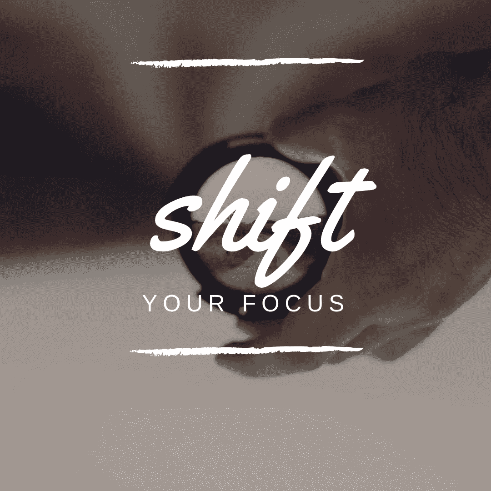
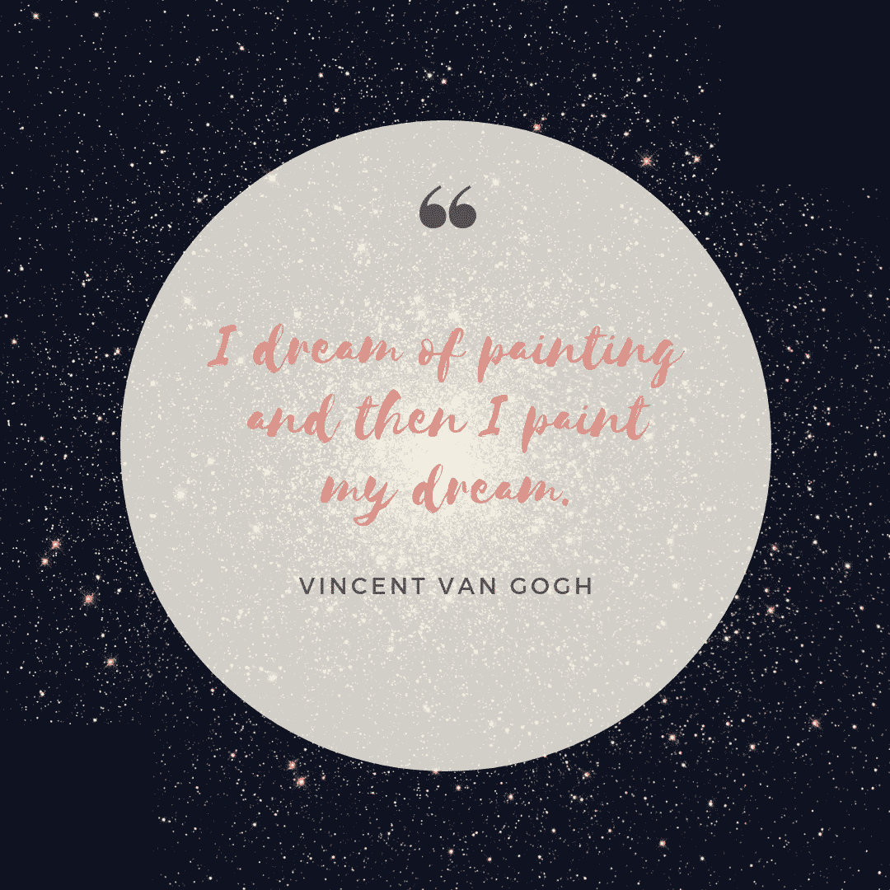

# 针对消极情绪的编程初学者指南

> 原文：<https://medium.datadriveninvestor.com/programming-beginners-guide-for-demotivation-ffb56471dbee?source=collection_archive---------19----------------------->

有时候你会觉得也许你不应该编程，因为你太笨了，一开始就理解不了。或者可能你的个人问题导致焦虑，让你无法专心学习。不管动机低落的原因是什么，作为一个初学者，我有三个建议:

**#1 寻找灵感**

当我感觉自己像个废物，无法创作出任何有用的东西时，我喜欢看别人的作品，并沉浸在“哇，我甚至不知道这是可能的”或“这太棒了，我需要做得更好才能创作出这样的东西”的精神中

本周，这些文章为我提供了这样的例子:

(1) [15 个令人惊叹的数据可视化(以及你能从中学到什么)](https://towardsdatascience.com/15-stunning-data-visualizations-and-what-you-can-learn-from-them-fc5b78f21fb8)

(2)[2018 年 25 个最佳数据可视化](https://towardsdatascience.com/the-25-best-data-visualizations-of-2018-93643f0aad04)

(3) [9 个 2018 年网页设计最佳网站布局实例及创意](https://codeburst.io/9-best-website-layout-examples-and-ideas-for-web-design-in-2018-514420fbc18c)

读完这些文章后，我喜欢做的是浏览列表，找到我喜欢的具体例子。然后我把它们贴在我的 tumblr 上([数据可视化](https://www.tumblr.com/blog/datalovedata)、[网页设计](https://www.tumblr.com/blog/lovelywebdesigninspirations))以备将来参考，因为在我看来，你的个人风格是你周围事物的积累。奥斯汀·克里昂在他的书《像艺术家一样偷窃》中写道:

> “艺术家是收藏家。不是囤积者，请注意，这是有区别的:囤积者不加选择地收集，艺术家有选择地收集。他们只收集自己真正热爱的东西。”

**#2 构建路线图**

当我感到没有动力的时候——而不是强迫自己编码——我喜欢回顾我迄今为止的进展，以提醒自己即使我做得很糟糕，我也没有糟糕到让我有现在的位置。有很多方法可以跟踪你的进展，但我个人喜欢阅读其他自学成才的开发人员写的记录他们历程的文章。每个人的旅程都是独一无二的，但有一个共同的信息很突出:**无论如何都要坚持下去**。这让我对自己缺乏技能感到不那么糟糕，即使在我不想编码的日子里也能保持一致。

这里有一些关于成为一名 web 开发人员需要做些什么的很棒的文章，我觉得非常有帮助和激励:

(1) [经过 10 个月的努力工作，我如何在 40 岁时得到我的第一份开发工作](https://medium.freecodecamp.org/how-i-switched-careers-and-got-a-developer-job-in-10-months-a-true-story-b8895e855a8b)

(2) [我在没有 CS 学位的情况下从零开始成为一名 web 开发人员的旅程(以及我从中学到的东西)](https://medium.freecodecamp.org/my-journey-to-becoming-a-web-developer-from-scratch-without-a-cs-degree-2-years-later-and-what-i-4a7fd2ff5503)

(3)[2018 年学习编码，获得录用，一路走好](https://medium.com/zerotomastery/learn-to-code-in-2018-get-hired-and-have-fun-along-the-way-b338247eed6a)

> “同理心是站在别人的立场上，用心去感受，用眼睛去看。同理心不仅难以外包和自动化，还能让世界变得更美好。”—丹尼尔·H·平克

就我个人而言，我喜欢 Syknapse 创建的[学习跟踪器](https://github.com/Syknapse/My-Learning-Tracker-first-ten-months)。我想创建我自己的并在不久的将来分享它。

**#3 转移你的注意力**

也许你很烦恼，因为你在编码时总是出错。

也许你经历了一次创伤性经历，每天都在处理其后果。

你消极的原因可能源于内部或外部环境因素。也许你能控制他们，也许你不能。你能控制的是你对它的态度。你是要让它碍事，还是要转移注意力继续前进？

我在编码教程和学习基础知识之间来来回回。当我感觉陷入编码困境时，我会阅读文章，强化我的基础知识或如何更好地编码。当我在学习语言的过程中觉得自己很愚蠢时，我会停下来，在 Youtube 上找到一个教程，然后开始编写代码。也许这看起来杂乱无章，但对我和我的工作流程来说是有效的。我宁愿转移我的注意力，继续前进，而不是坐着度过一个被迫无效的令人沮丧的会议。

同样的哲学也适用于个人问题:当你在精神上/情感上/精神上受到影响时，这尤其困难，但我更愿意关注其他事情，而不是坐以待毙。我已经完成了“让我哭出我的眼睛，直到我再也哭不出来”的路线，但老实说，我仍然在事后哭了，所以我的新态度是“我还不如一边哭一边编写应用程序；)".当然，说起来容易做起来难，但学会如何转移注意力是我从最具挑战性的时刻学到的最好的一课。

有用的资源:

(1) [完整的 Javascript 手册](https://medium.freecodecamp.org/the-complete-javascript-handbook-f26b2c71719c):在教程上感觉卡壳的时候，我觉得这很不可思议。这是对这种语言极其透彻的解释。

(2) [Traversy Media](https://www.youtube.com/user/TechGuyWeb) :这个 Youtube 频道充满了教程，是我最喜欢去学习的地方之一。强烈推荐。

(3) [我是如何克服抑郁和焦虑的](https://www.youtube.com/watch?v=ipkSFuQQ-zY)作者:咪咪 Ikonn:咪咪是我最喜欢的 youtubers 用户之一，在这段视频中，她讲述了她过去是如何处理自己的问题的。

我希望这能帮助那些情绪低落或没有动力的人。记住，不管你内心有什么感觉，只要继续前进，继续梦想❤

