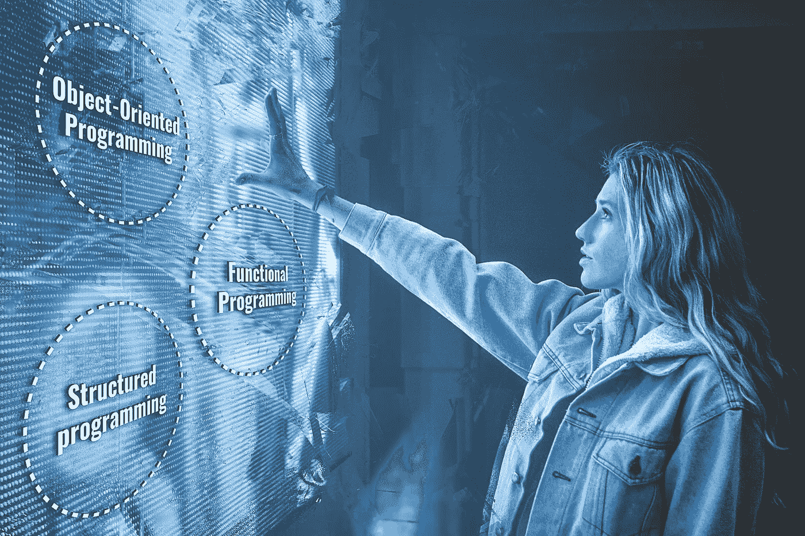

# 从另一个角度看编程范例👓

> 原文：<https://medium.datadriveninvestor.com/programming-paradigms-from-another-point-of-view-98895d8808d0?source=collection_archive---------5----------------------->

> “软件技术与 60 年代相比几乎没有变化”——罗伯特·c·马丁说

他是对的。我们仍然使用程序员在近 50 年前使用的条件、迭代器和赋值操作。

罗伯特·c·马丁对编程范式有着不同于维基百科的观点，这是值得肯定的。

 [## 2019 年最值得学习的编码语言|数据驱动的投资者

### 在我读大学的那几年，我跳过了很多次夜游去学习 Java，希望有一天它能帮助我在…

www.datadriveninvestor.com](https://www.datadriveninvestor.com/2019/02/21/best-coding-languages-to-learn-in-2019/) 

他的书 [*干净的建筑*](https://www.amazon.com/Clean-Architecture-Craftsmans-Software-Structure/dp/0134494164) [📘他说，尽管软件技术的基础很稳定，但很久以前就有三种编程范例，它们在当今世界仍然很重要。](https://www.amazon.com/Clean-Architecture-Craftsmans-Software-Structure/dp/0134494164)

# 1.面向对象编程🔌

第一个面向对象的语言创建于 1966 年。*奥利·约翰·达尔*和*克利斯登·奈加特*创造了 *Simula-67。*

OOP 的定义相当不明确。人们常说，OOP 语言是最能代表现实世界活动和关系的语言。

有人说 OOP 为我们提供了封装，但封装在 C 中是可能的。人们通常认为继承是 OOP 的一个关键特性，但在 C 语言中也是可能的，虽然不是很明确，但确实如此。

多态性是我们在描述 OOP 语言时想到的另一个关键特性。很久以前，当人们在不同的机器上开始使用相同的软件时，多态性就已经存在了。不同的外围设备需要有相同的接口供软件使用。所以面向对象程序设计也没有引入多态性？很久以前，指针在 C 语言中被用来应用多态性。但是面向对象编程使多态性变得容易了。使用指针是一种野蛮的行为，一系列的手工惯例促使了 c 语言中的这种用法。面向对象的语言使得多态更加安全和方便。因此，在描述 OOP 时，我们应该强调多态性特征。

# 2.函数式编程📚

虽然其他范例可能很复杂，但解释这个范例相当简单。函数式编程的关键概念是不变性。

函数式编程不是变异变量，而是创造新的变量。这有助于避免我们在编写并发代码时面临的问题。所有的竞争条件、死锁、并发更新问题都是因为变量突变而发生的。无论如何，因为我们没有无限的内存和处理器速度，完全不变性很少适用于策略。

一个非常流行的例子是 *JavaScript —* 它不强制不变性，但是它支持函数式编程。如果你曾经使用过 *React JS* 框架，你会注意到不变性是如何被强烈推荐的。

# 3.结构化程序设计🔨

结构化编程是琐碎的，几乎每个程序员每天都在使用它。这种范式鼓励使用条件句、重复结构和块结构。我们中的许多人可能甚至没有写过一个不使用它们的程序。那么你可能会问我——“结构化编程之前是什么？”让我告诉你这个故事。

这个范例是由*埃德格·迪克斯特拉*在 1968 年构思的。他认识到编程很难，程序员做得不是很好。任何复杂的代码都可能以令人惊讶的方式失败。他的解决方案是应用数学证明原则来证明代码是正确的。

在研究过程中，Dijkstra 确定 *Go To* 语句会阻止代码被分解成更小的块进行验证。

他写了一篇名为《去声明被认为有害的*》的论文。 *Dijkstra* 升级了一个问题，即 *Go To* 语句降低了代码的可读性，从而导致软件更容易出错，尤其是当必须对现有代码进行更改时。*

Dijkstra*写的论文建议使用 *if/else* 条件句和 *while* 循环，而不是 G *o To* 语句。建议的控制结构是由编程语言本身控制的语言构造，并且由阅读代码的每个人总是相同地解释。*

有一个构造是 Dijkstra 没有提到的——它是函数/方法。在我看来，它们最有助于避免去陈述。

如今，使用这些方便的语言结构并没有什么特别的，但在当时，这是一件事。

# 他们合法吗？🛂

罗伯特·c·马丁提出的关于范式的观点对我来说很奇怪，因为它与科技媒体中的观点截然不同。无论如何，我同意作者的观点，这三个确实产生了影响:

每一种范式都在限制我们。它们都没有为我们——程序员——增加力量。在过去的半个世纪里，我们已经学会了什么不该做。

这些编程范例是经过时间考验的，整个语言都是基于它们的，所以不管我们承认与否，它们都存在于我们的代码中😊