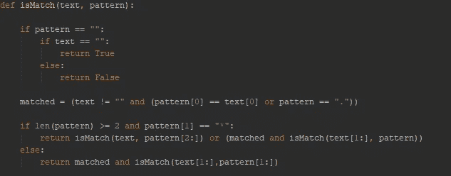
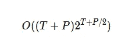
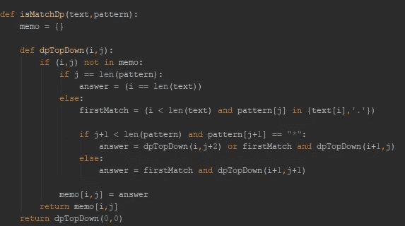

# 用 Python 编程简单的正则表达式匹配

> 原文：<https://medium.datadriveninvestor.com/programming-simple-regular-expression-matching-in-python-44ed0f61f287?source=collection_archive---------0----------------------->

正则表达式是编程中非常有用的概念。我们可以使用它们来解析基于已知格式的字符串，通常是为了确定一个字符串是否符合某个模式。通常，正则表达式往往是一个不太容易理解的概念，因为它们的设计非常复杂。

学习正则表达式如何工作的一种方法是学习如何编写简单的正则表达式匹配程序。在本文中，我们将学习如何使用基于以下标准的模式匹配正则表达式

1.模式可以包含任何小写字母字符。

2.如果一个字母后面有一个*，这意味着可以有 0 个或更多的字符。

3.如果字符是一个。这意味着可以有一个任何字符

让我们来看几个例子，以便更好地理解。

 [## 算法诱人的商业逻辑|数据驱动的投资者

### 某些机器行为总是让我感到惊讶。我对他们从自己的成就中学习的能力感到惊讶…

www.datadriveninvestor.com](https://www.datadriveninvestor.com/2019/03/22/the-seductive-business-logic-of-algorithms/) 

**正则表达式:**“ab”

对于这个模式，我们寻找一个字符串，该字符串具有所示的字母“ab”。这是唯一匹配该模式的字符串。

**图案:**“a * b *”

对于这个模式，我们寻找一个包含字母 a 0 次或更多次，字母 b 0 次或更多次的字符串。这意味着“ab”是可以接受的，“b”和“aaabbbb”也是可以接受的。

**图案:**。一个"

对于这个模式，我们寻找在第二个字母 a 之前有任何字母的字符串。这意味着“aa”被接受，“ba”被接受，以及任何类似的字符串。

由于*字符的行为方式，对该逻辑进行编程相对复杂。由于它查看前一个字符，并允许它 0 次或更多次，我们需要小心我们如何实现我们的解决方案，使其尽可能高效。对于这个模式匹配问题，我将给出两个解决方案。第一种是递归解决方案，第二种使用动态编程。

**递归方法**

这个问题的递归解决方案非常简单。我们的策略是继续检查第一个字母来检查匹配，直到我们用完模式和文本中的字符。完整的代码如下所示:

The recursive solution

首先，让我们讨论程序中存在的递归调用。如果我们有一个*作为第一个字符，并且模式中至少还有两个字符，我们需要进行递归调用。只要模式还有剩余字符，就会发生第二次递归调用。

如果我们看到一个*，并且模式中还剩下两个字符，我们就用这两个字符递归调用函数。然后我们将 or 的结果与模式的值进行匹配，以及从文本的第一个字符开始匹配模式。这将确保我们匹配*字符的方式允许零个或多个字符存在于文本中。

如果我们没有看到*字符，我们只需将文本和模式缩短一个字符，然后再次递归调用函数。你可以看到大部分的复杂性在于我们有一个*字符的情况，因为这是最有可能匹配的情况。当函数被递归调用时，我们检查的是文本或模式是否为空，或者如果模式仍然有字符，我们检查模式和文本是否仍然匹配。

这种方法很好，因为它编程很快，但是效率不是最好的。一般来说，普通递归通常比利用动态编程或类似方法的优化版本运行得慢。更糟糕的是，当我们有一个*字符时，我们的算法需要两次递归调用，一次是模式[2:]，一次是文本[1:]。由于这在函数整体上的表现，我们最终得到的时间复杂度为:

这是因为模式递归执行了 P/2 次，而文本递归执行了 T 次。在此基础上，我们有第三个递归调用，它使用 text[1:]和 pattern[1:]给出了(T+P)项。综合起来，我们最终得到了一个相当慢的算法。

**动态规划法**

当我们遇到递归解决方案的问题时，我们应该始终考虑像动态编程这样的优化技术。动态编程将允许我们记住以前已经完成的检查，以便减少步骤，从而减少我们第一个算法的时间复杂度。

这个想法是，我们从与第一个算法相似的逻辑开始。当我们仍然有一个值匹配我们的模式时，我们仍然要逐个字符地进行检查。不同之处在于，在这个算法中，每次调用都将保存当前的结果，以避免我们在看到*字符时需要回头查看字符串并构建子字符串。自上而下的方法如下所示:

您会注意到，与我们的递归解决方案相比，这看起来有些熟悉。当我们有*或更多的文本可以解析时，我们仍然有递归调用。不同之处在于，我们不是做 pattern[2:]和 text[1:]，而是做 pattern[j+2]和 text[i+1]，跟踪我们已经检查过的内容。这样做可以让我们跳过不必要的检查，我们的递归解决方案被迫这样做，因为它没有保留任何以前检查的记忆。

做这个小小的改变极大地帮助了我们的时间复杂度。以前，我们的调用在每次调用时都需要更多的工作，这意味着工作量会不断增加，直到我们达到指数级的算法。在这种情况下，对 dpTopDown 函数的每次调用都可以在恒定的时间内完成，因为我们所做的只是对照文本检查模式，并在每次调用时向前移动。因此，我们需要为模式调用 P 次，为文本调用 T 次，其中 P 和 T 分别是模式和文本的长度。这给了我们 O(TP)的总时间效率，现在是线性的。