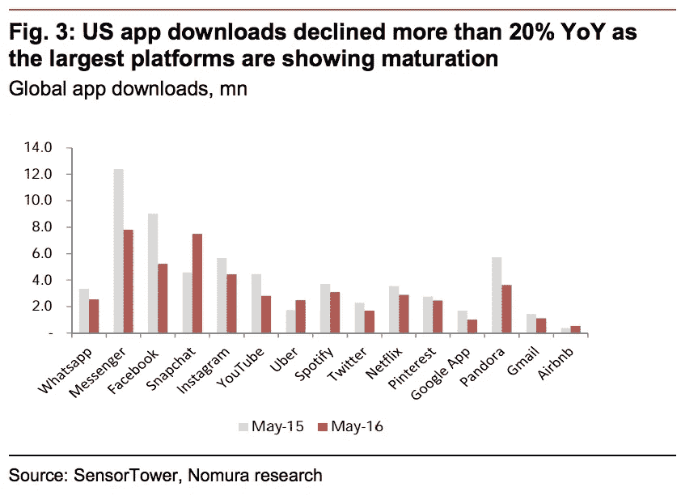
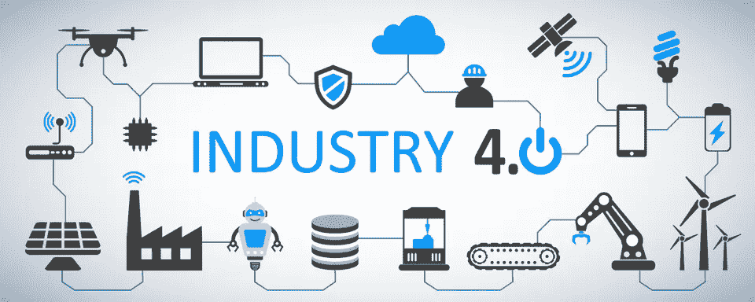

# 渐进式网络应用，人工智能，下一个应用热潮

> 原文：<https://medium.datadriveninvestor.com/progressive-web-apps-artificial-intelligence-the-next-app-boom-84ea807e0cc6?source=collection_archive---------12----------------------->

Photo by [Franck V.](https://unsplash.com/photos/g29arbbvPjo?utm_source=unsplash&utm_medium=referral&utm_content=creditCopyText) on [Unsplash](https://unsplash.com/search/photos/artificial-intelligence?utm_source=unsplash&utm_medium=referral&utm_content=creditCopyText)

应用热潮始于 2008 年 7 月，当时苹果推出了应用商店。前几年，当开发者开发应用程序时，仍然有人下载这些应用程序。但这也发生了变化，因为下载应用程序的普通智能手机用户数量急剧下降，根据 [Recode](https://www.recode.net/2016/6/8/11883518/app-boom-over-snapchat-uber) 的一篇文章，这种增长不像过去那样。这里可以看到一个增长较少的例子。

Image from [Recode.net](https://www.recode.net/2016/6/8/11883518/app-boom-over-snapchat-uber)

这张图代表了 2015 年和 2016 年各大应用的总下载量。这项研究证明，下载移动应用程序的人数正在下降。考虑到这一点，我们必须重新考虑移动应用的替代方案。最近，在网络应用领域，有一个竞争者可能会一劳永逸地结束 2008 年的应用热潮，即渐进式网络应用。根据来自 [Hackernoon](https://hackernoon.com/progressive-web-apps-the-future-of-mobile-web-app-development-f29257b0dea2) 的一篇帖子，渐进式网络应用程序是一种能够像原生移动应用程序一样看起来并做出反应的应用程序，这是通过现代浏览器上的 API 实现的，这些 API 使原生移动应用程序功能，如全屏应用程序或推送通知成为可能。最重要的是，这些 web 应用程序非常轻量级，安装过程也很容易，用户甚至不需要更新他们的 pwa，因为应用程序没有像应用程序商店那样的中间人来管理应用程序版本，应用程序会在用户连接到互联网时立即更新。有了这些优势，pwa 对移动应用及其未来是一个巨大的威胁。

但在这个阶段还有另一个参与者，人工智能近年来在可用性方面取得了巨大的飞跃。在深度学习的帮助下，人工智能的可能性是无限的。就在十年前，人工智能只能处理文字，现在人工智能可以进行人脸识别。这是一个只能通过科幻小说获得的功能，今天编写人工智能程序也变得更加容易，因为人工智能库变得越来越频繁。有趣的是，目前有一个用 Javascript 编写的人工智能库 Tensorflow.js。在 2018 年 Tensorflow 开发峰会上，谷歌开发人员展示了一个 Tensorflow.js 应用程序的演示，这是一个表情符号清道夫应用程序，用户会被提示在他们周围找到与应用程序中显示的表情符号相对应的物品。

Image from [Forbes](https://thumbor.forbes.com/thumbor/960x0/https%3A%2F%2Fblogs-images.forbes.com%2Fbernardmarr%2Ffiles%2F2018%2F09%2FAdobeStock_203804824-1200x480.jpg)

这改变了我们对网络应用的看法。根据福布斯的一篇文章，我们目前正处于一场新的革命中，工业 4.0，而以前计算机是用来帮助人类完成简单任务的。现在，我们正在开发能够相互连接并在没有人类参与的情况下做出决定的技术。想象一下，整个行业只有机器和网络连接。

现在你可能想知道，这与 2008 年的应用繁荣有什么关联。这甚至会影响我们的日常生活。例如，想象一下计算机为一家公司订购汽车零件，因为计算机意识到目前的库存不足所有这一切都没有人的参与，这是我们所有人保持相关性的新步骤。随着复杂的 PWA APIs 和人工智能的发展，新的应用程序热潮即将到来，但不是人类正在使用的应用程序。它将被开发用于计算机相互通信的目的。在我看来，未来应用程序的流程如下:人工智能将用于处理计算机接收的任何类型的输入，通过复杂的 API，它将向其他计算机发送命令以完成其任务。与现代框架兼容的人工智能库使这成为可能。