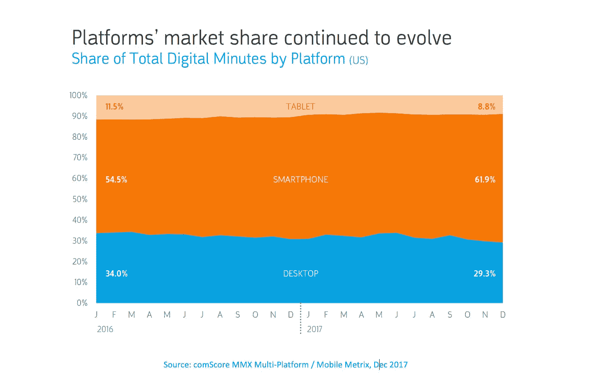
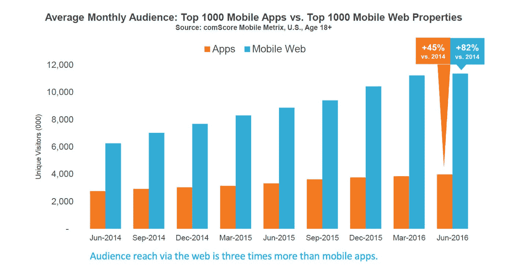
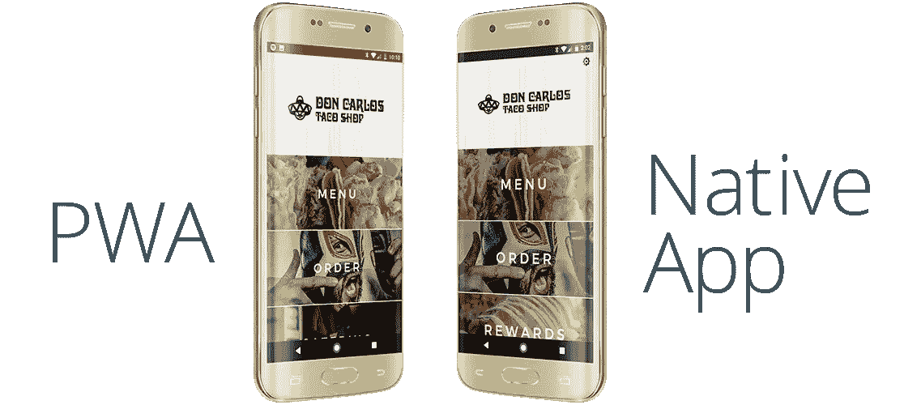

# 渐进式网络应用——通过移动设备吸引受众的新方式。

> 原文：<https://medium.datadriveninvestor.com/progressive-web-apps-the-new-way-to-engage-your-audience-through-mobile-4f130e660356?source=collection_archive---------1----------------------->

今天，人们用智能手机满足各种需求。随着这种转变的发生，这对品牌意味着什么？移动设备上的移动注意力持续时间比桌面上的更短，品牌面临的挑战是在这些短暂的机会窗口内吸引观众并满足他们的需求。

谷歌一份关于移动行为的报告展示了人们使用手机的目的以及需求是如何得到满足的。搜索不仅是使用最多的资源，也是 87%的人首先求助的资源。人们用手机寻找解决问题的方法。去搜索，去做，去买。

然而，根据谷歌的数据，如果加载时间超过 3 秒，53%的用户会放弃移动网站。谷歌将加载时间在 2.4 秒以内的移动网站评为“好”现在，一旦网站加载完毕，人们希望整个网站能够快速响应他们的需求。

来源:comScore MMX 多平台/移动矩阵，2017 年 12 月

*通过网络接触到的受众是移动应用的三倍*

# 为什么是渐进式网络应用？此外，你为什么要关心。

根据 ComScore 的 2018 年美国移动应用报告，移动网络推动了受众增长。该报告指出，通过网络接触到的受众是移动应用的三倍。

移动应用和移动网络在满足任何给定环境下的用户需求方面都有局限性。应用程序确实有优势，因为它们通过快速和强大的功能增加价值，如推送通知、定位服务、集成其他应用程序和网络的能力等。人们在智能手机上花费超过 85%的时间使用原生应用程序；然而，他们 84%的时间只花在五个应用上。68%的智能手机用户使用应用程序，主要用于新闻、游戏、娱乐或体育，因此很难在这些类别之外建立更多的忠实应用程序用户。

随着移动优化和移动响应需求的转变，品牌需要构建原生应用和移动就绪网站，以接触受众，提供有目的的互动和可获取的内容。

如果你能两者兼得，不是更简单吗？这不是幻想，而是现实。

这就是渐进式网络应用程序(pwa)如何在移动网络上提供令人惊叹的用户体验以及具有丰富、强大功能和迷人品牌体验的原生应用程序式体验的价值。

# 那么什么是渐进式网络应用呢？

你可以把渐进式网络应用想象成一个介于你的网站和你的移动应用之间的网站，只有两个世界的优点，没有任何一个的缺点。它们的行为和感觉就像设备上的原生应用程序。

**集成**:渐进式网络应用拥有类似应用的体验和互动，就像一个本地应用一样，除了在浏览器中之外，它能做所有的事情。它们反应灵敏，可以在任何平台上工作，无论使用何种设备或浏览器。

**SEO &可发现性** : [现在 60%的搜索来自移动设备，而且这个数字还在继续增长。](https://www.biznessapps.com/blog/progressive-web-apps/)人们正在积极地使用他们的移动设备寻找内容，所以想象一下你的 PWA 出现在那些搜索结果中。用户可以通过一个简单的网址访问你的 PWA，而不必从应用商店下载。PWA 是以标准 SEO 为基准的，不仅仅是应用程序的名称，还包括 PWA 中的内容。

**吸引人**:事实证明，谷歌支持的 PWAs 在悬浮性能、影响力和用户参与度方面是成功的。PWAs 正迅速成为网络互动的新规范。他们可以向移动设备发送推送通知，这使得它成为品牌的一个强大工具。PWAs 还可以使用相机、数据存储、GPS 和运动传感器、面部检测等设备功能，为 AR 和 VR 体验铺平道路，就在网络上。

**快速和轻便:** PWA 方法专注于可靠地加载更快更少的数据！它速度快、响应快、安全可靠，这使得参与度和转化率高于原生移动应用。

**可靠且可重复参与**:PWA 可以发送实时警报来吸引观众，即使应用程序没有运行。可以通过保存到主屏幕功能从主屏幕启动 PWAs。

**安全**:与传统的网络应用相比，PWAs 具有更好的安全性，因为它们是通过 HTTPS 提供服务的。

难怪各大品牌都在采用这项技术。英国《金融时报》放弃了自己的原生应用，转而支持 app.ft.com 强大的 PWA。

《福布斯》当然看到，对于客户来说，去网站把 PWA 安装到主屏幕上比从应用商店安装应用更简单。优步 Lyft 的星巴克将 PWA 瞄准了数据带宽有限和网络连接差的用户。网络推送通知帮助 Twitter 将用户参与度提高了 4 倍。凭借出色的用户体验，全球速卖通将所有浏览器的新用户转化率提高了 104%，在 iOS 上提高了 82%。

渐进式网络应用不是为了淘汰原生移动应用；虽然有些品牌已经完全放弃了自己的原生应用。重要的是要弄清楚它们是如何协同工作的。将渐进式网络应用整合到移动内容战略中以提供快速和身临其境的用户体验的机会不容错过，请确保您的品牌发挥优势。