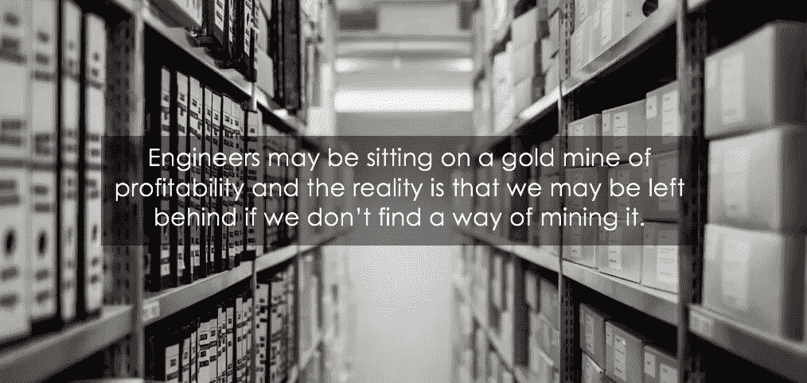
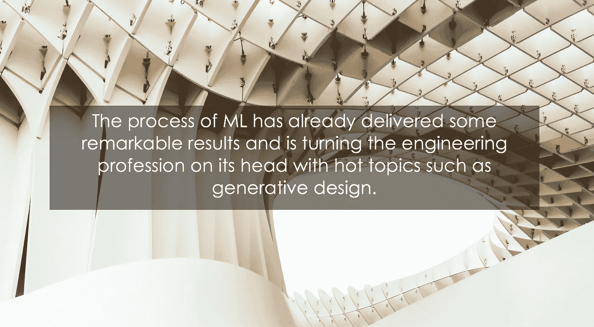
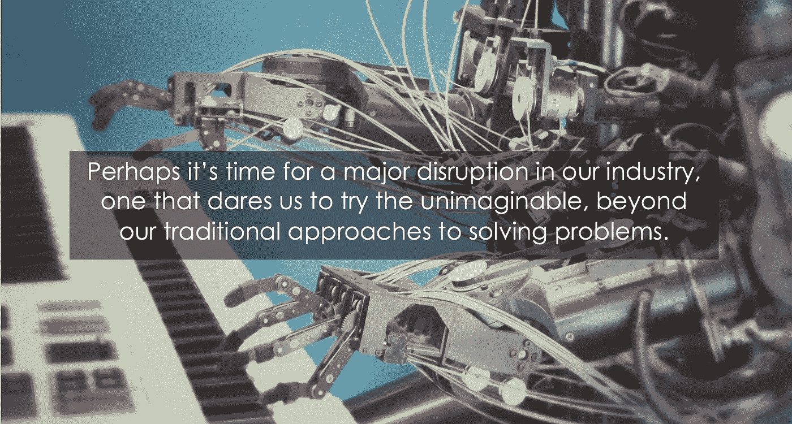

# 项目工程师们，你们可能坐在机会的金矿上，人工智能可能是你们的采矿工具

> 原文：<https://medium.datadriveninvestor.com/project-engineers-you-may-be-sitting-on-a-gold-mine-of-opportunity-and-artificial-intelligence-9fa1870dc6b2?source=collection_archive---------21----------------------->

在项目工程领域工作了近 25 年，我发现我们有多少业务流程一直停滞不前。正如大多数专家所倾向的那样，我们倾向于相信这些久经考验的业务流程是向前飞跃的稳定平台，但平淡的事实是太阳正在昨天的地平线上落下。

H[ar vard Business Review](https://hbr.org/sponsored/2017/07/digital-transformation-is-racing-ahead-and-no-industry-is-immune-2)，根据 Constellation Research 进行的研究显示，自 2000 年以来，财富 500 强企业中有 52%的**要么破产、被收购，要么由于数字中断**而不复存在。

该研究进一步预测，从现在起不到十年的时间里，**标准普尔 500 指数中 75%的公司将被出售，**尽管该研究没有具体说明原因，但很大一部分显然是由于数字颠覆造成的。

这意味着 375 家公司必须取代它们的位置，而那些愿意取代它们的公司，将会认识到并发现这些变革浪潮带来的多重机遇。

## 我们的哪些流程仍然类似于 1953 年发明的令人着迷但缓慢且过时的笔式绘图仪？

The Pen Plotter, a very fun machine to watch, was replaced with the wide-format InkJet Plotter, a revolutionary device which reduced printing time and the investment of human resources. It placed its owners ahead of their competition by combining processes that would have required multiple technologies to achieve.

作为工程师，我们不能否认第一性原理方法在应对新挑战和新项目中的重要性——毕竟，它是工程过程的基本组成部分。该原则认为，首先必须将问题分解成有限元素，这样对问题的理解就不受假设的约束。毕竟，我们的世界和产品是结构化的和过程驱动的。

然而，第一性原理的应用是一个费力费时的过程。每个进入这个行业的年轻工程师都必须掌握它；这一过程反过来又常常剥夺了高级工程师作为导师在一个压力很大的环境中的宝贵时间。

除此之外，我们对我们承担的每个项目的每个元素都重复这种方法，这意味着我们生产的定制设计只适用于特定的问题，它在创新方面的最佳报价是它绝对只做它被设计的工作。

## 我们每次都要从头开始吗？

Y et 众所周知，每个工程问题都有共同的变量，大多数问题在某种程度上都是相似的。想象一下迄今为止已经完成的所有工程项目。自从万维网出现以来，你估计这个过程在全球重复了多少次？

虽然我认为我们拥有的知识和经验是无价的，并将继续成为我们的核心竞争力，但我们尚未意识到我们组织历史的真正价值。

Photo by [Samuel Zeller](https://unsplash.com/photos/JuFcQxgCXwA?utm_source=unsplash&utm_medium=referral&utm_content=creditCopyText) on [Unsplash](https://unsplash.com/search/photos/data?utm_source=unsplash&utm_medium=referral&utm_content=creditCopyText)

## 那么，我们坐拥的这个机会金矿是什么呢？

他的金矿是数据。令人吃惊的是，严格的监管沉默为我们提供了明天的机会。我们被遗忘和低估了，我们将自己的经验和组织能力埋藏在我们的档案中——通常是不可访问的——我们如此努力地保存这些档案，以遵守我们的法定责任。

**年复一年积累的数据**，坐拥完整的设计、全面准确的成本估算，以及适用于各种应用的框架式解决方案。想想创建这些解决方案所花费的大量重复工作…拥有比以往任何时候都多的数据，我们是否还应该对以前可能已经解决过多次的类似问题进行手工计算？

我们不必承担这一艰巨的任务来创造我们的可交付成果，这意味着我们可以在所有组织层面重新分配大量的体力劳动时间——个人、主管、纠错、绩效评估、培训等。这个清单还可以继续下去，时间加起来会达到一个不可思议的数目。

## 如果我们引入人工智能之手来挖掘我们的数据，会怎么样？

人工智能(AI)通常是一个令人困惑的话题，需要明确的是，AI 有多种形式。这个领域的解决方案从有自我意识的科幻机器人(为了控制地球而与人类对抗)到一套相对简单的算法(一种称为机器学习的人工智能)，这些算法有能力预测数据模式。

机器学习提供了一种以前无法想象的[处理数据](https://www.forbes.com/sites/forbesagencycouncil/2018/08/01/do-you-know-the-difference-between-data-analytics-and-ai-machine-learning/#1b09d8cd5878)的方式。这是一个分析和再分析的过程，同时不断地从中学习，然后创造从数据池中预测细节的能力。

这种工具的真正力量在于计算机处理器不可思议的能力，它能无情地处理数据，使之达到人类无法轻易达到的深度和广度，通过这个过程，在数据的基础上建立自己的理论。这预先假定没有人需要教它理论，也不需要教它如何正确应用理论的错综复杂；相反，它会根据数据中的信息构建自己的数据库。

A beautiful example of g[enerative design](http://memagazineselect.asmedigitalcollection.asme.org/article.aspx?articleid=2676802) in Seville, Spain. Photo by [Martin Grincevschi](https://unsplash.com/photos/IJFLfaVos54?utm_source=unsplash&utm_medium=referral&utm_content=creditCopyText) on [Unsplash](https://unsplash.com/search/photos/la-setas-seville?utm_source=unsplash&utm_medium=referral&utm_content=creditCopyText)

## 现在问问你自己，机器学习能对你档案中的数据做什么？

机器学习会对我们做生意的方式产生怎样的潜在影响？首先，它可以扫描这些数据库，给它们编索引，使它们可以被访问。当然，如果档案已经数字化，这项任务可能会更容易，然而，[纸质档案也可以扫描和索引](http://library.stanford.edu/blogs/digital-library-blog/2017/11/artificial-intelligence-and-library-future-revisited)。然后，基于索引，它可以再次扫描存档，对各种类型的内容建立更深入的理解。

**人工智能能从这些数据中学到什么？**它能根据一组简单的查询提取以前的解决方案吗？如何分析以前的项目成本趋势，并将其与历史经济指标或其他地理趋势进行比较，以提供预测性的成本估计？它能拆开以前的设计，根据以前没有想到的变量产生自己的工程理论，并在这个过程中抛弃我们所知道的基本原则设计吗？

我们需要创造性的关注是找到创新的方法来改进我们的流程，摆脱旧的方法，走向未来。

## 人工智能会如何影响我们的日常生活？

对我来说，从这个思想实验中最切实的感悟之一是，在人工智能作为老师和检查者的情况下，培训工程师应用第一原理设计的可能性。这一过程可以应用于解决项目中的实际问题，从而随着专业发展影响产品。

对[工作环境](https://hbr.org/2008/07/employee-motivation-a-powerful-new-model)的影响尤其令人感兴趣。年轻的工程师更容易建立自主意识，更容易培养，也因此更有效率。经验丰富的工程师将有更多的时间从事创造性的、激励性的工作，使他们能够与我们有价值的客户更紧密地合作，有可能建立长期的合作伙伴关系。

将我们现有的工程专业知识与强大的工具(如人工智能)结合在一起，打造丰富我们团队生活的解决方案，同时为我们的公司增加竞争优势，这让我感到兴奋。

Photo by [Franck V.](https://unsplash.com/photos/U3sOwViXhkY?utm_source=unsplash&utm_medium=referral&utm_content=creditCopyText) on [Unsplash](https://unsplash.com/search/photos/artificial-intelligence?utm_source=unsplash&utm_medium=referral&utm_content=creditCopyText)

## 我们需要重新定义我们的文化和业务范围。

实现机器学习来索引无穷无尽的信息档案可能不是最容易的任务——捕获和索引会很麻烦——但我只能开始想象长期的好处。但也许，这一挑战最艰难的部分是重新谈判我们在工程领域的既定文化。

> **早在 1994 年，为《麻省理工学院斯隆管理评论》******撰稿的文卡特·文卡特拉曼(Venkat Venkatraman)就认定，在进化转型之外，还有革命性的领域。****

**从业务流程重新设计开始，他将下一个层次描述为业务网络重新设计，随后是最后也是最具革命性的流程——业务范围重新定义。**

**针对后者，他指出，改变业务重心的激进行为不仅需要彻底重组其流程和技术，还需要重组组织文化和集体思维。**

**我们都知道文化和技术转变会有多难，但我认为人工智能为我们提供了一种从整体上看待工程流程的不同方式，并可能让我们的公司快速成为非凡领导力和变革的典范。然而，关键的第一步是我们每个人都要成为行业变革的领导者。**

> **“并非所有徘徊的人都迷失了方向”
> 托尔金**