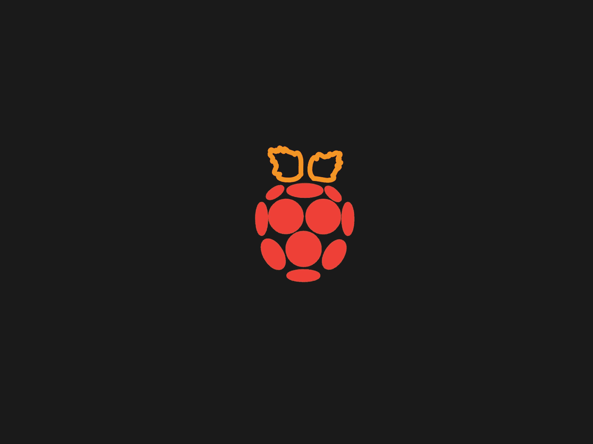
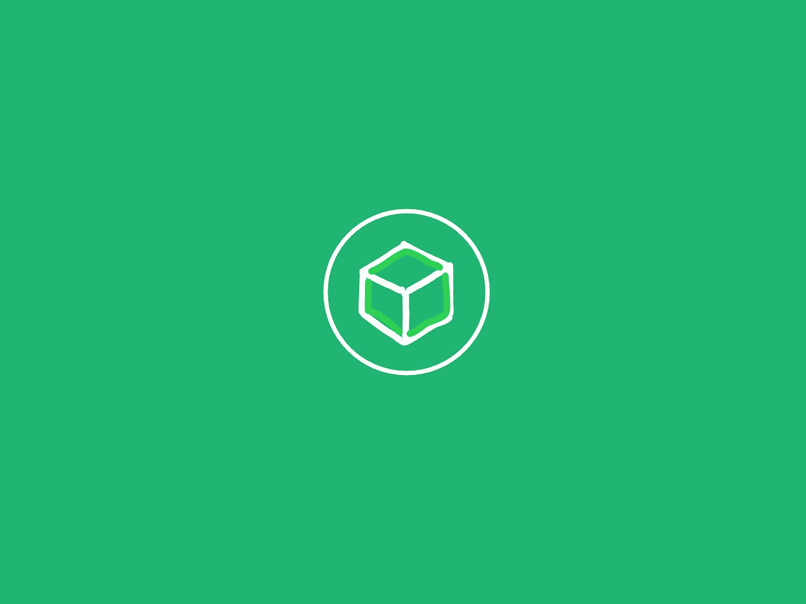
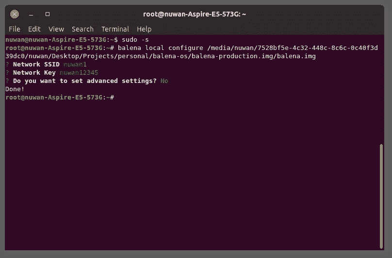
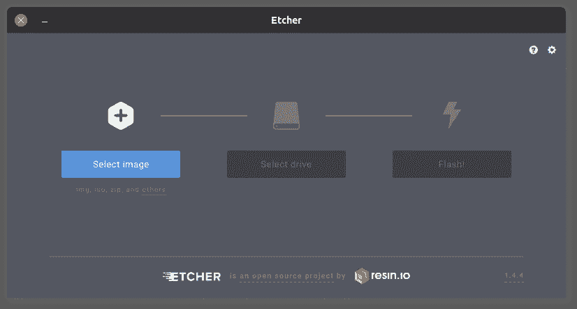
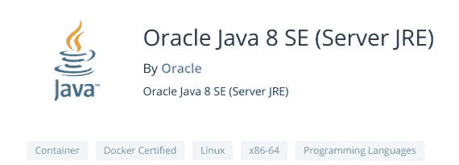
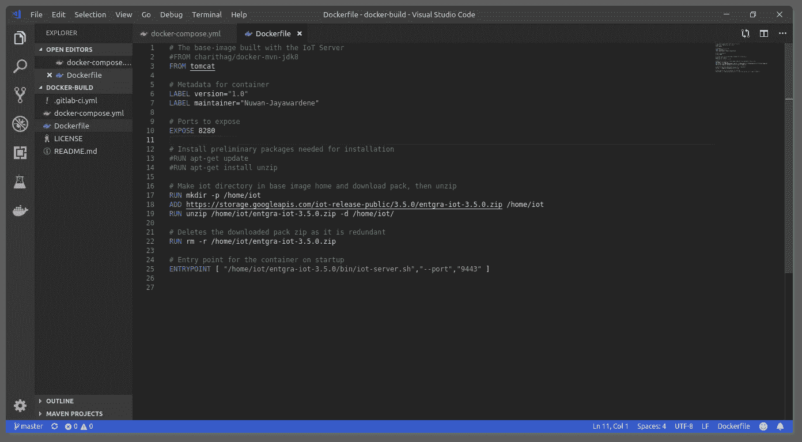
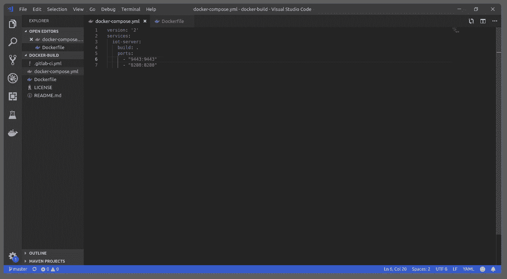

# 如何用 BalenaOS 和 Docker 缩小 EMM 服务器

> 原文：<https://medium.datadriveninvestor.com/project-pym-part-i-e59a58dd3b96?source=collection_archive---------5----------------------->

## 又名。Pym 项目:第一部分

Pym Particles not included

长久以来，我一直对树莓派的多功能性着迷。

虽然就我个人而言，我以前使用过这个设备，但那只是为了一个半吊子的不切实际的大学项目。
坦率地说，我对这个平台的体验充其量是最低限度的。

所有这一切都将改变…

# 使用物联网

在我在 [WSO2，Inc](https://medium.com/u/4571d92b14fa?source=post_page-----e59a58dd3b96--------------------------------) 的 12 个月实习期间，我得到了[的机会去开发](https://medium.com/@nuwnjay/visualizing-the-internet-of-things-the-design-3cc2d22d16f6?source=---------5------------------)他们的物联网服务器产品。这是我第一次接触并被他们的物联网雾/边缘网关解决方案吸引住的地方。
这款产品后来被重新命名为 [Entgra 物联网服务器](https://entgra.io/iot-platform)。

[Entgra IoT Server](https://entgra.io/)

Fog 实现的最初尝试包括将一个 Android 代理集成到一个现成的 Android 电视盒子上。

然而，在项目的第二次尝试中，我开始致力于小型化物联网服务器本身。这背后的推理涉及几个要点；

1.  雾节点本质上是一个微型网络。
    因此，用运行小型边缘网关的主服务器的微缩版来管理它们不是更有意义吗？
2.  技术一致性。
    开发和管理支持雾的网络非常困难。不同的技术组合只会加剧这个问题。在中央服务器和边缘网关上使用一致的技术可以缓解这一问题。
3.  易于部署。
    在云中工作的是在边缘网关上运行的(假设已经进行了一些修改以适应平台和环境的变化)。

在 RPi 上运行哪怕是一个缩小版的 Entgra 物联网服务器也是一项壮举，尤其是考虑到设备的规格有限。尽管如此，至少考虑在嵌入式环境中运行服务器的前景是有益的。因此，即使项目以失败告终，尝试本身也值得获得知识。

带着这样的决心，这个项目(以漫威漫画的角色命名，被亲切地命名为“Pym ”)开始了。

Entgra 物联网服务器文档对无缝部署提出了一定的系统要求。这是因为单个物联网服务器产品实际上由 3 个需要并发运行的服务器(物联网服务器、代理和分析)组成。
然而，主物联网服务器可以独立部署，在一定程度上降低资源消耗，这在测试场景中尤其有用。

Raspberry Pi

无论如何，通过尽可能地减少 fat 来保持最低的性能开销是至关重要的。这种“修整”是在几个方面完成的，例如；

1.  嵌入式硬件的操作系统
2.  所述操作系统中服务器的运行时环境
3.  实际可部署服务器中的模块

本文将讨论在前两个方面所做的工作。

## 1.操作系统

众所周知，Raspbian 是 Raspberry Pi 平台的默认操作系统。但是问题是 Raspbian 包含了大量的实用程序和预捆绑软件。需要一个更好、更精简的替代方案。

就在那时，一家名为 [Balena](https://www.balena.io/os/) 的公司开发的全新操作系统引起了我的注意。

[BalenaOS](https://www.balena.io/os/); previously resin.io

让 BalenaOS 脱颖而出的是它在 Raspberry Pi 上部署 Docker 容器的固有能力。更具体地说，部署在硬件上的任何容器都将作为设备的本机操作系统工作。这使得 BalenaOS 在无头服务器部署等情况下非常有吸引力。

因此，第一步是在我的开发机器上安装 BalenaOS CLI 工具。CLI 工具包括安装、访问和上传容器到目标设备所需的所有必要组件。

> $ npm 安装—全局—生产—不安全—perm balena-CLI

正如我之前提到的，BalenaOS 希望安装的容器可以无头运行。因此，所有的网络配置等。需要事先通过 Balena CLI 工具执行。

Configuring the BalenaOS.img file prior to flashing

此后，使用图像闪存工具将 BalenaOS 闪存到要安装在 RPi 上的 SD 卡上。

Using an older version of the Balena Etcher tool, back when the company was known as resin.io

一旦正确配置了设备，就可以使用 SSH 通过 CLI 工具进入 BalenaOS 用户空间。

> $ balena ssh mydevice.local —主机

随着操作系统安装和设备配置的完成，是时候进入项目的下一阶段了。

## 2.服务器的运行时环境

如前所述，使 BalenaOS 脱颖而出的是它原生运行容器的能力。
操作系统安装完成后，是时候转移到 Docker 上了。

但是首先，关于 BalenaOS 和 Docker 有 3 件事需要了解。

**1。构建 Entgra IoT 服务器的基础映像需要预先安装运行服务器所需的依赖关系。**

起初，我决定使用久经考验的 Ubuntu 18.04 基础映像来创建我的容器。很快我意识到这是一个棘手的问题，因为 Oracle Java(物联网服务器所需的主要依赖项)需要手动配置和安装。此后，我选择了下一个最好的选择；Oracle Java 8 映像。

起初，一切都非常顺利，但后来出现了一个致命的错误。虽然 Oracle Java 容器在我的开发机器上运行得很好，但是当我试图在 RPi 上运行它们时，它们就失败了。为什么？嗯，类似于操作系统是如何基于“架构”的，基础映像也支持目标架构。

Oracle Java 8 header as seen on [Docker hub](https://hub.docker.com/_/oracle-serverjre-8), notice the lack of the ARM architecture

不幸的是，Oracle Java 8 不支持 ARM，而 ARM 是 RPi 的 SoC 架构。
下一个最佳选择是 Apache Tomcat 基础映像。它比 Ubuntu 和 Oracle Java 镜像要重得多，也大得多，但它完成了任务，更重要的是，它还支持 x64 和 ARM。

**2。BalenaOS 用户空间是只读的**

作为一项安全措施，Balena 关闭了用户空间，防止任何类型的操作。然而，在实践中，它确实限制了在操作系统上使用容器的自由度和灵活性。

拥有一个只读用户空间意味着涉及文件操作的 shell 命令(比如 *mkdir* 、 *rm* 甚至 *wget* )是不可能的。因此，作为一种变通办法，一切都必须在 Docker 的“Dockerfile”命令所允许的范围内进行。

A preliminary version of the Dockerfile used for testing

**3。Balena CLI 允许使用 docker-compose.yml 文件在目标设备上部署和构建 docker 文件。**

完成 Dockerfile 的初步版本后，现在可以创建一个 docker-compose.yml，其中包含通常委托给 *$ docker run* 命令的部署配置

Preliminary docker-compose.yml file with deployment configurations

如上所述，docker-compose 非常简单。
在当前阶段，它包括 docker 文件的路径，以及当从最终基本映像中产生新容器时要发布的一组端口。在本例中，这些端口是 9443；访问 Entgra 物联网服务器 web dashboard 和 8280；用于注册设备。

这样一来，Balena CLI 现在可以用来将 docker-compose 文件部署到安装了 BalenaOS 的连接 RPi 上。

> $ CD <location containing="" docker-compose="" file="">$ balena push mydevice . local</location>

一旦该命令启动，Balena 就开始在目标设备上构建基础映像，如 Dockerfile 方法中所述。

尽管这是将 Entgra IoT 服务器移植到 RPi 上的一种相对干净的方式，但是有几个值得注意的地方需要解决。

1.  包括下载的服务器运行时在内的最终基本映像有 2.7GB，无论如何都太大了。
2.  Tomcat 基础映像的臃肿大小也是造成这种大尺寸的原因之一。
3.  RPi 上只打算运行 1 台服务器，而实际上该产品有 3 台服务器同时运行。

由于这个项目仍然是一项正在进行的工作，所有这些和更多的是计划在未来解决。

在接下来的文章中，我计划说明实际的产品是如何被缩小的，以使它在 RPi 上容易运行。

与此同时，可以考虑在 LinkedIn 和 T2 的 Twitter 上查找 Entgra。他们的产品提供了更多功能，[联系 Entgra 团队](https://entgra.io/contact)了解更多信息。