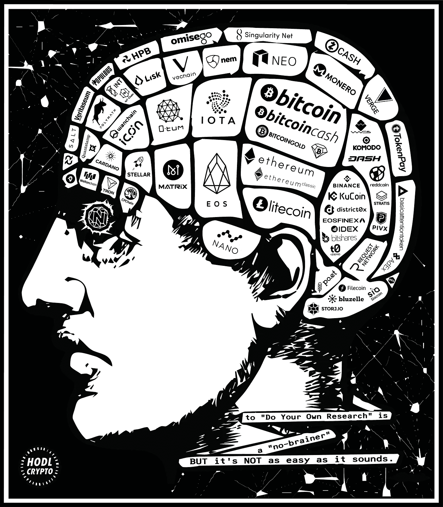

# 促进加密投资的 DYOR(自己做研究)文化

> 原文：<https://medium.datadriveninvestor.com/promoting-the-dyor-do-your-own-research-culture-for-crypto-investing-20bb8684045f?source=collection_archive---------3----------------------->

做自己的研究(又名“DYOR”)是加密货币和区块链社区经常使用的一句口头禅；而且理由很充分。

在加密领域，由于大型合作伙伴声明，甚至在某些情况下，关于即将到来的合作伙伴声明的声明，项目有一个严重的趋势来推动炒作。

TRON (TRX)的首席执行官贾斯汀·孙(Justin Sun)获得了最著名的加密公告案例奖，他以此作为在 Twitter 上推广其项目的策略而闻名。

可以肯定地说，从长远来看，这种策略可能会产生收益递减，而且每一个后续的声明都可能不那么被重视；尤其是像这样的迷因四处传播:

无论如何，这些公告通常会导致相应加密货币的交易价格大幅上涨。

如果你质疑这类公告和炒作的合作关系的有效性，你可以肯定有人会指责你“捏造”(也就是散布对项目的恐惧、不确定性和怀疑)。这就是 DYOR(自己做研究)概念的由来。

# 推广 DYOR 文化

对特定加密项目大肆宣传的两个极端的人都倾向于敦促其他人进行 DYOR，这对我们所有人来说都是一个好建议。具有讽刺意味的是，敦促他人 DYOR 的双方都认为这样做会导致他人得出相同的相应结论。

话虽如此，鼓励适当的尽职调查也没有坏处，推广这种 DYOR 文化只会带来更多见多识广的投资者，从而为整个社会带来更多价值。

# 反思“ICO 热”和新的伙伴关系公告趋势

当我们回顾 2017 年以及席卷加密社区的 ICO 投资热潮时，数百个新项目在几个月内推出 ICO，我们可以深入了解为什么 2018 年很可能是合作伙伴宣布之年。

这里的联系是，尽管 ICO 无疑将在 2018 年及以后继续推出，但这数百个年轻的项目都将争夺投资者的注意力，并在这个可能已经被描述为公用事业令牌饱和的市场中争夺主导地位和生存权利。

较小的项目将使用与大合作伙伴的合作声明作为其战斗箱中最强大的武器之一，以推动其令牌价格并在加密社区中获得相关性。

这是一个消极的现象，原因有二:1)这玷污了整个加密市场的声誉，使项目看起来不可信，并且主要由炒作驱动；2)项目团队围绕他们的公告大肆宣传通常会失去可信度。

# 不断更新和发布的压力

当项目的投资者社区等待他们资助的项目启动时，他们会不断地监控他们投资的更新。如果太长时间没有任何事情发生，代币的价格就会开始下跌。

这种展示持续进展的压力沉重地压在项目团队的肩上，这也解释了为什么他们觉得有必要告知投资者任何推进项目进程的事情。值得宣布的更新包括测试网、平台和钱包的 alpha 版本、品牌重塑、合作伙伴关系，当然还有公告。

# 对我们所有人来说，DYOR 是一个持续的过程

每当您考虑投资一个加密货币项目时，重要的是要彻底了解它背后的用例、技术和执行计划，以及其他细节，如令牌经济学和开发团队的背景。

此外，对加密货币项目的监测和审查对投资者来说不是一次性交易。这是一个持续的过程，投资者需要随时了解项目里程碑、开发团队的变化或增加、公告以及来自竞争项目或监管环境变化的外部威胁。

# 不要用 DYOR 来为怀疑论者辩护

尽管宣传 DYOR 没有坏处，但它经常被用作怀疑论者审视的一个懒惰的“借口”。我经常在留言板和聊天室里看到对“DYOR”的呼吁，作为对批评者关于为什么某些项目是好投资的问题的回应。这不是很有帮助。

或许这些人正试图避免给出可被视为“投资建议”的东西，并通过“DYOR”式的回应，将自己从监管机构可能带来的麻烦中解救出来，但在我看来，这既懒惰又偏执。

# 做并分享你自己的研究

如果你打算投入时间和精力对加密货币项目进行适当的尽职调查，你应该在 DYOR 之外更进一步，并与他人分享你的知识。

区块链技术的开源代码和透明性是分散加密货币社区的优势，同样，更开放地分享我们关于加密货币项目的知识(好的和坏的)的运动也是如此。

开放更多的对话和不同的观点和意见将丰富加密社区，对投资者和项目团队都有利。

总之，作为行动的号召，永远记住 DYOR，但也请记住为什么你应该 DASYOR 当解决怀疑论者和批评家。

**H** 老 **O** n 为 **D** 耳 **L** ife

*原载于 2018 年 4 月 24 日*[*【hodlcrypto.co】*](https://hodlcrypto.co/2018/04/24/promoting-the-dyor-do-your-own-research-culture-for-crypto-investing/)*。*