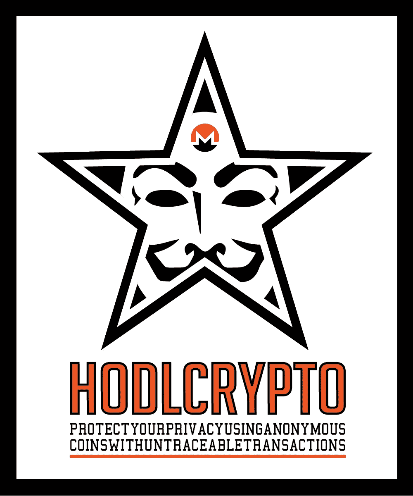
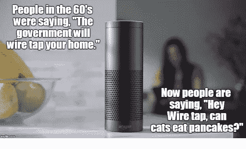
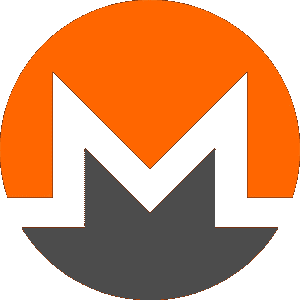
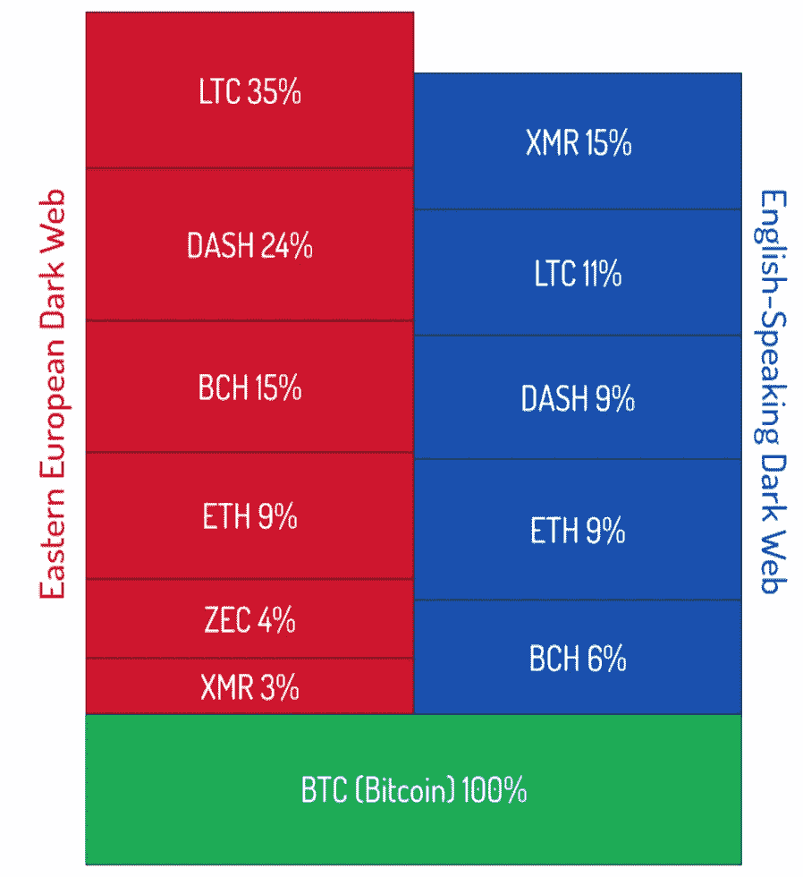
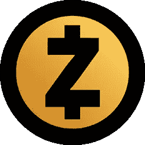
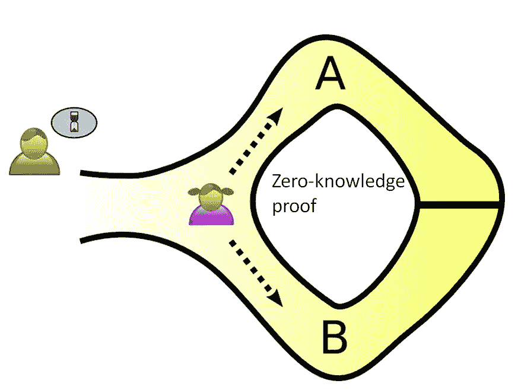
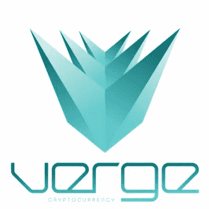
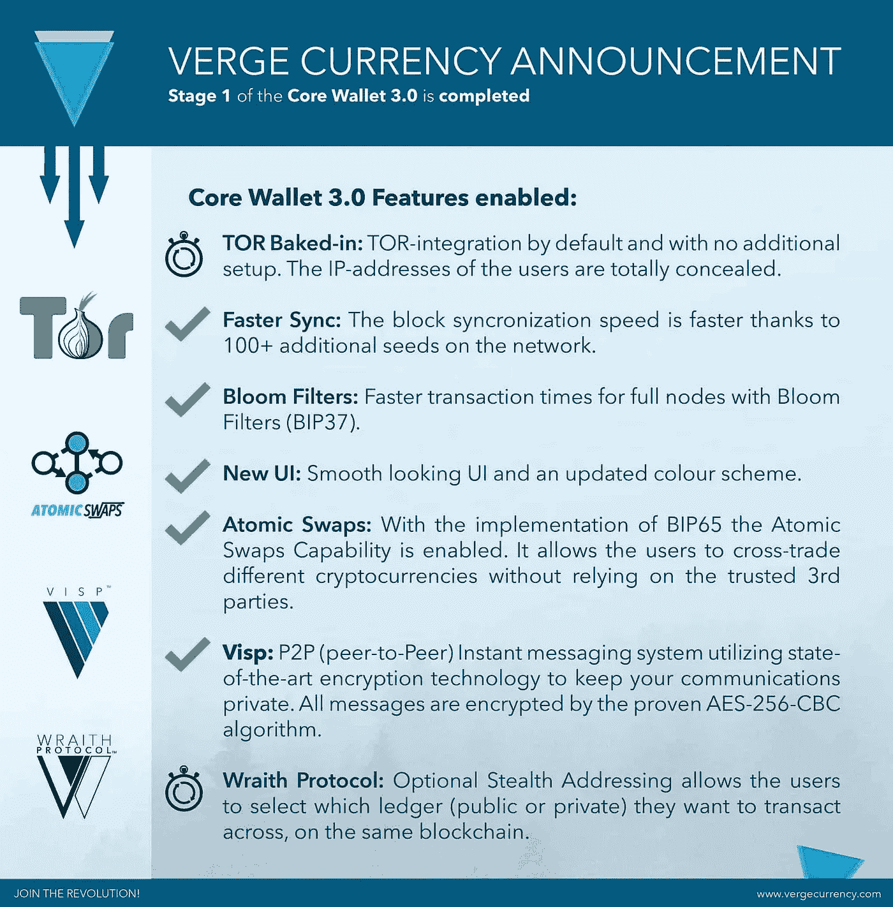

# 使用匿名硬币和不可追踪的交易保护您的隐私

> 原文：<https://medium.datadriveninvestor.com/protect-your-privacy-using-anonymous-coins-with-untraceable-transactions-f7a1e13a18c?source=collection_archive---------0----------------------->

在我们生活的世界里，隐私被许多人低估，甚至在许多方面已经“死亡”。

脸书、谷歌和其他科技巨头几乎知道你的一切，许多人已经接受了**的心态，“如果你没有什么要隐藏的，那么你就没有什么好担心的。”**

消费者继续采用进一步损害其隐私的技术，但似乎对此并无异议。

然而，一些人仍然高度重视他们的隐私，并采取预防措施来保护它。加密货币市场对隐私币有很大的需求，隐私币允许匿名和不可追踪的交易。

# 加密社区对隐私的需求

比特币和整个加密货币社区**长期以来一直与无政府资本主义和自由市场**联系在一起，因此很自然地认为社区对隐私也有**强烈需求**。

在过去的几年里，比特币的替代加密货币激增，旨在更好地服务于特定的使用情况。**在过去的几年里，隐私已经成为加密领域最热门的领域之一。**

# 比特币并不完全匿名或私有

众所周知，比特币事实上并非完全匿名或私有的货币。虽然您的身份并不与您的交易相关联，但您的公共地址可能会(以某种方式)与您的交易相关联。

这个公共地址用于发送和接收比特币交易。它还可以用来**跟踪和链接你的所有交易**，这些交易可以在比特币的公共账本上查看。

由于大多数商品和服务的购买，甚至许多交易所都需要某种形式的身份证明，所以在有人能够将你从零售商那里进行的交易与加密货币钱包、交易所以及你可能发送比特币的其他地方联系起来之前，只需要获得一些信息。

# 三大隐私硬币

今天有许多另类硬币来满足人们对隐私的需求。这些硬币使用各种创新技术——从加密技术到代理网络——使交易匿名且不可追踪。

下面我们将根据他们的隐私和安全功能的**强度以及他们在加密货币市场中的**相对市值排名**来介绍我认为的前 3 名。**

# 1)Monero(XMR)——隐私币之王

Monero 是**最受欢迎的隐私币**，也是群体中**市值最大的，目前排名第 11 的加密货币。**

Monero 使用了**CryptoNight“共识算法和环形保密交易，旨在提高隐私和安全性。**

**环形事务的工作方式是将事务中的公钥与其他较旧的事务捆绑在一起。这样做是为了创建一个混淆地址的“混合器”。这是一个非常健壮的过程，它使得区块链分析几乎不可能。正因如此，Monero 被视为最匿名的加密货币之一。**

**虽然**地址捆绑会导致更大的事务大小，但是**这不是一个大问题，因为 **Monero 的块大小是自适应的**。该项目还经常进行硬分叉以进行优化。**

**除了环保密交易，Monero 使用**环签名和秘密地址来隐藏交易中的发送方和接收方**。**

# **更多的匿名和隐私即将到来**

**进一步的匿名和隐私功能仍在开发中，如 **Kovri 路由器、**将被实现为**隐藏 I2P 交易的原始节点。****

*****注:*** *I2P 代表* ***隐形互联网项目*** *，这是一个匿名的网络层，允许抗审查，点对点通信。***

**对于那些熟悉 TOR 网络的人来说，I2P 是相似的，因为它们都是匿名代理网络。就 Monero 而言，TOR 和 I2P 之间的差异并不特别相关。**

**Monero 在隐私币中**久负盛名并占据主导地位，**开发团队**继续进行改进，**并且这种货币也**在暗网市场**获得了广泛接受(在英语暗网市场中仅次于比特币)。**

****

# **2)零知识证明的 Zcash (ZEC)**

****

**Zcash 使用**零知识证明**为其用户提供匿名。**

***对于那些不熟悉的人来说，零知识证明是一种方法，通过这种方法，一方(证明者佩吉)可以* ***向另一方(验证者胜利者)证明*** *她知道一个值 x，* ***除了她知道值 x 之外，不传递任何其他信息*****

******

***使用 Zcash，零知识证明用于**加密发送者/接收者地址和交易金额**。同时，所有交易仍由区块链验证。***

***更具体地说，Zcash 使用了 ZK-斯纳克法，这是零知识证明的一种变体，其中“证明者佩吉”和“验证者胜利者”之间不需要任何交互。***

****对于那些好奇的人来说，是的，****【ZK】是一个超级书呆子的缩写，它代表****Z****ero****K****knowledge****S****uccinct****N********

***Zcash 协议还使得**发送者不能生成特定的字符串，除非他们拥有该地址的开销密钥。**输入输出值也需要相等。***

***值得注意的是，Zcash 对 ZK-斯纳克的使用实际上并不能保证匿名。区块链分析师仍然可以将交易联系起来。***

***要在 Zcash 上使用这个隐私功能，你需要至少 4GB 的内存，这对 Zcash 的主流采用是一个严重的障碍。***

***此外，**用户 IP 地址不会被混淆**，除非用户自己使用像 I2P 或 TOR 这样的路由服务。Zcash 协议不会隐藏与公共数据相关的个人信息。***

***Zcash 是一家成熟的公司，拥有强大的开发团队和来自矿业社区的大力支持。可以肯定地说，Zcash 作为前 100 名加密货币(目前排名第 26 位)有一些坚实的后劲。***

# ***Verge (XVG) — TOR 和 IP 混淆***

******

***Verge 正在使用一种完全不同的方法来实现隐私和匿名。它不使用加密技术，而是使用 **Tor 和 I2P 网络，专注于 IP 混淆。*****

***Verge 团队之所以选择这条路线，是因为**他们认为，用户需要**一个开放的分类账来验证和查看他们的交易在哪里被接收/使用。***

***Verge 还有一些其他独特的功能，如原子互换和超快速交易。***

******

***在过去的一年里，随着人们开始意识到这项技术在匿名方面比其他一些更成熟的隐私硬币(如 Zcash)在技术上更胜一筹，Verge 的价格飙升。***

***与 Monero 等溢价较高的硬币相比，许多投资者更有理由投资升值潜力巨大的小型硬币。***

***在 2017 年底迅速崛起后，Verge 现在已经在加密货币领域建立了良好的声誉。它目前的市值排名第 21 位，**投资者有很多值得期待的东西，**包括一个(被大肆宣传的)**神秘伙伴关系**和其他功能，如**幽灵协议。*****

# ***结论***

***从这前 3 个例子可以看出，市面上有一些**保密币的固体选项**可以用来为重视隐私的用户保护交易信息；不管什么原因。***

***永远记住，即使你没有做错什么，你的交易也不关别人的事。采用隐私技术，除了提高信息的安全性之外，不会给你带来任何其他好处。***

*****H** 老 **O** n 为 **D** 耳 **L** ife***

****原载于 2018 年 4 月 11 日 hodlcrypto.co**的* [*。*](https://hodlcrypto.co/2018/04/11/protect-your-privacy-using-coins-with-untraceable-transactions/)***