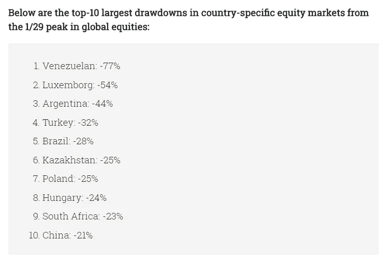
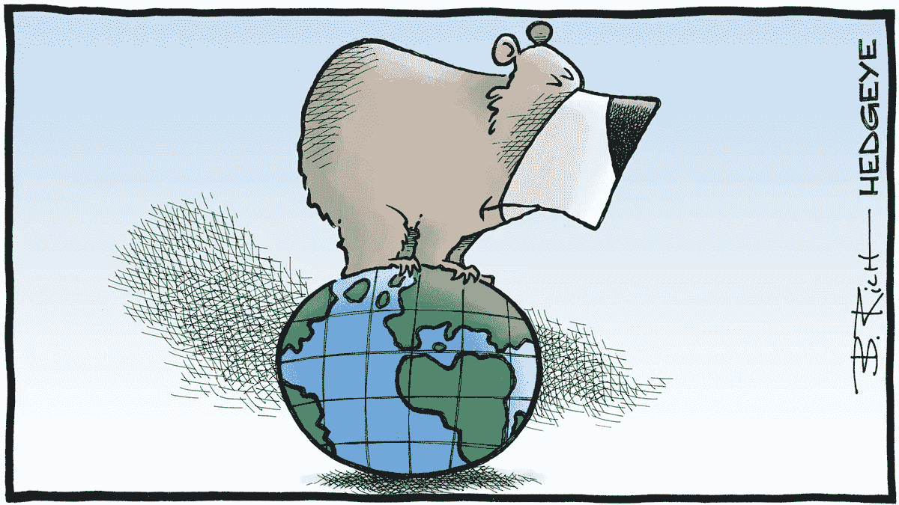

# 保护主义、政治和经济动荡

> 原文：<https://medium.datadriveninvestor.com/protectionism-politics-economic-turmoil-a7d0bfa17700?source=collection_archive---------4----------------------->

美国股市昨日出现 400 多点的大幅反转，为未来的事情发出了警告信号。随着科技股的翻身，市场发生了巨大的逆转。现在困扰我的不是熊市甚至全球经济衰退的想法，而是整个金融体系崩溃的想法不断在我脑海中涌现。你说为什么？让我详细说明一下…

当英国在 2016 年 6 月投票退出欧盟**时，变革之风开始随着**英国退出欧盟**吹起。1993 年由 12 个成员国组成的最大的经济政治集团之一首次高调退出。自第二次世界大战以来，西方赖以繁荣的包容政策、政治上的经济统一、贸易的自由流动、劳动力和资本受到了最大的考验，但最糟糕的还在后面。**

随着欧洲陷入漫长而复杂的英国退出欧盟谈判、政治不确定性和该地区的经济放缓，新一届美国政府上台，兑现了其选举承诺，决定退出**TPP**，加入 **NAFTA(北美自由贸易协定)**重新谈判&对其大多数贸易伙伴征收各种关税，这些伙伴在军事、政治和经济上都是美国的坚定盟友。很明显，美国无意做出任何让步，这一点从它在最近结束的七国集团会议上的严厉态度中可以明显看出。我们将把这一步是否正确的讨论留待以后进行。

当然，美国作为世界上最大和最具创新性的经济体，无论说什么或做什么，都会对全球金融体系产生重大影响，但世界各地的周期性经济因素加强了严重衰退的情况，如果经济强国的对抗政策继续下去，这有可能导致重大金融灾难。最近几个月，欧洲经济明显放缓，中国股市自今年 1 月以来暴跌 20%以上，市值蒸发 1.8 万亿美元，正式进入熊市。

Source: HEDGEYE

新兴市场一直处于低迷状态，面临美元的复苏和反弹，导致阿根廷、土耳其、巴西和南非等国家出现严重的通货膨胀和国际收支问题。加剧这种情况的是油价上涨，这将导致这些国家的通货膨胀进一步上升，从而推动中央银行提高利率。这与经济放缓时央行的预期截然相反。虽然美国市场在全球市场的低迷中受到保护，并且比其他地方的市场表现更好，但经济基本面和政治摩擦会在某个时候出现，正如我们昨天看到的那样，即使是好消息也无法提振市场。

最重要的是，美国的关税不会是单行道，因为我们看到中国和欧盟宣布对美国产品征收报复性关税。不仅如此，彭博报道**加拿大&欧盟**正在准备对来自中国和其他国家的钢铁征收关税和配额，以防止来自寻求规避美国关税的全球生产商的潜在进口潮。所以你可以看到这场由美国点燃的关税战正在像野火一样蔓延&在这场贸易对抗中，每个人都将遭受损失。

就连外汇市场也未能幸免于金融前线的摩擦。由于人民币最近的暴跌引发了对中国经济的担忧，政策制定者似乎不太愿意在与美国的贸易战中阻止人民币的下跌。人民币汇率跌至六个月来的新低，盯住美元的货币兑美元汇率触及新低。**中国人民银行**(中国央行)实际上允许人民币出现自 2017 年 1 月以来最大的单日百分比跌幅。人民币贬值有利于严重依赖出口的中国经济，这对任何人来说都不是秘密。

也许当前金融体系的混乱终究不是一件坏事，也许是时候彻底改革这个腐败的金融体系，使之成为一个对所有人都有益的体系——一个以透明、平等和效率为原则的分散体系——一个将决策权放在普通人手中，远离权力走廊、大公司和中央银行的体系。有什么猜测吗？

我以一幅漫画作为结束，这幅漫画完美地描绘了全球市场的现状。

如果你感兴趣的话，这里有我最近几篇与这篇文章相关的文章的链接: [**【所有的东西都是密码】。外汇.股票—06/22/2018**](https://medium.com/datadriveninvestor/all-things-cryptos-forex-stocks-06-22-2018-947107b971bb)**[**又一场金融风暴正在酝酿？**](https://medium.com/datadriveninvestor/another-financial-storm-brewing-c96b2db543b8)**

****保持联系:**[Twitter](https://twitter.com/fklivestolearn)**|**[**StockTwits**](https://stocktwits.com/trade_nut)**|**[**LinkedIn**](https://www.linkedin.com/in/faisal-khan-2a3009b/)**|**[**trade alike**](http://www.tradealike.com/)**|**[**脸书**](https://www.facebook.com/cryptos.forex.stocks/)**

***原载于 2018 年 6 月 28 日*[*www.datadriveninvestor.com*](http://www.datadriveninvestor.com/2018/06/28/protectionism-politics-economic-turmoil/)*。***

****