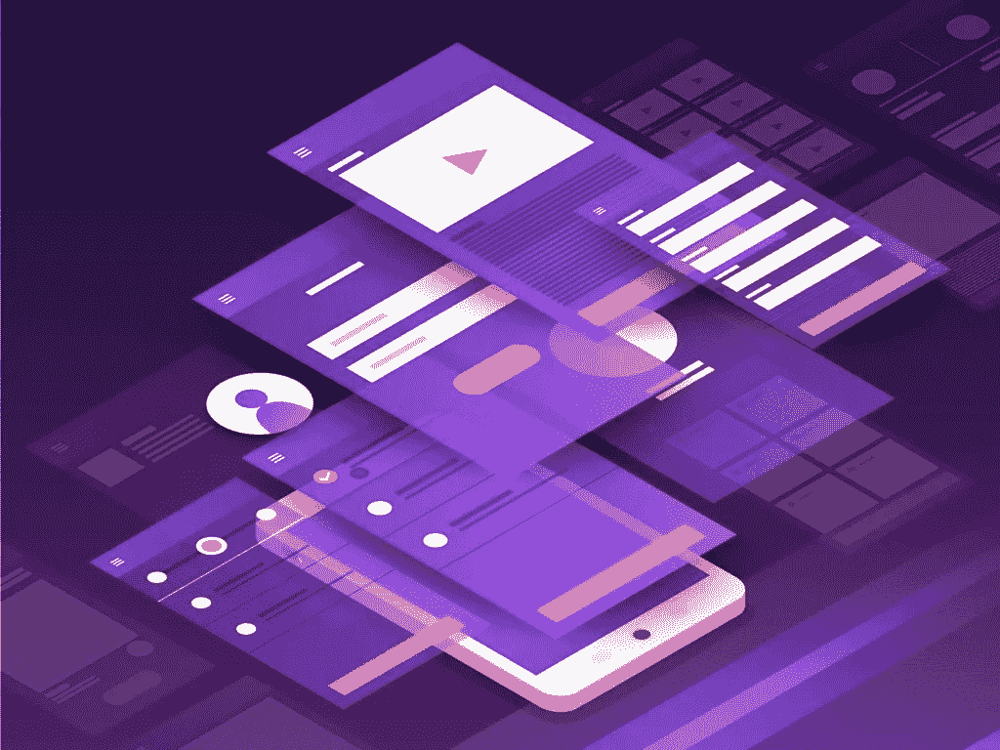
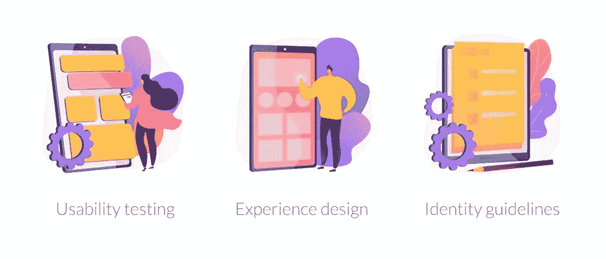

# 原型与线框与实体模型——设计交付物之间的差异

> 原文：<https://medium.datadriveninvestor.com/prototype-vs-wireframe-vs-mockup-difference-between-design-deliverables-97cff1af2ac1?source=collection_archive---------5----------------------->

许多人互换使用线框、模型和原型等术语，但事实并非如此。很容易理解为什么这些术语会混淆，但是它们中的每一个都代表不同的设计模板。在这篇文章中，我们将试图消除所有的困惑，告诉你这些单词分别指的是什么。

# 什么是线框？

线框是产品的低层次表示，它将显示产品的布局和结构。它不会涉及产品的太多细节，但会给你一个总体的看法，包括最重要的内容。可以把它想象成一个通道，通过对产品的共同理解，允许开发团队保持一致。线框将显示:

*   内容将如何组合在一起
*   信息将如何构建
*   用户如何与界面交互的描述

 [## 2019 年最值得学习的编码语言|数据驱动的投资者

### 在我读大学的那几年，我跳过了很多次夜游去学习 Java，希望有一天它能帮助我在…

www.datadriveninvestor.com](https://www.datadriveninvestor.com/2019/02/21/best-coding-languages-to-learn-in-2019/) 

虽然很容易将线框视为次要的设计方法，但事实上，它将作为整个项目的基础。因此，即使不涉及太多的细节，在这一点上充分描述项目最重要的时刻以避免后面阶段的混乱也是至关重要的。

# 什么是样机？

线框和实体模型之间的区别在于，后者将比线框更详细，并将包括信息框架的表示，并描述内容和功能。实体模型将类似于最终产品，尽管你不能与它互动或点击任何东西。例如，如果你正在[开发一个 web 解决方案](https://skywell.software/web-development/)，你将能够从用户的角度看到它看起来是什么样子，但是你将不能实际进入并探索它的功能。在向投资者展示你的产品时，有必要制作一个模型，以便所有团队成员能够直观地了解开发是如何进行的。创建模型时，请确保:

*   准确构建信息
*   演示基本功能
*   诱使人们进行视觉概述，而不是检查代码或其他内部细节。

如果你想在产品的早期阶段吸引投资者，模型将是一个很好的资源。它可以在短时间内创建，并为投资者提供更多关于可交付成果的信息。此外，您将能够出于内部文档的目的使用模型，因为它们为整个开发过程提供了上下文。

# 什么是原型？

原型将尽可能与最终产品相似。这是网络和[移动应用设计](https://skywell.software/mobile-app-development/)的重要组成部分，因为现在可以模拟用户与产品的交互。此外，如果处理得当，它可以为您节省大量与开发相关的成本。想象以下场景:您开始创建后端架构，但在项目进行到一半时才意识到接口的设计有缺陷，需要重做。这将导致重大延误和资源浪费。原型可以帮助您避免这种情况，并帮助您调整开发工作。当您创建原型时，用户必须能够:

*   与界面充分互动
*   以与最终产品相似的方式测试所有东西
*   了解你想要传达的用户体验

虽然原型不必与最终产品完全相同，但应该尽可能接近。所有的用户交互都应该仔细规划，并且应该反映最终的用户体验。当您在实际开发开始之前进行用户测试时，原型将非常有用，但是，请记住，创建原型非常耗时且成本高昂。因此，尝试开发您以后能够重用的原型，即使这意味着使用 HTML、CSS 或者是您自己的。虽然原型开发可能会产生一些额外的成本，但最终会带来巨大的回报。

# 选择最适合你的选项

希望，当你需要选择一个设计模板时，线框、实体模型和原型的比较是有用的。这很大程度上取决于你的目标和你对产品的了解程度。例如，如果你正在从头开始创建一个产品，你可能只有主要的概念，可以用来创建一个线框。然后，随着画面开始变得更加清晰，您获得了更多的细节，您可以开始创建一个模型，它将对外部目的(如吸引投资)和内部过程文档化有用。原型应该在后期使用，以便了解用户将如何与你的产品交互。

经历所有这些阶段是至关重要的，因为它们将允许您从技术和业务的角度确定什么是有意义的。很多时候，想法在纸上是好的，但是一旦你开始实施和测试它们，你会发现它们根本不起作用。有必要认识到在软件开发管道的早期可以做些什么，以避免将来的额外成本和延迟。

*原载于*[*https://sky well . software*](https://skywell.software/blog/prototype-wireframe-mockup-difference/)*。*