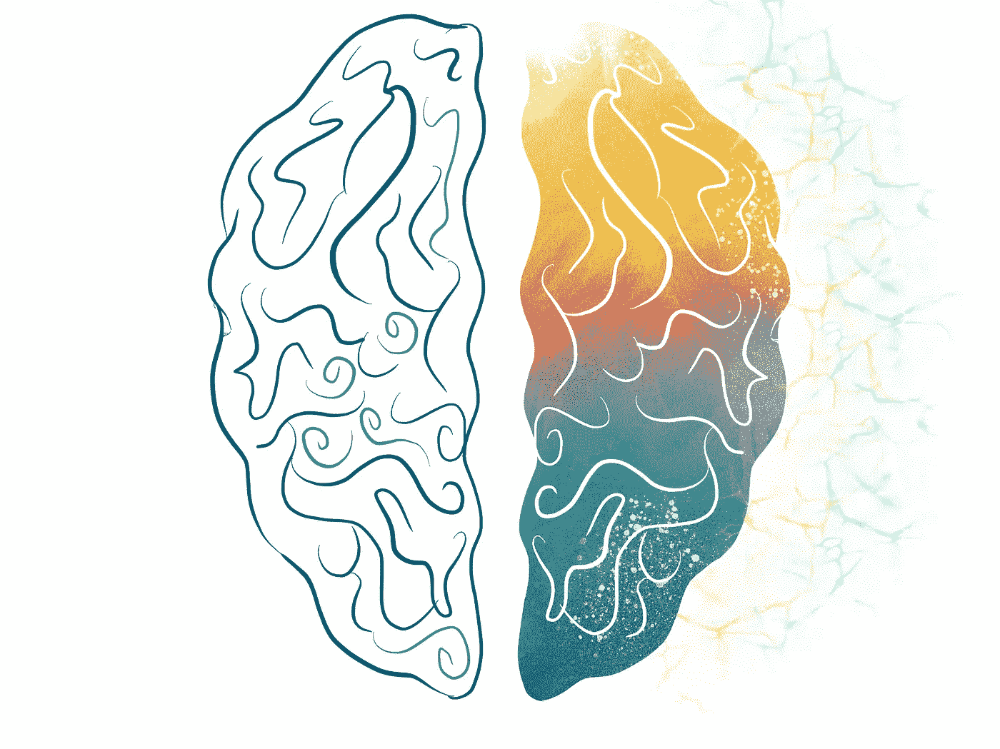
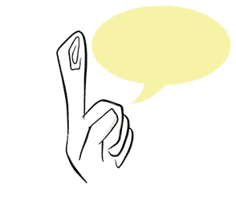

# 创造力和构思的心理学——我作为一个年轻企业家学到的基础。(第 1 部分，共 2 部分)

> 原文：<https://medium.datadriveninvestor.com/psychology-of-creativity-and-ideation-the-foundations-i-learned-as-a-young-entrepreneur-c3f1b02ed283?source=collection_archive---------9----------------------->

作为一名一年级学生，我开始了在商业和企业家世界的旅程，我每天处理的主要概念是如何想出一个“好主意”。

我思考了一些问题，比如如何区分好主意和坏主意，如何设计出足以“撼动”市场的创造性和颠覆性的东西，以及如何构建出能够创造收入的令人印象深刻的新东西。

每个问题都可以分成无数的副主题，但我认为构思中讨论得最少的一个主题是“有利环境”——产生伟大想法的心理因素。

在这篇文章中，我将重点放在激发创造力和帮助我理解如何鼓励创造过程的关键要素上。

(非常感谢来自威兹曼学院的教授 Lior Noy 博士和 Joobilix 的联合创始人 Keren Greengrass 女士教授了一门史诗课程)

# 在我们开始之前——一些证据向你展示我们都是有创造力的，只是需要一点鼓励！

一个常见的误解是，很少有人是“有创造力的”——尤其是世界上的毕加索和爱因斯坦。恰恰相反！有证据表明，每个人在某种程度上都有创造力。

与普遍误解相反的证据:

## 第一号——小孩子

当我们年轻的时候，我们不害怕做梦和想到疯狂的想法。研究证明，直到三年级，我们都是最有创造力的。这是为什么呢？

这可以用我们连接随机主题的能力来解释，这些主题融合并演变成非常规和酷的想法。在人生的这个阶段，我们仍然在快速学习——玩和连接不同的主题。

我们也缺乏恐惧和自我判断。随着年龄的增长，界限和社会规范开始出现，我们开始更多地使用我们的“内心批判”。

> 旁注——“内心批评家”是由基思·约翰斯通(Johnstone，1987)从戏剧即兴创作中发展出来的一个概念。这表明，我们的部分意识一直在监控我们将要说的和要做的事情，有时当它们被认为不合适时，会指责它们(阻止它们)。创作过程的规范应该鼓励人们克服他们内心的批判。例如，在头脑风暴的“开始”阶段，提出的每个想法都会被认可并记录下来。这应该会创造一个安全的环境，允许人们表达甚至奇怪或不适当的想法。
> 一个重要的警告:内心的批判是和他人一起生活的重要部分。即使在戏剧即兴表演中，或者在头脑风暴的开场阶段，也有不恰当的事情(例如，暴力)是不应该被容忍的。

## 编号 Dos — R.E.M .或“快速动眼期”

(不，我们不是在讨论令人敬畏的 80 年代摇滚乐队——尽管他们很酷)。

“快速动眼期”理论认为，在我们醒来之前的睡眠周期中，我们最有创造力。

在快速眼动疗法期间，大脑非常活跃，其活跃程度类似于清醒时。在 R.E.M .睡眠期间醒来的人报告了奇异的梦内容，这些内容通常充满了意想不到的联系。

每个人每天晚上都会经历这个阶段，这证明我们都有超级创造力的潜力。

## 第三——我们不一定要成为天才才能被认为是有创造力的…

在创造力的研究中，有两个概念叫做“大 C”和“小 C”。一个人不一定要像列奥纳多·达·芬奇或史蒂夫·乔布斯那样杰出的创造者才能被认为是有创造力的。

创意可以在普通人的小行为中找到，例如结合不同的技术来创造新的东西(Waze 就是一个很好的例子，将 GPS 与手机应用程序结合起来，创建一个基于社区的交通和导航应用程序)。

# 设定基调的基本“进”和“出”

## “是的，还有……”作为一句人生格言

你知道在一天漫长的工作后，你坐在你最好的朋友的客厅里，眼睛红红的，筋疲力尽的感觉吗？人们正在笑着讨论像日本厕所这样的随机发明，突然史蒂夫灵光一现史蒂夫经历了那个启蒙的时刻，他感觉就像哥伦布发现了美洲，鲍勃·迪伦写了《随风飘荡》，大卫·鲍依创造了 Ziggy Stardust…
史蒂夫开始谈论他不可思议的想法——日本厕所的网络安全(我知道这很荒谬)。

史蒂威抬起眼睛看着你，脸上挂着灿烂的笑容，带着满意的表情。他热情地阐述了自己的想法，而大家则哄堂大笑，齐声说“那绝对行不通”！

非常沮丧的史蒂夫为自己的想法辩护，但现在很沮丧。

“是和…”的目的:让我们试着改变一下场景。想象一下，你没有嘲笑史蒂夫，而是加入了他的想法？在他解释了厕所网络安全的想法后，你会建议另一个很酷的功能——使用污水管道的加密货币交换？

我知道这听起来很可笑，但是想想“是”的影响，Stevie 现在想要分享想法，通过用你的想法支持他，这些想法可能会变得更好！

## 框架设置和“沙盒”隐喻

今年我学到的最有价值的一课是在每个行动中目标的重要性。

创造一个框架式的环境是很重要的，以确保你达到你的关键绩效指标，并从每一个行动和遭遇中受益。良好的框架设置包括:目标、主题、时间框架、参与者的角色和参与规则(规范)→ TTTRR。

建立框架为缩小和建立目标提供了约束，因此允许更有效的相遇。框架设置帮助我更好地管理时间，并确保我根据预先设定的目标从每次会议中受益。

不管明显的“商业”导向的好处，框架设置也是创作过程中的一个关键促成因素。当自由和结构之间有一个良好的平衡时，创造性的过程通常会蓬勃发展。

一个有用的比喻是“沙盒”:一个有明确边界的受保护的地方，在那里创作者可以尽情发挥。例子包括:头脑风暴会议(受时间和规范的限制)；黑客马拉松；即兴表演(任何事情都可以，在一些界限内，例如，没有暴力或色情，以及时间限制和角色的明确定义)。

## “手电筒技术”和确保好的想法被听到…

你又一次发现自己在学校的一个小组项目中/与房间里最聪明/最有创造力/最有趣的人一起工作(如果这种感觉你不熟悉——恭喜，你在小组环境中占主导地位！)

对我们大多数人来说，这种感觉是熟悉的——团队项目意味着某人通常会在构思过程中被“忽略”或“忽视”。

这是心理学上两大概念造成的；“群体思维”和“领导效应”。结果——好的想法被遗漏了！

> “群体思维”(Group Think)——群体思维是一种群体现象，群体成员趋同于一种非最优的行动路线，往往受领导指挥，压制反对声音。这通常意味着一个团体/个人压抑他们觉得不合适的想法。当人们深深地陷入一个有凝聚力的群体时，当成员们对一致性的追求压倒了他们现实地评估备选行动方案的动机时，他们参与的一种思维模式。”(詹尼斯，1991)
> 
> “领先效应”——小组讨论遵循第一个想法的趋势，这种想法框定并经常限制解决方案的空间。我们最终会剔除那些不符合第一个想法的总体背景的好想法。*

幸运的是，有一个简单的方法可以解决这个问题——“手电筒技术！”类似于头脑风暴，闪光会议有一个主持人和参与者。指导方针:

1.主持人提出一个具体问题，每个参与者用一句话回答。

2.按照随机顺序，参与者大声朗读他们的(简短)答案，没有其他人的回答。

主持人的角色是设定流程框架并执行规范，以确保参与者不会忽视次要参与者的建议。

优点:

1.包容性——通过让所有参与者的声音都能被听到来促进团队的包容性。

2.效率—它允许小组在短时间内收集所有参与者的反馈。

3.没有领先效应——通过单独执行构思阶段，避免了“领先效应”。

4.鼓励倾听——“不回应”规则鼓励人们倾听其他想法，而不是做出反应。随机顺序(例如，通过扔球)也有帮助。

## 我记下的想法…

总而言之，在创造力的研究中，有很多有趣的话题可以涉及。我试着尽可能多地关注与以商业为导向的个人相关的提示和话题。

令我惊讶的是，这篇文章很容易写。太简单了，我不得不把它一分为二，因为它太长了。如果你喜欢这篇文章，那就去读这篇文章的第二部分吧——创造力和思维的心理学——这是我作为一个年轻企业家学到的基础。(第 2 部分，共 2 部分)

## 如果你觉得这很有用，一定要给很多很多的掌声👏。提示，最多可以留 50！😉(左上角)

我希望所提供的信息是相关和有趣的，并希望听到你的意见！

请随时联系我@我的网站 https://www.maayanrosenthal.com[或发邮件至 maayan.rose1@gmail.com](https://www.maayanrosenthal.com)[LinkedIn @ Maayan Rosenthal/insta gram @ Maayan Rosenthal _ ui。](mailto:maayan.rose1@gmail.com)

(如果你想了解更多关于创造力和与之相关的科学的话题，《时代》杂志发布了 2018 年 9 月的特别版，完全致力于这个话题[非赞助])。