# 将 CoinMarketCap 数据拖到 Google 表单上:一步一步的指南

> 原文：<https://medium.datadriveninvestor.com/pulling-coinmarketcap-data-onto-a-google-sheet-a-step-by-step-guide-coinmarketcap-a14440483fd2?source=collection_archive---------1----------------------->

作为数据驱动投资的坚定信徒，在做出决定之前，我总是尽力获得由数据支持的可投资见解，加密货币交易也是如此。幸运的是，对于像我这样不太懂技术的人来说，我只需要 Google sheet 和 CoinMarketCap API 来进行我自己的分析。请继续阅读，了解如何使用这两个免费工具获取和可视化加密货币数据！

# 什么是 CoinMarketCap？

如果您还不熟悉 CoinMarketCap，这里有一个简短的介绍。这是一个提供你可能需要的与加密货币相关的所有信息的网站。这包括它们的价格、市值、供应量等。

我们真正需要的是它的 API，让我们能够访问实时和历史数据，这将允许我们做一些数字处理和图表制作。


# 从 CoinMarketCap API 中可以获得哪些数据？

使用 CoinMarketCap API，您可以查看:

*价格

*市值

*数量(24 小时内)

*循环供应(过去 24 小时)

*价格趋势(一天、一周或一年)

CoinMarketCap 网站上的每一种加密货币。

# 如何将 CoinMarketCap API 中的数据导入 Google Sheets？

现在让我们言归正传。要访问 API，您需要访问以下 URL:

[https://coinmarketcap.com/api/](https://coinmarketcap.com/api/)

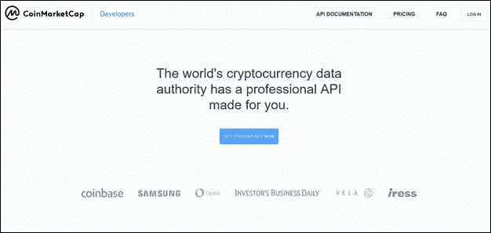

一旦出现，点击*立即获取 API 密钥*。

您可以注册一个免费的开发者门户帐户，也可以利用他们的付费计划。有了免费账户，你就可以获得最新列表和报价的基本信息，以及有限的通话次数。但是，如果您对提取历史数据或访问更多数据端点感兴趣，那么您可以考虑付费会员。无论哪种方式，一旦您注册了一个计划，您将获得一个 API 密钥，当您想要调用 API 时，您将使用该密钥进行身份验证。

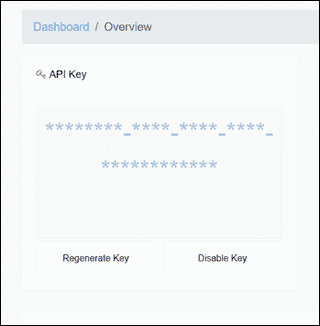

只需将鼠标悬停在星号上并点击“*复制密钥*”按钮，即可复制该密钥。然后，您可以在代码中使用这个键来访问所需的数据。

CoinMarketCap API 以 JSON 文档的形式提供所有数据。每枚硬币在文档中都有指定的 ID 和符号。比如第 0 项是比特币，第 1 项是以太坊，第 2 项是 Ripple 等等。所以当你想了解以太坊的时候，你必须使用索引 1 或者符号 ETH 来访问它。当你想访问比特币信息时，你需要使用索引 0 或符号 BTC。

您可以通过以下链接浏览该文档:

[https://api.coinmarketcap.com/v1/ticker/](https://api.coinmarketcap.com/v1/ticker/)

需要注意的重要一点是，CoinMarketCap 建议使用 CoinMarketCap ID 来指代加密货币，而不是符号。这是因为许多加密货币都有相同的符号，并且符号会根据硬币的更名而发生变化。为了确保您总是可靠地获得您的目标硬币，最好对硬币使用 CoinMarketCap 的永久 id。然而，由于我们刚刚开始，我们将使用符号，因为它更直观，更容易识别。一旦您更好地掌握了这一点，建议您开始使用 id 而不是符号。

现在卷起袖子，是时候开始编码了！Google Sheets 允许你使用基于 Javascript 的 Google Script 进行编码。但是即使你不懂 Javascript，这个指南也应该很容易理解和使用。

# 获取最新的加密价格

您可以使用 API 的免费版本获得最新的加密价格。首先，去谷歌工作表，打开一个空白的工作表。接下来，您可以通过从工具菜单导航到'*脚本编辑器*'来开始编码。

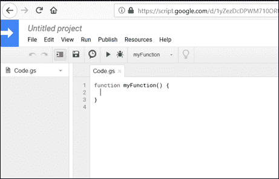

1.当脚本编辑器打开时，您将看到一个已经存在的函数模板。您可以在此基础上开始编码。我们把这个函数重命名为 **coin_price** 。

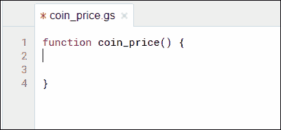

2.接下来，让我们创建一个名为 **sh1** 的变量来保存活动电子表格的句柄。这是我们要打印结果的工作表。我们的活动电子表格的名称只是 Sheet1，所以我们键入:

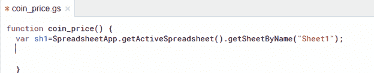

3.接下来，将以下代码原样复制到脚本编辑器中:

```
var requestOptions = {
 method: ‘GET’,
 uri: ‘https://pro-api.coinmarketcap.com/v1/cryptocurrency/quotes/latest',
 qs: {
     start: 1,
     limit: 5000,
     convert: ‘USD’
 },
 headers: {
   ‘X-CMC_PRO_API_KEY’: apiKey
 },
 json: true,
 gzip: true
 };
```

这段代码包含了访问特定 API 端点所需的所有信息。我从 CoinMarketCap API 文档中获得它，该文档位于:

[https://coinmarketcap.com/api/documentation/v1/](https://coinmarketcap.com/api/documentation/v1/)

由于我们想要获得最新的加密价格，我们将访问端点:

v1/加密货币/报价/最新

还有，注意单词*‘API key’？*这是粘贴从 CoinMarketCap API 帐户复制的 API 密钥的地方。确保您将密钥放在单引号内。

4.现在，让我们创建一个变量来保存 API 调用的 URL。类型:

```
var 
url=https://pro-api.coinmarketcap.com/v1/cryptocurrency/quotes/latest?symbol=BTC;
```

在我们的例子中，我们想知道比特币的最新价格。所以我们将“符号”指定为“BTC”。正如我们之前看到的，比特币的符号是 BTC。如果你想知道任何其他硬币的最新价格，你可以把它的符号放进去。


5.现在，我们使用 Google 脚本 UrlFetchApp.fetch 函数来获取 JSON 文件的内容，该文件出现在我们请求的“url”中。让我们将这些内容放入一个名为 result 的变量中。

```
var result= UrlFetchApp.fetch(url, requestOptions);
```

6.但是获取 JSON 格式的内容不会有太大的帮助。为了正确使用数据，我们需要以字符串的形式获取内容。我们通过使用 getContentText 函数来实现这一点。让我们将结果字符串存储在一个名为 txt 的变量中。

```
var txt= result.getContentText();
```

7.现在我们需要将字符串中的数据解析成单独的 Javascript 对象，这样我们就可以轻松地提取我们需要的任何信息。为此，我们使用 JSON.parse 函数并将字符串作为参数传递给它。让我们把这个解析的结果放入一个名为 d 的变量中。

```
var d=JSON.parse(txt);
```

8.现在是时候提取我们想要的东西了。我们想知道比特币最新的美元价格。在 JSON 文件中，数据是按照一定的层次结构排列的，所以您必须知道正确的路径来访问您需要的内容。如果您看一看 API 文档中的 JSON 代码，您会看到:

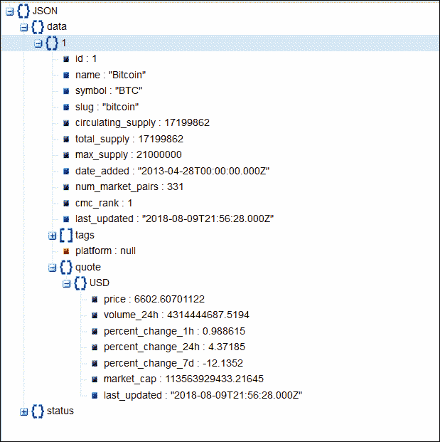

在这里，在数据下，我们有第一个对象，比特币，有符号 *BTC* 。在这个目录下，我们有*报价*对象，它包含*美元*对象。在这个美元对象下，我们有*价格*。

换句话说，我们可以通过以下方式获取价格:

d.data.BTC.quote .美元价格

为了确保我们将它记录到 Sheet 1 的第一行(1，2)的第二列中，我们将上面的路径放在一个 setValue 函数中:

```
sh1.getRange(1, 2).setValue(d.data.BTC.quote.USD.price)
```

现在你知道了！

当您将所有这些放在一起时，代码看起来像这样:

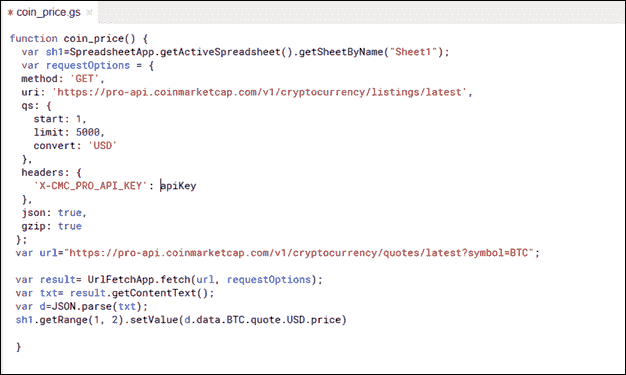

9.用名称保存该函数

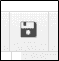

10.单击运行。

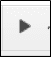

11.几秒钟后，脚本将请求您允许访问您的 Google 表单。授予访问权限。

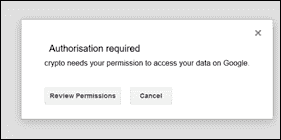

12.转到您的 Google Sheet，您应该会在 Sheet 1 的第一行第二列看到最新的比特币价格。

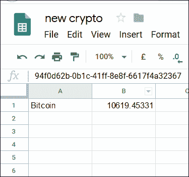

然后你可以在旁边写下‘比特币’这个词，以备将来参考。您也可以选择添加您可能感兴趣的其他硬币的名称，并以同样的方式获得它们的最新价格。

13.现在，让我们添加一个按钮来刷新数据，将图像/绘图插入到工作表的一角:

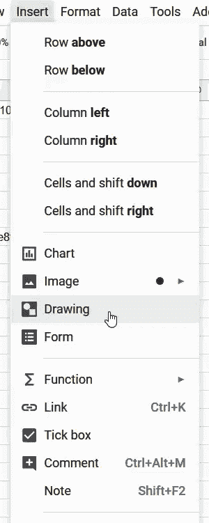

点击并选择“分配脚本”:


然后插入函数的名称:


完成后，只要想重新运行脚本并刷新数据，就可以简单地点击这个图片来查看硬币的最新价格。但是记住不要刷新太多次，因为 API 调用的数量是有限的。

# 获取历史 OHLC 加密价格

要获得历史数据，你需要一个付费会员。您可以通过标准订阅获得 3 个月的数据。

为了得到 3 个月的 OHLC 价格，我们遵循大致相同的系统。

1.创建一个新的 Google Sheet，打开脚本编辑器，将默认函数的名称改为 ohlc_price。为要打印结果的电子表格创建句柄。让我们再次将其命名为 **sh1** 。

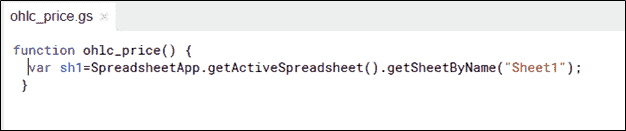

```
var requestOptions = {
  method: 'GET',
  uri: 'https://pro-api.coinmarketcap.com/v1/cryptocurrency/ohlcv/historical',
  qs: {
       'id': '1',
       'time_end': '2019-08-19'
  },
  headers: {
    'X-CMC_PRO_API_KEY': apiKey
  },
  json: true,
  gzip: true
};
```

2.按原样复制并添加以下代码:

由于我们想要获得历史 OHLC 加密价格，我们将访问端点:

' v1/加密货币/ohlcv/历史'

3.创建一个变量来保存 API 调用的 URL。类型:

```
var url=https://pro-api.coinmarketcap.com/v1/cryptocurrency/ohlcv/historical?id=1;
```

这将使我们能够访问 id 为 1 的加密(即比特币)的 OHLC 历史价格。如果你想知道任何其他硬币的历史 OHLC 价格，你可以输入它的 id。

假设我们想要过去 3 个月的每周数据。我们可以通过在 URL 中添加以下内容来指定这一点:

& time _ start = 2019–06–01 & interval =每周

这组参数将为我们提供从 2019 年 6 月 1 日开始的每周数据，但不包括最后一个间隔。

有关这方面的更多信息，可以参考 CoinMarketCap API 文档。

4.其余 3 个步骤与之前相同。

```
var result= UrlFetchApp.fetch(url, requestOptions);
var txt= result.getContentText();
var d=JSON.parse(txt);
```

5.现在要得到 BTC 的开盘价、最高价、最低价和收盘价，你需要知道每个价格的正确路径。如果您看一看 API 文档中的 JSON 代码，您会看到:

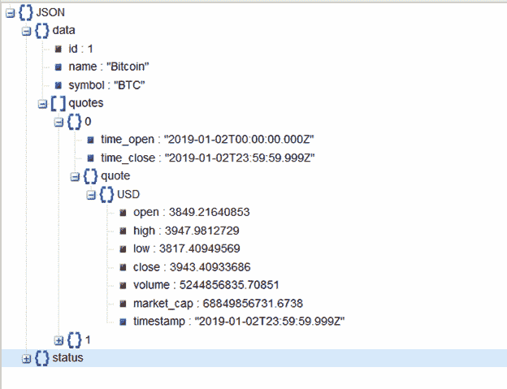

在这里，在数据下，我们有第一个对象，比特币，符号为 *BTC* 。在这下面，我们有*引号*对象，它包含两个时间戳(2019 年 1 月 2 日和 2019 年 1 月 3 日)的两个引号。对于第一个报价，我们可以访问 *USD* 对象下的*开盘价*，如下所示:

d . data . quotes[0]. quote . USD . open

对于第二个报价，我们使用:

data.quotes[1].quote.USD.open

..诸如此类。

因此，要将这两个引号放入工作表 1 的第一列((2，2)和(2，3))的第二行和第三行，我们键入:

```
sh1.getRange(2, 2).setValue(d.data.quotes[0].quote.USD.open)
sh1.getRange(3, 2).setValue(d.data.quotes[1].quote.USD.open)
```

但我们希望 10 个这样的报价分散在 3 个月。而且我们要全部四个值:*开*、*高*、*低*、*关*。我们还需要*时间戳*。所以我们一个一个来。

首先，让我们设置工作表 1:

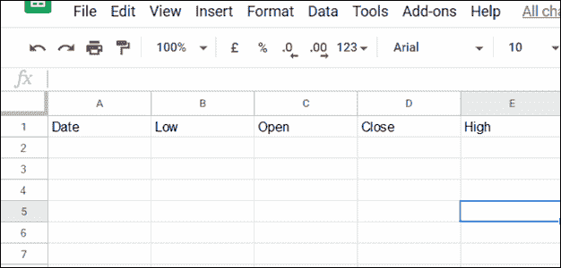

请注意，我将列标题的格式设置为低开-收盘-盘高，而不是开盘-盘高-盘低-收盘。这将使以后的数据可视化更加容易。

在脚本编辑器中，我们需要用变量 I 开始一个“for”循环。该变量将从 0 到 9 循环，每次递增 1，总共循环 10 次。

在每次重复时，我们遍历每列的第 2 行到第 11 行(因此 getRange 函数的第一个参数中的值是 i+2)。我们在第一列中显示 3 个月的 10 个时间戳值，在第二列中显示“低”值的引号，在第三列中显示“开”值的引号，在第四列中显示“闭”值的引号，在第五列中显示“高”值的引号。从 0 到 9，对 I 的每个值重复这一过程。

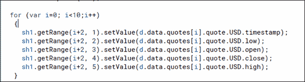

就是这样！您的整个代码应该如下所示:

```
function ohlc_price() {
 var sh1=SpreadsheetApp.getActiveSpreadsheet().getSheetByName(“Sheet1”);
 var requestOptions = {
 method: ‘GET’,
 uri: ‘https://pro-api.coinmarketcap.com/v1/cryptocurrency/ohlcv/historical',
 qs: {
     ‘id’: ‘1’,
     ‘time_period’:’daily’,
     ‘interval’:’2d’,
     ‘start_date’: ‘2019–08–15’,
     ‘end_date’: ‘2019–08–18’
 },
 headers: {
    ‘X-CMC_PRO_API_KEY’: ‘fc266b12-edda-4c05–9fc4–43b2c0ace268’
 },
 json: true,
 gzip: true
 };
 var url=”https://pro-api.coinmarketcap.com/v1/cryptocurrency/ohlcv/historical?id=1&time_start=2019-06-01&interval=weekly";
 var result= UrlFetchApp.fetch(url, requestOptions);
 var txt= result.getContentText();
 var d=JSON.parse(txt);

 for (var i=0; i<10;i++)
 {
 sh1.getRange(i+2,1).setValue(d.data.quotes[i].quote.USD.timestamp);
 sh1.getRange(i+2, 2).setValue(d.data.quotes[i].quote.USD.low);
 sh1.getRange(i+2, 3).setValue(d.data.quotes[i].quote.USD.open);
 sh1.getRange(i+2, 4).setValue(d.data.quotes[i].quote.USD.close);
 sh1.getRange(i+2, 5).setValue(d.data.quotes[i].quote.USD.high);
 }
}
```

现在，您的电子表格将包含过去 3 个月的所有 OHLC 值:

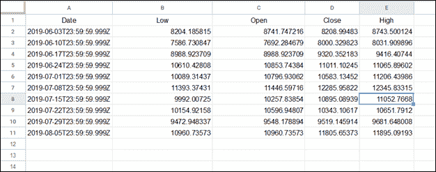

最后，让我们做一点格式化。我们只想看到时间戳的日期部分。为此，我们在 A 和 B 之间创建一个新列，并引入一个公式:

=left(A2，len(A2)-14)

这将删除 A2 中时间戳的最后 14 个字符，只留下我们想要的内容。最后，拖动右下角的手柄，将格式复制到所有后续行

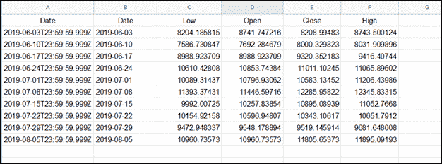

# 可视化历史 OHLC 数据

这一部分很简单。可视化 OHLC 数据的最佳方式是使用蜡烛图，它一目了然地总结了数据中的所有细节。

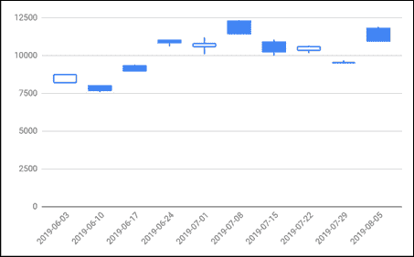

1.只需突出显示 B2 和 F11 之间的区域。

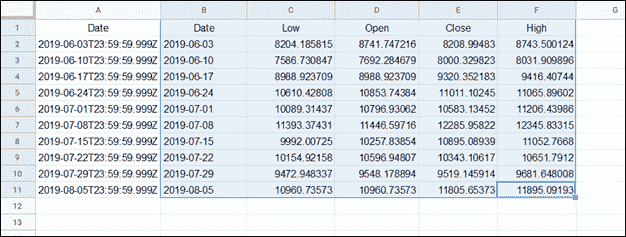

2.从菜单中点击插入->图表

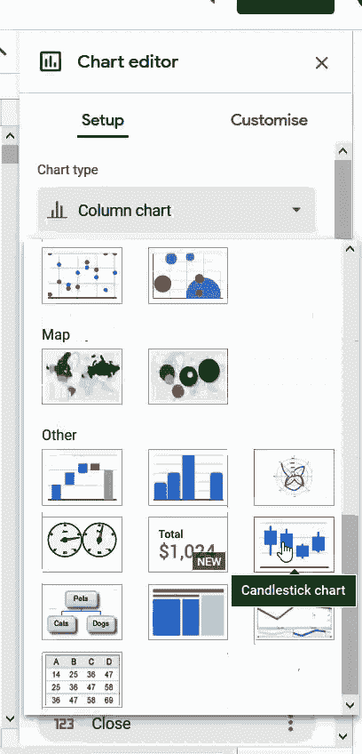

3.您会在窗口的右侧找到一个图表编辑器。单击“图表类型”下拉菜单，向下滚动找到“烛台图表”并选择它。

就这样，你现在可以看到过去 3 个月的每周 OHLC 值了！


你可以每天、每月甚至每小时都这样做。此外，您可以用同样的方式对其他硬币进行类似的可视化，只需记住在进行 URL 调用时更改 id 或符号即可。

*原载于 2019 年 10 月 8 日*[*【https://blog.coinmarketcap.com】*](https://blog.coinmarketcap.com/2019/10/08/pulling-coinmarketcap-data-onto-google-sheet/)*。*