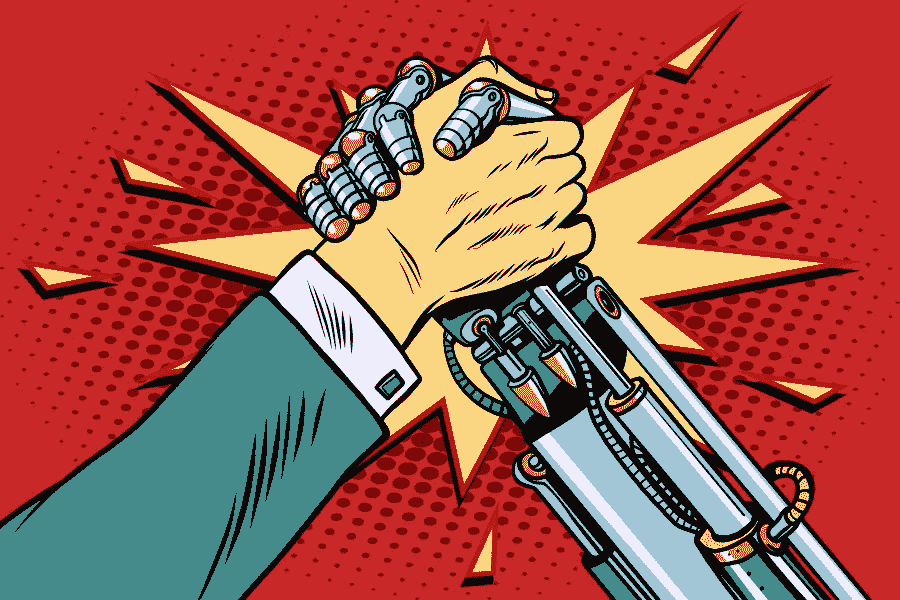

# 傀儡还是傀儡师:谁在控制自动化经济？

> 原文：<https://medium.datadriveninvestor.com/puppets-or-puppet-masters-whos-in-control-of-an-automated-economy-38b20151a2d?source=collection_archive---------4----------------------->

## 如果机器人和人工智能将运行经济，这对个人和政府的权力意味着什么？

© [studiostoks](https://stock.adobe.com/uk/contributor/205359883/studiostoks?load_type=author&prev_url=detail) / Adobe Stock

已经有一段时间了，但是乌托邦主义再次流行起来。这种最新的乌托邦主义不是社会主义者、嬉皮士或生态学家想象出来的。相反，它来自计算机程序员和数据科学家。这是一个[技术乌托邦](https://www.theguardian.com/sustainable-business/2016/feb/17/automation-may-mean-a-post-work-society-but-we-shouldnt-be-afraid)卖给我们，作为不断增长的自动化的逻辑结论。

据称，自动化的兴起意味着人类对于经济的运行将变得越来越多余。政府将提供一个普遍的基本收入(UBI ),其潜在的规模足以让我们从任何有偿工作中解脱出来。

这个技术乌托邦超越了通过税收系统提供 UBI 作为简单的再分配的平行谈话。这是一个人工智能和机器人技术的发展将我们从工作中解放出来的未来。在这个愿景中，UBI 就是分享自动化经济的经济红利。这种自动化经济将是一种集中组织的计划经济，由机器人和人工智能驱动，生产我们消费者需要的一切。我们，人类，将从这种自动化经济中获益，因为政府将向机器人征税，并向大众发放基本收入。

虽然有理由相信自动化对工作的任何破坏实际上可能会创造全新的行业或增加现有服务行业的相对价值，但为了本文的目的，让我们假设机器人将使我们大多数或所有人失业。

What will Alice do once the last job on earth has been automated?

为所有人提供服务的自动化经济听起来的确很吸引人。然而，中央集权的计划经济确实有一段曲折的历史。以往所有计划经济的尝试都以灾难告终，导致收入下降、技术停滞、预期寿命缩短、权力滥用和自由丧失。想想斯大林主义的俄罗斯、毛泽东主义的中国、朝鲜、柬埔寨、委内瑞拉等等。

你可能会觉得，将未来的人工智能革命与斯大林和毛的严重失败相提并论是一种廉价的手段。但如果要成功，未来的自动化经济必须找到困扰计划经济所有实验的许多问题的解决方案。先说[信息问题](https://en.wikipedia.org/wiki/Economic_calculation_problem)。

信息问题的出现是因为中央计划者从来没有足够的信息来成功地从中央计划经济；没有人比你自己更了解你的需求。我们是在暗示人工智能革命将解决信息问题吗？实现这一点的一个方法可能是将难以置信的详细个人数据实时交给管理经济的人工智能。这可能对一些人有吸引力，但对许多人来说，这看起来像是消费者被公司迷住的反面乌托邦。

放弃信息把我们带到了第二个问题。我们生活在信息时代。数据就是力量。因此，放弃数据就意味着放弃权力。

对未来自动化经济的梦想必然要求我们放弃对机器人的大量控制；控制销售什么产品，控制产品如何生产，控制产品如何营销。人工智能甚至可能会做一些我们认为不道德的事情，例如忽视服务无利可图的市场，如残疾人或那些有毒品和酒精问题的人。

如果机器人被赋予了这种权力，那么他们的某人/某物最终会控制他们吗？似乎有两种选择:

1.  这些机器人相当聪明，但最终还是在它们的程序员的控制之下，可以被他们编辑。
2.  机器人变得有知觉，现在独立于它们的人类设计师。

选项 2 将我们置于未知领域——没有人能预测机器人会认为什么决定是“最优”的。你的自由，可能还有你的安全，会非常危险。让我们假设这不会被实现。

第一种选择是，由经理、工程师和程序员组成的精英阶层来控制管理我们社会的机器人。在这一点上，请注意谁是 UBI 的最大支持者:马克·扎克伯格、埃隆·马斯克和硅谷的其他宠儿。这些科技巨头为我们设想了怎样的未来？由一小群超级富豪管理的机器人能够满足社会的所有需求吗？

第三个问题围绕着自动化经济对我们个人自由的影响。向所有人提供基本收入通常被称为促进企业家精神，但是一旦经济*完全*-自动化(就像上面视频中爱丽丝的世界)，人类甚至会被*允许*开始自己的事业吗？或者人工智能会决定人类只是低效率的来源吗？

机器人(或它们的设计者)会认为哪些其他活动“对经济有害”，因此应该被阻止甚至压制？也许艺术变成了资源的浪费，休息变成了不必要的奢侈品，表达自由变成了危险的干扰？

## 让机器人对民主负责

经济的高度自动化有可能使所有人受益。谁知道呢——UBI 甚至可能有用。但这些仍然是非常新的想法，我们需要仔细思考，以避免我上面列出的问题。冒着鸡蛋砸在我脸上的风险，我认为这样的未来还需要几年时间，所以有足够的时间来提出解决方案。

几乎可以肯定的是，自动化经济将涉及权力从个人和政府转移到私营企业手中，它们是软件和机器的所有者。这种权力的转移应该只发生在我们确信企业对政府和人民都负责的世界里。

有些人呼吁“[全自动奢侈共产主义](https://www.theguardian.com/sustainable-business/2015/mar/18/fully-automated-luxury-communism-robots-employment)”，讽刺的是，包括(tele sur 是政府喉舌)，在委内瑞拉，如果你在同一个句子中使用“奢侈”和“共产主义”这两个词，充其量只会有[嘲笑你](https://www.bbc.co.uk/news/world-latin-america-36319877)。自动化引发的问题的真正解决方案当然会更加复杂，并将成功地平衡国家、企业、个人……以及我们未来的机器人同事的权力。

点击[这里](https://medium.com/@DavidWatsonBlog/cooperative-investing-trade-unions-for-the-neoliberal-era-1aed46679c1)阅读我关于投资合作社如何从公司手中夺回权力的文章。

**给全球企业带来民主是我即将发表的文章的主题——关注我，确保你不会错过。**

2018 大卫·沃森版权所有