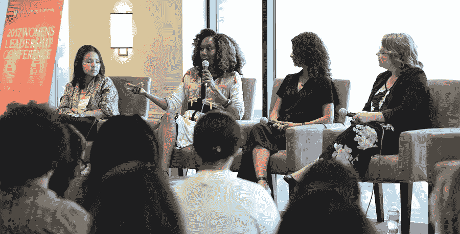

# 目标驱使企业家有所作为

> 原文：<https://medium.datadriveninvestor.com/purpose-propels-entrepreneur-to-make-a-difference-bd481566ec29?source=collection_archive---------0----------------------->

## 人们真的想要意义和联系

From left: Ann Le, Joy Donnell, Ana Flores and Maggie Chieffo speak about Image in the Age of Instagram.

作为一个有价值的人，脱颖而出并变得有意义是[乔伊·唐纳](https://twitter.com/doitinpublic)的强项。她热衷于利用关系来改变现状。剧透:她不喜欢谦逊。

唐纳是一个品牌和内容战略家，活动家和企业家“由目的驱动。”她相信通过拥有你的声音、形象、影响力和意图来拥有你的力量。她还是 [Vanichi 杂志](http://vanichi.com/)的主编。

“当大多数人追求‘脱颖而出’时，他们真正想要的是意义和联系。他们只是没有那样定义它，”唐纳说。

“联系需要你挖掘情感反应，”她说。“你必须在你的信息和内容中注入能够打动真正的人的人性化元素。用人们能感受到的方式与他们联系，自然的结果会是你在他们心目中脱颖而出。”

 [## 谁在外面？企业家需要知道

### 通过拥有你的声音来拥有你的力量

medium.com](https://medium.com/datadriveninvestor/whos-out-there-entrepreneurs-need-to-know-cb7fb4349d6c) 

一个有内涵的人是活着的——准备好并愿意参与对话和交流想法。

“我认为物质没有一个客观的定义，”唐纳说。“这是你感觉到的东西。物质来源于抓住你的激情，并有目的地追求它。

“这种目标和激情只能由个人来塑造，”她说。“什么给我们的生活带来意义，因人而异。”

她淡化了原创的必要性。

“原创性并不是脱颖而出的必要条件，”唐纳说。“以独特的方式挖掘一个已知的想法实际上会更有效。

“事实上，不要给自己加压，让自己变得有创意，”她说。"轻按您的意图和真实声音会自动将您的签名应用到您的内容中。有趣就好。寻找新的方式来呈现已知的想法。”

# **从你开始**

无论你选择哪种方式提出想法，你首先要说服的人是你自己。

唐纳说:“在你能对他人和观众产生意义之前，你必须先培养自己的意义。”“这意味着阐明你的意图。永远从你的意图开始。你的意图与你的幸福感有关。

“我们的意图滋养我们的幸福，”她说。“了解你的意图，然后用意图塑造你的信息、内容和媒体。这就是你如何发展独特的声音。不要把你的意图和你的“待办事项”清单混淆了。意图不是关于你必须完成什么任务。意图是基于你想要给予和吸引的东西。”

 [## 剥离算法层

### 了解数字背后的东西，以发展您的业务

blog.markgrowth.com](https://blog.markgrowth.com/stripping-away-the-layers-of-algorithms-a5471874ca3e) 

她解释说，网上的内容对应着一定的算法。

“你能吸引你展示的东西，”她说。“把你自己放进消息里。用你的意图为人们设计一次情感体验和旅程。让你的内容不仅能让他们摆脱焦虑，还能与他们自己的人性建立联系。”

根据唐纳的说法，你所说的不同并不重要，重要的是你如何解释自己。

“你的想法不必是原创的，”她说。“简单地说，在你如何发展这些想法时，要有独创性和独特性。这不仅会帮助你*产生共鸣*，也会帮助你*产生共鸣*。

“我们并不总是需要原创的想法，”唐纳说。“我们只是需要帮助我们以令人兴奋的方式看待事物的人。你的内容是归航的灯塔。它吸引了志同道合者和共同之处。”

# **发展人脉**

许多使用社交媒体的人都有网上联系，他们通过自己的例子告诉我们什么是社会物质。由此，你可以极大地拓展人脉。

“我每天都受到真正在线联系的积极影响，”唐纳说。“最近的一个例子是，一家在线奢侈品零售商通过 Instagram 找到了我，因为我经常讨论和穿着发展中经济体的新兴奢侈品牌。

“我们现在即将推出一个内容活动，展示在非洲大陆设计或制作的新兴奢侈品设计师，”她说。

 [## 在变化中找到理智

### 预见变化需要倾听，找出人们的需求

medium.com](https://medium.com/datadriveninvestor/find-sanity-within-change-c5e3cb10b7e7) 

通过与他人交谈，你可以向他们展示他们真正的重要性。简单的互动让人们——包括你自己——知道他们很重要。

“当你出现在人们面前时，他们知道他们对你很重要，”唐纳说。“支持你的实际支持者。你知道他们是谁。与他们交战。激励他们。询问他们的需求和目标。乐于助人。”

记住，援助是双向的。

“支持不是单行道，”唐纳说。“这值得互惠。有时候，我们太专注于推销自己，以至于我们所做的一切都是全天候向人们广播。停播开始受益。

“粉丝基础和支持基础是不一样的，”她说。“粉丝来了又去。支持者在更深层次上与你相连。给予支持，你会得到支持。与粉丝圈相比，建立支持需要更长的时间，但这是值得的，也更持久。”

# 鼓舞人心

你在网上或网下遇到的许多人都能激发出你最好的一面。他们尊重你，平等对待你，并与你讨论有效的观点。

“我只和激励我变得更好、做得更好的人在一起，”唐纳说。“我知道我是力量遗产的一部分。我的祖先被认为是一次性的——尽管他们不是——然而他们幸存了下来，我也存在了。

“所以，当我累了，需要额外的灵感时，我就记住了，”她说。“对我来说，知道以前的人克服了困难，所以你能成为这样的人，这是一种力量。它滋养了我的韧性。”

 [## 如何重新获得更大的成功

### 有了弹性，我们从压力中反弹，达到更高的高度

medium.com](https://medium.com/datadriveninvestor/how-to-bounce-back-to-even-greater-success-db10e86791e1) 

如果你着眼于改变世界，许多专家建议保持谦逊。唐纳不同意。

“我认为谦逊是一种被高估的美德，”她说。“不要做一个混蛋或自恋者，但要能够承认并说出你的成就。有收据。给他们发声。给他们看看。我们对谦逊的定义是，一个社会通常会说服伟大的人坐下来闭嘴，而直男自恋者会变得大声并被崇拜。

“去他妈的谦逊，”唐纳说。“拥有你的力量。拥有你的声音。拥有自己的沟通能力。建立联盟，把你的信息传递给世界，而不需要道歉。无论你努力做什么，都值得用你的热情和声音去尊重。”

想法可以成为有意义的行动计划，特别是如果你把自己放在前面和中心。

“把你自己变成你自己的中心，”唐纳说。“你的想法必须开始产生，并与现实世界联系起来。你的第一项行动是*了解*你的关系网。检查你已经有的关系和联系。区分你真正的支持者和你临时的盟友。

她说:“弄清楚你还需要哪些类型的关系才能茁壮成长。”“开始创作吸引这类支持者的内容。把网上交流和面对面交流结合起来。这不是一个非此即彼的情况。你必须同时发展这两种关系。”

# **超越在线**

唐纳也提醒不要仅仅依赖网络联系。

“请不要依赖社交媒体平台作为你唯一的联系方式，”她说。“你应该总是，*总是*建立一个邮件列表。除非你拥有社交媒体平台，否则你不应该让它成为你拥有的受众的唯一数据库。”

 [## 电子邮件的力量来自数据

### 一份名单代表人们向你伸出友谊之手

medium.com](https://medium.com/datadriveninvestor/emails-power-surges-from-data-889015c20958) 

她提到了自己为周围的世界增添物质的几种方式。

“我拥有一个名为[Vanichi.com](https://t.co/5JtDTW4bKq)的平台，”唐纳说。“我们追求的是一致的奢华。我们将发布更多专栏文章，并鼓励提交讨论社会问题以及我们的奢侈品特色的文章。写专栏是增加你重要性的好方法。”

她的所有努力——无论其背景如何——都是基于人性的。

“没有人性为中心，就没有真正的奢侈品，”唐纳说。“如果我们忽视我们的公共健康需求，我们将永远不会有一个更加奢华的未来。

“我在国际上谈论宣传、品牌、内容策略和媒体。我也就这些话题做客座演讲，”她说。“我的创意活动侧重于媒体，这些媒体拓展了我们的人性意识、文化理解、性别平等机会、人权等等。”

她用行动支持她的话。

“我把我的创造力用于行动主义，”唐纳说。“我是像我们这样的女性的大使，该组织支持人权和女性主导的倡议。”

她还写了一本名为《超越品牌的 T2》的书，讲述如何利用意图驱动的信息来塑造你的遗产。它将于五月上市。

**关于作者**

吉姆·卡扎曼是拉戈金融服务公司的经理，曾在空军和联邦政府的公共事务部门工作。你可以在[推特](https://twitter.com/JKatzaman)、[脸书](https://www.facebook.com/jim.katzaman)和 [LinkedIn](https://www.linkedin.com/in/jim-katzaman-33641b21/) 上和他联系。