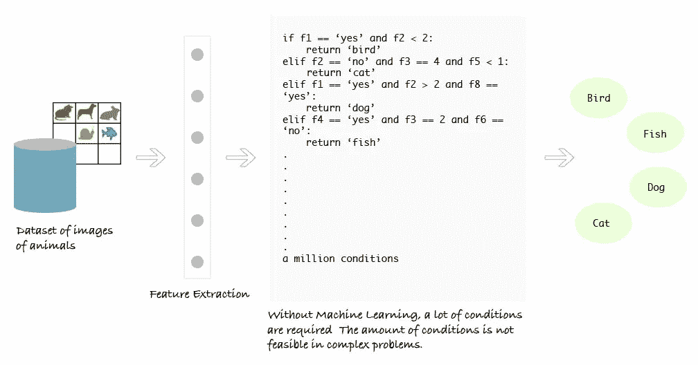
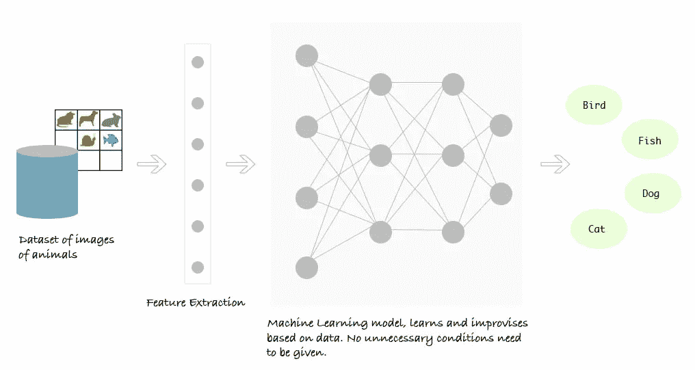

# 机器学习的追求—简介

> 原文：<https://medium.datadriveninvestor.com/pursuit-of-machine-learning-introduction-dc58744eb3e9?source=collection_archive---------4----------------------->

[](http://www.track.datadriveninvestor.com/1B9E)

什么是机器学习，为什么它首先出现在这里，以及它的常见应用。

*由***# GirlDressedInCode**


> 机器学习是让计算机在没有明确编程的情况下学习的科学。

在 [***我上一篇博客***](https://medium.com/@rashmisangwan/hi-i-am-girldressedincode-9a71767125ae) 中，提到了我开始从事这个领域时所面临的问题。如果没有好的指导，很多事情都会出错，让你对自己确定的道路失去信心。但是永远记住—

> 不要让别人告诉你，你成不了大器。

在这一系列教程中，我将为初学者提供关于机器学习概念的更简单的解释，从最基础的到高级数学模型甚至神经网络(又名深度学习)。

[](https://www.datadriveninvestor.com/2019/03/03/editors-pick-5-machine-learning-books/) [## DDI 编辑推荐:5 本机器学习书籍，让你从新手变成数据驱动专家…

### 机器学习行业的蓬勃发展重新引起了人们对人工智能的兴趣

www.datadriveninvestor.com](https://www.datadriveninvestor.com/2019/03/03/editors-pick-5-machine-learning-books/) 

系列将包含如下所列的一系列教程

1.  介绍
2.  [m . l、A.I .和 D.L .之间的区别](https://medium.com/datadriveninvestor/difference-between-ml-ai-dl-23db64f7aa2)
3.  [机器学习中的分类](https://medium.com/datadriveninvestor/classification-in-machine-learning-f5f677972a77)
4.  有监督的
    i)回归
    ——::线性回归
    ——::多元回归
    ——::多项式回归

    ii)分类
    ——*二元类逻辑回归
    ——*多类逻辑回归
    ——*决策树
    ——::支持向量机
    ——*随机森林
    ——* K 重交叉验证
    ——* KNN
5.  无监督的
    i)基于分区的聚类 Ex-K-means，K-median。
    ii)基于层次的聚类。凝聚的、分裂的
    ii)基于密度的聚类。基于密度的噪声应用空间聚类
6.  推荐系统
    i)基于内容的
    ii)协同过滤
7.  深度学习

所以我们先来深入介绍一下机器学习。

# 什么是机器学习？

```
**Machine** **learning** (ML) is the scientific study of algorithms and statistical models that computer systems use to effectively perform a specific task without using explicit instructions, relying on patterns and inference instead. - *Wikipedia*
```

简单地说，我们收集了大量数据，并让计算机处理这些数据，以找到有趣的模式，这些模式可以以某种方式用于我们的理解，或者反过来，可以被计算机本身用来学习。大部分时间只是统计。

例如，查看一个显示一个地区小学费用的数据表，我们可以预测那些数据甚至没有显示在表中的学校的费用。它可能不是 100%准确。但是随着数据的增长，我们的预测变得越来越准确。

还有很多问题是无法显式编程的，只能用一组正确的数据进行训练。让我们来看看机器学习的另一个广为人知的定义

```
A computer program is said to learn from **experience** E with respect to some **task** T and some **performance** measure P, if its performance on T, as measured by P, improves with experience E. *- Well-posedLearning Problem by TomMitchell (1998)*
```

被这些话弄得有点不知所措？别担心…让我们后退一步，看看我到底在说什么。

# 我在说什么？

机器学习是人工智能的一种应用，旨在创建自学软件，该软件不是为完成特定任务而编程的，而是为完成该任务而训练的。

让我们举个例子——

猜测脸书照片上的人物并不容易编程。让我们明白...为什么？

机器只理解二进制，即 0 和 1。为了让计算机理解特定的实体，我们需要将其转换为二进制表示。

但是，等等…我们怎样才能把我的狗的照片转换成二进制呢？


我们能...让我们看看怎么做。任何图像都是由像素组成的。每个像素由不同的颜色组成。每种颜色都可以用十六进制表示。这又可以转换成二进制。

> 图像->像素->颜色组合->十六进制->二进制

….哼。太多了？等着吧…😇

现在电脑保存了这张狗的照片。我们需要用电脑猜测这张照片里有一只狗。

但是有太多的问题需要首先回答。一般来说，对于计算机来说，狗是一个形状复杂的东西。环境中有许多不同的东西，除了一只狗。那么我们要怎么做呢？让我们试着弄清楚…

> *电脑—* 人类::对话

*‘狗是什么形状的？’—* 不是几何形状。

“好吧，那就必须有一个狗的形状的功能描述。” —没有。这也完全取决于点击图片的方向。还有狗狗的表情和坐姿…很复杂。

*‘嗯……嗯’——【沉默】*

*“好吧，忘了形状吧”*

“这只狗是什么颜色的？” —不一样。

*‘不同物种的不同？’—* 是的...而且同一只狗本身也不一样。单身狗本身身上就有不均匀的色调…很复杂。

*‘嗯……嗯’——【沉默】*

“那我如何将狗与环境区分开来？”

“我怎么知道黑领不是狗的一部分？”

“但是那个黑鼻子显然是他的。”

“还有一百万个问题可以问。”

—闭嘴！！！[计算机存疑，人类愤怒]

—只是听。它有四条腿和一条尾巴。

*‘嗯……腿？？反面？？‘搞什么鬼？’*

“不管怎样……瞧……这是一只狗？”


[电脑摇滚，人类冲击]

如果我们能解决这个问题，那很好。如果没有…跟上我。

> 问题:我们有一个动物图像的数据库，然后我们必须找到哪个图像属于哪个动物。

## 没有机器学习

*   它需要很多规则。
*   高度依赖当前数据集。
*   不够一般化，无法检测出样本病例。



## 通过机器学习

*   该模型查看所有特征集及其对应的动物类型，并学习每个元素的模式。
*   模型由机器学习算法构建。
*   无需明确编程即可工作。
*   使用与 4 岁儿童相同的学习过程。



有许多问题只能由计算机来解决，但编程却非常困难。所以我们现在有了机器学习来拯救我们。

在深入研究我们如何实现机器学习之前，让我们看看 ML -的更多应用

# **应用**

## 1)数据库挖掘

这个时代，数据就是一切。每个人都在以指数级的速度收集越来越多的数据。

来自自动化/web 发展的大型数据集可以是— web 点击记录、医疗记录、生物学收集的数据、工程数据等。

这个大型数据集是 ML 在过去 20 年中非常流行的原因之一。在未来几年，这一数字还会进一步上升。

ML 用于处理和找出这个大型数据集中的模式，以帮助商业决策。例如，Flipkart 使用数据挖掘技术来预测什么是大规模销售的好时机和产品。

## 2)应用程序不能手工编程

《出埃及记》-自主直升机、手写识别、自然语言处理(NLP)或计算机视觉等。

1.  *自主直升机*——我们只是不知道如何编写程序让直升机自己飞行。相反，起作用的是训练计算机飞行的方法。它从失败中吸取了教训。
2.  *手写识别*——许多行业都在使用许多手写识别软件来简化流程。《出埃及记》今天，在美国和国际上发送一封邮件是非常便宜的，因为有一种学习算法可以学习如何阅读你的笔迹，这样它就可以自动发送一封邮件，所以发送这些邮件只需要几美分。
3.  *NLP 或计算机视觉*—这些是人工智能领域中与理解语言或图像有关的领域。它有助于在脸书照片上建议标签，谷歌图片搜索，过滤掉攻击性的评论等。

## 3)自我定制程序

《出埃及记》亚马逊和网飞产品推荐。我们在亚马逊和网飞服务上得到的建议并不是为每个人手工策划的。相反，机器学习被用于它。

## 4)其他领域

《出埃及记》银行决定批准贷款，电信公司使用客户的人口统计数据对他们进行细分或预测他们下个月是否会退订他们的公司，聊天机器人，使用人脸识别的电脑游戏，等等。都是机器学习应用

# 摘要

在这篇文章中，我们看了什么是机器学习，为什么它在这里摆在首位，以及它的常见应用。*在下一篇*[](https://medium.com/datadriveninvestor/difference-between-ml-ai-dl-23db64f7aa2)**中，我们将关注当今互联网上最普遍的困惑。**

> *杀不死你的，会让你变得更强。*😜*
> —来源:机器学习模型*

*这是 **#GirlDressedInCode** 暂时结束。Ttyl。👍🏻*

> *吃吧。睡觉。代码。重复一遍。👩‍💻*