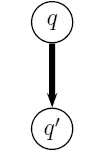
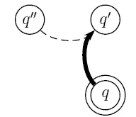
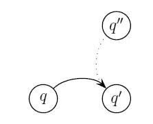
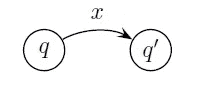
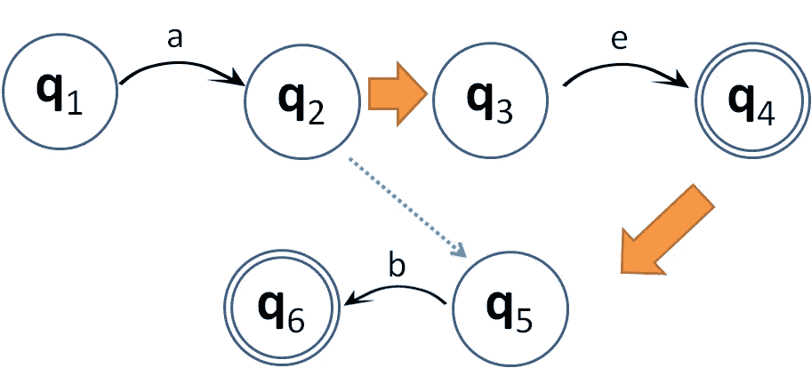

# 下推自动机(PDA)和上下文无关文法(CFG)

> 原文：<https://medium.datadriveninvestor.com/pushdown-automata-pda-and-context-free-grammar-cfg-695409625853?source=collection_archive---------3----------------------->

上下文无关语法(CFG)是一组重写规则，可用于递归地生成或再现模式/字符串。举个例子，

S → ABB
A → 0
B → 1
B → 2

有了上面的规则，我们就可以生成下面的字符串:
S→ABB→012；或者
S→ABB→011；或者
S→ABB→022；或者
S → ABB → 021

也就是说，使用这些规则将能够生成四组可能的字符串:012、011、022、021。这一点在使用句法规则生成句子时颇为相似:
S→NP VP
NP→N
NP→Det N
VP→V
VP→V NP

可能的句子会是下面这些(举几个例子):
S → NP VP → N VP → N V → Mary jumps。
S → NP VP → Det N VP → Det N V →一个男生跳。
S → NP VP → N VP → N V NP → N V N →玛丽打玛丽。
S → NP VP → N VP → N V NP → N V Det N →玛丽打了一个男生。

基于 CFG 包含递归规则的特点，如何将有限状态自动机(FSA)应用于 CFG？实现该目标的想法是向 FSA 添加存储设备。带有存储设备的 FSA 称为下推自动机(PDA)。PDA 是一个状态有限的自动机，记忆可以是无限的。通过 PDA 的应用，它将能够识别出如下所示的 CFG:{0^n 1^n | n∈ℕ}.

PDA 可以是不同类型的转换，例如扩展、缩减和有条件的。(以下对这些转变的描述和图表来自威廉·舒勒的[讲义 8。)](https://www.asc.ohio-state.edu/schuler.77/courses/5801/LN08.pdf)

*   扩展:将先前的状态推送到存储器上(将存储器上的 *q* 状态推送到*q’*状态)

*   减少:从存储中删除最后一个状态(删除 *q"* 状态，同时将 *q* 状态推到存储中的 *q'* 状态)

*   有条件:类似于归约转换，但是 *q"* 状态没有被移除而是保持不变

*   状态转换:通过输入 *x* 从 *q* 转换到*q’*状态(不将 *q* 状态叠加到*q’*状态)

我们将如何使用 PDA 的上述过渡？下面是威廉·舒勒的[习题集 3 中的一个练习范例。](https://www.asc.ohio-state.edu/schuler.77/courses/5801/PS3.pdf)

>黑色箭头:带有输入字符串的状态转换
>橙色粗箭头:扩展转换(将先前状态压入堆栈)
>蓝色虚线箭头:缩减转换(弹出特定的先前状态)

让我们从一个状态转移到另一个状态，看看每个状态都存储了什么。*请注意，只有当最终状态有一个空的内存堆栈(ϵ)时，才会接受消耗的输入字符串。

状态:存储
*Q1*:ϵ
*Q2*:ϵ(消耗输入“a”)
*Q3*:*Q2*(将前一状态 *q2* 推送到堆栈上)
*q4* : *q2* (消耗输入“e”)
*q5*:ϵ(将前一状态 *q2* 推送到堆栈上

注意，虽然 *q4* 和 *q6* 都是最终状态，但是 *q4* 中的堆栈不为空，并且消耗的字符串不能在 *q4* 被接受。当 *q6* 有一个空堆栈并且本身是一个最终状态时，被使用的输入字符串被接受。还有一点需要注意的是，由于 *q4* 是最终状态，因此它不会被下推到堆栈中(而只是堆栈中已经存在的先前状态，例如 *q2* )以存储在状态 *q5* 中。

也就是说，虽然 *q4* 是最终状态但是堆栈不为空， *q4* 将不能接受输入字符串“a e”。然而， *q6* 是一个空栈的最终状态，它可以接受被消费的字符串“a e b”。

PDA 接受输入字符串的状态的三个要求是:
a)输入字符串被消耗；
b)堆栈的状态为空；c)该状态是最终状态。

结论:如何证明一种语言是 CFG？如果语言是 CFG，那么有一个 PDA 可以识别它；
2)如果有一种语言的 PDA，那么它就是 CFG。

*这是我自己的一篇学习笔记。如果有误导，请告诉我。

# 参考

*   威廉·舒勒。2018.凌 5801——讲义八。[https://www . ASC . Ohio-state . edu/schuler . 77/courses/5801/ln08 . pdf](https://www.asc.ohio-state.edu/schuler.77/courses/5801/LN08.pdf)
*   斯坦福大学。下推自动机。(幻灯片)。[https://web . Stanford . edu/class/archive/cs/cs 103/cs 103.1132/lectures/17/small 17 . pdf](https://web.stanford.edu/class/archive/cs/cs103/cs103.1132/lectures/17/Small17.pdf)
*   卡莉·摩尔。下推自动机。*Brilliant.org*。[https://brilliant.org/wiki/pushdown-automata/](https://brilliant.org/wiki/pushdown-automata/)