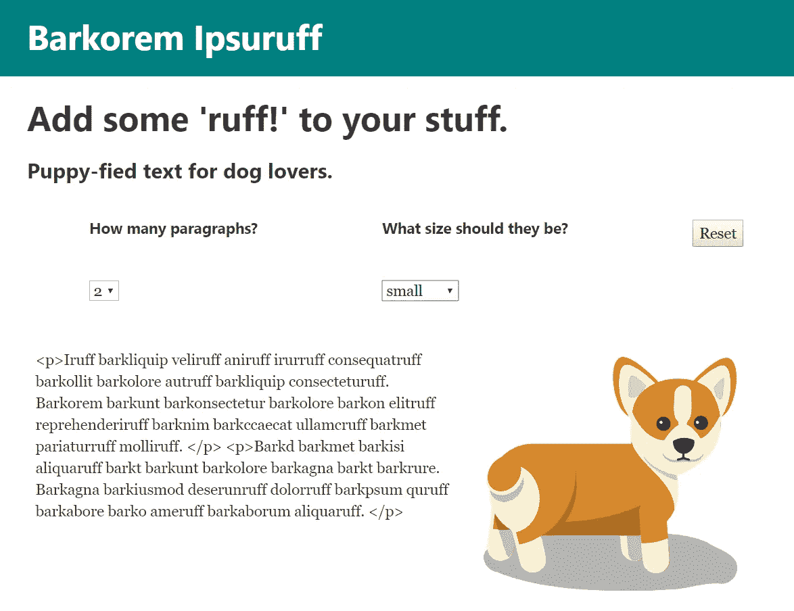
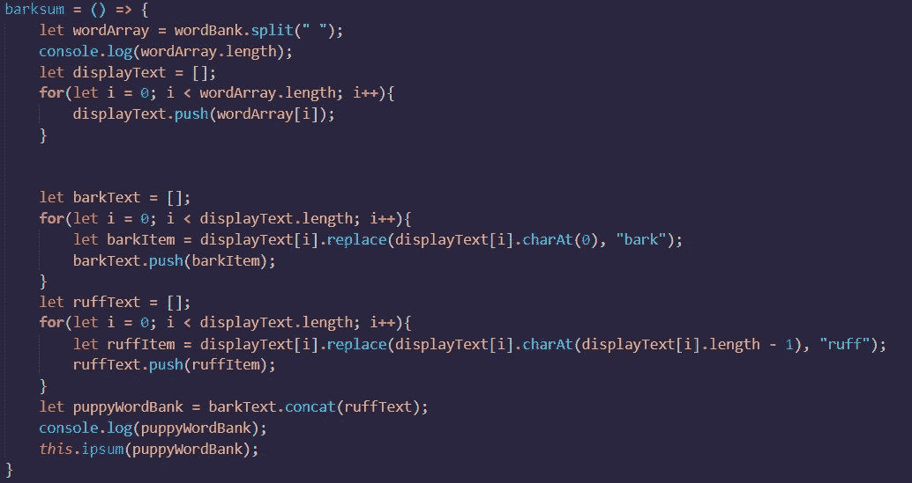
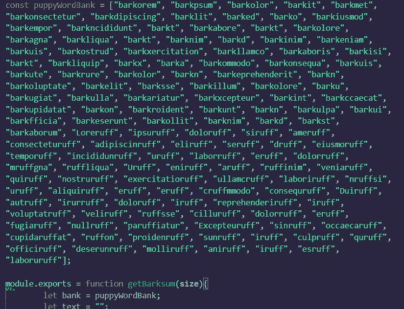

# 把我的 Lorem Ipsum 生成器放在 npm 上

> 原文：<https://medium.datadriveninvestor.com/putting-my-lorem-ipsum-generator-for-dog-lovers-on-npm-853790943ce6?source=collection_archive---------20----------------------->

查看时间:[https://www.npmjs.com/package/barkorem-ipsuruff](https://www.npmjs.com/package/barkorem-ipsuruff)

几周前，我决定使用 React.js 制作我的第一个自主项目。我已经通过 [Bloc](https://bloc.io) 和 [Udemy course](https://www.udemy.com/share/1003MwBEsdcV1UR34=/) 制作了一段时间的辅导项目，我终于觉得自己准备好了。

Lorem Ipsum generators 对我来说是一个常见的初学者项目，而且我受到了这个令人敬畏的[杰夫·高布伦文本生成器](http://jeffsum.com/)的启发，以某种方式使它变得独特。因此，我的想法是为爱狗人士设计的 lorem ipsum 发电机。

Gatsby.js 让我很快完成了这个项目。它具有强大的内置功能，例如:

*   惰性图像加载
*   反应路由器
*   和模板化布局

至于创建 bank 化的单词库，我用原始“Lorem ipsum”文本中的一个字符串启动它。然后我通过一个函数运行它，这个函数创建了`barkText`和`ruffText`数组。在`barkText`数组中，我用“树皮”代替了每个单词的第一个字母。在`ruffText`数组中，我把每个单词的最后一个字母换成了“ruff”。这些连接在一起形成了`puppyWordBank`，它被传递给随机生成器函数。

View on Github: [https://github.com/lindsayspencer/barkorem-ipsuruff](https://github.com/lindsayspencer/barkorem-ipsuruff)

有几篇文章(我将在下面的参考资料部分列出)帮助我理解了随机生成器函数的逻辑。它根据请求的段落数量和大小创建随机的文本段落。

最后，在完成和样式化站点之后，我使用 [Netlify](http://netlify.com) 来轻松部署站点，它会与您的 Github 帐户同步，以便在您每次提交新的提交时自动重新部署。

在分享了我的新项目后，有人建议我把它变成一个库，在 npm 上发布。由于我本周早些时候开始钻研 Node.js，我认为是时候重新访问 Barkorem Ipsuruff 了，看看我是否能弄清楚如何创建和发布我的第一个 Node 包。(我还将在下面附上我为此使用的非常有用的文章！)

第一步是创建一个新目录并运行`npm init`。

对于步骤 2，我查看了我的原始文件，并将生成器函数复制到一个新的项目文件中。我决定把它简化一点，这样就不需要用户输入什么了。我不再需要指定段落的数量——您可以多次调用该模块来指定多个段落。尺寸输入仍然可用，如小号`‘S’`、中号`‘M’`或`‘L’`，但不提供尺寸将默认为中号。

View on Github: [https://github.com/lindsayspencer/npm-barkorem-ipsuruff](https://github.com/lindsayspencer/npm-barkorem-ipsuruff)

我还决定不包含将原始的“Lorem ipsum”翻译成 barkified 版本的函数。对于用户的项目来说，提供已经修改过的文本数组似乎更有效。代码包含在`index.js`文件中供感兴趣的人参考，但它不会减慢你的程序。将清理后的代码分配给`module.exports`，代码就可以运行了！

步骤 3–8 包括:

*   确保我的`package.json`包含许可证和 Github 回购
*   创建一个包含安装和使用信息的`README.md`文件
*   创建 npm 帐户
*   通过运行`npm login`连接到帐户
*   使用`npm publish`
*   使用`npm install barkorem-ipsuruff`在另一个项目中测试它

差不多就是这样！我对 Node.js 中导出和导入模块的基本理解(加上来自 Google 的一些帮助)是我发布第一个小软件包并准备就绪所需要的。看看如何在 https://www.npmjs.com/package/barkorem-ipsuruff[的下一个项目中使用它。](https://www.npmjs.com/package/barkorem-ipsuruff)

# 精彩资源:

 [## 发布您自己的 NPM 包🎉

### 注意:对于 npm 模块有一个惊人的样板。这篇文章是基于我在创建它时学到的东西。

hackernoon.com](https://hackernoon.com/publish-your-own-npm-package-946b19df577e)  [## 如何制作一个漂亮、小巧的 npm 包并发布它

### 你不会相信这有多容易！

medium.freecodecamp.org](https://medium.freecodecamp.org/how-to-make-a-beautiful-tiny-npm-package-and-publish-it-2881d4307f78)  [## 圣所 Ipsum:建立一个天主教 React.js Lorem Ipsum 发电机

### 我如何在互联网上建立最神圣的 lorem ipsum 生成器，以及任何人的 React lorem ipsum 项目的设计。

medium.com](https://medium.com/@graysonhicks/sanctum-ipsum-d507e9b0e8c9)  [## JS Ipsum -生成你自己的 JS 乱码

### JavaScript 无处不在，现在你可以把它放在你的模型中。

jsipsum.lunarlogic.io](https://jsipsum.lunarlogic.io/)