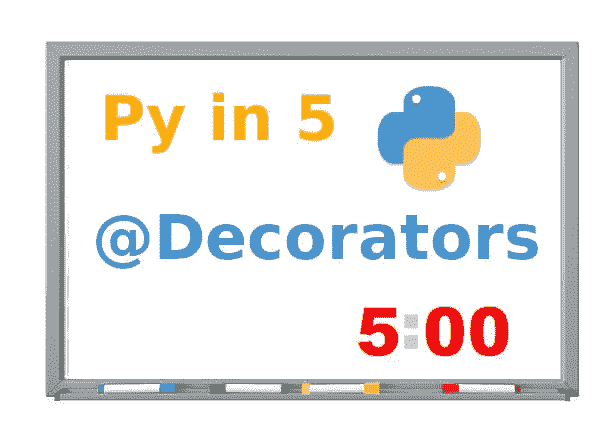
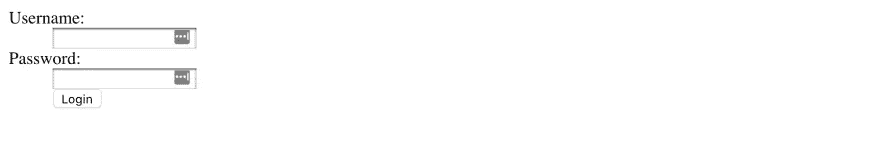
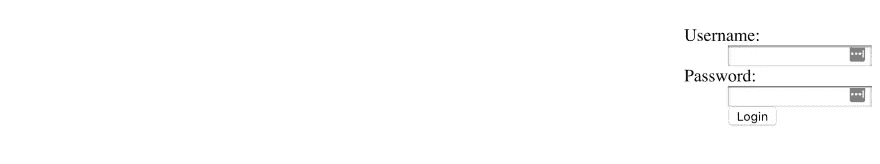

# Py in 5:装修工

> 原文：<https://medium.datadriveninvestor.com/py-in-5-decorators-f787f0ea1a74?source=collection_archive---------22----------------------->

Python 中的 decorator 是什么，我为什么要关心？



Python Decorators Explained in 5 Minutes

> **原载于编码鸭博客:【ccstechme.com/coding-duck-blog】[](https://www.ccstechme.com/coding-duck-blog)**

**大家好，欢迎来到另一个 Py in 5 讨论。在该系列文章中，我采用 Python 编程概念，并尝试用 5 分钟或更短的时间用通俗易懂的语言解释它。我们今天的话题:装修工！**

**作为我们的客户，让我们得到装饰者的“官方”定义:**

**pythontips.com:**

*****修改其他功能的功能*****

**python.org:**

*****使用@wrapper 语法返回作为函数转换应用的另一个函数的函数*****

**好的，我听到的是……函数。函数接受一个函数返回一个函数，这样你的应用程序就能正常运行。以及通常使用的编程范式？面向对象…很明显。**

**尽管这些定义根本不是在兜圈子，也不是用它们自己的定义来定义自己，但我还是要试着澄清一些事情。**

**从真正抽象的意义上来说，可以把 decorators 看作是一种封装，但是是在函数级而不是类级。就像 Python 中的类允许封装它们的属性一样，decorators 允许在函数中进行这种 OOP。就像你导入一个类到你的 python 文件中，比如说“时间”模块。假设你想让你的程序在继续之前等待 10 秒钟。为此，您应该写:`time.sleep(10)`。你在这里所做的基本上是利用封装。“sleep”函数封装在 time 类中。**

**想象你有一个叫睡眠的朋友，你小时候想和他一起玩。你会去他家，按门铃，他爸爸时间会去开门。“嗨！睡觉能出来玩吗？”你会问时间。**

**“当然可以！”他会回答，“让我去帮你把他找来。”然后，睡眠会出来，你们会去享受快乐的时光。装饰器提供了类似的功能，但是它不是封装函数，而是封装上下文。任何用装饰器调用的函数都可以访问该装饰器特有的上下文(函数运行前后发生的影响函数运行的事情)。一般来说，就像你的父母(班级)会有你需要的特定行为方式。但是当你的叔叔(装修工)带你去做一些事情的时候，你的行为会和在家里不一样。当你被一个不同于你父母的亲戚临时照顾时，对你的期望和你的行为是不同的。**

**例如，让我们看看几个改变 HTML 表单行为的装饰器。该表单编写如下，并在 Flask web 框架中呈现:**

```
@app.route('/')
def styling():
    return '''
            <form action='' method='post'>
                <dl>
                  <dt>Username:
                  <dd><input type=text name=username>
                  <dt>Password:
                  <dd><input type=text name=password>
                  <dd><input type=submit value=Login>
                </dl>
            </form>'''
```

**并且渲染成这样**

****

**现在，让我们将以下装饰者添加到组合中:**

```
def style_with_flex_end(func):
    def func_wrapper():
        return '''<div style="display: flex; flex-direction: row; justify-content: flex-end">{0}</div>'''.format(func())
    return func_wrapperdef style_with_flex_center(func):
    def func_wrapper():
        return '''<div style="display: flex; flex-direction: row; justify-content: center">{0}</div>'''.format(func())
    return func_wrapper
```

**两个装饰者做相似的事情。它们之间唯一的区别是 justify-content 样式标签。然而，通过简单地给前面提到的 HTML 表单这些装饰器应用的*上下文*，我们得到了一个不同的结果。让我们将`style_with_flex_end`装饰器附加到这个 Flask route 上，只需在“样式”函数的定义上使用一个“@”符号调用它，并且没有括号。**

```
@app.route('/')
@style_with_flex_end
def styling():
    return '''
            <form action='' method='post'>
                <dl>
                  <dt>Username:
                  <dd><input type=text name=username>
                  <dt>Password:
                  <dd><input type=text name=password>
                  <dd><input type=submit value=Login>
                </dl>
            </form>'''
```

**添加装饰器会呈现如下所示的表单:**

****

**如您所见，装饰器提供的`justify-content: flex-end;`上下文改变了表单在页面上出现的位置，而不需要修改表单代码本身。同样的事情也可以用我们的另一个装饰者来做:**

```
@app.route('/')
@style_with_flex_center
def styling():
    return '''
            <form action='' method='post'>
                <dl>
                  <dt>Username:
                  <dd><input type=text name=username>
                  <dt>Password:
                  <dd><input type=text name=password>
                  <dd><input type=submit value=Login>
                </dl>
            </form>'''
```

**然后呈现如下:**

****

**因此，总而言之，装饰器给函数添加了上下文。基本上，它给了你的函数使用装饰器提供的附加装饰的“许可”。我们的例子表明，如果我们问`@style_with...`装饰者他们实现的 justify-content 样式是否可以“出来玩”，那么当他们“和爸爸妈妈在家”时，他们会给我们的 HTML 一组不同的期望，因此允许他们的行为不同于平时。**

**我希望这已经为那些不确定什么是室内设计师或者室内设计师做什么的人澄清了一些事情。如果您有任何问题或需要澄清，请在下面留下评论！我总是愿意帮助他人理解，因为一如既往，这个世界需要你，你的想法，以及你对这个奇妙领域的独特方法，这样我们就可以共同建设未来酷、有用、棒的技术！**