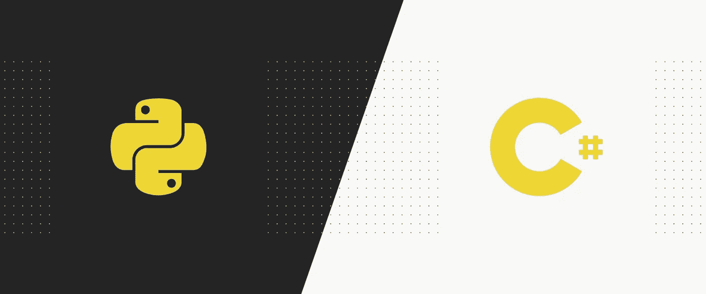

# Python 和 C#的比较

> 原文：<https://medium.datadriveninvestor.com/python-and-c-a-comparison-f0f150142b73?source=collection_archive---------7----------------------->

[](http://www.track.datadriveninvestor.com/1B9E)

**Python 和 C#都是用于特定任务的有用语言，在可预见的未来，它们应该会被使用。如果你和我一样，在学习 Python 之前，你学了很多语言。我用得最多的语言是 C#，它已经成为我依靠的一堵墙，但是它与老的 Python 相比如何呢？**

在我的[网站](http://jordan-ireland.com)上查看一些用 C#和 Python 制作的项目。

[](https://www.datadriveninvestor.com/2019/02/21/best-coding-languages-to-learn-in-2019/) [## 2019 年最值得学习的编码语言|数据驱动的投资者

### 在我读大学的那几年，我跳过了很多次夜游去学习 Java，希望有一天它能帮助我在…

www.datadriveninvestor.com](https://www.datadriveninvestor.com/2019/02/21/best-coding-languages-to-learn-in-2019/) 

我们必须考虑的第一件事是如何使用两种语言。C#和 Python 都是面向对象的语言，这是一种围绕数据或对象而不是功能和逻辑组织程序的模型。对象可以定义为具有唯一属性和行为的数据字段。C#是完全面向对象的，而 Python 可以用来编写过程代码。C#是一个静态编译的代码，这意味着 C#将在游戏引擎等方面表现出色，但 Python 是开发时间的领导者。

接下来，我们要看看语言的构成。Python 依赖于空白，并且类型正确。这些错误非常笼统，并且没有给出背后的很多含义。由于这个原因，搜索错误有时会很棘手并且很耗时。C#更多地依靠标点符号来告诉编译器该做什么。让我们来看一些例子:

## 大蟒

```
a = 3
b = 'this is a string'
c = 4.564352def function_name(x, y, z=None):
  if z == None:
    return x + y
  else:
    return (x + y) - z
```

## C#

```
int a = 3;
string b = 'this is a string';
float c = 4.564352f;float FunctionName(float x, float y, float z = 0) {
  if(z == 0) {
    return x + y;
  } else {
    return (x + y) - z;
  }
```

**您马上会注意到的一个主要区别是格式。为了让 Python 知道你在说什么，你必须有完美的缩进。如果空格不存在，你的代码就不会运行。Python 不在乎你传递给函数什么参数，只要它能工作。而 C#只关心标点符号。在函数中，只能传递浮点变量。是的，您可以使用术语`var`来使用您想要的任何东西，但是它稍微减慢了运行时间。**

**另一个**巨大的差异是命名惯例。C#的命名如下:type > name=yourvariable。(同样，您可以通过`var`，但是它会稍微减慢运行时间)。Python 命名约定:name=yourvariable。不需要使用类型。它知道你在说什么！