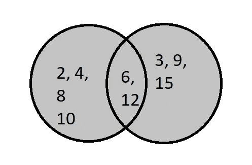
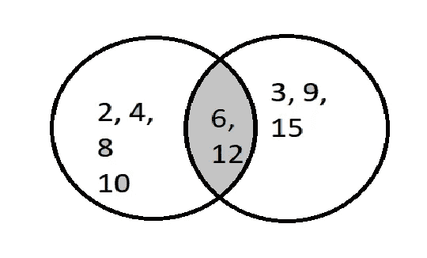
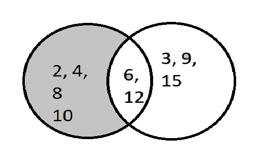
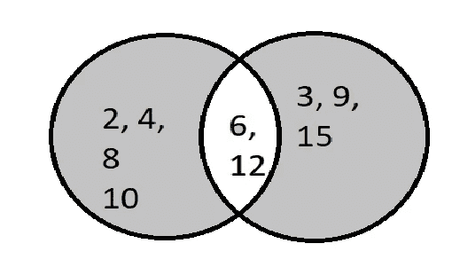

# Python 数据结构-集合

> 原文：<https://medium.datadriveninvestor.com/python-data-structures-set-4e732b4be8?source=collection_archive---------1----------------------->

[](http://www.track.datadriveninvestor.com/1B9E)

*先决条件:任何编程语言的基础知识*

*我们将在这里探讨数据结构集及其所有操作。*

为[设定的 Jupyter 笔记本](https://github.com/arshren/Data-Structures/blob/master/Python%20Data%20Structures%20-%20Set.ipynb):

对于[列表](https://medium.com/@arshren/python-data-structures-list-9131e7386c8d)上的所有操作

对于[字典上的所有操作](https://medium.com/@arshren/python-data-structures-dictionary-9b746b94b421)

对于[元组](https://medium.com/@arshren/python-data-structures-tuple-c84a3f822ab2)上的所有操作

对于公共[数据帧](https://medium.com/@arshren/python-data-structures-dataframe-888fef6872bf)

***在这里我们将了解什么是集合，如何创建集合，访问集合中的元素，向集合中添加元素，从集合中删除元素。我们会发现，如果我们可以更新元素是一个集合。***

# 什么是集合？

*   *集合是无序的，并且收集的数据没有索引*
*   *集合中的元素是不可变的，不能改变*
*   集合中的元素必须是唯一的

# 一套有什么用？

*   *从序列中删除重复项*
*   *计算标准的数学运算，如交、并、差和对称差。*
*   *集合有一个高度优化的方法来检查集合中是否存在元素*

# 创建集合

可以通过在{}内放置值来创建集合。

在下面的示例中，我们将“Tokyo”和“Mumbai”作为重复值，但是由于 set 只能包含唯一值，我们可以看到输出中只包含一次“Tokyo”和“Mumbai”

```
cities ={'Tokyo', 'Frankfurt','Mumbai', 'New York', 'Chicago', 'Tokyo', 'Mumbai'}
print(cities)***{'Frankfurt', 'Chicago', 'New York', 'Tokyo', 'Mumbai'}***
```

我们也可以使用 set()方法创建一个集合。这里你可以看到元素是无序的

```
months =set(['Jan', 'Feb','March', 'April', 'May', 'June', 'July', 'Aug', 'Sep','Oct', 'Nov', 'Dec'])
print(months)***{'June', 'March', 'Dec', 'April', 'Jan', 'Aug', 'Sep', 'July', 'Nov', 'Oct', 'Feb', 'May'}***
```

# 访问集合中的元素

由于集合是无序的数据集合，我们不能使用索引来访问集合中的元素。我们可以使用 for 循环来访问集合中的单个元素

```
for i in months:
    print(i)***June
March
Dec
April
Jan
Aug
Sep
July
Nov
Oct
Feb
May***
```

要检查一个元素是否出现在集合中，我们可以在操作中使用**。**

在下面的例子中，我们检查巴黎是否出现在城市集中，返回 False。

```
'Paris' in cities
***False***
```

这里我们检查东京是否出现在城市中，返回 True

```
'Tokyo' in cities
***True***
```

# **向集合添加元素**

要将单个元素添加到集合中，我们可以使用 add()方法。

```
cities.add('Paris')
cities{'Chicago', 'Frankfurt', 'Mumbai', 'New York', 'Paris', 'Tokyo'}
```

如果我们想向一个集合中添加多个元素，我们需要使用 update()

```
cities.update(['Beijing','London','San Francisco'])
cities***{'Beijing',
 'Chicago',
 'Frankfurt',
 'London',
 'Mumbai',
 'New York',
 'Paris',
 'San Francisco',
 'Tokyo'}***
```

# 更改集合中的现有元素

我们不能改变集合中的元素，因为集合是不可变的

# 移除元素是一个集合

要删除一个元素，我们可以使用 remove()方法。如果元素不存在，那么 remove 将引发一个" **KeyError"**

```
cities.remove('London')
cities***{'Beijing',
 'Chicago',
 'Frankfurt',
 'Mumbai',
 'New York',
 'Paris',
 'San Francisco',
 'Tokyo'}***
```

我们也可以使用 **discard** ()方法从集合中删除一个元素。如果集合中不存在要删除的元素，则不会引发错误。

```
cities.discard('Frankfurt')
cities***{'Beijing', 'Chicago', 'Mumbai', 'New York', 'Paris', 'San Francisco', 'Tokyo'}***
```

**pop** ()方法从集合中随机删除一个元素。

```
cities.pop()
cities***{'Beijing', 'Chicago', 'Mumbai', 'New York', 'San Francisco', 'Tokyo'}***
```

我们可以使用 clear()方法从集合中删除所有元素

```
cities.clear()
cities***set()***
```

# 将元素从一个集合复制到另一个集合

我们可以将元素从一个集合浅层复制到另一个集合。浅层拷贝，当您更改一个集合的内容而另一个集合保持不变时。

在这里，我们创建城市并将其内容复制到 copy_cities。然后，我们将“新加坡”添加到 copt_cities 集合中，但是看到 cities 集合保持不变

```
cities ={'Tokyo', 'Frankfurt','Mumbai', 'New York', 'Chicago'}
copy_cities = cities.copy()
print(copy_cities)
***{'Chicago', 'New York', 'Tokyo', 'Mumbai', 'Frankfurt'}***copy_cities.add('Singapore')
print(copy_cities)
***{'Singapore', 'Chicago', 'New York', 'Tokyo', 'Mumbai', 'Frankfurt'}***print(cities)
***{'Chicago', 'New York', 'Tokyo', 'Mumbai', 'Frankfurt'}***
```

# 查找集合中元素的数量

我们使用 len()方法来找出一个集合中元素的个数

```
len(copy_cities)***6***
```

# **设定操作**

在这一节中，我们将探讨并、交、差和对称差

我们创建两个集合，一个是 2 的倍数，一个是 3 的倍数

```
set_muliple_2 ={2,4,6,8,10,12}
set_muliple_3 ={3,6,9,12,15} 
```

Union 将从两个集合中取出所有元素，因此我们将得到所有唯一值，这些值要么是 2 的倍数，要么是 3 的倍数，或者两者都是



Union is the grayed area between set_multiple_2 and set_multiple_3 with values 2,3,4,6,8,10,12,15

```
set_muliple_2.union(set_muliple_3)
***{2, 3, 4, 6, 8, 9, 10, 12, 15}***
```

**交集**将获取两个集合之间的公共元素。在我们的例子中，我们将有两个数字都是 2 和 3 的倍数



Intersection is the grayed area with values 6 and 12 between set_multiple_2 and set_multiple_3

```
set_muliple_2.intersection(set_muliple_3)***{6, 12}***
```

**差**使用**差**()方法或**-**进行。

Difference 将返回只存在于 set _ muliple _ 2 集合中而不存在于 set _ muliple _ 3 集合中的元素。

换句话说，它将返回集合 _ 多重 _2 的所有元素，并删除集合 _ 多重 _2 和集合 _ 多重 _3 之间的公共元素



Difference is the grayed area with values 2,4,8,10 between set_multiple_2 and set_multiple_3

```
set_muliple_2.intersection(set_muliple_3)
***{2, 4, 8, 10}***set_muliple_2 - set_muliple_3
***{2, 4, 8, 10}***
```

**使用**【^】**运算符**执行对称差分**。**

它将返回两个集合之间的唯一元素，但排除两个集合之间的公共元素。

在我们的例子中，我们将拥有两个集合中的所有元素，并排除 set _ muliple _ 2 和 set _ muliple _ 3 之间的公共元素，即 6 和 12



Symmetric Difference is the grayed area with values 2,3,4,8,9,10,15 between set_multiple_2 and set_multiple_3

```
set_muliple_2 ^ set_muliple_3
**{2, 3, 4, 8, 9, 10, 15}**
```