# Python-Django(视图、模板和模型)

> 原文：<https://medium.datadriveninvestor.com/python-django-views-templates-models-f0844a00db70?source=collection_archive---------0----------------------->

[](http://www.track.datadriveninvestor.com/1B9E)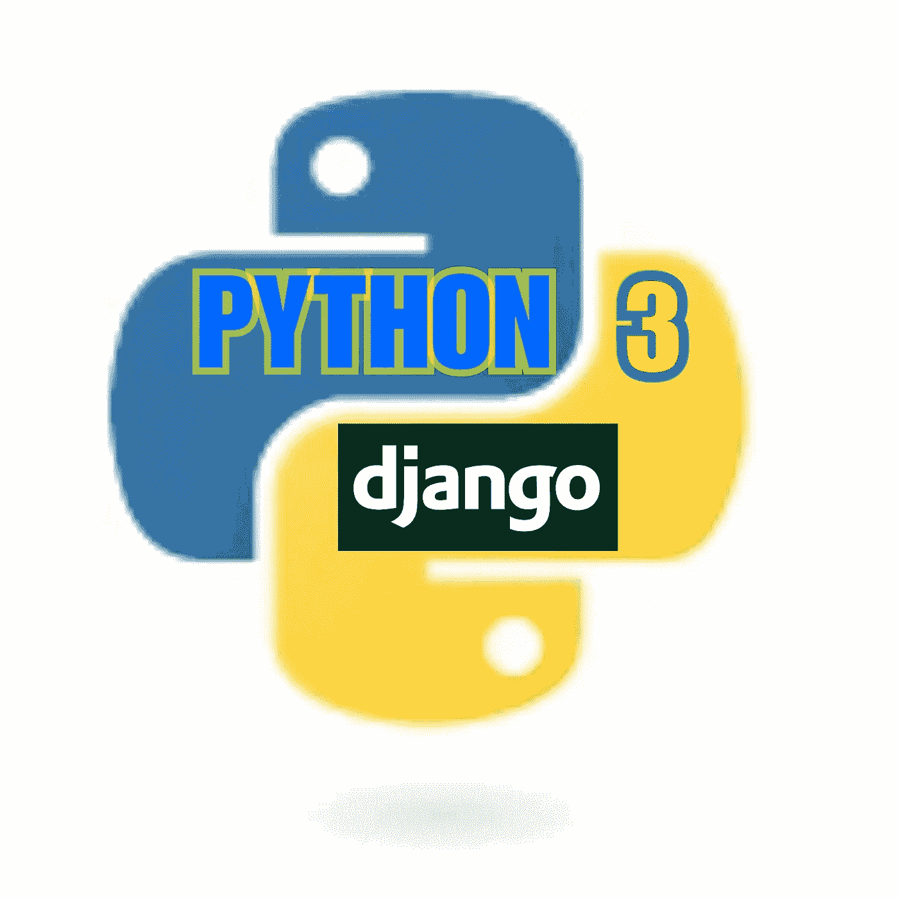

python.org/djangoproject.com

Django 是一个用 python 编写的丰富的 web 框架。Django 是一个免费的开源软件，它有能力创造奇迹。Django 速度很快，认真对待安全问题，扩展性极强。

Instagram 是使用 Django 框架的最多产的社交媒体应用之一。谷歌，使用 Django 的十大网络应用，你会对它的影响力感到惊讶。

## 功能

Django 项目是具有不同功能的不同应用程序的集合。

Django 允许我们将用户请求的 URL 映射到实际处理它的代码，还允许我们动态创建请求的 HTML。

通过使用模板，我们实际上可以将数据库中的计算值或信息注入到 HTML 页面中，以显示给用户。

所以我们要通过这个网络框架把所有的前端和后端连接起来。

# 装置

人们总是建议，当你学习新的东西并准备应用到你的系统中时，你应该更喜欢在“虚拟环境”中使用它。

然后，它会保护您的系统，因为新软件或应用程序或任何技术可能会以一种您现在可能不知道的方式造成损害。

一旦你完全理解它，你就可以忽略虚拟环境。

要在 Linux 中创建虚拟环境(python env ),我们需要:

```
python3 -m venv myenv
```

“myenv”是虚拟环境的名称，使用下面提到的两个命令之一来激活虚拟环境:

```
source myenv/bin/activate. myenv/bin/activate
```

现在要将 Django 安装到虚拟环境中，键入:

```
pip install django
```

你可以通过 Django 的[文档 https://docs.djangoproject.com/en/2.1/intro/install/](https://docs.djangoproject.com/en/2.1/intro/install/)来了解它的整个安装过程。

# 第一个项目

```
django-admin startproject mysite
```

上面的命令将启动一个新项目 *mysite* 。现在，在您的项目中，您有一个目录，它具有相同的名称 *mysite* 和 *managed.py* 文件，我们将在大部分时间使用该文件。

现在在 mysite 目录中，您将有 4 个文件:

1.  空白的 *__init__。py* 文件让 python 知道这个目录应该被当作一个 Python 包。
2.  一个 *settings.py* 文件，您可以在其中存储我们所有的项目设置。
3.  一个 *urls.py* 文件，用于保存项目的所有 URL 模式并关联应用程序的不同页面。
4.  一个 *wsgi.py* 文件作为 web 服务器网关接口，将在项目的后期帮助我们。

现在在命令行中使用 manage.py，如下所示，看看会发生什么:

```
python manage.py runserver
```

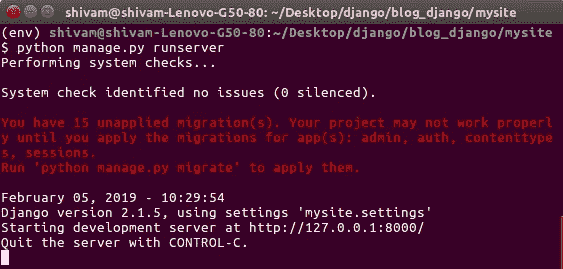

1\. Terminal

您将看到这种结果，现在可以忽略未应用迁移的警告。

我们将在项目的后期看到这一点。

将网址[*http://127 . 0 . 0 . 1:8000/*](http://127.0.0.1:8000/)复制并粘贴到您的网络浏览器中。

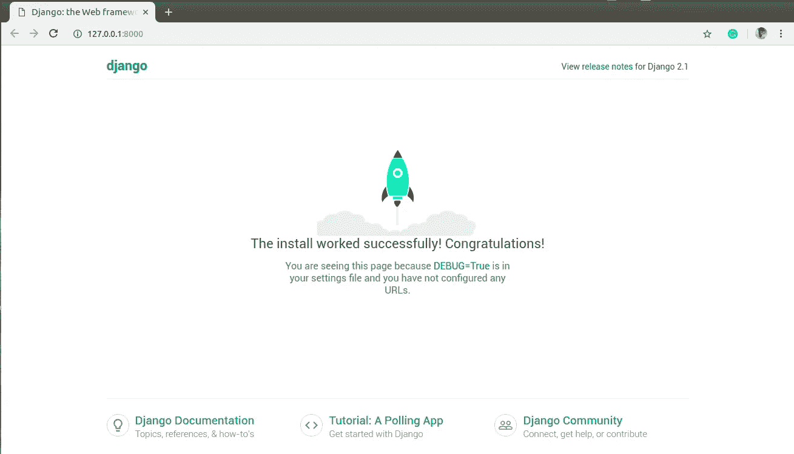

2\. The first web page

然后你可以看到你的第一个网页被本地托管在你的电脑上。恭喜你，你刚刚运行了你的第一个单个项目。

# 你的第一个应用

要在 Django 中启动一个新的应用程序，您需要输入以下命令:

```
python manage.py startapp my_app
```

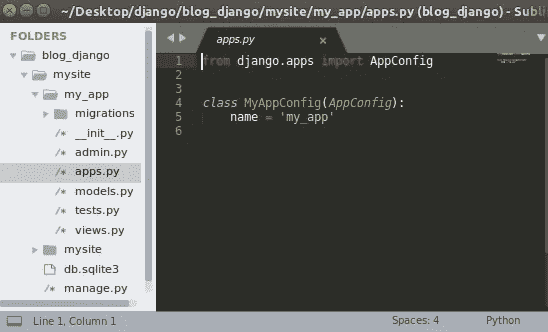

3\. Created app

在这里，您可以看到我们的 *my_app* 应用程序已经创建。

*my_app* 带有一些文件，如图 3 所示。

让我们看看这些文件是做什么用的。

1.  *__init__。py* 是空白脚本，由于它的名字，让 python 知道目录将被当作一个包。
2.  admin.py 是您注册模型的地方，以便在 Django 的管理界面中使用它们。
3.  *apps.py，*在这里我们可以放置应用程序的具体配置。
4.  *models.py* 是我们将要存储数据模型的地方，数据之间的实体和关系将被指定。
5.  *test.py* 文件用于保存不同的函数来测试我们自己的应用程序。
6.  *views.py* 处理请求并返回响应。
7.  *“迁移”*文件夹存储数据库及其与模型相关的特定信息。

## 创建视图并将其映射到 URL

你在 Django 中看到的一切都是像主页视图一样的视图，或者是详细视图，例如，当我们在 Instagram 中打开一个个人资料时，我们看到的是主页视图，当我们在该个人资料中打开一个特定的帖子时，我们看到的是详细视图。

要在 views.py 文件中创建一个视图，然后将其映射到 urls.py 文件，我们将创建一个视图，向我们显示编程世界中最丰富的语句，即“Hello World”。

现在打开 views.py，您会在那里找到第一个 import 语句。

我们需要输入下一个导入语句:

```
from django.http import HttpResponse
```


7\. views.py

现在我们将创建一个索引函数，它将接收一个请求并返回一个 HTTP 响应，如图 7 所示。

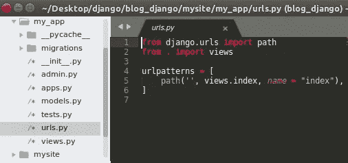

8\. my_app/urls.py

然后，我们必须在 my_app 中创建/打开 urls.py 文件，导入视图并映射视图，如图 8 所示。

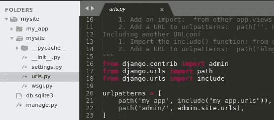

9\. mysite/urls.py

打开 mysite 中的 urls.py 文件，并执行图 9 所示的操作。

您还可以阅读在编辑器中添加视图和其他 URL 配置的说明。

由于 Django 是开源的，所以这个框架一直在发展。

如果您使用的是早期版本，那么我们使用了一些正则表达式来添加视图，但现在我们的做法有所不同。

再次运行“python manage.py runserver”来检查我们是否得到了“Hello WORLD”语句。

复制网址[*http://127 . 0 . 0 . 1:8000/my _ app*](http://127.0.0.1:8000/my_app)*运行到你的浏览器中。*

*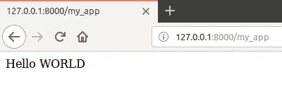*

*10\. Mozilla browser*

*如果你能看到显示的结果，那么恭喜你。如果出现错误，请检查您的 urls.py 文件，您可能没有正确编写 import 语句，或者在将方法添加到“urlpatterns”时出现语法错误。*

*总结整个过程:*

*1.在“my_app”的 *views.py* 文件中创建一个视图。*

*2.在“my_app”中创建一个 *urls.py* 文件，并将视图映射到此处，即“my_app/urls.py”。*

*3.打开“我的站点”中的 *urls.py* 文件，将“我的应用”的 URL 文件映射到这里，即“我的站点/urls.py”。*

*注意:不要混淆两个 *urls.py* 文件，因为一个属于 my_app，另一个属于 project mysite。*

# *模型*

*模型是我们数据的信息来源。它包含我们数据的行为方面和其他基本特征。*

*模型是为 Django 项目创建数据库的一种方式。每个模型都映射到一个数据库表，也就是说，每次你创建一个模型时，它都会映射到一个数据库表。*

*从现在开始，我们将致力于 Django 的[文档](https://docs.djangoproject.com/en/2.1/intro/)中给出的项目“投票”。所以首先浏览一下文档的第一部分，或者你可以用一个名为“polls”的应用程序重复上面的步骤。*

*SQLite 是默认数据库，如果您希望为您的项目使用更具可伸缩性的数据库，那么请安装正确的[数据库绑定](https://docs.djangoproject.com/en/2.1/topics/install/#database-installation)。*

*你可以在 settings.py 文件中查看你的默认数据库，应该是这样的:*

```
*DATABASES = {
    'default': {
        'ENGINE': 'django.db.backends.sqlite3',
        'NAME': os.path.join(BASE_DIR, 'db.sqlite3'),
    }
}*
```

*在 same settings.py 文件中，我们可以看到默认情况下常用的 INSTALLED_APPS:*

```
*INSTALLED_APPS = [
    'django.contrib.admin',
    'django.contrib.auth',
    'django.contrib.contenttypes',
    'django.contrib.sessions',
    'django.contrib.messages',
    'django.contrib.staticfiles',
]*
```

*其中一些应用程序至少使用一个数据库，因此要创建表，请运行以下命令:*

```
*python manage.py migrate*
```

*该命令将查看 INSTALLED_APPS，然后创建必要的表。可以在终端/命令行上看到它所应用的每个迁移的消息。*

# *创建模型*

*要创建模型，请访问 polls/models.py 文件并创建模型:*

*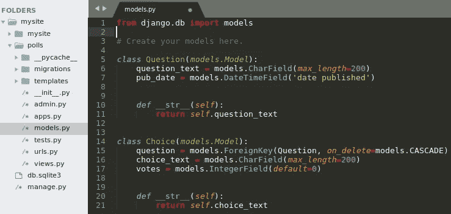*

*11\. polls/models.py*

*我们可以创建任意多的模型。这里我们创建了两个模型，每个模型都继承了 *models.Model.* 的特性*

*在这些模型中，每个字段用 [*字段*](https://docs.djangoproject.com/en/2.1/ref/models/fields/#django.db.models.Field) 类表示，例如 [*CharField*](https://docs.djangoproject.com/en/2.1/ref/models/fields/#django.db.models.CharField) 表示字符，[*datetime Field*](https://docs.djangoproject.com/en/2.1/ref/models/fields/#django.db.models.DateTimeField)*表示日期&时间。为了使系统更加友好，字段被命名为 question_text 和 pub_date，我们的数据库将它作为列名，我们将在 python 代码中使用它。**

**有一个由 [*外键*](https://docs.djangoproject.com/en/2.1/ref/models/fields/#django.db.models.ForeignKey) 定义的关系，它告诉每一个选择都与单个问题相关。**

**在处理交互提示时，为了方便起见，添加 __str__ 方法也很重要。**

## **激活模型**

**下一步是添加或安装我们的“投票”应用程序，为此，我们需要在 INSTALLED_APPS 中添加应用程序配置。应用配置可以在 *apps.py* 文件中看到。：**

```
**INSTALLED_APPS = [
    'django.contrib.admin',
    'django.contrib.auth',
    'django.contrib.contenttypes',
    'django.contrib.sessions',
    'django.contrib.messages',
    'django.contrib.staticfiles',
    'polls.apps.PollsConfig',
]**
```

**Django 现在知道要包含“polls”应用程序，所以在您的终端/命令行中运行命令:**

```
**python manage.py makemigrations polls**
```

**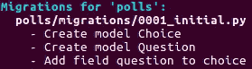**

**12\. Terminal**

**当我们运行 *makemigrations* 时，我们告诉 Django 我们已经添加了一个新模型或者对现有模型做了一些更改，或者两者都做。**

*   **它将创建一个数据库，并运行 SQL 语句，如创建此应用程序的表。**
*   **它将创建一个 Python 数据库访问 API 来访问问题和选择对象。**

**您还可以通过以下方式查看 SQL 表流程:**

```
**python manage.py sqlmigrate polls 0001**
```

**您将看到如下所示的类似内容:**

**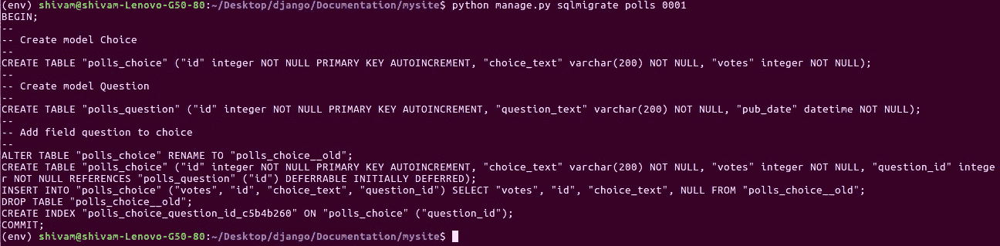**

**13\. Terminal**

**现在，我们将再次运行 migrate 命令，在数据库中创建这些模型表:**

```
**python manage.py migrate**
```

**您可以看到所有正在运行的操作和迁移:**

**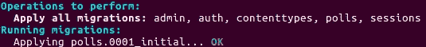**

**14\. Applying migrations**

**基本上，每当我们更改现有模型或添加新模型时，我们都必须*进行迁移*，然后*进行迁移。***

**为了查看对模型所做的更改，Django 给了我们免费的 API 来使用和调用 python shell 运行:**

```
**python manage.py shell**
```

**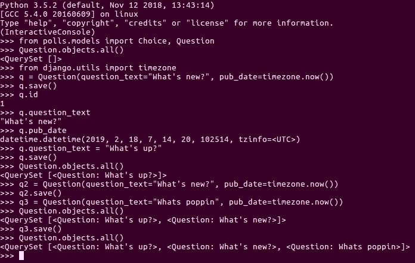**

**15\. Database API**

**因为我们在模型中给出了 __str__ 方法(图 11 ),所以当我们运行 Question.objects.all()时，我们会得到结果:**

```
**<QuerySet [<Question: What’s up?>, <Question: What’s new?>, <Question: Whats poppin>]>**
```

**如果你不给出 __str__ 方法，那么你会得到这样的结果:**

**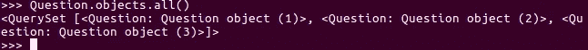**

**15.1 API**

**在 choice 模型中，我们首先添加三个 choice_text，然后删除一个。**

**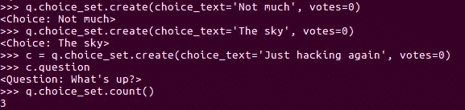**

**15.2 API**

**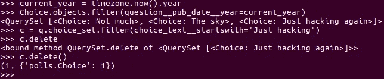**

**15.3 API**

**您可以跳过此 choice_model 添加过程，因为文档中没有提及。**

**要了解关于如何探索[数据库 API](https://docs.djangoproject.com/en/2.1/topics/db/queries/) 的更多信息，请检查文档，在继续之前，我们必须在图像中或在“[使用 API](https://docs.djangoproject.com/en/2.1/intro/tutorial02/#playing-with-the-api) 处选择退出准确的操作，否则在我们处理模板时，您将面临困难。**

# **管理员用户**

**为了避免为员工和客户添加、删除和更改内容而生成管理站点的繁琐工作，Django 自动创建管理界面模型。**

**因此，我们需要创建一个管理员用户。在您的终端/命令行中运行该命令:**

```
**python manage.py createsuperuser**
```

**它会问你三件事用户名，电子邮件地址和密码。**

**注意:请始终记住您的用户名和密码，否则您将无法登录，并且在这种情况下您无法检索用户名和密码。**

**让我们启动开发服务器并运行:**

```
**python manage.py runserver**
```

**现在，打开您的网络浏览器并加载[http://127 . 0 . 0 . 1:8000/admin/](http://127.0.0.1:8000/admin/)您将看到:**

**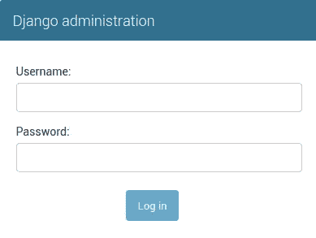**

**16\. Django-administration**

**输入您的用户名和密码，然后登录。登录后，您将看到两个可编辑的内容组和用户。**

**要查看我们创建的模型问题，我们必须将模型添加到 polls/admin.py，如下所示:**

```
**from django.contrib import adminfrom .models import Questionadmin.site.register(Question)**
```

**刷新网页以查看:**

**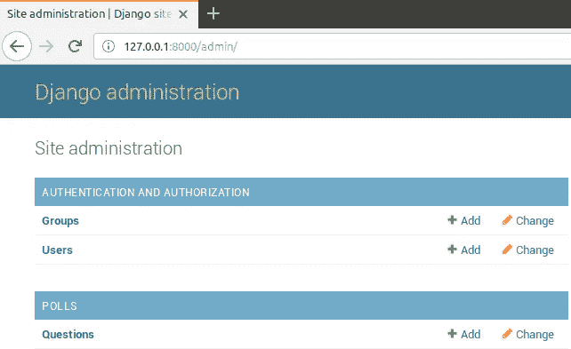**

**17\. Admin-page**

**在这里，你可以看到问题现在被添加，不要担心姜戈只是复数名称。**

**单击问题，您可以看到表格是根据问题模型自动生成的，您可以在这里编辑、添加和删除问题。**

# **模板**

**Django 中的一个模板用于标记和实现从 HTML 文件到 python 的各种逻辑。**

**有两种类型的模板:**

1.  **{{ variable }}用于不同的变量。**
2.  **它用于放置逻辑、循环和链接。**

**每当你调用模板，Django 寻找应用程序中的确切关键元素，所以首先在投票应用程序中创建模板文件夹，然后投票文件夹到模板，然后 index.html 文件到投票文件夹。**

****

**18\. sublime**

**不要搞混了，它会像 polls/templates/polls/index . html 一样。**

**当在同一个项目中创建更多的应用程序时，模板标记变得很乏味。**

**为了避免这种情况，我们创建了一个与模板中的投票同名的文件夹。现在，我们将创建更多视图，如列表和详细视图，我们将看到模板标记。**

**步骤 1:打开 Views.py 并编写以下代码:**

****

**19\. polls/views.py**

**在这里，我们创建了 4 个视图:索引、详细信息、结果和投票视图。**

**步骤 2:将视图添加到 polls/urls.py，如下所示:**

**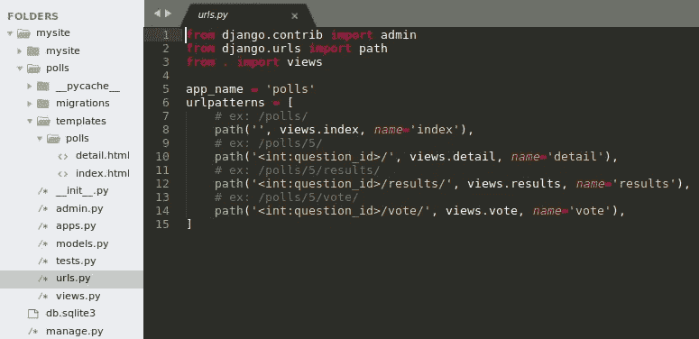**

**20\. polls/urls.py**

**这里，question_id 是从 views.py 文件中的相应函数中获取的。#语句说明了其他 URL 将如何工作，您也可以检查它:**

**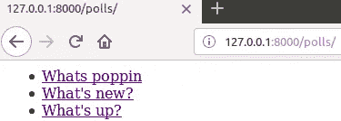**

**20.1 Browser**

**# ex:[http://127 . 0 . 0 . 1:8000/polls](http://127.0.0.1:8000/polls/2/vote/)/**

**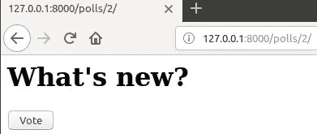**

**20.2 Browser**

**# ex:[http://127 . 0 . 0 . 1:8000/polls/2](http://127.0.0.1:8000/polls/2/vote/)/**

**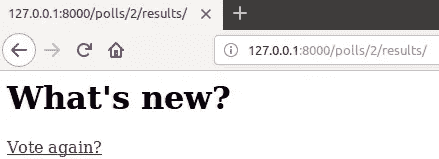**

**20.3 Browser**

**# ex:[http://127 . 0 . 0 . 1:8000/polls/2](http://127.0.0.1:8000/polls/2/vote/)/results/**

**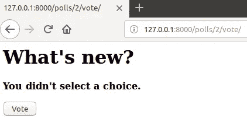**

**20.4 Browser**

**# ex:[http://127 . 0 . 0 . 1:8000/polls/2](http://127.0.0.1:8000/polls/2/vote/)/vote/**

**第三步:现在将 HTML 代码写入 index.html:**

**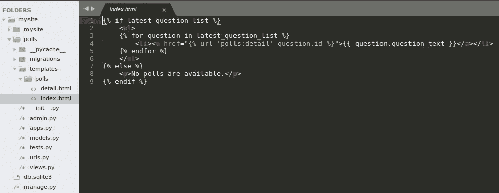**

**21\. polls/templates/polls/index.html**

**第四步:现在把这个写详细点。**

```
**{{ question }}**
```

**它暂时会起作用。**

**因此，我们已经看到了如何创建视图、创建模型和使用模板。我们还使用了 Django 提供的免费 API。**

**要阅读和了解关于 Django 的更多信息，请阅读其文档[。](https://docs.djangoproject.com/en/2.1/intro/)**

**如果你想通过视频教程学习，那么可以查看 youtube 频道“[聪明的程序员](https://www.youtube.com/channel/UCqrILQNl5Ed9Dz6CGMyvMTQ)和他的播放列表名称“ [Python Django 教程 2018 初学者](https://www.youtube.com/playlist?list=PL-J2q3Ga50oOpni_xS2PPUe4mf9lM96dD)”。**

**对于一个不同的项目检查"[sendex](https://www.youtube.com/playlist?list=PLQVvvaa0QuDe9nqlirjacLkBYdgc2inh3)" YouTube 频道。**

**有时你可能不理解文档，因为它是以标准的方式编写的，所以我建议你阅读“ [Django for 初学者](https://djangoforbeginners.com/)”。它一步一步地教 Django，并有各种项目可以练习。**

**如果你是 python 的绝对初学者，那么请阅读 Kushal Das 写的“[python for you me](https://pymbook.readthedocs.io/en/latest/)”。它将教会你作为 python 初学者所需要的一切。**

**要了解 python 中更多有趣的东西，请阅读“[用 Python 自动化枯燥的东西](https://automatetheboringstuff.com/)”。**

**如果您对本教程有任何问题或疑问，请在 Twitter[twitter.com/softwareartist_](https://twitter.com/softwareartist_)或 Telegram[@ shivam _ software artist](https://t.me/shivam_softwareartist)上评论或 ping 我。**

**快乐编码🙂🙂**