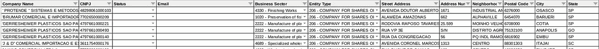

# 面向商业的 Python:挖掘潜在客户的数据

> 原文：<https://medium.datadriveninvestor.com/python-for-business-data-mining-for-lead-generation-9c7c94cbcdd4?source=collection_archive---------6----------------------->

拿起你的鹤嘴锄，因为我们将要探索一些数据

Photo credit: [pixel2013](https://pixabay.com/users/pixel2013-2364555/) | Pixabay

# 介绍

在开始编写代码之前，理解程序要完成什么是很重要的。这篇文章采用了一组特定的(业务)目标，并使用 Python 来实现期望的结果。如果用例看起来很窄，扩展你的思维，你将能够把概念应用到你自己的需求中，相应地调整代码。

不用说，这个帖子仅仅是为了**教育目的**。源代码可以在文章末尾找到，你可以自由使用，但风险自负。

## 目标

让我们假设我们的公司需要为一个特定的市场收集信息并产生销售线索。在这种情况下，我们公司有兴趣收集在巴西 *注册的**进口公司的数据。***

*如果你想更深入的了解进口是，参考* [*这篇文章*](https://bizfluent.com/how-does-4585961-importing-work.html) *。*

我们能够得到进口商的目标名单(解释如下)，但数据是不完整的。在这篇文章中，我们使用数据挖掘策略来收集关于目标的更多信息，并创建具体的线索。

目标列表提供了一些关于进口公司的唯一标识，如名称、CNPJ(税务 ID)和地址。在这篇文章的后面部分，我们来看看几个在线资源，为你提供更多关于这些公司的信息。某些网站允许您搜索 CNPJ 信息，搜索结果有时会包含联系信息。

**CNPJ 搜索网站**

 [## CNPJ 咨询公司

### CNPJ 和萨伊巴·贾阿巴西企业质量状况咨询公司。格拉萨…

consultacnpj.info](https://consultacnpj.info/)  [## ✅咨询公司→国家地籍局

### CNPJ 或中央公积金在线地籍调查咨询

consultarcnpj.com.br](https://consultarcnpj.com.br/)  [## www.cnpj.world - CNPJ，telefone e endereo de empresas brasileiras

### busca inteligente 服务公司利用 busca Campo 为企业提供服务。公司名称是什么？

www.cnpj.world](https://www.cnpj.world/)  [## CNPJ 地籍咨询公司

### CNPJ 于 1998 年 7 月 1 日颁布了第 27/1998 号规范性文件，以促进发展

consultacnpj .免费](https://consultacnpj.gratis/)  [## CNPJ 咨询公司

### 为客户提供实时的信息、服务和新的机会…

consultacnpj.com](https://consultacnpj.com/) 

## 要求

*   Python 的一般知识
*   Python 版本 3.6 以上
*   一个 [Google Cloud Console](https://cloud.google.com) 账户(以及启用了 [Google Sheets API](https://developers.google.com/sheets/api) 的活动项目)
*   一个 [NordVPN](https://nordvpn.com) 账户

## 部分

我们将使用几个不同的库/第三方应用程序。为了清楚起见，每个库/应用程序的指南都被分成单独的部分。

*   第 1 部分—简介
    您目前正在阅读这一部分。
*   [第 2 部分— NordVPN](https://medium.com/@eduardogdc.py/python-for-business-data-mining-for-lead-generation-nordvpn-90d27ef4f24f)
    通过使用 VPN 和随机服务器来保护您的 IP 身份，以避免被标记。
*   第 3 部分——Google Sheets
    将您的数据存储在 Google Sheets 上，并使用 API 进行更新
*   第 4 部分—请求
    使用 Python 的请求库从 web 中挖掘信息

Photo credit: [cegoh](https://pixabay.com/users/cegoh-94852/) | Pixabay

# 从哪里开始？

我们知道我们要瞄准什么样的公司，但是他们(具体)是谁？处理进出口服务的各方在当地政府进行了某种形式的注册。巴西也不例外。在网上快速搜索会把你带到巴西经济部的网页。令人惊讶的是，他们公布了从 1997 年开始的进口商(和出口商)的数据。你可以在这里找到数据[。数据每月更新，所以我们将从 2018 年开始使用该集。您需要使用报告的第二个选项卡(进口商)。](http://www.mdic.gov.br/comercio-exterior/estatisticas-de-comercio-exterior/empresas-brasileiras-exportadoras-e-importadoras)

该报告提供了公司名称、税号、地址和业务部门，但缺少我们真正感兴趣的内容:联系信息或网站。没问题！这就是这篇文章的主旨:使用 Python 挖掘数据。

让我们将数据复制并粘贴到 Google Sheet 中，这样我们就可以通过 API 访问它(在后面的步骤中)。如果你不懂葡萄牙语，不要害怕。我翻译了下面的列标题:

CNPJ —税务 ID(您可以将它视为公司的唯一标识符)

Empresa —公司名称

Endereco —街道地址

Numero —地址号码(巴西地址通常与街道地址分开)

Bairro —邻近地区

CEP —邮政编码

municipio——市

UF —州

CNAE 初级——经济活动的主要国家分类(等同于工业/商业部门)

nature za Juridica——法律性质

您的 Google 表单应该类似于下图。我还为**状态**和**电子邮件**添加了一个专栏(我们将在后面的章节中介绍)。我们还没有任何电子邮件联系人。

Data pasted to Google Sheet

## 翻译

**业务部门**和**实体类型**是我们稍后将在条件逻辑中使用的列。因为我们的节目将会用英语写，所以最好把这些专栏从葡萄牙语翻译过来。我已经在 Github 上发布了[商业部门(cnae_codes.txt)](https://github.com/rocketmovingapp/companyminer/blob/master/src/translations/cnae.txt) 和[实体类型(legal_nature.txt)](https://github.com/rocketmovingapp/companyminer/blob/master/src/translations/legal_nature.txt) 的英文翻译，所以你所要做的就是在 Google Sheets 上使用`Find and Replace`来交换值。

## 下一步是什么？

清理和格式化数据可能看起来很无聊，但是现在花时间组织事情可以防止你以后碰壁。

在下一节中，我们将深入研究代码并使用 NordVPN。

[**点击这里进入下一部分:NordVPN**](https://medium.com/@eduardogdc.py/python-for-business-data-mining-for-lead-generation-nordvpn-90d27ef4f24f)

 [## 替代数据分析-遥感度量金属信号|数据驱动的投资者

### 替代数据现在被誉为新的石油。这些数据集提供了独特而及时的市场和…

www.datadriveninvestor.com](https://www.datadriveninvestor.com/2019/09/19/rs-metrics-metalsignals-data-analysis/)