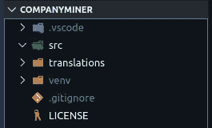
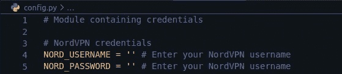
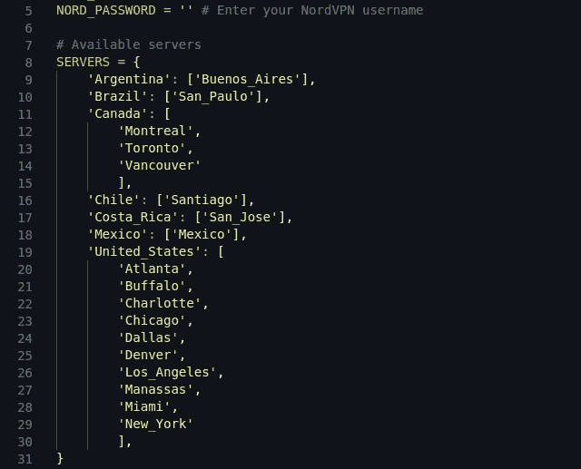
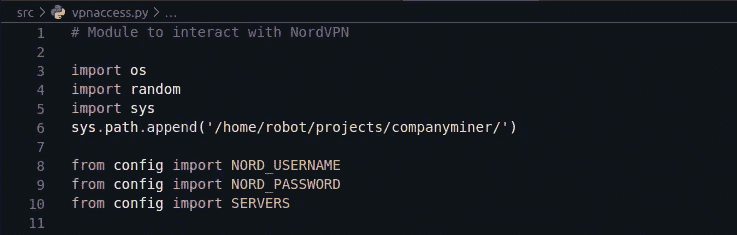
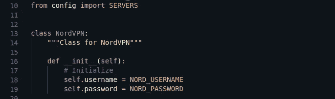
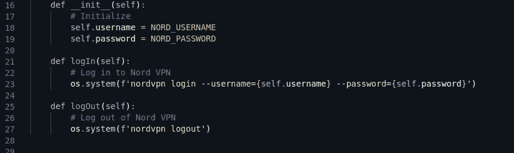
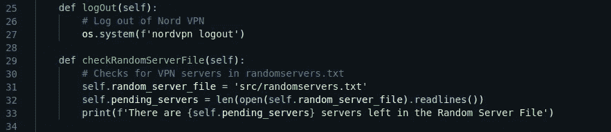
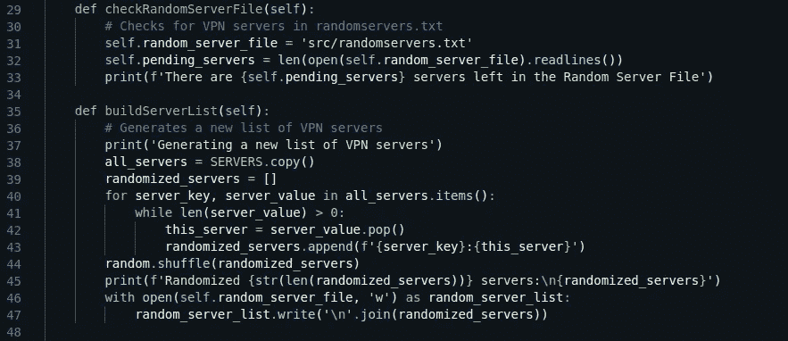
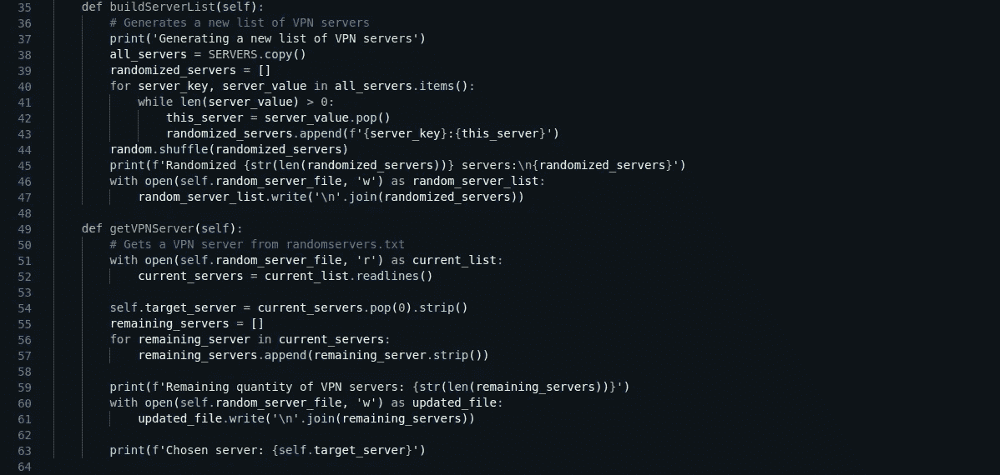
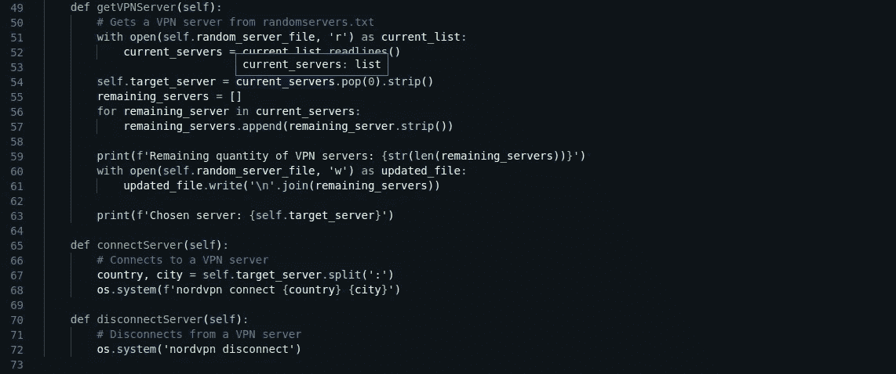

# Python for Business:用于潜在客户挖掘的数据挖掘— NordVPN

> 原文：<https://medium.datadriveninvestor.com/python-for-business-data-mining-for-lead-generation-nordvpn-90d27ef4f24f?source=collection_archive---------1----------------------->

安全连接后的地雷


Photo credit: [Madskip](https://pixabay.com/users/madskip-11782809/) | Pixabay

[上一节](https://medium.com/@eduardogdc.py/python-for-business-data-mining-for-lead-generation-9c7c94cbcdd4)概述了这篇文章旨在解决的商业目标。我们下载了一份在巴西注册的进口公司名单，并将数据添加到谷歌表单中。在我们开始数据挖掘之前，确保我们的连接是安全的是很重要的！

# NordVPN

你需要一个 nord VPN[的有效账户才能使用他们的服务。NordVPN 最吸引人的特性之一是它的无日志策略。他们不会跟踪、收集或共享您的私人数据！](https://nordvpn.com/)

我们将介绍如何从 Python 脚本连接到 NordVPN，但是为了这样做，您需要在您的机器上安装它。您可以查看[下载 NordVPN for Linux](https://nordvpn.com/download/linux/) 页面以及[安装说明](https://support.nordvpn.com/FAQ/Setup-tutorials/1182453582/Installing-and-using-NordVPN-on-Linux.htm)了解更多信息。

## 项目结构

现在您已经准备好开始编码了！为您的项目创建一个目录。我们将我们的目录命名为:`companyminer`。在`companyminder`内制作`src`目录。这是我们存储程序不同模块的地方。

如果你使用一个虚拟环境，确保把它添加到`companyminer`目录中。

在 Python 3 上，您可以使用以下命令来创建`src`和一个虚拟环境

```
cd companyminer
mkdir src
python3 -m venv venv
```

你的结构应该看起来像下图。



Project structure

**注意:图像中有一些文件/文件夹可能不适用**

1.  。vscode —由 Visual Studio 代码自动创建
2.  翻译—包含 cnae.text 和 legal_nature.txt 文件的文件夹
3.  。gitignore —忽略推送到 Github 的文件
4.  许可证 Github 的许可证文件

# 配置文件

登录 NordVPN 需要您输入用户名和密码。我们将凭证存储在一个 Python 文件中，并使用我们的 Python 脚本将变量发送到 shell，而不必每次都手动输入。NordVPN 的另一个很酷的特性是它可以让你选择特定国家和城市的服务器。我们将创建的函数之一包括从选项列表中选择一个国家/城市组合。我们希望将选项限制在选定的服务器范围内，这些服务器也将存储在一个 Python 文件中。

## NordVPN 凭据

将您的登录凭证添加到主目录`companyminer`中的`config.py`文件中。最佳实践原则规定，您应该将包含凭证的任何文件保存在您的`src`目录之外。如果您使用的是 Linux，您可以使用`touch`命令(仍然在`companyminer`中)来创建您的`config.py`文件。

```
touch config.py
```

在`config.py`中添加变量`NORD_USERNAME`和`NORD_PASSWORD`来存储您的 NordVPN 凭证。



companyminer/config.py

## NordVPN 服务器

从互联网上挖掘数据信息涉及到向不同的 web 服务器发出 HTTP 请求，通常是大量的请求。温和的方法经常被推荐，这样你的 IP 就不会被标记。当您有大量的请求要执行时，这就带来了复杂性。一种策略是使用虚拟专用网来保护您的连接，并使用来自 VPN 提供商的不同服务器。将请求分布在多个 IP 上可以减少被主机服务器阻塞的可能性。

我们已经决定选择一系列国家的 NordVPN 服务器。查看 [NordVPN 服务器页面](https://nordvpn.com/servers/)查看其服务器所在的所有国家。

我们选择的国家:

*   阿根廷
*   巴西
*   加拿大
*   辣椒
*   哥斯达黎加
*   墨西哥
*   美国

返回到`config.py`文件并创建一个字典来保存各种服务器选项。字典键包含国家名称，字典值包含国家的城市列表。

要查看一个国家/地区内可用的城市，请打开终端并输入以下命令(在您登录 NordVPN 后):

```
nordvpn <country> cities
```

*将<国家>替换为您想要搜索的国家的名称。*

您的`config.py`文件应该类似于下图。字典`SERVER`保存代表服务器选项的键和值。



companyminer/config.py

# NordVPN 类

有了凭证和服务器选项，我们现在可以继续创建`NordVPN`类，它将包含用于与 VPN 交互的方法。导航到`src`目录并创建`vpnaccess.py`文件。

```
cd src
touch vpnaccess.py
```

打开`vpnaccess.py`并将所需的导入语句添加到文件的顶部。`os`模块用于运行 shell 命令，如`nordvpn login`和`nordvpn connect`。从列表中随机选择(服务器)项目意味着我们需要导入 Python 的`random`模块。记住`vpnaccess.py`和`config.py`在不同的目录位置。为了能够访问`config.py`中的变量，我们应该将它的目录位置附加到系统路径中。导入`sys`会引入模块，而命令`sys.path.append(<path to directory>)`会将目录附加到路径中。

现在可以从`config`导入`NORD_USERNAME`、`NORD_PASSWORD`和`SERVERS`。



companyminer/src/vpnaccess.py

## NordVPN 方法

在接下来的步骤中，您将创建`NordVPN`类及其方法。每种方法都应该执行特定的任务。避免将几个过程塞进同一个方法中。你的代码会更简单易懂。

从高层次的角度来看，这些是我们希望我们的`NordVPN`类处理的任务:

*   登录
*   注销
*   从`SERVERS`变量中获取一个随机 VPN 服务器
*   连接到服务器
*   断开与服务器的连接

这个列表没有任何特定的顺序。

## 初始化

继续使用`vpnaccess.py`文件，为`NordVPN`创建一个类，并添加一个`__init__()`方法来初始化它。将`self.username`和`self.password`设置为从`config`导入的`NORD_USERNAME`和`NORD_PASSWORD`变量。



Initialize the NordVPN class

## 登录和注销 NordVPN

从命令行登录 NordVPN 会提示输入用户名/电子邮件和密码。创建一个`logIn()`方法来启动一个 shell 命令并传递 NordVPN 凭证。`--username`和`--password`命令使您能够向终端传递凭证。

添加一个`logOut()`方法注销 NordVPN。这避免了在程序运行结束后手动注销的需要。

因为我们使用的是 Python 3.6.8，所以我们可以使用`f-strings`将变量放在`{ }`花括号中直接传递到字符串中！



NordVPN logIn() and logOut() methods

## 连接到不同的 VPN 服务器

在本文的后面部分，我们将创建一个 cron 作业，在每天不同的时间运行该程序。如果我们打算在不同的 VPN 服务器之间连接和切换，那么我们需要某种记录来知道哪些 VPN 服务器我们已经使用过，哪些没有使用过。这避免了必须为每个 HTTP 请求使用相同的 VPN 服务器，并降低了被阻止的机会。

用这个信息维护一个简单的文本文件应该就可以了。创建一个`checkRandomServerFile()`方法来搜索名为`randomservers.txt`的文本文件。该方法使用`.readlines()`来计算文件中文本的行数。每行文本代表一个我们可以连接的 VPN 服务器。该方法将文本文件中 VPN 服务器的数量分配给`self.pending_servers`变量。



NordVPN checkRandomServerFile() method

导航到`src`目录并创建一个空的`randomservers.txt`文件。这是`checkRandomServerFile()`方法将要读取的文本文件。


randomservers.txt

`randomservers.txt`文件存在于您的程序中，但它是空的。创建一个`buildServerList()`方法来生成 VPN 服务器的列表，并将列表写入`randomservers.txt`文件。

用`.copy()`创建一个`SERVERS`的副本，并将结果分配给`all_servers`。这允许你操作`all_servers`中的数据，而不是触摸我们定义为常量的`SERVERS`。给`randomized_servers`分配一个空列表。由于`all_servers`是一个字典，您可以使用`.items()`来遍历键、值对。每个键的值是一个城市列表。您想要遍历`server_value`列表中的每一项，将当前项弹出到`this_server`变量。每次迭代都将一个字符串元素追加到`randomized_servers`列表中。我们有意在`server_key`和`this_server`之间添加一个`:`字符。这给了我们一个可识别的字符，我们可以在其他方法中使用它将字符串分成 *Country* 和 *City* 字符串。

`while`循环继续迭代，直到`server_value`中没有剩余的项目。`randomized_servers`中的条目应该与它们在原始`SERVERS`字典中出现的顺序相同。使用`random.shuffle(randomized_servers)`将列表随机排序。

`with open(self.random_server_file, 'w') as random_server_list:`行代码以写模式打开`randomservers.txt`文件并将其赋给`random_server_list`变量，并在完成`with open()`语句后关闭文件。使用`'\n'.join(randomized_servers)`将`randomized_servers`中的每个项目作为一行写入文本文件。



NordVPN buildServerList() method

## 获取 VPN 服务器并更新剩余服务器的列表

现在您需要创建一个方法，从`randomservers.txt`文件中获取一个 VPN 服务器，并从文本文件中移除该 VPN 服务器。这个方法会处理这个问题。

使用`with open()`语句中的`'r'`以只读模式打开文本文件。将`randomservers.txt`的内容读入变量`current_servers`。将列表中的第一项弹出到`self.target_server`中，这样您就能够从您将在接下来的步骤中创建的方法中调用它。变量`self.target_server`保存我们打算连接的 VPN 服务器。将`.strip()`加到`.pop()`上确保我们不会拾取任何可能逗留的`'\n'`。

将`remaining_servers`创建为空列表。一个`for`循环遍历`current_servers`列表中剩余的每一项，并在去除任何前导或尾随空白后将其附加到`remaining_servers`。`remaining_servers`列表包含移除`self.target_server`后剩余的所有 VPN 服务器。

再次使用`with open()`打开`randomservers.txt`并将模式设置为`'w'`，这样脚本就可以写入文件。在这种情况下，您有意用更新的 VPN 服务器列表覆盖现有数据。



NordVPN getVPNServer() method

## 从 NordVPN 连接和断开

您将添加的最后两种方法使您能够连接和断开 NordVPN。我们将登录和注销从连接和断开中分离出来，这样您就能够独立于连接到服务器进行登录。这意味着您的程序可以在整个程序会话期间保持登录状态，并与各种服务器连接或断开连接。

创建一个`connectServer()`方法。因为我们已经将`target_server`设置为`self`，所以我们可以在这个方法中调用它。使用`.split(':')`将字符串拆分成一个列表。因为我们知道列表总是只包含两个项目，所以我们可以通过使用`country, city = self.target_server.split(':')`来解包*国家*和*城市*数据。

使用`os.system()`向终端发送命令。对于实际的命令，使用一个`f-string`来传入文本`nordvpn connect`，后跟花括号`{ }`内的`country`和`city`变量。

从 NordVPN 断开甚至更容易。创建一个`disconnectServer()`方法，并简单地将`nordvpn disconnect`作为文本传递给`os.system()`命令。



NordVPN connectServer() and disconnectServer() methods

# 下一步是什么？

有了`NordVPN`类，我们可以继续创建一个处理 Google Sheets 的类。我们需要从 Google Sheets 中读取数据，并使用这些数据发出 HTTP 请求。

**点击这里进入下一部分:谷歌工作表**