# Python 机器学习数据清理

> 原文：<https://medium.datadriveninvestor.com/python-machine-learning-data-clean-up-2d2a40f0374d?source=collection_archive---------1----------------------->

*了解清理数据的不同方法*

*现在我们已经理解了数据，可视化了数据，让我们清理数据，以便我们为使用不同的机器学习算法做好准备。*

了解数据参考我的帖子—[https://medium . com/@ arshren/machine-learning-understand-data-dfef 261d 833 b](https://medium.com/@arshren/machine-learning-understanding-data-dfef261d833b)

关于数据可视化，请参考我的帖子—[https://medium.com/@arshren/data-visualization-5b1dc260c91a](https://medium.com/@arshren/data-visualization-5b1dc260c91a)

用于数据清理的 python 代码-[https://github . com/ar shren/machine learning/blob/master/Python % 20-% 20 cleaning % 20 the % 20 data . ipynb](https://github.com/arshren/MachineLearning/blob/master/Python%20-%20Cleaning%20the%20data.ipynb)

理解、可视化和清理数据是我们在理解不同机器学习算法的同时需要掌握的最基本的步骤。

在本帖中，我们将了解

*   从数据集中删除重复条目
*   去除不相关的观察
*   处理缺失数据

我们将采用不同的数据集来学习清理数据的不同方法

# 从数据集中删除重复条目

我们将首先导入所需的库——pandas 和 numpy

```
import numpy as np
import pandas as pd
```

我们将创建一个具有重复值的 dataframe，然后看看如何删除重复条目

```
df = pd.DataFrame({"Name":["Jack", "Jill", "John", "Jack"], "Rank":[1,21,3,1], "Marks":[99,56,97,99]})
df
```

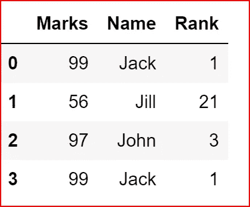

df dataframe with duplicate entries

现在，让我们删除重复条目，保留第一个实例，并删除任何其他重复条目

```
df.drop_duplicates(keep='first')
```

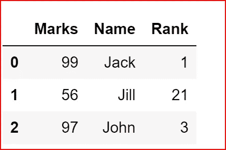

removing duplicate rows and just keeping the first occurence

删除重复行的任何实例

```
df.drop_duplicates(keep=False)
```

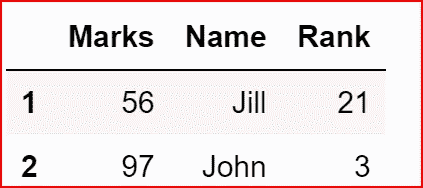

removing any duplicate rows and keeping only unique rows

默认情况下，Inplace 为 false，这意味着原始数据集保持不变，因此，如果我们再次打印 df，我们会看到所有行

```
df
```

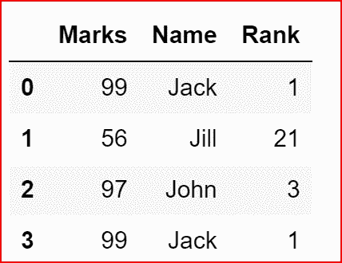

df is same again as inplace is False by default

```
df.drop_duplicates(keep='first', inplace=True)
df
```

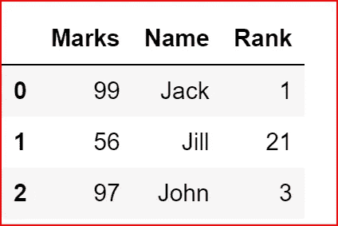

df is now changed as inplace was set to true and only first instance of duplicate row was kept

# 去除不相关的观察

*泰坦尼克号的数据集在这里可以得到*-[https://www.kaggle.com/c/titanic](https://www.kaggle.com/c/titanic)

我们现在将从下载的数据集中读取数据。我们将使用训练数据集 train.csv。

关于**从不同格式的文件读取和写入不同格式的文件的更多细节**请关注我的帖子—[https://medium . com/@ arshren/python-read-and-write-data-from-files-d3b 70441416 e](https://medium.com/@arshren/python-reading-and-writing-data-from-files-d3b70441416e)

要想很好的理解数据，参考我的帖子-[https://medium . com/@ arshren/machine-learning-understanding-data-dfef 261d 833 b](https://medium.com/@arshren/machine-learning-understanding-data-dfef261d833b)

我已经将数据集下载到了默认的 jupyter 文件夹中

```
data_set = pd.read_csv("train.csv")
```

让我们通过打印数据集中的 3 行来查看数据集的所有特性

```
data_set.head(3)
```

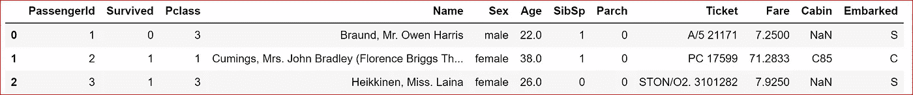

head(3) display first three rows from the dataset

在数据集中，数据帧名称和机票似乎不相关，似乎对我们预测乘客生存机会的分析没有帮助，因此我们删除了该列

```
data_set.drop(['Name', 'Ticket'], inplace=True, axis=1)
data_set.head(3)
```

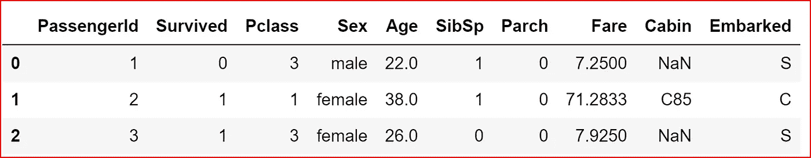

dropped columns Name and Ticket

# 处理缺失数据

**删除包含缺失值的行**

我们可以通过使用 **dropna()删除包含 null 或缺失数据的行。**如果我们将 inplace 设置为 True，那么原始数据集将被修改

```
data_set.dropna(inplace = True)
data_set.head(3)
```

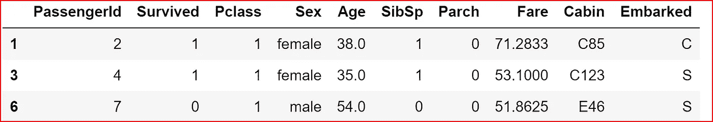

Row 0 and Row 2 are dropped as they has Nan Values

总是删除包含任何空值的行可能不是一个好策略，因为我们可能会忽略数据集的随机性

*那么，处理缺失值的下一个最佳选择是什么呢？*

**为一行中的空值设置阈值**

我们可以设置一个阈值计数，如果一行超过了空值的阈值计数，那么我们可以删除该行。

只有当一行包含 2 个或更多的 null 值时，我们才会从 data_1 中删除一行，所以我们应该只删除行 0，保留行 2 和行 3。

如果我们此时打印 data_1，由于 inplace 默认为 False，data_1 数据帧保持不变。

```
data_1
```

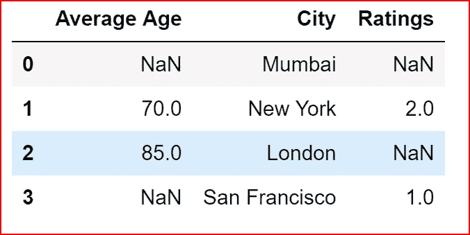

data_1

```
data_1.dropna(thresh=2)
```

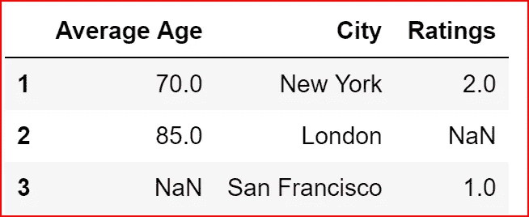

dropping data based on threshold count

*如果我不想删除任何缺少数据的行，而是用更有意义的值填充它，该怎么办？*

**用值**填充缺失数据

我们可以用一些有意义的值来填充缺失的数据，如平均值、中值或列中最常见的值。

**其中一个方法是使用 fillna()** 通过指定我们想要如何填充空值或缺失值。

在下面的例子中，我们通过取平均值来填充“评级”栏中缺失的值

```
 data_1['Ratings'].fillna(data_1['Ratings'].mean(), inplace = True)
data_1
```

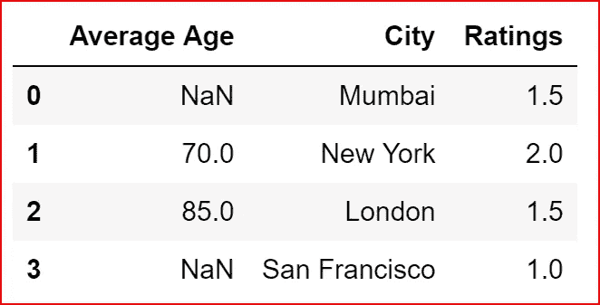

Ratings missing values are filled by mean of the Ratings column

在下面的例子中，我们用“平均年龄”列的中位数 77.5 来填充“平均年龄”列

```
data_1['Average Age'].fillna(data_1['Average Age'].median(), inplace = True)
data_1
```

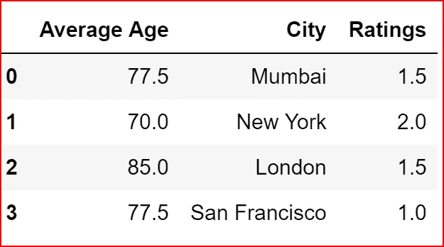

filling missing values in Average Age column with median of the column

**为列输入带有平均值、中间值或最常用值的缺失数据**

对于输入，我们需要从 sklearn.preprocessing 库导入输入器

```
from sklearn.preprocessing import Imputer
```

我们将创建一个新的数据框架 data_1 来显示估算类的用法

```
countryData = pd.DataFrame({"Country":["France","Spain", "Germany", "USA"], "Age":[np.nan,45,np.nan,32], "Salary":[np.nan,90000,np.nan,75000]})countryData
```

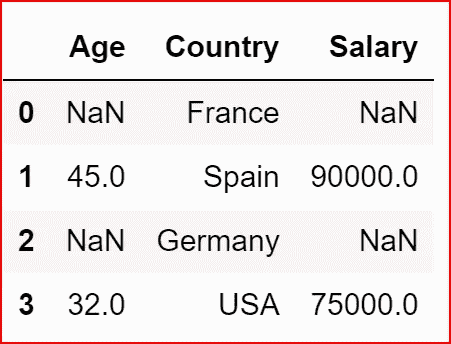

countryData

我们将创建一个估算对象，并设置一个处理缺失值的策略。

可用不同策略有**均值、中值和最频繁**

然后，我们将 imputter 对象放在希望处理缺失值的列上

拟合数据后，我们转换数据帧中的数据

```
imp = Imputer(missing_values='NaN', strategy='mean', axis=0)imp.fit(countryData.iloc[:,[0,2]])countryData.iloc[:,[0,2]]=imp.transform(countryData.iloc[:,[0,2]])countryData
```

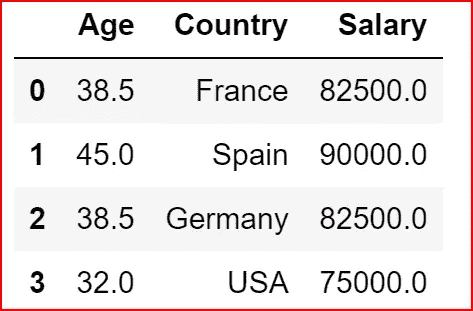

Imputing the missing data with mean values for the columns Age and Salary

**使用替换方法**

如果我们想用另一个值替换数据帧中的一个值，那么我们可以使用 replace 方法。

我们将使用相同的数据框架国家数据

```
countryData = pd.DataFrame({"Country":["France","Spain", "Germany", "USA"], "Age":[np.nan,45,np.nan,32], "Salary":[np.nan,90000,np.nan,75000]})countryData
```


countryData

我们将用 40 代替年龄栏的 NaN 值

```
countryData.replace({'Age':np.NAN},40 )
```

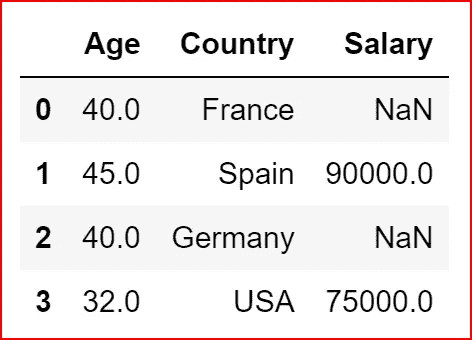

replacing NaN in Age column with a value of 40