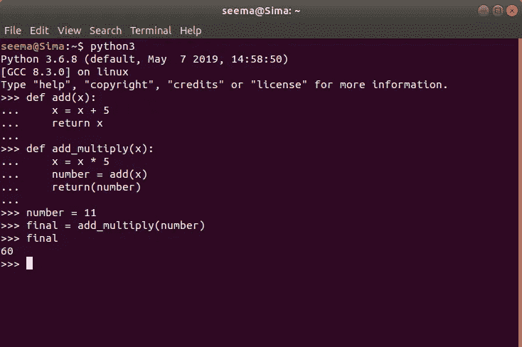
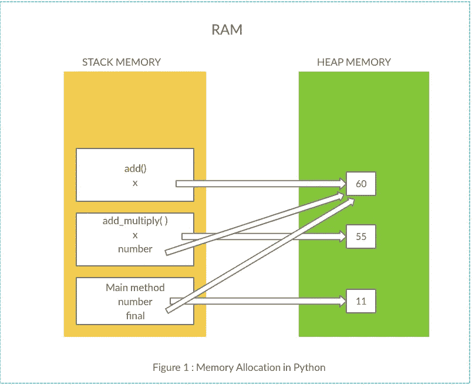

# Python 内存管理

> 原文：<https://medium.datadriveninvestor.com/python-memory-management-3cc903fd4fc1?source=collection_archive---------3----------------------->

> 你有没有想过为什么内存管理很重要？

嗯，记忆就像是把所有发生的事情储存在我们的大脑里。同样，数据保存在计算机的机器大脑中。如果失去了记忆，我们将无法记起，我们不得不问自己的存在。

首先，如果内存管理不当会发生什么？我猜想会有内存泄漏，这意味着不再需要的对象或分配的内存仍然存在。它会使系统变慢。了解内存管理可以帮助我们编写高效的代码，更熟悉如何解决问题、排除故障和调试。

在 Python 中，一切都是对象。它描述了一切都有属性和方法。它可以被子类化(继承)，赋值给一个变量，并作为一个参数传递给一个函数。

我们需要考虑的两个前提是:

1.  基本 Python 对象的大小。
2.  Python 内部是如何管理内存的？

Python 代码被转换成字节码，字节码是以更易于机器阅读的格式编写的指令。我记得。pyc 或 __pycache__ 文件夹，包括在。gitignore 文件。我不知道为什么它和我的 python 项目一起被创建。实际意图是缓存字节码，以便更快地执行代码。

[](https://www.datadriveninvestor.com/2019/02/21/best-coding-languages-to-learn-in-2019/) [## 2019 年最值得学习的编码语言|数据驱动的投资者

### 在我读大学的那几年，我跳过了很多次夜游去学习 Java，希望有一天它能帮助我在…

www.datadriveninvestor.com](https://www.datadriveninvestor.com/2019/02/21/best-coding-languages-to-learn-in-2019/) 

Python 解释器接收它的执行份额。分配多少内存取决于 python 版本、平台和环境设置。

通过导入 sys 模块，我们可以很容易地得到对象的大小。例如，在运行 python 3.6.8 的 64 位版本的情况下:

要以字节为单位获取对象的大小:

```
>>> import sys
>>> sys.getsizeof({})
240
>>> sys.getsizeof([])
64
>>> string = "Seema"
>>> sys.getsizeof(string)
54
```

类似地，我们可以使用 id()来检查对象的身份。这里，I 是引用变量，10 是对象。

```
>>> i = 10
>>> j = 10
>>> id(i)
10914784
>>> id(j)
10914784
>>> id(i) == id(j)
True
>>> hex(id(i))  (a memory address in hexadecimal)
'0xa68be0'
>>> hex(id(j))
'0xa68be0'
```

在内部，python 由保留的主存储组成，它可以分为两个区域:

静态内存分配的堆栈内存。

用于动态内存分配的堆内存。



A simple example of Stack and Heap Memory Allocation



**Methods and References are created in the stack memory. Whereas Objects are created in heap memory.**

堆栈存储器遵循 LIFO 顺序。在值返回或超出范围后，最近的函数或方法将从堆栈中删除。

Python 的 heapq 模块实现了一个最小堆。Python 内存管理器在内部查看 Python 堆。Python 对象(PyObject)通常由三部分组成:

a.对象类型

b.参考计数

c.目标值

有些人可能不熟悉参考文献。引用是指向另一个对象的容器对象或变量名。我们可以在每次引用一个对象的时候从 1 开始计数。

```
>>> x = 20
# Reference count equals 1
>>> y = 20
# Reference count equals 2
>>> three_twenties = [20, 20, 20]
# Reference count equals 5
```

我们还可以使用 sys 模块来计算参考数:

```
>>> import sys
>>> message = “Hello”
>>> sys.getrefcount(message)
2*# We get 2 references count, 1 from the message variable and 1 from getrefcount*
```

默认情况下，Python 是用 C 编程语言实现的。因此，它遵循 CPython 标准垃圾收集。Python 中的垃圾收集由两部分组成。引用计数和分代垃圾收集。Python 只使用引用计数进行内存管理，它无法检测引用周期。当一个或多个对象相互引用时，就会出现引用循环。

最简单的例子可以是:

```
>>> cycle = []
>>> cycle.append(cycle)>>> i = 0
>>> obj1 = { }
>>> obj2 = { }
>>> obj2[i+1] = obj1
>>> obj1[i+1] = obj2
#Here, obj2 is referencing to obj1 and vice versa
```

在 Python 中，垃圾收集是自动完成的。分代垃圾收集基于大多数对象在年轻时死亡的理论。它由三代组成。垃圾收集根据阈值定期运行。当阈值设置为零时，垃圾收集被禁用。

门槛是什么？

阈值是定义总内存分配和释放的速率或比率。它只是相对世代的收集频率或乘数。

使用阈值开始垃圾收集的伪代码是:

> 当分配的内存数量减去释放的内存数量>阈值时
> 
> 请开始垃圾收集

默认情况下，阈值为(700，10，10)。第一代 700，其他两代各 10。

```
>>> import gc
>>> gc.get_threshold()
(700, 10, 10)
```

我们还可以设置阈值:

`gc.**set_threshold**` ( *阈值 0* [，*阈值 1* [，*阈值 2* ]])

```
>>> gc.set_threshold(860, 12, 12)
```

这意味着如果上述计算度量超过 700，那么自动垃圾收集器将运行。如果在三代中，有两代或更多代超过了阈值，GC 首先选择最老的一代。

最初，检查唯一的一代`0`。如果自从检查了代`1`以来，代`0`已经被检查了超过*阈值 1* 次，则代`1`也被检查。类似地， *threshold2* 控制收集代`2.`之前的代`1`的收集数

GC 遍历每个容器对象，并临时删除对它引用的所有容器对象的所有引用。