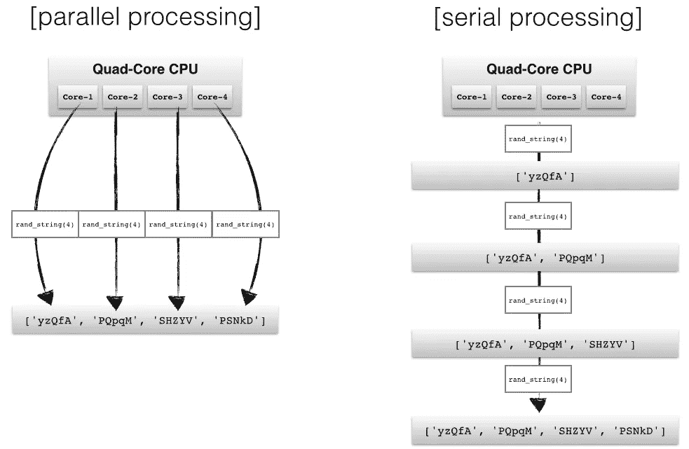

# Python 中的多重处理:比较研究—池和进程类

> 原文：<https://medium.datadriveninvestor.com/python-multiprocessing-pool-vs-process-comparative-analysis-6c03c5b54eec?source=collection_archive---------0----------------------->

多重处理是提高性能的一种不可思议的方法。当我们使用 python 代码评估大量表达式的任务时，我们运行了 Python 多重处理。在这种情况下，依次评估表达式是不明智的，也是乏味的。

所以，在 Python 中一定要使用多重处理。

大多数情况下，在多重处理中，利用进程或线程来执行任务。为了获得增强的多处理性能，我们选择使用线程。但是通过研究，我们发现 GIL 锁禁用了 Python 中的多线程功能。通过进一步的研究，我们了解到 Python 为多重处理提供了两个类。进程和池类。在这一节中，我回顾了我们在使用池和进程类时的理解。此外，利用这两个类的执行检查。此外，我还逐点指出了执行检查，它将为您的多重处理任务选择合适的策略

# 池和进程类

尽管池和进程都并行执行作业，但是它们并行执行作业的方式是不同的。

 [## 2019 年最值得学习的编码语言——数据驱动的投资者

### 在我读大学的那几年，我跳过了很多次夜游去学习 Java，希望有一天它能帮助我在…

www.datadriveninvestor.com](https://www.datadriveninvestor.com/2019/02/21/best-coding-languages-to-learn-in-2019/) 

使用 FIFO 策略调度执行的池类。它的工作方式类似于地图缩小设计。它映射来自不同处理器的输入，并汇集来自所有处理器的输出。运行代码后，它以列表或数组的形式恢复输出。它等待所有作业完成，然后返回输出。正在执行的进程放在内存中，其他不执行的进程放在内存之外。

process 类将进程存储在内存中，并使用 FIFO 调度将作业分配给可用的处理器。当流程结束时，它会先发制人，计划新流程的执行。

# 何时使用池和进程？

我认为选择合适的方法取决于工作。Pool 允许每个进程有多个作业，这可能会使您的程序更容易并行。如果您有一个 numbers 作业要并行运行，您可以创建一个进程数与 CPU 核心数相同的池，然后将 numbers 作业的列表传递给 pool.map。该池会将作业分配给工作进程，并以列表的形式返回值，然后将其传递给父进程。

同样，由于并行执行的任务数量很少，而且每个任务只需执行一次，因此为每个任务使用单独的多处理进程可能比较实用，而不是建立一个池。

我们利用池和过程类来评估。以下是我们对池流程类的看法:

正如我们所看到的，进程在内存中分配所有的任务，而池只在内存中分配正在执行的进程，所以当任务数量很大时，我们可以使用池，当任务数量很小时，我们可以使用进程类。如果出现大任务，你使用进程的那个点可能会发生内存问题，触发系统扰动。在池类中，创建它是有开销的。随后，对于小任务数，当使用池时，性能会受到影响。

FIFO 策略中在可访问内核之间划分进程的池。在每个内核上，分布式进程按顺序运行。这样，如果存在长时间的 IO 活动，会一直持续到 IO 任务完成，并且不会计划另一个进程。这导致执行时间增加。Process 类挂起运行 IO 活动的进程，并调度另一个进程。因此，在长时间 IO 活动的情况下，使用 process 类是合适的。

# 比较研究

对于我们的情况，使用池类的执行如下:

Process()的工作原理是为每个需要运行的并行进程启动一个独立的系统进程。当我们使用 Process class 时，我们目睹了数以千计的进程被创建并堆积在内存中时造成的机器中断。

> 1)使用池- 6 秒
> 
> 2)不使用池- 10 秒

为了进一步测试，我们减少了每个表达式中的参数数量，并运行了 100 个表达式的代码。

使用池类的性能如下:

> 1)使用池- 4 秒
> 
> 2)不使用池- 3 秒

然后，我们将参数增加到 250，再次执行。

使用池类的性能如下:

> 1)使用池- 0.6 秒
> 
> 2)不使用池- 3 秒

总结一下，我认为当有大量进程和少量 IO 等待时，池类更好。当进程数量很少且 IO 活动很长时，进程类更好。你在 Python 中进行多重处理的经验。

# 参考资料:

1.  [17.2。多重处理——基于进程的并行处理](https://docs.python.org/3.6/library/multiprocessing.html#module-multiprocessing)