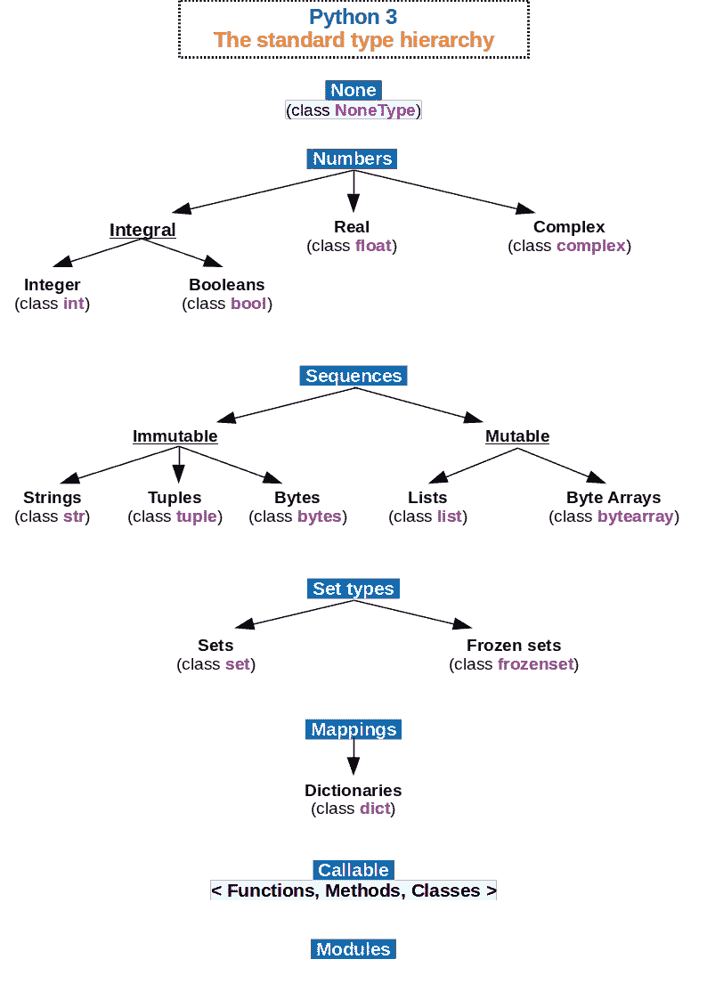
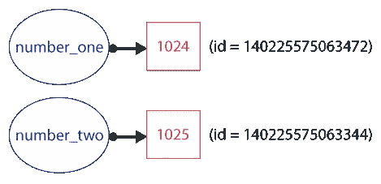
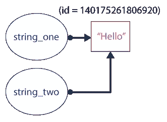
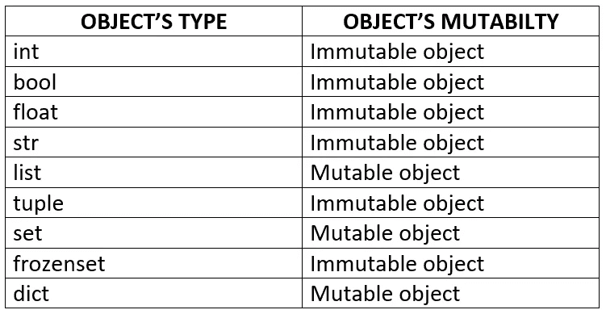
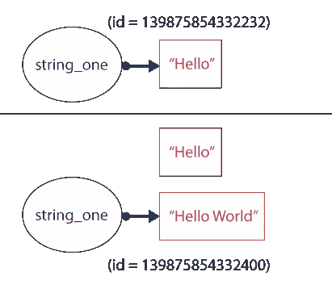
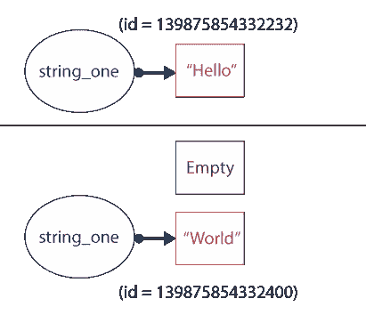
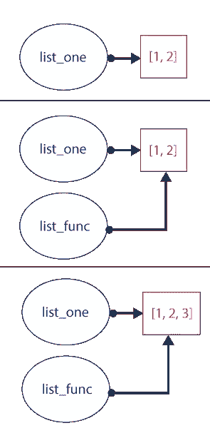
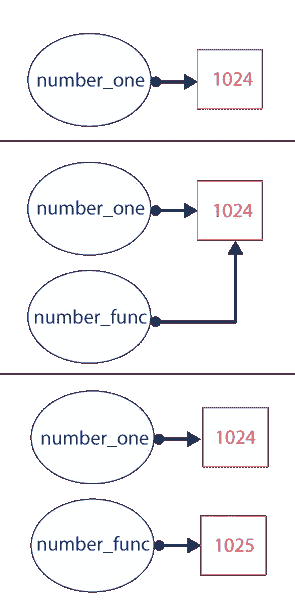

# Python &面向对象编程

> 原文：<https://medium.datadriveninvestor.com/python-object-oriented-programming-d861ac0b5d9f?source=collection_archive---------2----------------------->


ython 是一种跨平台语言，许多应用程序都使用这种语言，它们运行在 Windows 和类似 Unix 的系统上，例如 Linux 或 Mac OSX。它的标准库和第三方库提供了有用的模块来执行编程项目中实现的许多过程，如人工智能(AI)、Web 开发、机器人、基于音频/视频的应用程序等。这些特性是 Python 成为最常用编程语言之一的部分原因，如 [GitHub](https://www.fossmint.com/popular-programming-languages-on-github/) 所示。

Python 是一种**多参数语言**，用于以过程和函数方式编程，但 Python 的核心是**面向对象编程** (OOP)。这种方法包括围绕**对象、**组织程序，这些对象包含任意数量和种类的数据。这些对象是在运行时创建和修改的。每个对象被认为是一个**类的实例，**可以被看作是一个由一些变量和函数组成的模板，这些变量和函数被称为*属性引用。*这些属性由**数据属性** *—* 或者仅仅是属性*—*维护每个实例状态的*划分，并由**方法**修改它们的状态。*

*[](https://www.datadriveninvestor.com/2019/03/25/a-programmers-guide-to-creating-an-eclectic-bookshelf/) [## 创建折衷书架的程序员指南|数据驱动的投资者

### 每个开发者都应该有一个书架。他的内阁中可能的文本集合是无数的，但不是每一个集合…

www.datadriveninvestor.com](https://www.datadriveninvestor.com/2019/03/25/a-programmers-guide-to-creating-an-eclectic-bookshelf/) 

OOP 中有四个基本原则:

*   继承:每个类(子类)都有能力从另一个类(基类)派生属性引用。
*   多态性:意味着一个给定类的任何对象都可以被使用，就好像它是该类的任何基类的对象一样。
*   抽象:指隐藏内部细节，只显示对象的基本信息。
*   封装:由对象属性引用的访问限制组成。

这些原则很方便，因为实现了一些很好的特性，如可重用性、数据冗余、代码维护和安全性。优势不仅体现在用 Python 实现这些原则时，也体现在它的源代码中——一切都是对象。所有的数据类型，无论是整数、浮点还是字符串，甚至是复合数据类型——即列表、元组、集合和字典——都引用对象。

这篇博客讨论了对象的引用——id、类型、别名——以及对象的可变性。* 

# *Id 和类型*

*如上所述，每个对象都是一个类的实例。Python 包含一些内置的数据类型类，如整数、浮点数、字符串等。作为一个类的每个实例，这些对象都有由它们的类定义的属性和方法——即[列表对象被它们的方法修改，如 append 或 copy](https://docs.python.org/3/tutorial/datastructures.html) 。下图显示了属于 Python 中每个内置类型的类。*

**

*Fig 1\. The standard type hierarchy in Python 3\. Source: [wikipedia.org](https://en.wikipedia.org/wiki/Data_type)*

*为了知道任何对象的类类型，必须使用`type`函数。这个函数返回属于每个创建的对象的类。假设有以下 Python 脚本:*

```
*#!/usr/bin/python3number_one = 1024
string_one = "Hello World"
list_one = [1, 2, 3]
tuple_one = (1, 2, 3)
print(type(number_one))
print(type(string_one))
print(type(list_one))
print(type(tuple_one))*
```

*该脚本的输出将是类类型:*

```
*<class 'int'>
<class 'str'>
<class 'list>
<class 'tuple'>*
```

*`Type`函数用于调试过程，即确定从网络爬虫中提取的文本的类型。*

*每个对象都有一个标识(id)。这由一个整数表示，并保证在对象的生命周期中是唯一的和恒定的。这个整数表示对象在内存中的地址。[因此，具有非重叠生存期的两个对象可能具有相同的 id 值](https://docs.python.org/3/library/functions.html#id)。*

*让我们看看当创建两个整数对象时会发生什么:*

```
*#!/usr/bin/python3number_one = 1024
number_two = 1025
print(id(number_one)) **#(id = 140225575063472)**
print(id(number_two)) **#(id = 140225575063344)***
```

*在这种情况下，在 Python 脚本中创建了两个具有不同值的整数对象。Python 本身没有变量，而是有**对象引用**。因此，`number_one`和`number_two`将是这两个整数对象的对象引用。通过 id 内置函数，可以获得每个对象的身份，以便进行打印。*

**

*Fig 2\. Object references, represented with circles, and integer objects, represented with rectangles.*

*如上所述，每个变量引用一个具有不同 id 的对象。当定义两个字符串对象时，会发生同样的行为:*

```
*#!/usr/bin/python3string_one = "Hello"
string_two = "World"
print(id(string_one)) **#(id = 140450207424840)**
print(id(string_two)) **#(id = 140450207425008)***
```

*那些被`string_one`和`string_two`引用的对象被分配在不同的内存空间中。但是，如果这些变量相等，会发生什么呢？*

```
*#!/usr/bin/python3string_one = "Hello"
string_two = string_one
print(id(string_one)) **#(id = 140175261806920)**
print(id(string_two)) **#(id = 140175261806920)***
```

*在这种情况下，打印的身份是相同的。当执行第一行时，创建字符串对象和对象引用(`string_one`)。在第二行之后，还创建了一个`string_one`的**别名**，称为`string_two` 。别名是指向由先前创建的对象引用所引用的同一对象的对象引用。下图以图形方式展示了这种行为。*

**

*Fig 3\. Object reference and alias that points to a same object in memory.*

*这些对象引用的相等性可以通过`==`和`is`条件来检查——当它们引用同一个对象时，结果是`True`:*

```
*#!/usr/bin/python3string_one = "Hello"
string_two = string_one
print(string_one == string_two) **#True**
print(string_one is string_two) **#True***
```

*为了**优化内存空间**，当引用一个具有相同值的对象时，Python 自动创建一个对象引用的**别名**，而不是创建几个对象:*

```
*#!/usr/bin/python3string_one = "Hello"
string_two = "Hello"
print(id(string_one)) **#(id = 140175261806920)**
print(id(string_two)) **#(id = 140175261806920)**
print(string_one == string_two) **#True**
print(string_one is string_two) **#True***
```

*这种行为发生在不可变的对象上，比如整数、字符串和元组，但是对于可变的对象，比如列表和字典，Python 创建不同的对象，即使它们具有相同的值:*

```
*#!/usr/bin/python3list_one = ["Hello", "World"]
list_two = ["Hello", "World"]
print(id(list_one)) **#(id = 140504185698440)**
print(id(list_two)) **#(id = 140504185698504)**
print(list_one == list_two) **#True**
print(list_one is list_two) **#False***
```

*在这个例子中，`==`条件的结果是`True`,因为`list_one`和`list_two`具有相同的值，但是`is`条件的结果是`False`,因为每个对象引用指向不同的对象，它们具有不同的`id`。*

# *对象的可变性*

*对象的标识和对象的类型在运行时创建时是不可更改的。但是，根据对象的类型，它们的值可以改变。一方面，值可以改变的对象称为**可变对象。**另一方面，具有不可变值的对象被称为**不可变对象。**下图显示了具有可变性类型的对象列表:*

**

*Fig 4\. Object’s mutability of standard types in Python*

*如上所示，当两个或多个对象引用指向具有相同值的不可变对象时，它们的标识是相同的。但是，每次对象引用的值改变时，Python 都会创建另一个对象:*

```
*#!/usr/bin/python3number_one = 1024
print(id(number_one)) **#(id = 140616357076912)** number_one = 1025print(id(number_one)) **#(id = 140616357076784)***
```

*在这种情况下，创建一个 id 为`140616357076912`的整数对象，并且`number_one`引用该对象。当`number_one`改变它的值时，它实际上引用了一个新的 integer 对象，有另一个 id ( `140616357076784`)。如果使用字符串对象进行测试，会出现以下情况:*

```
*#!/usr/bin/python3string_one = "Hello"
print(id(number_one)) **#(id = 139875854332232)** string_one = string_one + " World"print(id(number_one)) **#(id = 139875854332400)***
```

*两个对象被创建并被`string_one`引用。在第一行，`string_one`是指一个以`Hello`为值的对象。在第二行，`string_one`指向一个新对象，值为`Hello World`。Python 不显式删除对象，使得不可到达的对象可能被垃圾收集。一旦脚本完成，内存空间被释放:*

**

*Fig 5\. Graphic demostration of example when immutable objects created when a different value is assigned to an object reference (string_one).*

*为了避免垃圾收集，当运行时需要存储常量值时，应该使用不可变对象。另一种选择是用关键字`del`删除未使用的不可变对象:*

```
*#!/usr/bin/python3string_one = "Hello"
print(id(string_one)) **#(id = 139875854332232)** del string_one **#Removing unused object** string_one = "World"print(id(string_one)) **#(id = 139875854332400)***
```

**

*Fig 6\. Graphic demostration of example when an immutable object is deleted when it is unused.*

*根据可变对象的值在其生命周期内试图改变的方式，Python 用 value value 创建一个新对象或修改现有对象。假设有以下 Python 脚本，其中一个元素被添加到列表中:*

```
*#!/usr/bin/python3list_one = ["Hello", "World"]
print(id(list_one)) **#(id = 140704891648072)** list_one = ["Hello", "World", "Ok"]print(id(list_one)) **#(id = 139875854332232)***
```

*在运行时，Python 创建了两个对象，并将它们分配到内存空间中。与字符串对象的例子相似，`list_one`指的是两个不同的对象。以下命令行会发生这种情况:*

```
*#!/usr/bin/python3list_one = ["Hello", "World"]
print(id(list_one)) **#(id = 140704891648072)** list_one = list_one + ["Ok"]print(id(list_one)) **#(id = 139875854332232)***
```

*为了修改现有的列表，避免新的对象，必须使用可变对象的方法。和任何类一样，这些类型都有几个改变原始对象状态的属性引用。根据上一个例子，在列表中添加元素有几种方法。第一个是使用`.append`方法:*

```
*#!/usr/bin/python3list_one = ["Hello", "World"]
print(id(list_one)) **#(id = 139800957999176)** list_one.append("Ok")print(id(list_one)) **#(id = 139800957999176)***
```

*第二个是键入`+=`来调用类`list`的`__iadd__`特殊方法:*

```
*#!/usr/bin/python3list_one = ["Hello", "World"]
print(id(list_one)) **#(id = 140183694727240)** list_one += ["Ok"]print(id(list_one)) **#(id = 140183694727240)***
```

*词典上也显示了这种可变性。假设在已创建的`dict`对象中添加了一个项目:*

```
*#!/usr/bin/python3dict_one = {"Hello": 1, "World": 2}
print(id(dict_one)) **#(id = 140163454592904)** dict_one["Ok"] = 3print(id(dict_one)) **#(id = 140163454592904)***
```

*`dict_one`的 id 不变。同样，当一个项目被删除时，它也起作用:*

```
*#!/usr/bin/python3dict_one = {"Hello": 1, "World": 2}
print(id(dict_one)) **#(id = 140524845111176)** del dict_one["World"]print(id(dict_one)) **#(id = 140524845111176)***
```

*通过`del`关键字，也可以删除列表中的元素:*

```
*#!/usr/bin/python3list_one = [1024, 1025, 1026]
print(list_one)
print(id(list_one))del list_one[1]print(list_one)
print(id(list_one))*
```

*最后一个脚本的输出是:*

```
*[1024, 1025, 1026]
139966595061832
[1024, 1026]
139966595061832*
```

*当运行时需要可变大小的对象时，使用可变对象。正确使用他们的方法，有可能避免垃圾收集。*

# *函数和参数*

*函数由参数(或自变量)和 Python 语句组成。参数可以是任何数据类型，无论是标准类型还是创建的数据类型。实际上，这些参数充当给定对象引用函数的别名。假设有以下 Python 脚本:*

```
*#!/usr/bin/python3def add_elem_list(list_func):
    list_one.append(3)list_one = [1, 2]
print(list_one)
add_elem_list(list_one)
print(list_one)*
```

*执行的输出是:*

```
*[1, 2]
[1, 2, 3]*
```

*尽管`add_elem_list`没有返回值，该函数改变`list_one`的值。如图 7 所示，这是因为`list_func`引用了内存空间中分配的同一个对象。很明显，这两个对象之间是相等的(`list_one == list_func`)。由于自变量是一个可变对象，当它通过它的方法改变时，它并不创建一个新的对象。*

**

*Fig 7\. Graphic demostration of changing a mutable objects as an argument of a function.*

*不可变对象不能用那种方式修改。尽管参数是对象别名，但是 Python 的每次更改都会创建一个新的对象:*

```
*#!/usr/bin/python3def add_one_to_int(number_func):
    number_func += 1number_one = 1024
print(number_one)
add_one_to_int(number_one)
print(number_one)*
```

*上述脚本的输出是:*

```
*1024
1024*
```

**

*Fig 8\. Graphic demostration of changing a mutable objects as an argument of a function.*

*在本例中，`number_one`指的是一个值为`1024`的整数对象。然后，`number_func`引用同一个对象，但是当它被添加`1`时，一个新的整数被创建，`number_func`指向它——如图 8 所示。为了得到结果，必须在函数中实现返回值:*

```
*#!/usr/bin/python3def add_one_to_int(number_func):
    return number_func + 1number_one = 1024
print(number_one) **#1024**
number_one = add_one_to_int(number_one)
print(number_one) **#1025***
```

# *参考*

*   *PYTHON。Python 文档。来源:[https://docs.python.org/3/](https://docs.python.org/3/)*
*   *马克·萨默菲尔德(2010 年)。Python 3 编程:Python 语言的完整介绍。艾迪森-韦斯利。*