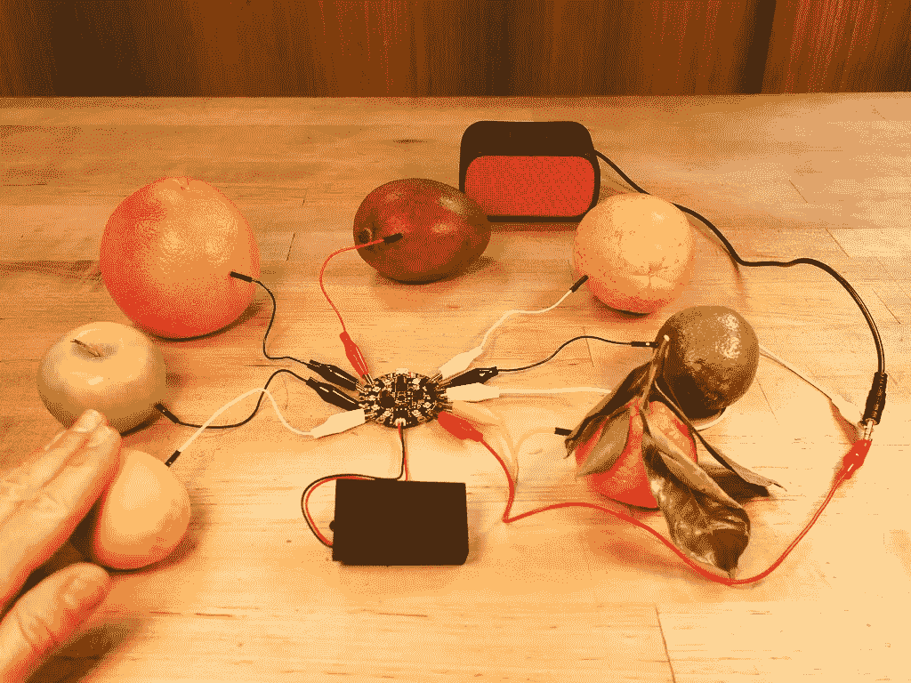
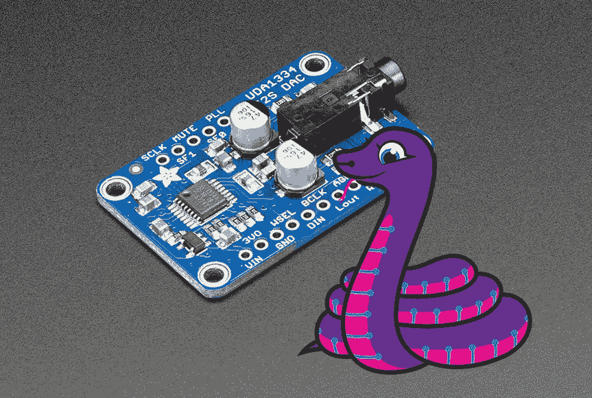

# 盒子外面的 Python

> 原文：<https://medium.datadriveninvestor.com/python-outside-the-box-157f5bb46f47?source=collection_archive---------55----------------------->

我第一次接触 Python 是由我的女朋友介绍的，她使用 Python、R 和 SQL 来分析大袋的数据，以模拟房屋贷款的表现。我看到几乎所有的单词和数字(以及大量的括号)要么产生了更多的近义词(好的)，要么产生了“回溯(最近一次调用)”——坏的。

在数据科学沉浸式项目中，我花了八周时间在大会无所不知的浏览器下学习 Python 和数据科学。虽然 Python 对我来说几乎是透明的，但我仍然认为它是一种用于执行数据科学和机器学习工作的计算机代码。

本周，当我请一位朋友帮忙寻找一个好的音序器(音序器是一种音频设备，可以按照可配置的顺序播放音调)时，这种观点被打破了。她建议我看看 Adafruit 的 [Fruitbox 音序器](https://learn.adafruit.com/circuitpython-fruitbox-sequencer-musically-delicious-step-pattern-generator?view=all)，这是一款初学者友好的[步进音序器](https://en.wikipedia.org/wiki/Music_sequencer)，它使用电容触摸传感器来触发声音。Fruitbox 在一个 [CircuitPython](https://learn.adafruit.com/circuitpython-fruitbox-sequencer-musically-delicious-step-pattern-generator/code-with-circuitpython) 上运行，这是 Python 的一个子集，用于编程和试验低成本微控制器。你需要一个功能强大的开发板(AdaFruit 售价 15-30 美元)和 Python 的基础知识。

我已经订购了一个 Fruitbox 套件和一个 [Trellis Feather DSP-G1 合成器](https://learn.adafruit.com/feather-trellis-dsp-g1-synthesizer/overview)套件。我的下一篇文章会在他们到达时更新…

