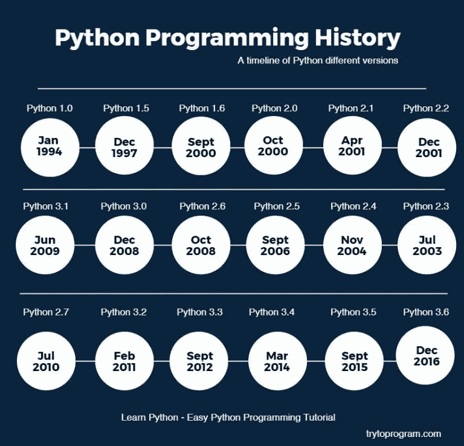

# Python 编程语言

> 原文：<https://medium.datadriveninvestor.com/python-programming-language-ac762a3b5977?source=collection_archive---------5----------------------->

python programming language

Python 是一种解释型的高级通用编程语言。由吉多·范·罗苏姆创建并于 1991 年首次发布的 Python 拥有一种强调代码可读性的设计理念，特别是使用了大量的空白。它提供了能够在小规模和大规模上进行清晰编程的结构。2018 年 7 月，Van Rossum 卸任语言社区领袖。

Python 有一个*动态类型系统*和自动内存管理。它支持多种编程范例，包括面向对象的、命令式的、函数式的和过程式的，并且有一个大型的综合*标准库。*

Python 解释器可用于许多操作系统。Python 的参考实现 CPython 是一个开源软件，它有一个基于社区的开发模型，就像 Python 的几乎所有其他实现一样。Python 和 **CPython** 由非营利性 *Python 软件基金会管理。*

**历史**

python language history

Python 是由吉多·范·罗苏姆于 20 世纪 80 年代末在荷兰 CWI 信息中心构思的，作为 ABC 语言(其灵感来自 SETL)的继承者，能够处理异常并与操作系统接口。它的实施始于 1989 年。Van Rossum 对 Python 的长期影响体现在 Python 社区给他的称号上；*仁慈的终身独裁者(BDFL)*—2018 年 7 月 12 日，他给自己一个永久的假期。

Python 2.0 于 2000 年 10 月 16 日发布，具有许多主要的新特性，包括循环检测垃圾收集器和对 Unicode 的支持。

Python 3.0 于 2008 年 12 月 3 日发布。这是对该语言的一次重大修改，并不完全向后兼容。它的许多主要特性被移植到 Python 2.6.x 和 2.7.x 版本系列。Python3 的发布包括了 **2to3** 实用程序，它可以自动(至少部分)将 Python 2 代码翻译成 Python 3。

Python 2.7 的寿终正寝日期最初定在 2015 年，后来推迟到 2020 年，因为担心大量现有代码不容易移植到 python 3。2017 年 1 月，谷歌宣布了 python 2.7 to Go*trans compiler*的工作，以提高并发工作负载下的性能。

**特点和理念**

Python 是一种多范式编程语言。完全支持面向对象编程和结构化编程，它的许多特性支持函数式编程和面向方面编程(包括通过元编程和元对象(魔术方法))。通过扩展支持许多其他范例，包括契约式设计和逻辑编程。Python 使用动态类型以及引用计数和循环检测垃圾收集器的组合来进行内存管理。它还具有动态名称解析(后期绑定)的特性，在程序执行期间绑定方法和变量名。

Python 的设计为列表传统中的函数式编程提供了一些支持。具有*滤镜()、贴图()、*和*还原()*功能；列出理解、字典和集合；和生成器表达式。标准库有两个模块( **itertools** 和 **functools** )，实现从 **Haskell** 和**标准 ML 借用的功能工具。**

该语言的核心理念在文档****Python 的 Zen(PEP 20)***中进行了总结，其中包括如下格言:*

*   *漂亮总比丑陋好*
*   *显性比隐性好*
*   *简单比复杂好*
*   *复杂总比复杂好*
*   *可读性计数*

*Python 并没有把所有的功能都内置到它的核心中，而是被设计成高度可扩展的。这种紧凑的模块性使得它作为一种向现有应用程序添加可编程接口的方式特别受欢迎。Van Rossum 的愿景是一个小的核心语言，有一个大的标准库，可以用 ABC 轻松扩展，这支持了相反的方法。*

*虽然在编码方法上提供了选择，但是 Python 哲学拒绝过多的语法(比如 Perl 的语法),而倾向于更简单、更整洁的语法。正如 Alex Merteli 所说:“*在 Python 文化中，将某物描述为‘聪明’并不被认为是一种恭维”。* Python 的哲学拒绝 Perl，“*有不止一种方法来做”*语言设计的方法赞成“*应该有一种——最好只有一种——显而易见的方法来做。”**

*Python 的开发人员努力避免*过早的优化，*并拒绝对 CPython 参考实现的非关键部分进行修补，这些修补会以清晰度为代价提供微小的速度提升。当速度很重要时，Python 程序员可以将时间关键的函数转移到用 C 等语言编写的扩展模块中，或者使用 **PyPy，**一个实时编译器。Cython 也是可用的，它将 Python 脚本翻译成 C，并直接调用 Python 解释器中的 C 级 API。*

*Python 开发人员的一个重要目标是让它用起来有趣。这反映在 language 的名字中——向英国喜剧组合 **Monty Python —** 致敬，以及偶尔对教程和参考资料的有趣做法中，例如引用 spam 和 eggs(来自一部著名的 Monty Python 小品)而不是标准 foo 和 bar 的例子。*

*Python 社区中常见的一个*新词*是***Python 化*** ，可以有很多种与程序风格相关的含义。说代码是 Python 式的，就是说它很好地使用了 Python 的习惯用法，它是自然的或者显示了语言的流畅性，它符合 Python 的极简主义哲学和对可读性的强调。相比之下，难以理解或读起来像是从另一种编程语言粗略转录的代码被称为*非韵律代码。Python 的用户和崇拜者，尤其是那些被认为有知识或有经验的人，通常被称为 Pyhtonists、Pythonistas、Pythoneers。**

***语法和语义***

*Python 是一种易于阅读的语言。它的格式在视觉上是整洁的，并且它经常使用英文关键词，而其他语言使用标点符号。与许多其他语言不同，它不使用**花括号**来分隔块，语句后的分号是可选的。它比 **C** 和 **Pascal** 有更少的语法异常和特例。*

***缩进***

*Python 使用**空格缩进、**而不是**花括号**或关键字来划分块。缩进的增加出现在某些语句之后；缩进的减少表示当前块的结束。因此，程序的视觉结构准确地代表了程序的语义结构。该特征有时被称为**越位规则。***

***语句和控制流***

*Python 的*语句*包括(除其他外):*

*   ***赋值语句**(记号' **= 【T3 '，等号)。这与传统命令式编程语言中的操作不同，这种基本机制(包括 Python 版本的*变量的性质)*阐明了该语言的许多其他特性。 **C** 中的赋值。例如 **x=2** ，翻译成“类型化变量名 **x** 接收一个复制数值 **2”。**(右手)值被复制到**分配的存储位置**，其(左手)变量名是**符号地址。**分配给变量的内存对于声明的**类型来说足够大(可能相当大)。*****

*在最简单的 **Python 赋值的情况下，**使用同一个例子， **x=2，**翻译成“(泛型)”name **x** 接收对一个单独的、动态分配的数值(int)类型为 2 的**对象**的引用。这被称为 ***绑定*** 这个名字到对象上。由于名字的存储位置*包含*指示值，*称其为变量*是不合适的。名称可能随后在任何时候被反弹到各种类型的对象，包括字符串、过程、带有数据和方法的复杂对象等。*

*将一个公共值连续分配给多个名称，例如**x = 2；y = 2；z=2** 导致将存储分配给(最多)三个名称和一个数字对象，这三个名称都绑定到该数字对象。由于名称是一个**通用引用**持有者，因此将一个固定的**数据类型**与之相关联是不合理的。然而，在给定的时间，一个名字将被绑定到*的某个对象上，*将拥有**的类型；于是就有了**动态打字。*****

*   ***if** 语句，有条件地执行一段代码，以及 **else** 和**elif**(else-if 的缩写)。*
*   ***for** 语句，它遍历一个 iterable 对象，将每个语句捕获到一个局部变量中，供附加的块使用。*
*   ***while** 语句，只要条件为真，就执行一段代码。*
*   ***try** 语句，允许 **except 子句捕获并处理其附属代码块中引发的异常；**它还确保了 **finally 块**中的清理代码将一直运行，而不管该块如何退出。*
*   ***引发**语句，用于引发指定的异常或重新引发被捕获的异常。*
*   ***类**语句，它执行代码块并将其本地名称空间附加到一个类，用于**面向对象编程。***
*   *定义**函数**或**方法的 **def** 语句。***
*   *来自 2006 年 9 月发布的 **Python 2.5** 的 **with** 语句，它在上下文管理器中封装了一个代码块(例如，在代码块运行之前获取一个**锁**并在之后释放该锁，或者打开一个**文件**并关闭它)，允许*资源获取类似于初始化(RAII)* 的行为，并替换一个普通的 try/finally 习语。*
*   ***传递**语句，作为一个 NOP。从语法上讲，创建一个空代码块是需要的。*
*   ***断言**语句，在调试期间用于检查应该适用的条件。*
*   ***产生**语句，该语句从**生成器返回一个值。**从 Python 2.5 开始，yield 也是一个运算符。该表用于实现**协程。***
*   ***导入**语句，用于导入其函数或变量可以在当前程序中使用的模块。使用导入有三种方式:*
*   *导入<module>【as】</module>*
*   *从<module name="">进口*</module>*
*   *从<module name="">导入<definition>【as<alias>】、<definition>【as<alias>】、…。</alias></definition></alias></definition></module>*
*   *在 Python 3 中 **print** 语句被改为 **print()函数**。*

*Python 不支持**尾调用**优化或第一类延续，根据 Guido Van Rossum 的说法，它永远不会支持。然而，在 2.5 中，通过扩展 Python 的生成器，提供了对类协程功能的更好支持。之前 2.5 生成器都是懒迭代器；信息从生成器中单向传递出去。在 Python 2.5 中，可以将信息传递回一个生成器函数，而在 Python 3.3 中，信息可以通过多个堆栈级别传递。*

***表情***

*有些 Python 表达式类似于语言，如 **C** 和 **Java** ，而有些则不是:*

*   *加法、减法和乘法是相同的，但是除法的行为不同。Python 中有两种类型的除法。它们是 Python 中两种类型的划分。他们是**地板师**和**整数师。** Python 还增加了 ****** 运算符进行取幂运算。*
*   *从 Python 3.5 开始，引入了新的 **@中缀运算符**。它旨在被像 **NumPy** 这样的库用于**矩阵乘法。***
*   ***在 Python 中，==** 是按值比较，而 Java 是按值比较数值，按引用比较对象。(可以用 equals()方法在 Java 中对对象进行值比较)。Python 的 **is 运算符**可能是为了比较对象身份(通过引用比较)。在 Python 中，比较可能是链式的，例如 **a < = b < = c***
*   *Python 使用单词 **and，or，not** 作为布尔运算符，而不是符号 **& &，||，！**用于 Java 和 c*
*   *Python 有一种称为*列表理解的表达式。* Python 2.4 将列表理解扩展成一个更通用的表达式，称为*生成器表达式*。*
*   *匿名函数使用 *lambda 表达式实现；然而，这些都是有限的，因为身体只能是一种表达。**
*   *Python 中的条件表达式被写成 **x if c else y** 不同于 **c？许多其他语言通用的 x: y** 运算符。*
*   *Python 区分了**列表**和**元组。**列表写成**【1，2，3】，**是可变的，不能作为字典的键(Python 中字典键必须是**不可变的**)。元组被写成 **(1，2，3)，**是不可变的，因此可以用作字典的键，只要元组的所有元素都是不可变的。+运算符可用于连接两个元组，这不会直接修改它们的内容，而是生成一个包含两个提供的元组的元素的新元组。*

*因此，给定变量 **t 最初**等于(1，2，3)，执行 **t = t + (4，5)** 首先计算 **t + ( 4，5)**，然后将其赋回给 **t，从而有效地**“修改】t、的内容，同时符合元组对象的不可变性质。在明确的上下文中，括号对于元组是可选的。*

*   *Python 的特点是*序列解包*，其中多个表达式，每个都计算可以赋值的任何内容(变量、可写属性等)，以相同的方式与形成元组的文字相关联，并且作为一个整体，放在赋值语句中等号的左侧。该语句期望右侧的*可迭代*对象在迭代时产生与所提供的可写表达式相同数量的值，并将迭代通过该对象，将每个产生的值分配给左侧的相应表达式。*
*   *Python 有一个**【字符串格式】**运算符 **%。**这个函数类似于 **C、**中的 **printf** 格式字符串，例如 **"spam=%s eggs=%d" % ("blah "，2)** 计算结果为 **"spma=blah eggs=2 "。**在 Python 3 和 2.6+中，这由 **str 类**的 **format()** 方法补充，例如**“spam = { 0 } eggs = { 1 }”。格式(“布拉”，2)。** Python 3.6 增加了**“f 串”:blah = " blah ":eggs = 2；f'spam = {blah} eggs={eggs}'***

***方法***

*对象上的方法是附属于对象类的函数；语法*instance . method(argument)*对于普通的方法和函数来说，是*class . method(instance argument)***的语法糖。** Python 方法有一个显式的 **self** 参数，用于访问其他一些面向对象的编程语言(如 C++、Java、Objective-C .或 Ruby)中的实例数据。*

***打字***

*Python 使用了 **duck typing** ，有类型化的对象但没有类型化的变量名。编译时不检查类型约束；相反，对对象的操作可能会失败，表明给定对象的类型不合适。*

*尽管是动态类型的，Python 是*强类型的，*禁止定义不明确的操作(例如，向字符串添加数字)，而不是默默地尝试理解它们。Python 允许程序员使用类定义他们自己的类型，这是最常用于*面向对象编程的。*类的新实例是通过调用类(例如， **SpamClass()** 或 **EggsClass())** 构造的，这些类都是自身的实例)，允许*元编程*和*反射。**

*在 3.0 版本之前，Python 有两种类:*旧式*和*新式。*两种样式的语法是相同的，区别在于类**对象**是直接继承还是间接继承(所有新的样式类都继承自对象，并且是类型的实例)。在 Python 2.2 以后的版本中，这两种类都可以使用。Python 3.0 中消除了旧的样式类。*

*长期计划是支持*逐步类型化*，从 Python 3.5 开始，该语言的语法允许指定静态类型，但在默认实现中不检查静态类型。一个名为 ***mypy*** 的实验性可选静态类型检查器支持编译时类型检查。*

***数学***

***Python** 有常用的 **C** 语言算术运算符( **+、—、*、*、%)。*** *它还有* ******** *求幂，例如 5**3 == 125 和 9**0.5 == 3.0，3.5 版本中包含了新的矩阵乘法* ***@*** *运算符。*此外，它还有一个一元运算符( **~)，**，本质上是反转它的一个参数的所有位。对于整数，这意味着 **~x = -x — 1。**其他运算符包括按位移位运算符**x<y、**将 **x** 左移 **y** 位，与 x **(2** *y)相同， **x > > y、**将 **x** 右移 **y** 位，与 **x//(相同***

*由于 Python 广泛的数学库，以及进一步扩展本机功能的第三方库 **NumPy** ，它经常被用作**科学脚本语言来帮助解决问题，例如数字数据处理和操作。***

***图书馆***

*Python 的大型**标准库**通常被认为是其最大的优势之一，它提供了适合许多任务的工具。支持面向互联网的应用程序，如 **MIME 和 HTTP** 。它包括用于创建*图形用户界面、*连接到*关系数据库、* *生成伪随机数、*任意精度小数算术、操作*正则表达式*和*单元测试的模块。**

*标准库的某些部分被规范所涵盖(例如， *Web 服务器网关接口(****【WSGI****)*实现 **wsgiref** 遵循 **PEP-333，**但大多数模块没有。它们由它们的代码、内部文档和测试套件(如果提供的话)指定。然而，因为大多数标准库是跨平台的 Python 代码，所以只有少数模块需要针对变体实现进行修改或重写。*

*截至 2018 年 3 月，第三方 Python 软件的官方存储库 Python 包索引(PyPI)包含超过 130，000 个包，具有广泛的功能，包括:*

*   *图形用户界面*
*   *Web 框架*
*   *多媒体*
*   *数据库*
*   *建立工作关系网*
*   *测试框架自动化*
*   *网页抓取*
*   *证明文件*
*   *系统管理*
*   *科学计算*
*   *文本处理*
*   *图像处理*

***开发环境***

*大多数 Python 实现(包括 CPython)包括一个*读取-评估-打印循环* (REPL)，允许它们作为一个*命令行解释器*，用户顺序输入语句并立即收到结果。*

*其他 Shells，包括 IDLE 和 IPython，增加了自动完成、会话状态保持和语法高亮等更多功能。*

*除了标准的桌面集成开发环境之外，还有基于浏览器的 Wen IDE；SageMath(意在开发科学和数学相关的 python 程序)； *PythonAnywhere，*基于浏览器的 IDE 和托管环境；以及 Canopy IDE，一个强调科学计算的商业 Python IDE。你也可以使用 **JetBrains 的 **Pycharm** 。***

*支持我，看看我的小应用:[人生规划师](https://thelifeplanner.co)*

*干杯！*