# Python 项目:每年 80 本书的阅读挑战

> 原文：<https://medium.datadriveninvestor.com/python-project-80-books-per-year-reading-challenge-88bfc281add?source=collection_archive---------18----------------------->

我喜欢阅读，从八岁起，我就开始从我读过的书中写出我最喜欢的诗句。

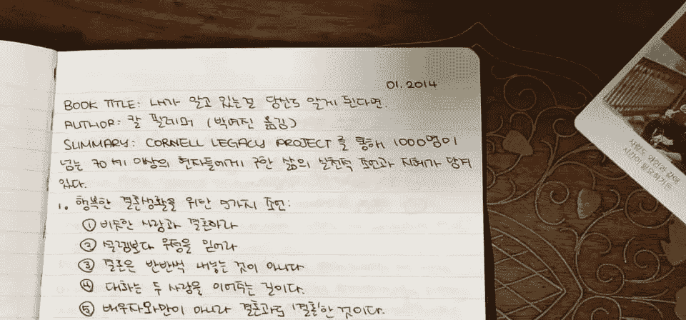

我过去常常把它们写在我的 Moleskine 上，但后来觉得写在网上更有意义。从 2017 年开始，我一直用 Tumblr 代替。

2017 年，我定下新年决心，一年读 80 本书。我成功了，因为收获太大，我在 2018 年继续读了 80 本书。两年时间，我读了 160 本书。

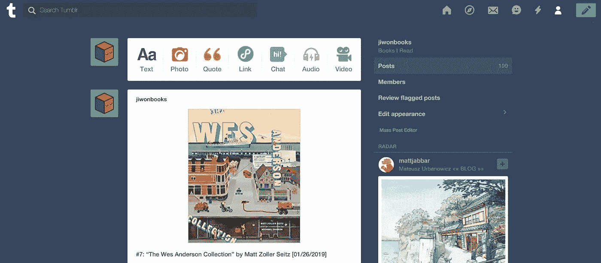

my most recent read in 01/26/2019\. I plan to continue the new year’s resolution in 2019.

读书本身是有益的，但我想分析我所读的内容。我想了解我的阅读习惯，我读什么类型的书，我最后写了多少引文。

我在 2018 年 6 月开始学习 Python，并制定了个人目标，在我的阅读书籍挑战上开始一个项目。

免责声明:我的编码并不完美。我写这篇文章的原因首先是为了得到反馈，希望能得到一些帮助！如果您能在评论区留下任何建议或提示，我将不胜感激:)

步骤 1:从 Tumblr 下载 blog posts(XML)

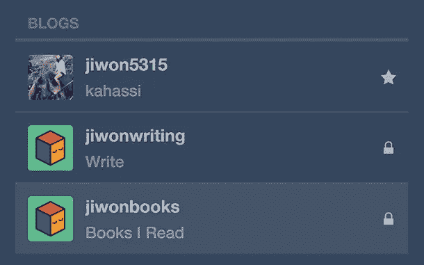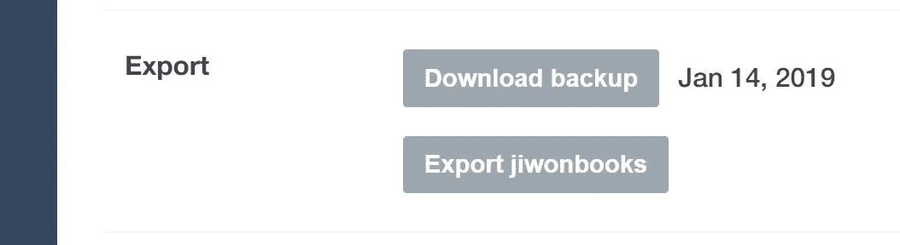

步骤 2:从 XML 文件中提取文本

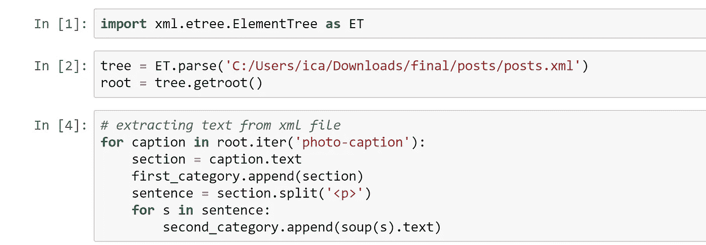

步骤 3:遍历文本，使用 regex 查找书号、标题、作者、阅读日期和书籍引用的匹配项。

*注意:XML 文件比我想象的要混乱得多，所以有一些异常值(例外)。*

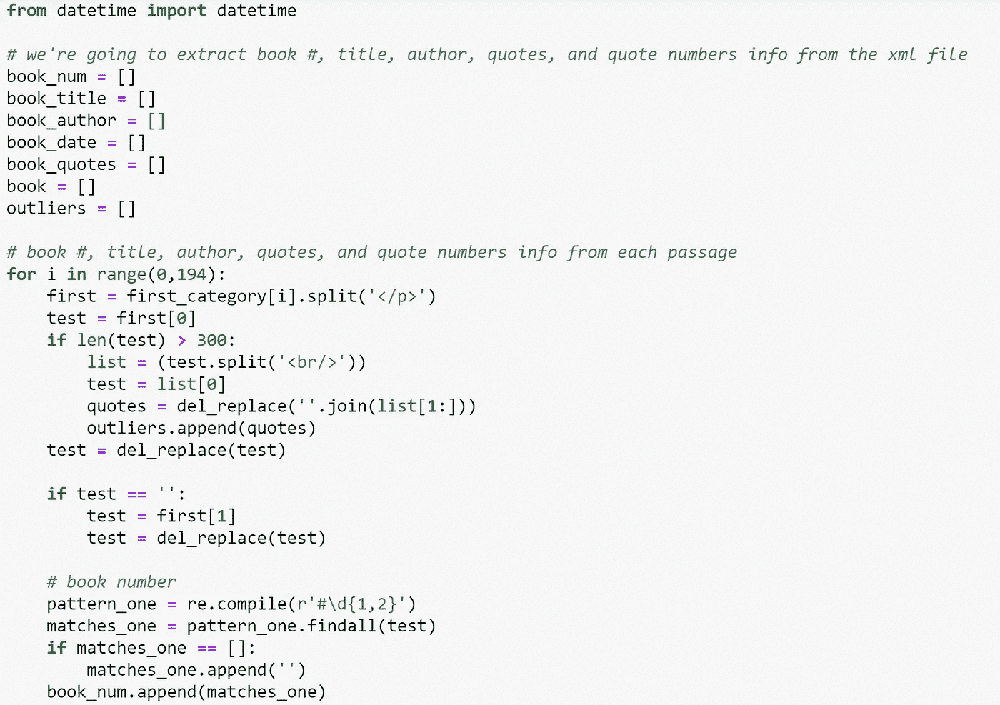

complete code [here](https://github.com/jiwon5315/Python/blob/master/Tumblr%20XML%20Data%20Cleaning.ipynb)

步骤 4:检查循环是否有效

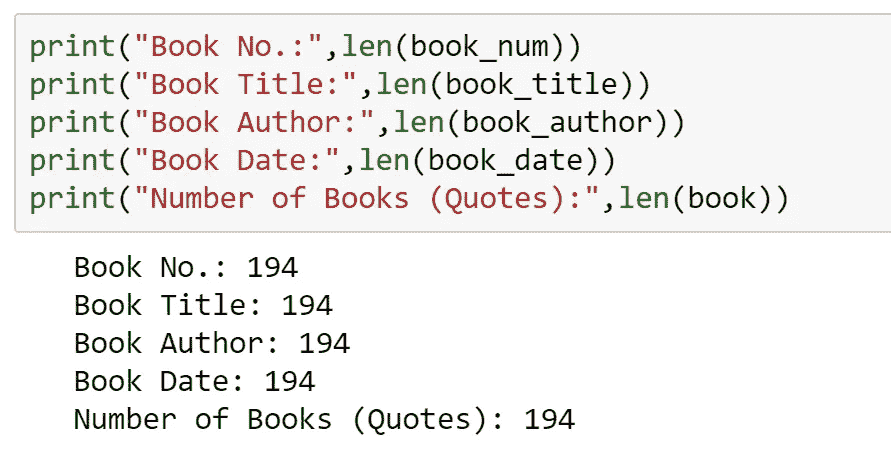

14 articles from The New Yorker magazine were part of the list, which I excluded later.

步骤 5:创建一个熊猫数据框架

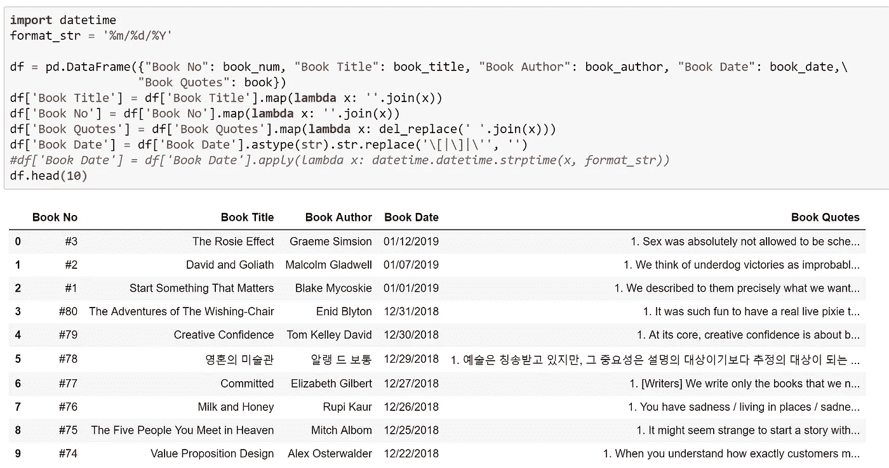

第 6 步:通过找到所有的错误开始清理数据！

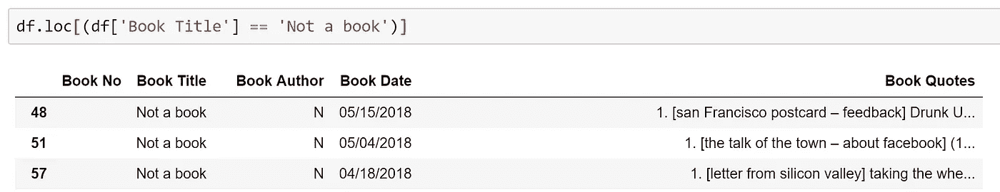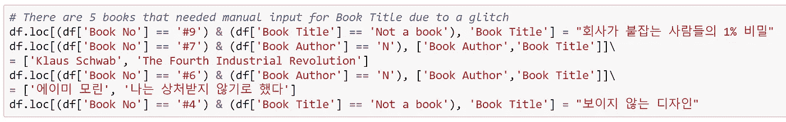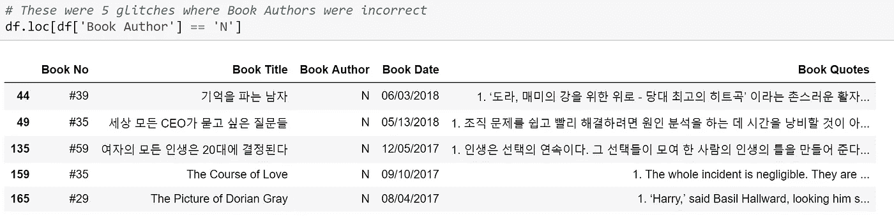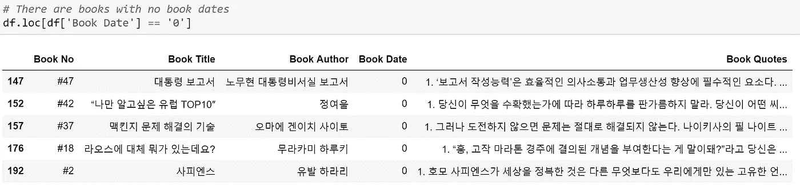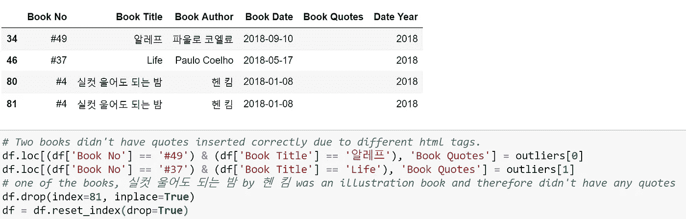

第 7 步:从“图书报价”列，我循环使用一个正则表达式来计算有多少报价，并创建了一个新列。

第八步:一旦数据更加有组织，我对我的数据集做了三个假设。

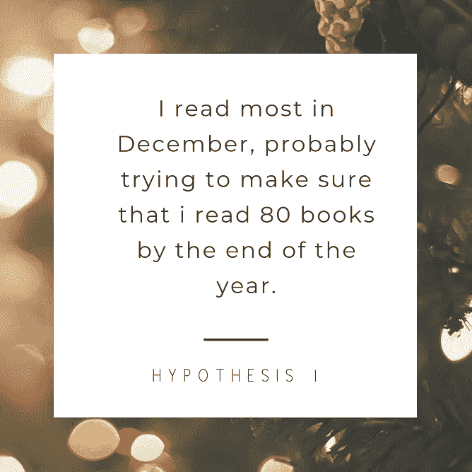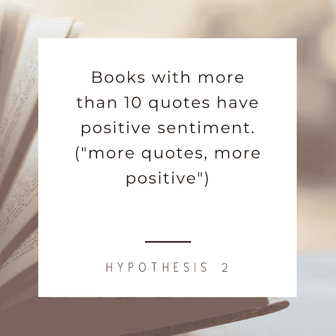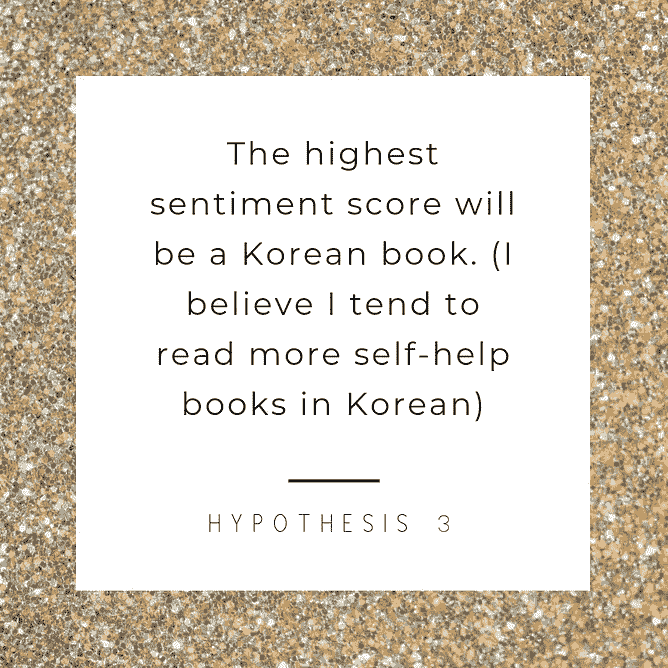

第九步:测试假设。

*假设 1:我在 12 月读得最多。*

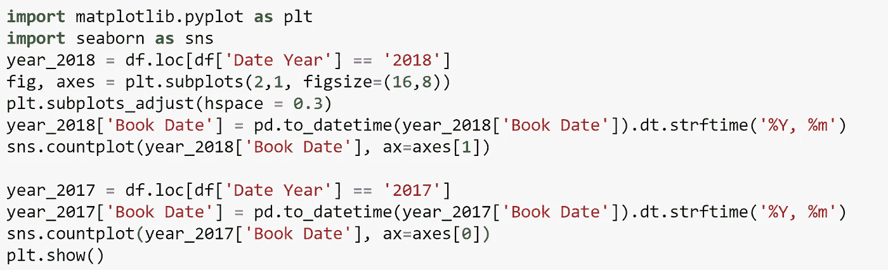

结论——我*在十二月*读了更多的书。

假设 2:引用次数超过 10 次的书，情绪是正面的。(引用越多，正面越多)

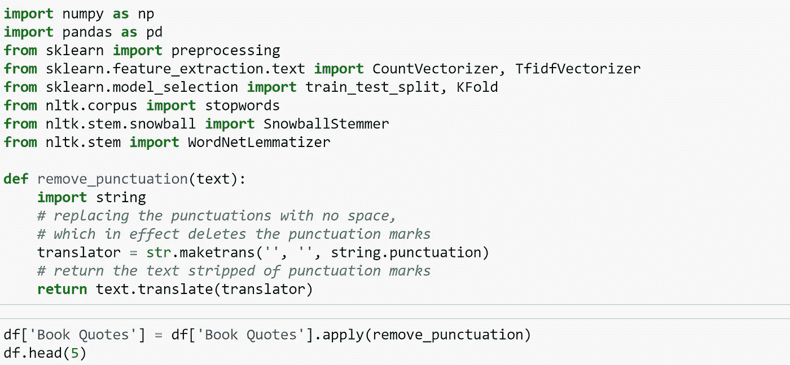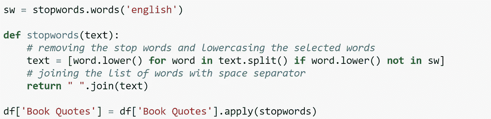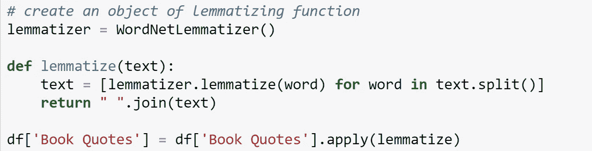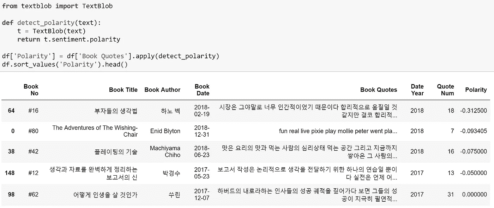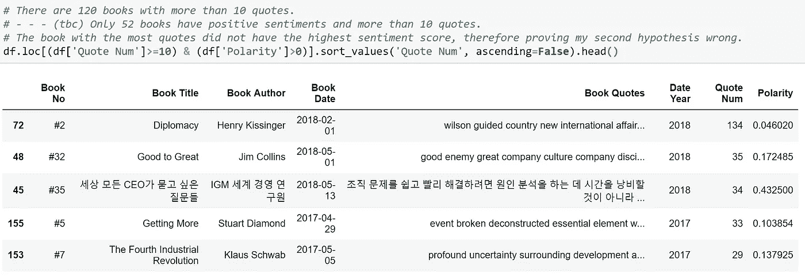

结论——更多的引用并不意味着更多的积极情绪。

假设三:情感分最高的会是一本韩文书。

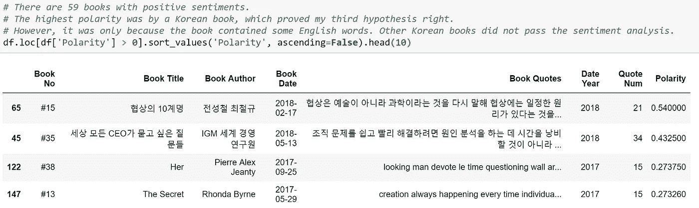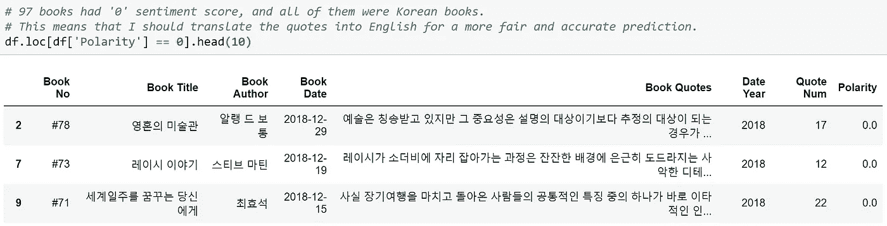

结论——关于一本韩国书的最高情感分数，我是对的，但我也错了。textblob 不能处理朝鲜语文本，只能提取英语单词。

**第十步:了解我的极限，放弃！**

意识到我需要将韩语文本翻译成英语，以便进行更公正、更少主观的分析，我尝试了(在我看来)所有的方法。我尝试了 textblob 翻译(这是最好的，但一直崩溃)，googletranslate，pytranslate 等。，但意识到我的技能与我的抱负不相称。

这与我最初想要的相差甚远。我想从最喜欢的作家中抽取前十个单词，也许是一个 ML 函数，我可以在其中键入书名，并根据我的阅读列表等来看看我是否会喜欢它。然而，我认为学习的一部分是有耐心。我的技能还没有达到那个水平，这没关系。一旦我的编码技能更好了，我希望回到这个项目，但在那之前，这是我正在进行的工作，是我学到了多少和我可以实现的可能性的指标。

我写这篇文章是希望作为你的下一个 python 项目，你会对任何书呆子感兴趣。我强烈推荐 80 本书阅读挑战作为旁注。

你可以在这里找到完整的代码。