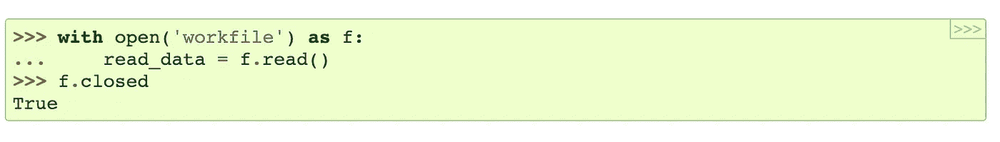

# 我们都必须使用的 Python 技巧

> 原文：<https://medium.datadriveninvestor.com/python-tricks-we-use-everyday-but-dont-understand-f081a3bfc07c?source=collection_archive---------5----------------------->


Photo by [rawpixel.com](https://www.pexels.com/@rawpixel?utm_content=attributionCopyText&utm_medium=referral&utm_source=pexels) from [Pexels](https://www.pexels.com/photo/man-holding-white-paper-1851467/?utm_content=attributionCopyText&utm_medium=referral&utm_source=pexels)

你有没有发现自己在看 python 的生成器、关键字或其他常见的技巧，并且想知道它们到底是如何工作的？我经常发现自己*在想——*我在使用我不理解的代码时感到很不舒服。因此，我花了相当多的时间研究和阅读大量的文章和文档来理解这些概念。以下是我学到的。。。

## ***概要***

*   ***列表理解***
*   ***装修工***
*   ***关键词***
*   ***发电机和‘产量’关键字***
*   ***闭包***
*   ***提示和资源***

[](https://www.datadriveninvestor.com/2018/10/23/running-to-get-rid-of-the-crazy-how-working-out-increases-your-productivity/) [## 跑步摆脱疯狂:锻炼如何提高你的生产力|数据驱动的投资者

### 没有比锻炼更好的方式来开始一天的工作了。我试着一周至少做四天，在…

www.datadriveninvestor.com](https://www.datadriveninvestor.com/2018/10/23/running-to-get-rid-of-the-crazy-how-working-out-increases-your-productivity/) 

## 列出理解

先说一个简单的。就我个人而言，我对这些是如何工作的感到非常困惑。一次写三+行代码？？看看这个→

```
num_list = [str(i) for i in range(5)]
print(num_list) # ['0','1','2','3','4']
```

这显然与以下内容相同:

```
num_list = []
for i in range(5):
   num_list.append(str(i))
print(num_list) # ['0','1','2','3','4']
```

但是，如果事情更复杂呢？请记住，它遵循以下模式:

```
result = transform  iteration  filter
```

其中 transform 是要添加到列表中的内容，iteration 是 for 循环语句，filter 是确定是否添加 transform 的条件。

```
evens = [i for i in range(5) if i%2 == 0]
print(evens) # [0, 2, 4]
```

## 装修工

等等，什么是装修工？如果您以前从未使用过这个工具，您将会发现一个伟大的工具，它将使您的生活变得更加轻松！

装饰器是包装函数，它接受一个函数作为参数，并返回一个替换函数。例如:

```
def decorator(func):
   def inner_func():
       return func() + 1
   return inner_func()def number():
   return 20print(number()) # 20
print(decorator(number)) # 21
```

上面是一个装饰函数如何工作的例子。下面是它们的使用方法:

```
@decorator
def number():
   return 20print(number()) # 21
```

如果我的函数接受参数怎么办？也许我们的程序是为面包店设计的，它根据有多少人即将过生日来计算我们需要多少蛋糕片。假设，我们有我们的预订，并且被给予添加附加的预订或删除取消。因此，我们需要一个加减函数，以及每次预订需要多少蛋糕片。

```
def decorator(func):
   def inner_func(reservations, diff):
       # 20 slices per person
       cake_slices = func(reservations, diff)*20 
       return str(amount) + ' cake slices'
   return inner_func@decorator
def add(old_reservations, new_reservations):
   return old_reservations + new_reservationsdef sub(reservations, cancellations):
   return reservations - cancellationsprint(add(5,4)) # 200 cake slices
print(sub(5,4)) # 20 cake slices
```

它仍然会接受这个函数，对它求值，然后加 1。在幕后，这就是发生的事情→

```
add_reservations = decorator(add)
print(add_reservations(5,4)) 
# decorator(add)(5,4) --> inner_func(5,4) --> '200 cake slices'
# 200 cake slices
```

[进一步阅读和使用案例](http://simeonfranklin.com/blog/2012/jul/1/python-decorators-in-12-steps/)

## “with”关键字

在 Python 中，我们经常使用“with”关键字来打开和访问文件中的数据，并且知道这样做是最佳实践。但是它是如何工作的，为什么它是最佳实践？

带有的*是使用 Python 库中的一个类创建的，这允许我们使用带有*的关键字*来实现打开和自动关闭文件的后端功能。它打开文件，让您访问数据，然后在您离开内部块时关闭它。*

请看 Python 文档中的下图。这里用的*读取*工作文件*中的数据，并存入 *read_data* 。当我们在循环之外检查文件是否对我们关闭时，我们看到它确实是关闭的。*



[https://docs.python.org/3/tutorial/inputoutput.html](https://docs.python.org/3/tutorial/inputoutput.html)

这为什么有用？当你读完文件后，关闭它是很重要的！如果没有带有功能的*，您将不得不自己打开和关闭文件，这就为错误留下了空间。此外，由于这是一个非常频繁使用的代码块，程序员更容易将它放在一个单独的函数中，现在这是由 Python 内置的*和*为我们完成的。*

那么，如果你没有将*与*一起使用，并且忘记关闭你的文件，该怎么办呢？如果您自己没有这样做，Python 垃圾收集器可能会也可能不会关闭您的文件。如果你的文件没有关闭，为什么会是坏的？

*   如果您打开了太多从未关闭的文件，它会占用大量内存，从而降低您的计算机速度。
*   如果您试图编辑文件，编辑将永远不会出现，因为文件需要关闭编辑更新到文件！

[延伸阅读](http://effbot.org/zone/python-with-statement.htm)

## 生成器和产量关键字

生成器是一个函数，它返回一个我们可以通过调用 *yield* 来迭代的对象。使用 *yield* 允许我们在不退出函数的情况下返回一个值，此外，还可以在迭代中移动到下一个值。

> “收益意味着控制权的转移是暂时和自愿的*，*，我们的职能部门期望在未来重新获得控制权。”杰夫·克努普

在生成器上调用 *next()* 会导致它调用 yield 并给出序列中的下一个值。我们来看一个例子→

假设我们有一个 [linkedList](https://medium.com/basecs/whats-a-linked-list-anyway-part-1-d8b7e6508b9d) ，我们想在一个循环中迭代它，而不需要在每次迭代中存储我们在哪个节点上。让我们看看*发电机*如何帮助我们:

```
class LinkedList(object):
   # your linkedList functions
   def __init__(items):
      self.head = None
      for item in items:
         self.append(item)

   def _generator(self):
      node = self.head
      while (!self.is_empty() and node is not None):
         yield(node.data)
         node = node.next
   def __iter__(self):
      return self._generator()
```

现在，如果我想在链表中循环查找所有鞋子的颜色(假设我们有一个 isColor()函数来检查这个项目是否是一种颜色)，我们可以执行以下操作:

```
shoes = LinkedList(["red","blue","Nike","Adidas","purple"])
for item in shoes:
   if isColor(item):
      print(item)
```

更多的例子和深入的解释:[进一步阅读](https://jeffknupp.com/blog/2013/04/07/improve-your-python-yield-and-generators-explained/)

## 关闭

所以，这对我来说是一个新的。阅读每个人的定义让我越来越困惑。事实证明，闭包并没有我想象的那么复杂，所以这里有一个简单的定义:

> 闭包是一个函数对象，它记住封闭作用域中的值，即使这些值不在内存中。—极客为极客

好吧，但那是什么意思？所以闭包允许我们在它们的作用域之外访问/调用“捕获的”变量/函数。这里有一个来自*极客给极客*的例子:

```
**def** outerFunction(text): text **=** text **def** innerFunction(): **print**(text) **return** innerFunction # Note we are returning function WITHOUT parenthesis**if** __name__ **==** '__main__': myFunction **=** outerFunction('Hey!') myFunction()
```

调用 myFunction 允许我们访问 innerFunction 并打印文本‘嘿！’。虽然在 Python 中无效，但在其他语言中，这有助于隐藏数据并减少全局变量的使用。

## [更多提示和资源](https://sahandsaba.com/thirty-python-language-features-and-tricks-you-may-not-know.html)

希望这对你有用。拜拜~