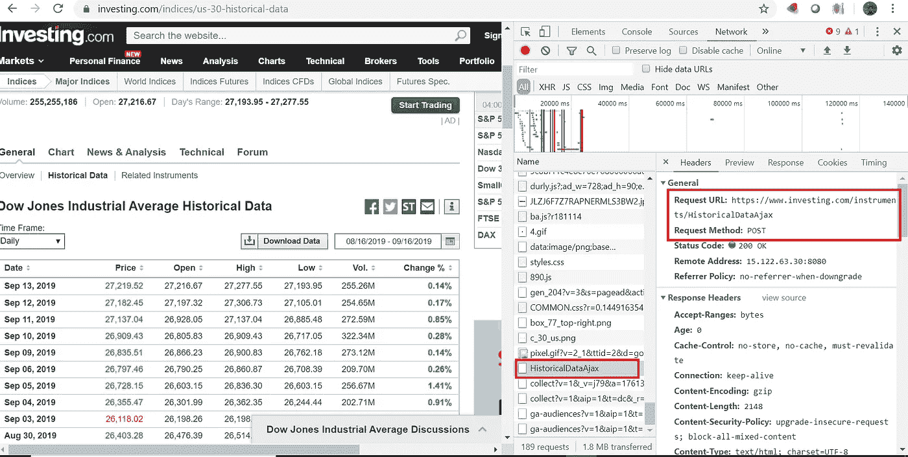
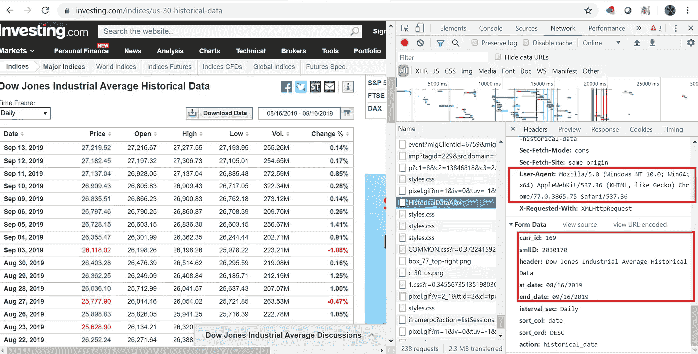

# Python 实用程序用于废弃历史金融数据- ML 数据挖掘

> 原文：<https://medium.datadriveninvestor.com/python-utility-for-data-scrapping-historical-financial-data-ml-data-mining-5396dfe6f38c?source=collection_archive---------2----------------------->

> **目的**——这篇文章解释了从公共领域[(*https://www.investing.com/indices/major-indices*)](https://www.investing.com/indices/major-indices)中挖掘一些重要金融信息的 python 实用程序

创建机器学习模型的一个重要方面是识别正确的数据集来建立模型。一旦数据被识别，就有一个具有挑战性的部分来挖掘**正确/真实的**历史数据，以便训练机器学习模型。我的目标是预测 Nifty-50 的趋势，因此我需要因变量的历史数据，如布伦特原油价格、美元/印度卢比价格、印度 VIX(波动指数)、恒生指数价格、道琼斯指数价格和富时指数价格。此外，investing.com 就是这样一种公开可用的资源，它以 EOD(日终)格式[](https://www.investing.com/indices/major-indices)*提供所有必需的因变量的历史数据*

*[](https://www.datadriveninvestor.com/2019/02/07/8-skills-you-need-to-become-a-data-scientist/) [## 成为数据科学家所需的 8 项技能|数据驱动型投资者

### 数字吓不倒你？没有什么比一张漂亮的 excel 表更令人满意的了？你会说几种语言…

www.datadriveninvestor.com](https://www.datadriveninvestor.com/2019/02/07/8-skills-you-need-to-become-a-data-scientist/) 

第一步是通过分析浏览器中的网络请求/响应来理解和找到 api (ajax call)请求



Request URL



URL payload parameters

当从上述步骤中获得请求有效负载参数时，重复相同的步骤以获得其他因变量的有效负载参数(美元/印度卢比价格、印度 VIX、恒生指数价格、道琼斯指数价格和富时指数价格)。最后，最后一步是获取 pandas 数据帧中的数据，并按照进一步训练机器学习模型所需的正确格式解析它。* 

```
**# -*- coding: utf-8 -*-*
*"""*
*@author: raiak*
*"""*

**import** **requests**
**from** **bs4** **import** BeautifulSoup
**import** **pandas** **as** **pd**
**import** **csv**
**from** **datetime** **import** date
**import** **datetime**

today = date.today()
today=date.strftime(today,'**%d**/%m/%Y')
urlheader = {
  "User-Agent": "Mozilla/5.0 (X11; Linux x86_64) AppleWebKit/537.36 (KHTML, like Gecko) Chrome/50.0.2661.75 Safari/537.36",
  "X-Requested-With": "XMLHttpRequest"
}
filename=['BrentCrude.csv','DowHistorical.csv','FTSE_Historical.csv','HangSeng_Historical.csv','India VIX Historical Data.csv',
          'USD_INR_Historical.csv']
url = "https://in.investing.com/instruments/HistoricalDataAjax"

**for** each **in** filename:
    **with** open(each, 'r') **as** readFile:
        reader = csv.reader(readFile)
        lines = list(reader)
    startdate=lines[1][0]
    startdate=datetime.datetime.strptime(startdate,'**%d**-%b-%y')
    startdate += datetime.timedelta(days=1)
    startdate=startdate.strftime('**%d**/%m/%Y')
    readFile.close() **if** (each == 'BrentCrude.csv'):
        header="Brent Oil Futures Historical Data"
        curr_id="8833"
        smlID= "300028"
        column_name='Brent Crude Price' **elif** (each == 'DowHistorical.csv'):
        header="Dow Jones Industrial Average Historical Data"
        curr_id="169"
        smlID= "2030170"
        column_name='Dow Price' **elif** (each == 'FTSE_Historical.csv'):
        header="FTSE 100 Historical Data"
        curr_id="27"
        smlID= "2030166"
        column_name='FTSE' **elif** (each == 'HangSeng_Historical.csv'):
        header="Hang Seng Historical Data"
        curr_id="179"
        smlID= "2030179"
        column_name='Hang Seng Price' **elif** (each == 'India VIX Historical Data.csv'):
        header="India VIX Historical Data"
        curr_id="17942"
        smlID= "2036406"
        column_name='Volatility Index VIX' **elif** (each == 'USD_INR_Historical.csv'):
        header="USD/INR Historical Data"
        curr_id="160"
        smlID= "106815"
        column_name='USD-INR price'

    payload = {'header': header, 
               'st_date': startdate, 'end_date': today, 
               'sort_col': 'date', 'action': 'historical_data', 
               'smlID': smlID, 'sort_ord': 'DESC', 'interval_sec': 'Daily', 'curr_id': curr_id}

    req = requests.post(url, headers=urlheader, data=payload)
    soup = BeautifulSoup(req.content, "lxml")
    table = soup.find('table', id="curr_table")
    split_rows = table.find_all("tr")
    rows = table.findAll('tr')
    header_text = []
    headers = rows[0]

    *# add the header text to array*
    **for** th **in** headers.findAll('th'):
        header_text.append(th.text)

    **del** header_text[2:]

    row_text_array = []
    **for** row **in** rows[1:]:
        row_text = []
        *# loop through the elements*
        **for** row_element **in** row.findAll(['th', 'td']):
            *# append the array with the elements inner text*
            row_text.append(row_element.text.replace('**\n**', '').strip())
        **del** row_text[2:]
        *# append the text array to the row text array*
        row_text_array.append(row_text)

    df = pd.read_csv(each)

    df1 = pd.DataFrame(row_text_array)

    df1.rename(columns={0:'Date',1:column_name}, inplace=**True**)
    df=df.append(df1,sort=**False**)
    df=df.dropna()
    df['Date']= pd.to_datetime(df['Date'])
    df = df.sort_values('Date',ascending=**False**)

    df['Date']= df['Date'].dt.strftime('**%d**-%b-%y')
    print(df.head(3))
    df.to_csv(each,index=**False**)Date  Brent Crude Price
0  16-Sep-19              65.50
1  15-Sep-19              68.41
2  13-Sep-19              60.22
        Date  Dow Price
0  16-Sep-19  27,110.89
1  13-Sep-19  27,219.52
2  12-Sep-19  27,182.45
        Date      FTSE
0  16-Sep-19  7,352.98
1  13-Sep-19  7,367.46
2  12-Sep-19  7,344.67
        Date Hang Seng Price
0  16-Sep-19       27,124.55
1  13-Sep-19       27,352.69
2  12-Sep-19       27,087.63
        Date  Volatility Index VIX
0  16-Sep-19                 14.93
1  13-Sep-19                 14.12
2  12-Sep-19                 14.90
        Date  USD-INR price
0  16-Sep-19         71.544
1  13-Sep-19         70.985
2  12-Sep-19         70.967*
```

*上面的代码显示了从上一次运行迭代开始的数据增量更新。此代码旨在与 RPA bot(UIPath)集成，以定期收集数据来训练机器学习模型并进行预测。例如，如果“BrentCrude.csv”文件包含从上一次运行的开始日期-“2010 年 1 月 1 日”到结束日期-“2019 年 9 月 12 日”的数据，那么在下一次运行时，“结束日期”=今天的日期和开始日期将是上一次运行的结束日期+1，即开始日期=“2019 年 9 月 13 日”。如果没有以前的记录，只需相应地指定变量 startdate 的值。*

***GitHub 链接**-[https://GitHub . com/raiak 82/utility functions-data mining-and-data pre-Processing/blob/master/financial data mining . ipynb](https://github.com/raiak82/UtilityFunctions-DataMining-and-DataPre-Processing/blob/master/financialDataMining.ipynb)*