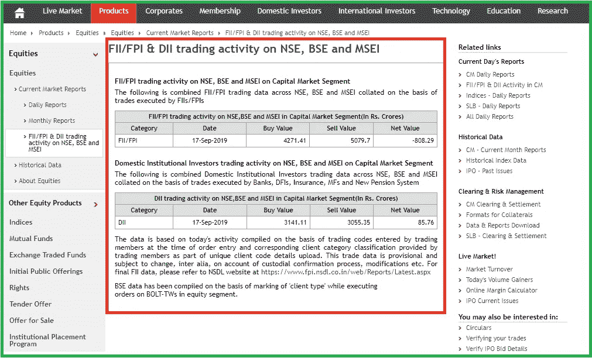
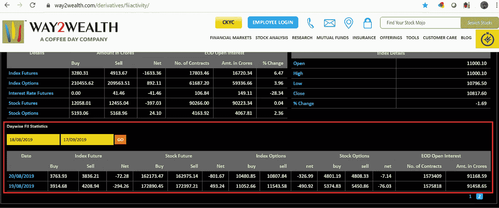

# 用于废弃历史 FII 数据的 Python 实用程序- ML 数据挖掘

> 原文：<https://medium.datadriveninvestor.com/python-utility-for-scrapping-historical-fii-data-ml-data-mining-a804a885df15?source=collection_archive---------5----------------------->

> **目的**——提供 python 实用函数，从公开可用的资源(【https://www.way2wealth.com/derivatives/fiiactivity/】)中获取历史 FII(外国机构投资者)数据



FII & DII activity on NSE daily basis ([https://www.nseindia.com/products/content/equities/equities/fii_dii_market_today.htm](https://www.nseindia.com/products/content/equities/equities/fii_dii_market_today.htm))

FII(外国机构投资者)Nifty 指数的每日活动数据，即期货/期权净交易值，是预测 Nifty 趋势势头的重要自变量之一。 [Way2Wealth](https://www.way2wealth.com/derivatives/fiiactivity/)) 提供 FII 每日活动的历史数据。



FII day wise data

```
*# -*- coding: utf-8 -*-*
*"""*
*@author: raiak*
*"""*
**import** **time**
**from** **selenium.webdriver.chrome** **import** webdriver
**import** **pandas** **as** **pd**
**from** **selenium.common.exceptions** **import** NoSuchElementException

**class** **FIIDataImport**():

    *# Creating an empty Dataframe with column names only*
    dfObj = pd.DataFrame(columns=['Date', 'IndexBuy', 'IndexSell','IndexNet','StockBuy','StockSell','StockNet','IndexOptionBuy','IndexOptionSell','IndexOptionNet','StockOptionBuy','StockOptionSell','StockOptionNet','Contracts','Amount'])
    options = webdriver.Options()
    element_present=**True**
    options.add_argument("--start-maximized")
    driver = webdriver.WebDriver("chromedriver.exe",options=options)
    driver.get("https://www.way2wealth.com/derivatives/fiiactivity/");
    time.sleep(10);
    driver.find_element_by_id("ctl00_ContentPlaceHolder1_ctl00_txtstart").clear();

    *# Change date to fetch data from specific date*
    driver.find_element_by_id("ctl00_ContentPlaceHolder1_ctl00_txtstart").send_keys("01/08/2019"); 
    driver.find_element_by_id("ctl00_ContentPlaceHolder1_ctl00_btngo").click();

    iterate_pages=2
    page_before_xpath="//*[@id='ctl00_ContentPlaceHolder1_ctl00_grdboard']/tbody/tr[19]/td/table/tbody/tr/td[";
    page_afterXpath="]/a";
    on_pageXpath=page_before_xpath+str(iterate_pages)+page_afterXpath;

    time.sleep(10);

    **while** element_present:
        **for** j **in** range (2,12):
            date_element_present=**True**
            beforeXpath= "//*[@id='ctl00_ContentPlaceHolder1_ctl00_grdboard']/tbody/tr[";
            afterXpath_Date="]/td[1]";
            afterXpath_IndexBuy="]/td[3]";
            afterXpath_IndexSell="]/td[4]";
            afterXpath_IndexNet="]/td[5]";
            afterXpath_StockBuy="]/td[7]";
            afterXpath_StockSell="]/td[8]";
            afterXpath_StockNet="]/td[9]";
            afterXpath_IndexOptionBuy="]/td[11]";
            afterXpath_IndexOptionSell="]/td[12]";
            afterXpath_IndexOptionNet="]/td[13]";
            afterXpath_StockOptionBuy="]/td[15]";
            afterXpath_StockOptionSell="]/td[16]";
            afterXpath_StockOptionNet="]/td[17]";
            afterXpath_ContractsNumber="]/td[19]";
            afterXpath_Amount="]/td[20]";
            **for** h **in** range (1,19):

                finalXpath=beforeXpath+str(h)+afterXpath_IndexBuy;
                **try**:
                    IndexBuy=driver.find_element_by_xpath(finalXpath);
                    date_element_present=**True**
                **except** NoSuchElementException:
                    date_element_present=**False**

                **if** date_element_present:
                    finalXpath=beforeXpath+str(h)+afterXpath_Date;                    
                    Date=driver.find_element_by_xpath(finalXpath).text;

                    finalXpath=beforeXpath+str(h)+afterXpath_IndexBuy;
                    IndexBuy=driver.find_element_by_xpath(finalXpath).text;

                    finalXpath=beforeXpath+str(h)+afterXpath_IndexSell;
                    IndexSell=driver.find_element_by_xpath(finalXpath).text;

                    finalXpath=beforeXpath+str(h)+afterXpath_IndexNet;
                    IndexNet=driver.find_element_by_xpath(finalXpath).text;

                    finalXpath=beforeXpath+str(h)+afterXpath_StockBuy;
                    StockBuy=driver.find_element_by_xpath(finalXpath).text;

                    finalXpath=beforeXpath+str(h)+afterXpath_StockSell;
                    StockSell=driver.find_element_by_xpath(finalXpath).text;

                    finalXpath=beforeXpath+str(h)+afterXpath_StockNet;
                    StockNet=driver.find_element_by_xpath(finalXpath).text;

                    finalXpath=beforeXpath+str(h)+afterXpath_IndexOptionBuy;
                    IndexOptionBuy=driver.find_element_by_xpath(finalXpath).text;

                    finalXpath=beforeXpath+str(h)+afterXpath_IndexOptionSell;
                    IndexOptionSell=driver.find_element_by_xpath(finalXpath).text;

                    finalXpath=beforeXpath+str(h)+afterXpath_IndexOptionNet;
                    IndexOptionNet=driver.find_element_by_xpath(finalXpath).text;

                    finalXpath=beforeXpath+str(h)+afterXpath_StockOptionBuy;
                    StockOptionBuy=driver.find_element_by_xpath(finalXpath).text;

                    finalXpath=beforeXpath+str(h)+afterXpath_StockOptionSell;
                    StockOptionSell=driver.find_element_by_xpath(finalXpath).text;

                    finalXpath=beforeXpath+str(h)+afterXpath_StockOptionNet;
                    StockOptionNet=driver.find_element_by_xpath(finalXpath).text;

                    finalXpath=beforeXpath+str(h)+afterXpath_ContractsNumber;
                    Contracts=driver.find_element_by_xpath(finalXpath).text;

                    finalXpath=beforeXpath+str(h)+afterXpath_Amount;
                    Amount=driver.find_element_by_xpath(finalXpath).text;

                    dfObj = dfObj.append({'Date': Date,'IndexBuy' : IndexBuy, 'IndexSell' : IndexSell, 'IndexNet' : IndexNet, 'StockBuy' : StockBuy, 'StockSell' : StockSell, 'StockNet' : StockNet,'IndexOptionBuy' : IndexOptionBuy, 'IndexOptionSell' : IndexOptionSell,'IndexOptionNet' : IndexOptionNet,'StockOptionBuy' : StockOptionBuy,'StockOptionSell': StockOptionSell,'StockOptionNet':StockOptionNet,'Contracts':Contracts,'Amount':Amount}, ignore_index=**True**)

            **try**:
                next_page=driver.find_element_by_xpath(on_pageXpath);
                element_present=**True**
                iterate_pages=iterate_pages+1;
                on_pageXpath=page_before_xpath+str(iterate_pages)+page_afterXpath;
            **except** NoSuchElementException:
                element_present=**False**
            **if** element_present:
                driver.execute_script("arguments[0].click();", next_page);
                time.sleep(10);
            **else**:
                **break**;

    dfObj.to_csv('FII-Import-Data.csv')
    print(dfObj.head(3))
    driver.quit();Date IndexBuy IndexSell  IndexNet   StockBuy  StockSell StockNet  \
0  17/09/2019  3280.31   4913.67  -1633.36  210455.62  209563.51   892.11   
1  16/09/2019  3697.90   3397.41    300.49  176608.20  175428.17  1180.03   
2  13/09/2019  2700.90   3707.39  -1006.49  348323.78  343155.07  5168.71   

  IndexOptionBuy IndexOptionSell IndexOptionNet StockOptionBuy  \
0       12058.01        12455.04        -397.03        5193.06   
1       12170.65        12043.68         126.97        5900.69   
2       12171.43        12371.69        -200.26        5452.19   

  StockOptionSell StockOptionNet Contracts    Amount  
0         5168.96          24.10   1515599  90266.00  
1         5896.21           4.48   1505514  90223.34  
2         5465.17         -12.98   1492675  88733.32
```

为了使用这段代码，下载 chrome driver-web driver*并将其放在与上述代码相同的位置，如果还没有安装 selenium (pip install selenium)和 pandas (pip install pandas)。给你:)*

*[](https://www.datadriveninvestor.com/2019/02/07/8-skills-you-need-to-become-a-data-scientist/) [## 成为数据科学家所需的 8 项技能|数据驱动型投资者

### 数字吓不倒你？没有什么比一张漂亮的 excel 表更令人满意的了？你会说几种语言…

www.datadriveninvestor.com](https://www.datadriveninvestor.com/2019/02/07/8-skills-you-need-to-become-a-data-scientist/) 

从下面的代码行中更改开始日期，以便从特定的日期获取它，例如，“01/01/2011”

```
*# Change date to fetch data from specific date*
    driver.find_element_by_id("ctl00_ContentPlaceHolder1_ctl00_txtstart").send_keys("01/08/2019");
```

> 需要注意的是——每页只加载 18 条记录/行，因此如果用户计划获取过去几年的深层历史数据，将需要几个小时来废弃数据并将其存储在 csv 中。但是，它应该是一次性活动，因为在下一次运行时，它将只是一个增量更新。

***GitHub****-*[*https://GitHub . com/raiak 82/utility functions-data mining-and-data pre-Processing/blob/master/FII-data import . ipynb*](https://github.com/raiak82/UtilityFunctions-DataMining-and-DataPre-Processing/blob/master/FII-DataImport.ipynb)*