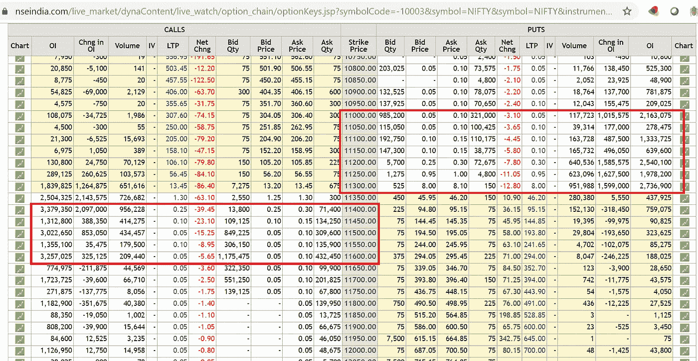
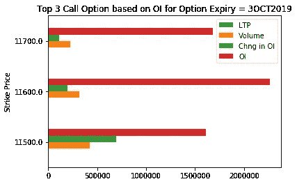
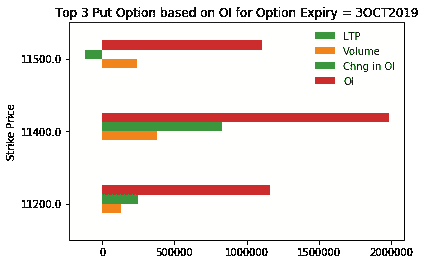
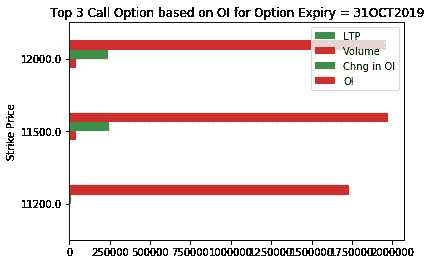
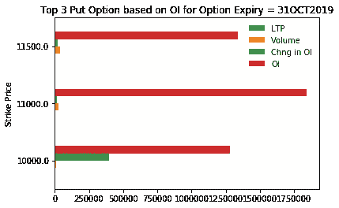

# Python 实用程序基于实时的每周和每月期权链数据导出漂亮的支持和阻力区——这是交易机器人触发盈利预订或亏损预订的重要功能

> 原文：<https://medium.datadriveninvestor.com/python-utility-to-derive-nifty-support-and-resistance-zone-based-on-live-weekly-monthly-option-1b02bd3b31dd?source=collection_archive---------0----------------------->

***用途****——Python 效用函数取实时 top 3 调用&放基于 OI(未平仓利息)的俏皮的执行价格。这些数据为理解指数期权链数据的近到期和远到期的阻力和支持区域提供了有用的信息。*

有许多输入，如 OHLCV(开盘价、最高价、最低价、收盘价和成交量)以及不同类型的技术指标，交易者通过分析这些指标来进入和退出股票市场。同样，期权链或期权矩阵为交易者了解阻力和支持区域提供了重要信息，交易者必须在市场方向转向之前在这些区域记录利润或损失。

[](https://www.datadriveninvestor.com/2019/01/23/which-is-more-promising-data-science-or-software-engineering/) [## 数据科学和软件工程哪个更有前途？数据驱动的投资者

### 大约一个月前，当我坐在咖啡馆里为一个客户开发网站时，我发现了这个女人…

www.datadriveninvestor.com](https://www.datadriveninvestor.com/2019/01/23/which-is-more-promising-data-science-or-software-engineering/) 

期权链数据为不同执行价格的给定证券提供期权合约，包括看跌和看涨。好吧，要看的重要参数是未平仓合约(OI) &不同执行价格下 OI 的变化。这些数据提供了非常有用的信息，说明 FII(外国机构投资者)目前对证券或指数的下限和上限的押注。这对于 Nifty 指数或 BankNifty 指数等指数来说基本成立，因为指数的运动主要取决于宏观因素(如原油价格、美元价格、降息、企业减税等)。)而不是股票或特定部门的新闻(如内幕新闻、发起人质押股票、公司治理等)。)



Nifty Option Chain Expiry 3rd October 2019

外国投资者是衍生品市场的主导者，在这个市场上，他们实际上没有来自国内机构投资者的竞争。期权溢价收入是外国投资者收入或利润的主要来源之一。因此，在看涨和看跌期权的给定执行价格下具有最大未平仓利益的 OI 提供了 Nifty 指数的阻力和支撑区域。在这些区域，漂亮的期货盈利预订或空头回补会相应发生。

下面的给定函数***next thu _ and _ last thu _ expiry _ date()****将获取下周四和月末到期的日期*

```
***def** nextThu_and_lastThu_expiry_date ():

    todayte = datetime.today()

    cmon = todayte.month
    if_month_next=(todayte + relativedelta(weekday=TH(1))).month
    next_thursday_expiry=todayte + relativedelta(weekday=TH(1))

    **if** (if_month_next!=cmon):
        month_last_thu_expiry= todayte + relativedelta(weekday=TH(5))
        **if** (month_last_thu_expiry.month!=if_month_next):
            month_last_thu_expiry= todayte + relativedelta(weekday=TH(4))
    **else**:
        **for** i **in** range(1, 7):
            t = todayte + relativedelta(weekday=TH(i))
            **if** t.month != cmon:
                *# since t is exceeded we need last one  which we can get by subtracting -2 since it is already a Thursday.*
                t = t + relativedelta(weekday=TH(-2))
                month_last_thu_expiry=t
                **break**
    str_month_last_thu_expiry=str(int(month_last_thu_expiry.strftime("**%d**")))+month_last_thu_expiry.strftime("%b").upper()+month_last_thu_expiry.strftime("%Y")
    str_next_thursday_expiry=str(int(next_thursday_expiry.strftime("**%d**")))+next_thursday_expiry.strftime("%b").upper()+next_thursday_expiry.strftime("%Y")
    **return** (str_next_thursday_expiry,str_month_last_thu_expiry)str_next_thursday_expiry,str_month_last_thu_expiry=nextThu_and_lastThu_expiry_date()*
```

## *print(" Next Expiry Date = "+str _ Next _ 星期四 _ Expiry)
print(" Month End Expiry Date = "+str _ Month _ last _ thu _ Expiry)

**Next Expiry Date = 3 oct 2019**

Month End Expiry Date = 31 oct 2019*

*下面的函数使用从上面获得的日期从 NSE 中获取近周到期和月末到期的漂亮期权链数据。图像中显示的期权链数据非常庞大，显示了不同的执行价格和大量的信息。因此，我创建了一个函数，该函数将获得 Nifty 看涨和看跌期权的前 3 个执行价格以及最后交易价格(LTP)、交易量、OI 变化、OI(未平仓权益)*

```
***def** optionChain (expirydate):

    urlheader = {
      "User-Agent": "Mozilla/5.0 (Windows NT 10.0; Win64; x64) AppleWebKit/537.36 (KHTML, like Gecko) Chrome/77.0.3865.90 Safari/537.36",
      "authority": "www.nseindia.com",
      "scheme":"https"
    }

    url="https://www.nseindia.com/live_market/dynaContent/live_watch/option_chain/optionKeys.jsp?"
    params="segmentLink=17&instrument=OPTIDX&symbol=NIFTY&date="
    *#expirydate="3OCT2019"*

    url_encoded=url + params + expirydate

    req = requests.get(url_encoded, headers=urlheader)
    soup = BeautifulSoup(req.content, "lxml")
    table = soup.find('table', id="octable")

    rows = table.findAll('tr')
    header_text = []
    headers = rows[1] *# removing columns from call and put dataframe which are not needed such as Bid Qty, Bid Price, Ask Price etc..* remove_indices_for_put = [0,1,2,3,4,5,6,7,8,9,10,12,13,14,15,16,18,22]
    remove_indices_for_call = [0,4,6,7,8,9,10,12,13,14,15,16,17,18,19,20,21,22]

    *# add the header text to array*
    **for** th **in** headers.findAll('th'):
        header_text.append(th.text)

    header_text = [i **for** j, i **in** enumerate(header_text) **if** j **not** **in** remove_indices_for_put]
    df_call = pd.DataFrame(columns=header_text)
    df_put = pd.DataFrame(columns=header_text)

    *#row_text_array = []*
    **for** row **in** rows[2:-1]:
        row_text = []
        row_text_call = []
        row_text_put = []
        *# loop through the elements*
        **for** row_element **in** row.findAll(['th', 'td']):
            *# append the array with the elements inner text*
            row_text.append(row_element.text.replace('**\n**', '').strip())

        *# append the text array to the row text array*
        row_text_put = [i **for** j, i **in** enumerate(row_text) **if** j **not** **in** remove_indices_for_put]
        **for** i **in** range(len(row_text_put)):
            **if** (row_text_put[i]=='-'):
                row_text_put[i]=0
            **else**:
                row_text_put[i]=row_text_put[i].replace(',', '')
                row_text_put[i]=float(row_text_put[i])
        row_text_call = [i **for** j, i **in** enumerate(row_text) **if** j **not** **in** remove_indices_for_call]
        row_call_temp=[**None**] * len(row_text_call)
        **for** i **in** range(len(row_text_call)):       
            **if** (row_text_call[i]=='-'):
                row_call_temp[len(row_text_call)-i-1]=0
            **else**:
                row_text_call[i]=row_text_call[i].replace(',', '')
                row_text_call[i]=float(row_text_call[i])
                row_call_temp[len(row_text_call)-i-1]=row_text_call[i]
        df_call = df_call.append(pd.Series(dict(zip(df_call.columns, row_call_temp))), ignore_index=**True**)
        df_put = df_put.append(pd.Series(dict(zip(df_put.columns, row_text_put))), ignore_index=**True**)    

    df_call['OI'] = pd.to_numeric(df_call['OI'])
    df_call=df_call.nlargest(3, ['OI'])
    df_call.set_index('Strike Price', inplace=**True**)
    print("Top 3 Strike price of Call Option based on Open Interest for Expiry Date = "+expirydate)
    df_call=df_call.sort_index(axis = 0) 
    print(df_call)

    df_call.plot.barh(title='Top 3 Call Option based on OI for Option Expiry = '+expirydate)

    print("================================================================================") 
    df_put['OI'] = pd.to_numeric(df_put['OI'])
    df_put=df_put.nlargest(3, ['OI'])
    df_put.set_index('Strike Price', inplace=**True**)
    print("Top 3 Strike price of Put Option based on Open Interest for Expiry Date = "+expirydate)
    print(df_put)
    df_put=df_put.sort_index(axis = 0) 
    df_put.plot.barh( title='Top 3 Put Option based on OI for Option Expiry = '+expirydate)
    **return**(df_call,df_put)print("Call/Put Option data of next Thursday expiry =  "+str_next_thursday_expiry)

df_call_near_expiry,df_put_near_expiry=optionChain(str_next_thursday_expiry)**Call/Put Option data of next Thursday expiry =  3OCT2019

Top 3 Strike price of Call Option based on Open Interest for Expiry Date = 3OCT2019
                LTP    Volume  Chng in OI         OI
Strike Price                                        
11500.0       60.00  423953.0    696825.0  1609575.0
11600.0       25.60  318676.0    198225.0  2265975.0
11700.0        9.75  228059.0    109725.0  1685325.0***
```

**

```
 ***Top 3 Strike price of Put Option based on Open Interest for Expiry Date = 3OCT2019
                LTP    Volume  Chng in OI         OI
Strike Price                                        
11400.0       23.90  376299.0    827400.0  1983900.0
11200.0        4.50  130578.0    245250.0  1164075.0
11500.0       60.55  238375.0   -122475.0  1108725.0***
```

**

```
 *print("Call/Put Option data of last Thursday of a month expiry =  "+str_month_last_thu_expiry)
df_put_near_expiry,df_put_last_expiry=optionChain(str_month_last_thu_expiry)

**Call/Put Option data of last Thursday of a month expiry =  31OCT2019
Top 3 Strike price of Call Option based on Open Interest for Expiry Date = 31OCT2019
                LTP   Volume  Chng in OI         OI
Strike Price                                       
11200.0       425.0   2186.0      7800.0  1732350.0
11500.0       224.0  40028.0    247650.0  1974000.0
12000.0        43.6  41541.0    242400.0  1961100.0*** 
```

**

```
***Top 3 Strike price of Put Option based on Open Interest for Expiry Date = 31OCT2019
                LTP   Volume  Chng in OI         OI
Strike Price                                       
11000.0        48.2  25830.0     18300.0  1841850.0
11500.0       180.0  36932.0     23925.0  1336500.0
10000.0         3.6   9618.0    396825.0  1282650.0*** 
```

**

*请注意:-据观察，选项链数据在 5-10 分钟内更新。*

*现在，有多种方法可以使用前 3 名看涨和看跌期权数据，首先，当 nifty 指数的现货价格在支撑区附近交易时(OI 最高的看跌期权的执行价格)，它可以用于建立 Nifty 期货的新多头头寸，或者当指数在阻力区附近交易时(OI 最高的看涨期权的执行价格)，建立 Nifty 期货的空头头寸。*

*更重要的是，如果一个人使用 OpenAI 健身房空间创建了一个 AI 机器人，其中机器人使用 10 或 15 分钟的烛台模式结合不同的功能来占据一个位置，那么阻力和支持罢工价格就很方便了。人们可以在 OpenAI 健身房空间中嵌入逻辑，以根据每周和每月到期日的期权链数据触发账面利润区和止损。*

*[***GitHub 链接***](https://github.com/raiak82/UtilityFunctions-DataMining-and-DataPre-Processing/blob/master/niftyOptionChain.ipynb) ***的代码:)****