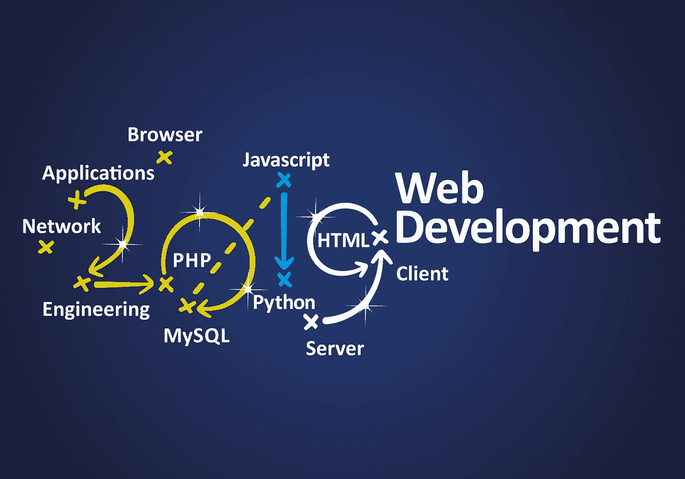

# Python 与 PHP 的 Web 开发:定制后端选择什么

> 原文：<https://medium.datadriveninvestor.com/python-vs-php-for-web-development-what-to-choose-for-custom-backend-3d9e2e9c5978?source=collection_archive---------17----------------------->

如今很难找到一个好的后端开发者，因为几乎每个企业都需要一个网站或一个必须连接到服务器的移动应用。全国各地的公司都向拥有管理后端所需技能的开发人员提供高薪。构建 web 应用后端最常用的语言有:

*   python——相当新，有巨大的库支持
*   PHP——已经存在很长时间了，被许多大公司使用，比如脸书
*   JavaScript——这种语言在所有技能水平的程序员中都很流行，目前占据了巨大的市场份额
*   。NET —主要由企业使用

在本文中，我们将只看前两种，以及哪一种更适合您:Python 或 PHP。

# Python 与 PHP 性能对比

人们更喜欢 Python 而不是 PHP 的原因之一是因为它简单易学。事实上，大多数编程课程都是从教学生 Python 开始的，这样他们就可以学到所有的基础知识。这种简单性让 Python 无论是新手还是有经验的开发者都竖起了大拇指，因为与其他语言相比，它的代码可读性更好。

在社区支持方面，他们是平等的。尽管 Python 比较新，但它仍然有一个令人印象深刻的开发人员社区准备提供支持。当谷歌开始使用 Python 来构建他们一些最知名的应用程序(如 YouTube)时，Python 开始变得流行起来，许多其他知名公司也纷纷效仿，开始使用 Python 来构建他们的网络应用程序。这份名单包括 Instagram、Pinterest 和 Reddit 等。

就调试而言，Python 有一个非常强大的调试器，叫做 PDB。上面有很多可用的文档，而且非常容易使用，即使对于刚入门的人来说也是如此。PHP 也提供了一个调试器，但就像语言本身一样，它更难使用。

# Python 与 PHP 的速度

就速度而言，PHP 比 Python 快，这将显著提高性能。这样的速度在处理大量数据时特别有用。例如，使用大量数据的银行应用程序需要这样的速度，以防止用户注意到备份。然而，大多数简单的应用程序不需要这样的速度，即使在处理时间上有某种延迟，也不会被注意到。

在框架方面，Python 经常与 Django 和 Flask 一起使用，而 PHP 经常使用 Laravel、YII 和 Symphony。Django 与 Python 有很多共同之处，例如，它非常易于扩展和使用，是创建[商业网站解决方案](https://skywell.software/web-development/)的好选择。

# Python 与 PHP 在 Web 开发中的比较

到目前为止，我们已经谈了很多关于使用 Python 有多简单，以及为什么很多公司喜欢它。然而，我们需要记住 PHP 是专门为创建 web 应用程序而设计的。PHP 和 Python 之间的区别在于，PHP 被创建时只有一个目的，从未打算用作多用途语言。Web 应用程序比独立程序更复杂，因此 PHP 需要更先进，以适应其最初的目的。考虑到这一点，PHP 应该是 web 开发的最佳选择。

# 结论

虽然 PHP 确实是为 web 开发而创建的，但是您仍然必须考虑其他因素，例如您的团队的经验以及他们拥有的专业知识。如果你的团队没有太多的经验，你应该坚持使用 Python 来避免以后的问题。在运行中学习 PHP 是不可能的，如果你在代码中发现一些错误，这将需要比你现有的更高级的专业知识。

你还必须考虑 Python 的另一个优势，那就是它的库。Python 的库有很好的文档记录，你可以找到对几乎所有应用程序的支持。这样，即使你真的遇到了一些麻烦，你也能找到答案，而不需要从外面找任何人。然而，如果你有一个经验丰富的团队可以处理更复杂的编码，你也可以使用 PHP，因为它是专门为此目的而设计的。

很多还取决于你做什么，需要多少数据，你将使用多少数据。如果你的 web 应用程序需要处理大量的数据，那么你将别无选择，只能使用 PHP。收集你的应用程序的所有需求，然后看看你的团队中有哪些专家，并据此做出明智的决定。

*最初发表于*[*sky well . software*](https://skywell.software/blog/python-vs-php-for-web-development/)*。*