# PyTorch 深度学习纳米学位:卷积神经网络

> 原文：<https://medium.datadriveninvestor.com/pytorch-deep-learning-nano-degree-convolutional-neural-networks-b92ee1969bb7?source=collection_archive---------3----------------------->

纳米度的第三部分:CNN

[简介](https://medium.com/@artgor/pytorch-deep-learning-nanodegree-introduction-161817c22384)

[神经网络](https://medium.com/@artgor/pytorch-deep-learning-nanodegree-neural-nerworks-cf44a852be59)

*卷积神经网络*

[递归神经网络](https://medium.com/@artgor/pytorch-deep-learning-nanodegree-recurrent-neural-networks-894fce63469b)

[生成性对抗网络](https://medium.com/@artgor/pytorch-deep-learning-nanodegree-generative-adversarial-networks-bc37e2b50a81)

[部署模型](https://medium.com/@artgor/pytorch-deep-learning-nanodegree-deploying-a-model-b2a7f0ac0685)

[这趟旅程的终点](https://medium.com/@artgor/pytorch-deep-learning-nanodegree-the-end-of-this-journey-5c1d6eeb0026)

# 一般

在这一课中，我们学习卷积神经网络，尝试迁移学习和风格迁移，了解权重初始化的重要性，训练自动编码器和做许多其他事情。此外，我们将致力于第二个项目——狗品种分类器。

## 卷积神经网络

在这一课中，我们将学习更多关于神经网络的知识:写 MLP 和他们与 CNN 的比较，CNN 如何工作，图像增强，以及其他事情。我将跳过这一节。为什么？因为它对任何人都是免费的。Udacity 有一门免费课程:[神经网络入门](https://www.udacity.com/course/deep-learning-pytorch--ud188)。本课程第五课包含了这一课，有兴趣的可以过一遍。

## 迁移学习

迁移学习广泛应用于许多计算机视觉问题，例如图像分类和分割。基本上，它是这样工作的:有人在 ImageNet 或其他一些大型图像数据集上训练一个深度 CNN，并将其提供给公众使用。现在，我们可以使用这个具有预训练权重的模型，并将其应用于我们在较小数据集上的任务，模型的质量通常会比我们试图从头开始训练新模型的质量更高。

[迁移学习](https://www.youtube.com/watch?v=yfPEROi3SPU) —简短描述迁移学习的视频。

[有用层](https://www.youtube.com/watch?v=kn4BN7z3UGQ)——关于预训练权重层的更多信息。

[微调](https://www.youtube.com/watch?v=XOyb315xYbw) —如何使用预先训练好的神经网络。

根据我们的数据集，主要有四种情况:

1.  新数据集很小，新数据与原始训练数据相似。
2.  新数据集很小，新数据不同于原始训练数据。
3.  新数据集很大，新数据与原始训练数据相似。
4.  新数据集很大，新数据不同于原始训练数据。

**新数据集很小，新数据与原始训练数据相似。**

*   切掉神经网络的末端
*   添加与新数据集中的类数量相匹配的新全连接图层
*   随机化新的全连接层的权重；冻结预训练网络的所有权重
*   训练网络以更新新的全连接层的权重


Adding and training a fully-connected layer at the end of the NN.

由于新数据较小且与原始数据相似，我们可以保留大部分预训练的网络，只训练新添加的最后一个密集层。

**小数据集，不同数据**

*   除了靠近网络开始处的一些预训练层之外，切掉所有层
*   向剩余的预训练层添加与新数据集中的类别数量相匹配的新的全连接层
*   随机化新的全连接层的权重；冻结预训练网络的所有权重
*   训练网络以更新新的全连接层的权重

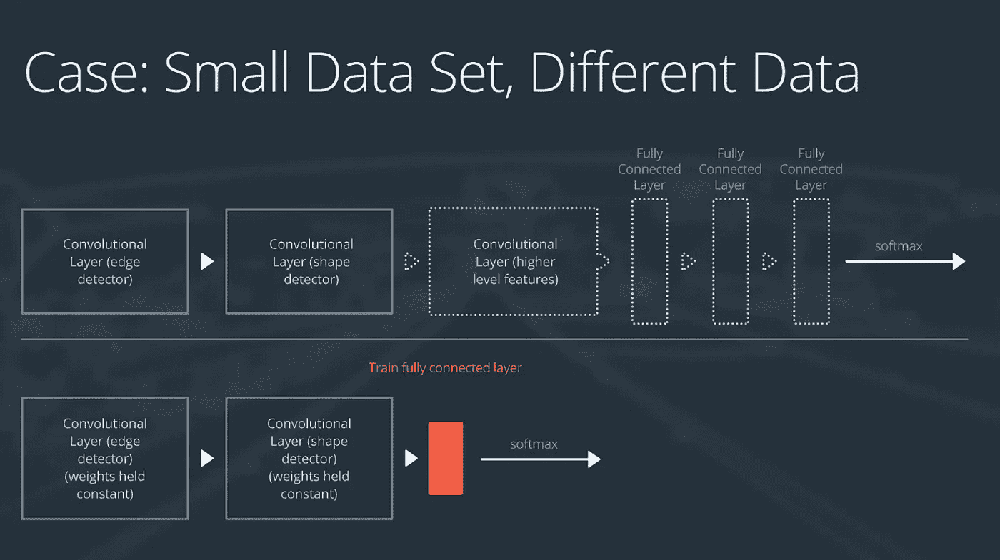

Remove all but the starting layers of the model, and add and train a linear layer at the end.

由于我们有不同的数据，我们不能使用整个预训练的网络-它的最后几层被训练来寻找不同的特征，所以它可能不会很好地处理我们的数据。如果我们只保留几个顶层(识别更一般的特征)，我们的模型将能够学习与我们的数据集相关的特征。

**大型数据集，相似数据**

*   移除最后一个完全连接的图层，并替换为与新数据集中的类数量相匹配的图层
*   随机初始化新的全连接层中的权重
*   使用预训练的权重初始化其余的权重
*   重新训练整个神经网络

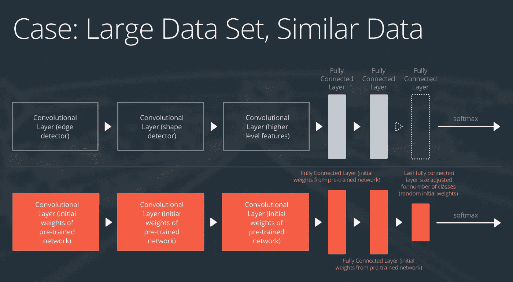

Utilizing pre-trained weights as a starting point!

这个想法是，如果我们在一个大数据集上训练整个网络，我们不会过度拟合。

**大数据集，不同数据**

*   移除最后一个完全连接的图层，并替换为与新数据集中的类数量相匹配的图层
*   用随机初始化的权重从头开始重新训练网络
*   或者，您可以使用与“大型且相似的”数据案例相同的策略

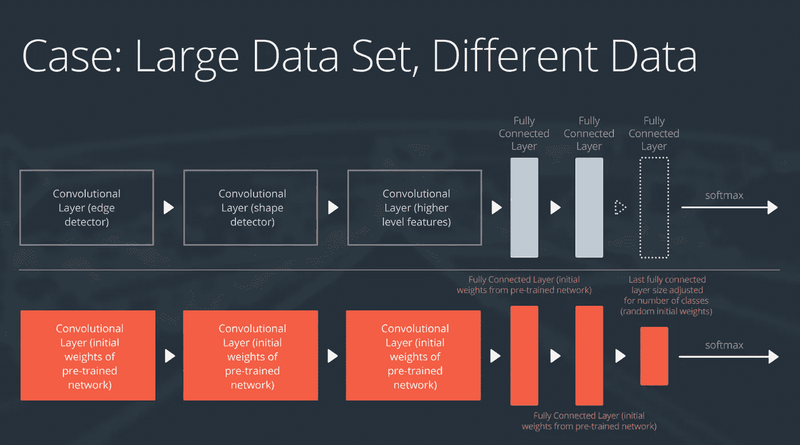

Fine-tune or retrain entire network.

这个想法是，如果我们有一个不同的数据集，我们将需要训练自己的网络。

[VGG 模型&分类器](https://www.youtube.com/watch?v=fOiQFXItYe4) —实用视频。

[冻结重量&最后一层](https://www.youtube.com/watch?v=ssNIX_2QfMQ)

[训练一个分类器](https://www.youtube.com/watch?v=4LniBMFI53g)

## 重量初始化

权重初始化真的很重要。不良的初始权值会使神经网络无法训练，因此应该使用良好的初始化方法。

[重量初始化](https://www.youtube.com/watch?v=Ehc60si91Wg)

[恒定重量](https://www.youtube.com/watch?v=zR4fECgeZ7Y)——如果我们设定恒定重量，会发生什么？

[随机制服](https://www.youtube.com/watch?v=FacdIomrLIw)

[一般规则](https://www.youtube.com/watch?v=YKe9iOUMmsI)

[正态分布](https://www.youtube.com/watch?v=xm43q4qD2tI) —正态分布的重量初始化

[解决方案和默认初始化](https://www.youtube.com/watch?v=xIn8XLbR1LM) —健身笔记本重量初始化解决方案。代码可在[这里](https://github.com/udacity/deep-learning-v2-pytorch/tree/master/weight-initialization)获得。

## 自动编码器

在这一课中，我们将学习自动编码器，它可以将数据压缩到一个更小的特征空间，然后将其转换回原始尺寸。代码在这里:[https://github . com/uda city/deep-learning-v2-py torch/tree/master/auto encoder](https://github.com/udacity/deep-learning-v2-pytorch/tree/master/autoencoder)

[自动编码器](https://www.youtube.com/watch?v=a5zHMWOq0fc) —一般信息

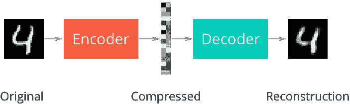

最简单的自动编码器是线性自动编码器。我们将学习使用 in 来压缩 MNIST 数据集中的数字。

[定义&训练自动编码器](https://www.youtube.com/watch?v=OWrlQUSGqyo)

[一个简单的解决方案](https://www.youtube.com/watch?v=Jh3mbomqpw8)

[可学习的上采样](https://www.youtube.com/watch?v=KjztLwPksj8) — CNN 显然比线性模型更擅长上采样。

[转置卷积](https://www.youtube.com/watch?v=hnnLAC1Q0zg)

卷积自动编码器使用卷积层，比线性编码器更好。

[卷积自动编码器](https://www.youtube.com/watch?v=QCA8QeZeDW8)

[卷积解](https://www.youtube.com/watch?v=2_Yw9LLomCo)

[上采样&去噪](https://www.youtube.com/watch?v=XX63da4EPN0)

去噪自动编码器将随机噪声添加到输入数据中，从而使网络更好地泛化。

[去噪](https://www.youtube.com/watch?v=RIfEhKev24I)

## 风格转移

正如我在本系列的第一篇博文中所写的，风格转换允许您将一幅图像的风格转换为另一幅图像。

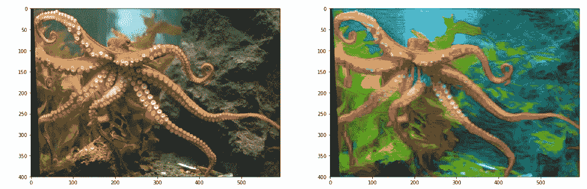

这一课在 Udacity 的免费课程中也有:[神经网络简介](https://www.udacity.com/course/deep-learning-pytorch--ud188)。本课程第六课包含了这一课，有兴趣的可以过一遍。可以在这里找到代码:[https://github . com/uda city/deep-learning-v2-py torch/tree/master/style-transfer](https://github.com/udacity/deep-learning-v2-pytorch/tree/master/style-transfer)

## 项目:犬种分类器

这是本课程的第二个专题。在这个项目中，我们将尝试建立一个算法，该算法将首先决定一幅图像包含一只狗还是一个人，然后它将预测狗的品种。这个项目的代码模板可以在这里找到:[https://github . com/uda city/deep-learning-v2-py torch/tree/master/project-dog-classification](https://github.com/udacity/deep-learning-v2-pytorch/tree/master/project-dog-classification)

让我们跟随项目的步骤吧！我们有两个数据集:13233 张人类照片和 8351 张狗的图像。

**检测人脸**

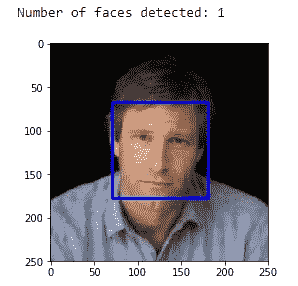

我们有一个使用 OpenCV 的人脸检测代码——简单的基于 Haar 特征的级联分类器。它工作正常，但不是很好，如下图所示:

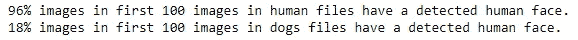

所以我决定使用一种不同的方法，并且使用了这个资源库中的代码:[https://github.com/TropComplique/mtcnn-pytorch](https://github.com/TropComplique/mtcnn-pytorch)

使用多任务级联卷积网络进行人脸检测，效果较好。但是在狗的图像上有很多假阳性。我想原因是这个模型是根据人脸定制的，即使没有人脸，它也会搜索人脸。

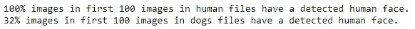

**侦查犬**

首先，我们使用基线方法:我们简单地使用预先训练的 VGG16 模型进行预测。这里有一个很好的技巧:你可以在这里看到所有 1000 个 ImageNet 类。关键字 151–268 描述了狗的品种，因此如果 VGG16 返回的预测值在这个范围内，我们可以说检测到了一只狗。这非常有效！

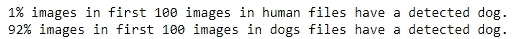

我对尝试其他方法很感兴趣，并使用了预先训练的 ResNet-18，结果甚至更好:

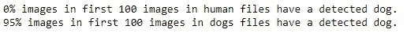

**从零开始训练 CNN 关于狗的品种**

下一步是训练我们自己的模型。首先，我们从头开始训练它(作为练习)。

我编写了我的自定义数据集类:

```
class DogsDataset(Dataset):
    def __init__(self, datafolder, transform = transforms.Compose([transforms.CenterCrop(32),transforms.ToTensor()])):
        self.datafolder = datafolder
        self.image_files_list = []
        self.transform = transform
        self.labels = []
        for folder in glob(datafolder + '/*'):
            for img in glob(folder + '/*'):
                self.labels.append(int(folder.split('.')[0][-3:]))
                self.image_files_list.append(img)

    def __len__(self):
        return len(self.image_files_list)def __getitem__(self, idx):
        img_name = self.image_files_list[idx]

        image = Image.open(img_name).convert('RGB')
        image = self.transform(image)

        label = self.labels[idx]
        return image, label
```

和多层 CNN:

```
class Net(nn.Module):
    def __init__(self):
        super(Net, self).__init__()
        self.conv1 = nn.Conv2d(3, 16, 3, stride=2, padding=1)
        self.conv2 = nn.Conv2d(16, 32, 3, stride=2, padding=1)
        self.conv3 = nn.Conv2d(32, 64, 3)
        self.pool = nn.MaxPool2d(2, 2)
        self.fc1 = nn.Linear(2304, 512)
        self.fc3 = nn.Linear(512, 133)
        self.dropout = nn.Dropout(0.1)def forward(self, x):
        x = self.pool(F.relu(self.conv1(x)))
        x = self.pool(F.relu(self.conv2(x)))
        x = self.pool(F.relu(self.conv3(x)))
        x = x.view(-1, 2304)
        x = self.dropout(x)
        x = F.relu(self.fc1(x))
        x = self.dropout(x)
        x = self.fc3(x)
        return x
```

它达到了 12%的测试精度(836 幅图像中的 104 幅)，足以通过这项任务。

**使用迁移学习训练 CNN**

在本节中，我再次使用 ResNet-18 创建了一个基线:

```
model_transfer = models.resnet18(pretrained=True)
for param in model_transfer.parameters():
    param.requires_grad = False
model_transfer.fc = nn.Linear(512, 133)
```

显然，它工作得更好，达到了 74%的准确率(623/836)。

**编写最终算法**

现在我们用下面的逻辑写了一个算法:

*   如果在图像中检测到一只**狗**，返回预测的品种。
*   如果在图像中检测到一个**人**，返回相似的狗品种。
*   如果在图像中没有检测到**或**，则提供一个指示错误的输出。

以下是一些结果:

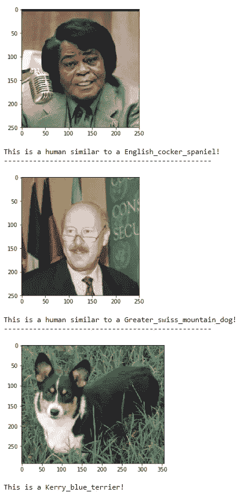

该算法工作得不是很好，我认为主要原因是 CNN 模型的数据集小和主干简单。如果我们有一个更好的模型和更多的数据，结果会更好。我想这与任何深度学习项目都是相关的:)

## 用于癌症检测的深度学习

在这节课中，巴斯蒂安·特龙向我们讲述了他用卷积神经网络检测皮肤癌的开创性工作。

[简介](https://www.youtube.com/watch?v=ZCpXvVdIdnY)

[皮肤癌](https://www.youtube.com/watch?v=70jGZeiTNgk)

[皮肤癌的生存概率](https://www.youtube.com/watch?v=QPlp3NeGuSk)

[医学分类](https://www.youtube.com/watch?v=RCOSP60dV7U)

[数据](https://www.youtube.com/watch?v=2RLbbV7MQNA)

[形象挑战](https://www.youtube.com/watch?v=Efnoj1KNPHw)

皮肤癌真的很难发现:

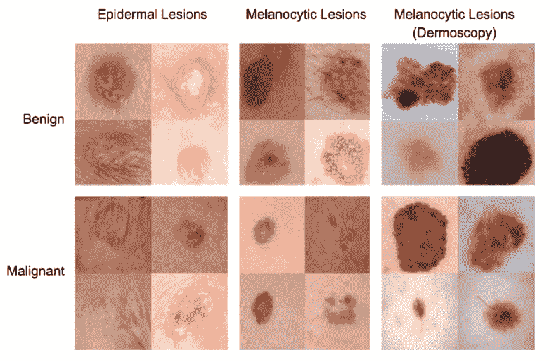

[训练神经网络](https://www.youtube.com/watch?v=HwiI-UXUx-M)

[随机与预初始化权重](https://www.youtube.com/watch?v=sOuoRZRKDzs)

[验证培训](https://www.youtube.com/watch?v=Oxm9ofvov3I)

[灵敏度和特异性](https://www.youtube.com/watch?v=GBZjyeMjKxc)

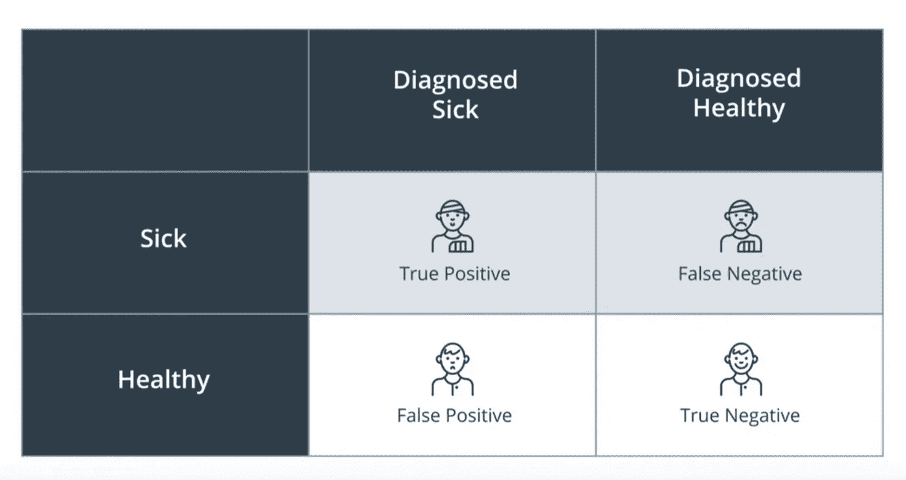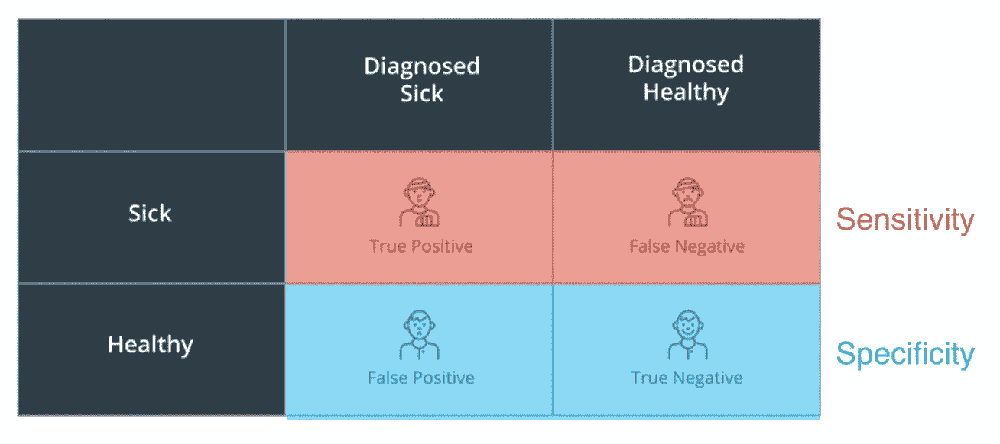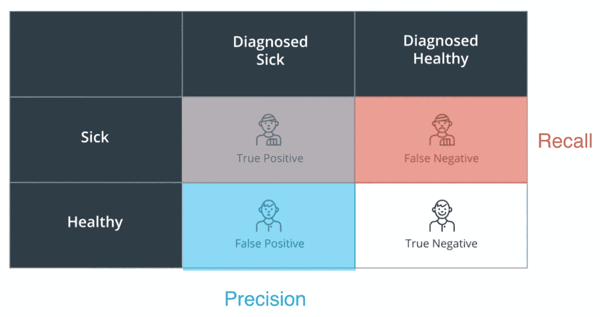

[诊断癌症](https://www.youtube.com/watch?v=IJYvt2ssUFk)

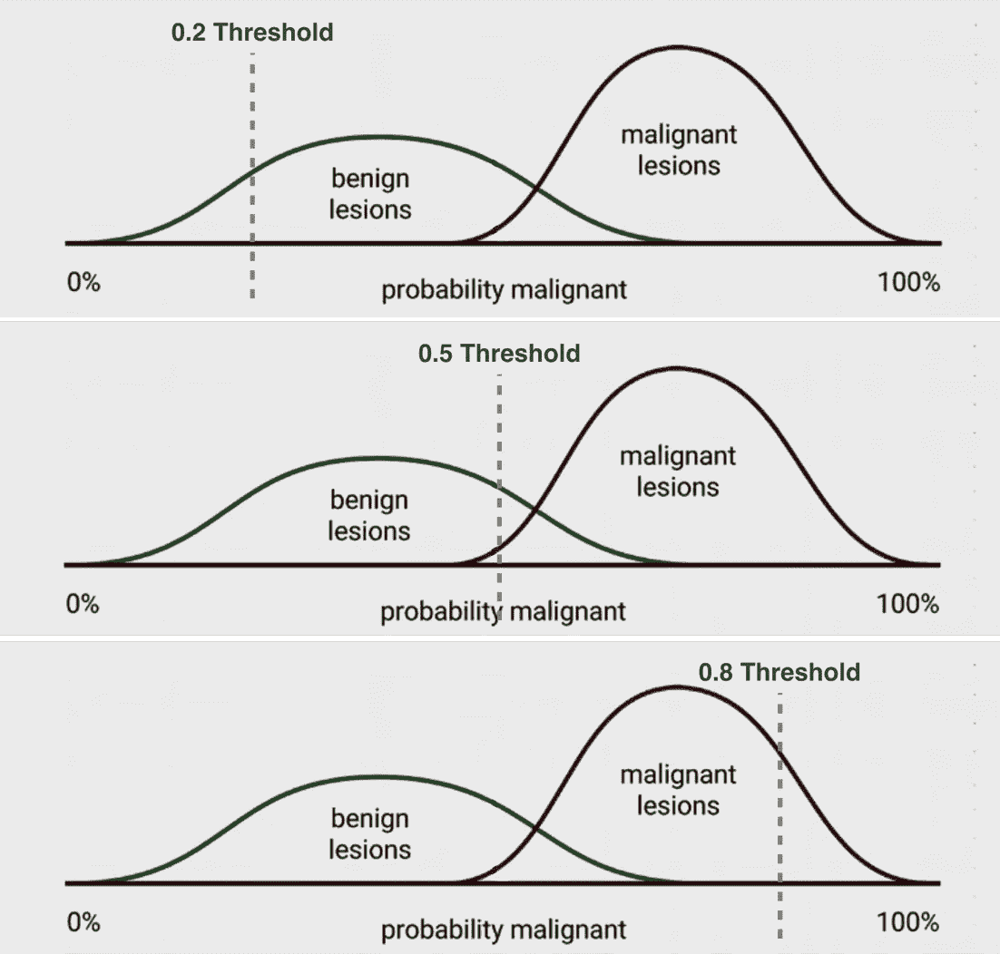

[刷新 ROC 曲线](https://www.youtube.com/watch?v=2Iw5TiGzJI4)

[ROC 曲线](https://www.youtube.com/watch?v=sdUUf6RRmXI)

[与医生比较我们的结果](https://www.youtube.com/watch?v=fWwe_JlpnlQ)

[可视化](https://www.youtube.com/watch?v=aGIGB4Ta3_A)

[网络在看什么？](https://www.youtube.com/watch?v=qN-rvoxPbBw)

[刷新混淆矩阵](https://www.youtube.com/watch?v=9GLNjmMUB_4)

[混淆矩阵](https://www.youtube.com/watch?v=3rpN-YYlfes)

[结论](https://www.youtube.com/watch?v=WhpE_8sTt-0)

## 深度学习领域的工作

在这一小段中，我们获得了许多关于深度学习的实用想法。

**如何打入深度学习行业？**

重要的是寻找机会，展示自己的技能！

*   保持更新:阅读 twitter/medium 和其他资源；
*   做工作调查，看看成功还需要哪些技能；
*   开发自己的 app/产品:这将证明你的技能；
*   阅读最近的论文，并编写自己的实现；

**发展附加技能**

你需要掌握许多纳米学位没有的技能，这里有一些例子:

*   通过我们的其他人工智能纳米学位课程或其他资源探索计算机视觉、自然语言处理和/或深度强化学习等领域
*   提高您在 C++(一种用于硬件的有用语言)中的编程能力
*   学习如何在 PyTorch 和 TensorFlow 中构建网络
*   使用 SQL 和应用数据分析技能，具体来说，如何清理数据或处理非常小或非常大的数据集

**典型的深度学习工程师在日常工作中做什么**

具体工作任务因公司而异，但这里有一些例子:

*   设计和构建机器智能特性
*   开发与深度学习相关的机器学习算法，如搜索算法中的物体检测、语言翻译、图像检索等
*   在生产中部署分析模型并评估其可扩展性
*   C++和 Python 中的代码
*   使用 PyTorch 和 Tensorflow 等 ML 框架实现和原型化深度学习模型
*   在将模型部署到生产环境后，对其进行监控和更新
*   使用数据扩充来处理小型数据集
*   在硬件、软件架构硬件和质量保证方面与其他数据和工程团队协作

这是深度学习纳米学位的第二部分。我们学习了如何编写 CNN，并使用它们完成各种任务。下一部分将是关于递归神经网络:RNN，LSTM，单词嵌入和更多！