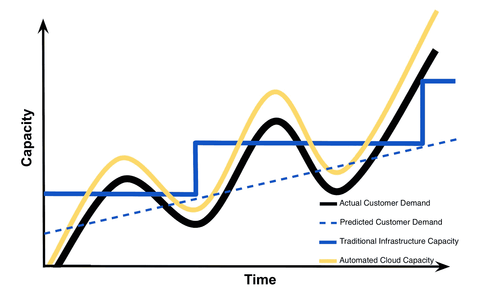
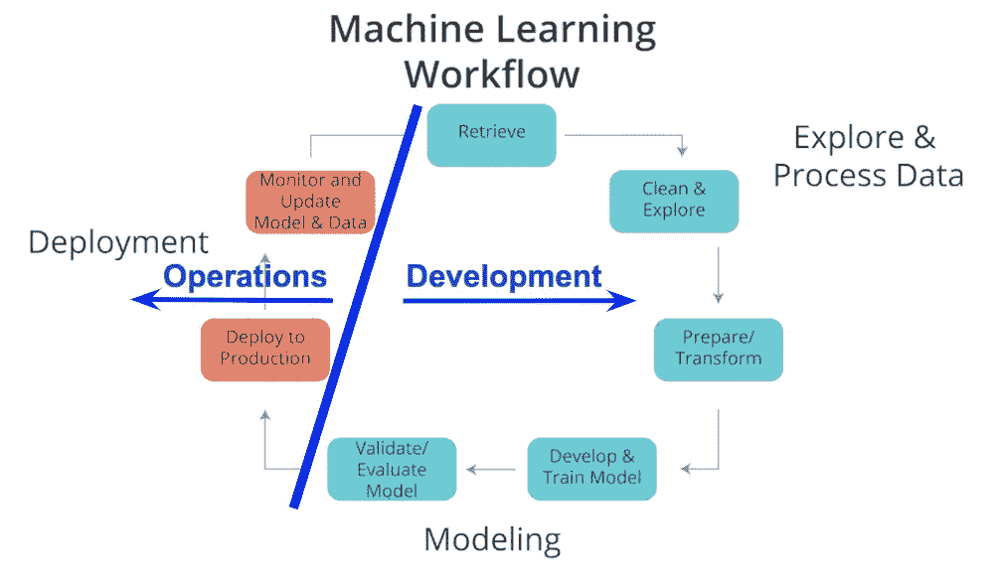
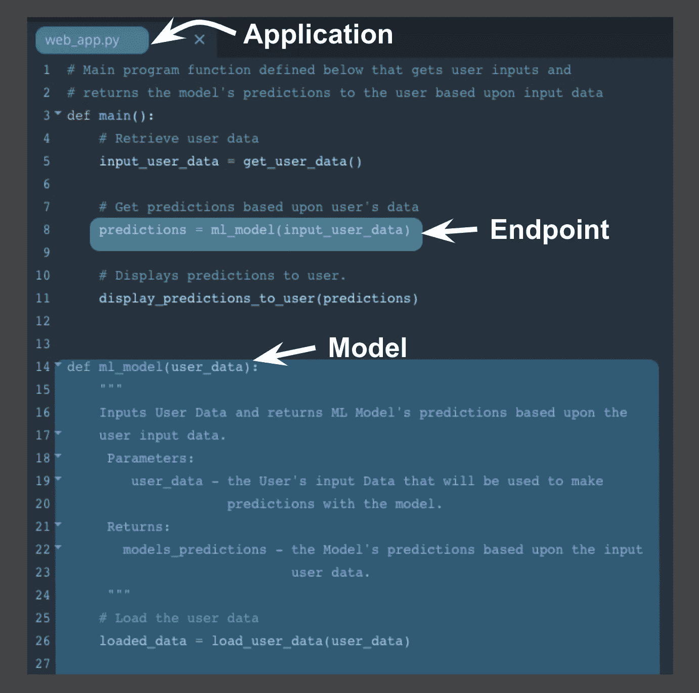
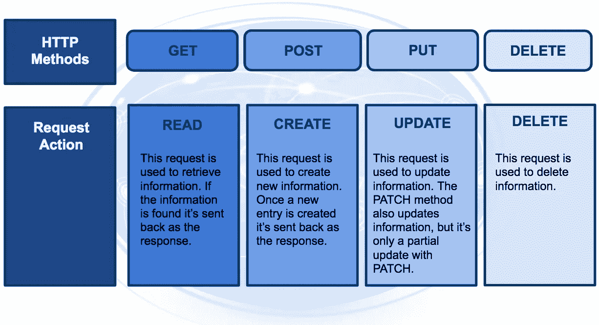
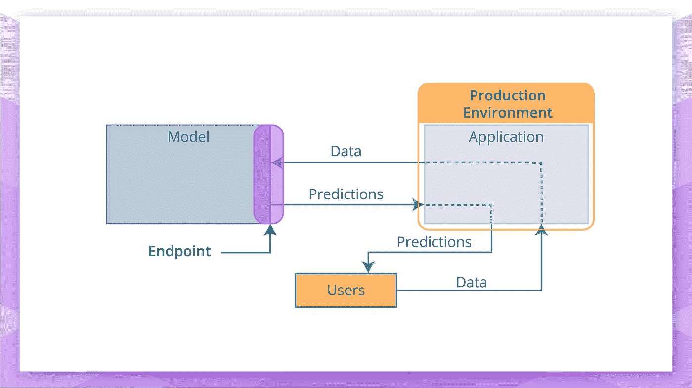
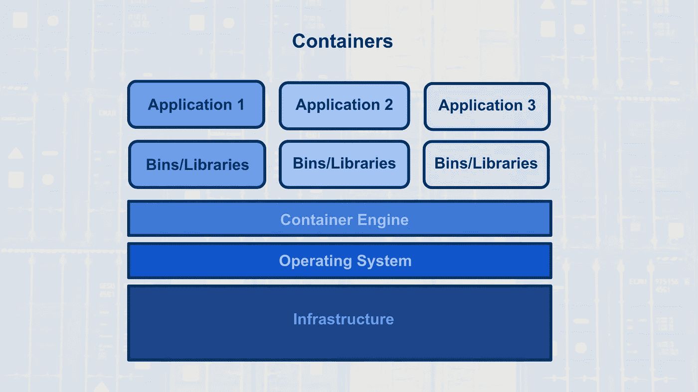
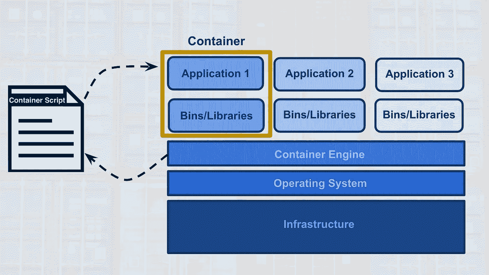
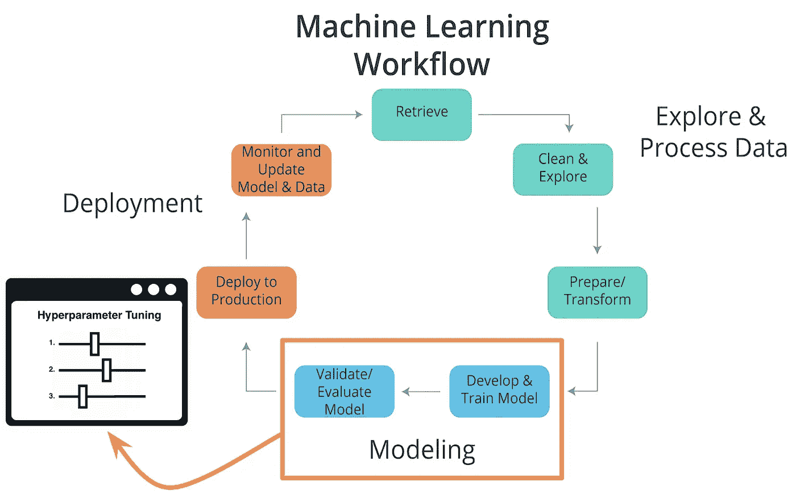
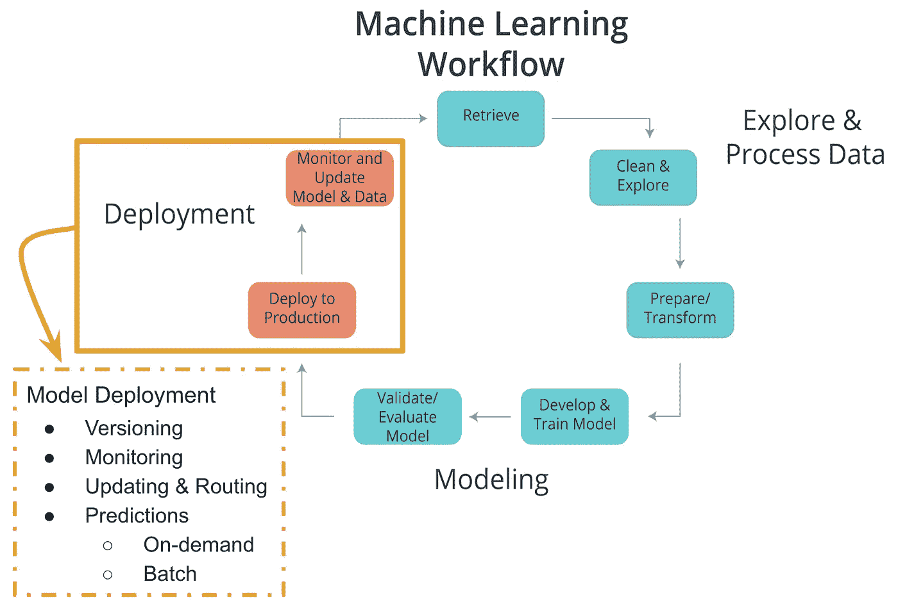

# PyTorch 深度学习纳米学位:部署模型

> 原文：<https://medium.datadriveninvestor.com/pytorch-deep-learning-nanodegree-deploying-a-model-b2a7f0ac0685?source=collection_archive---------1----------------------->

纳米度的第六部分:在 SageMaker 上部署

[简介](https://medium.com/@artgor/pytorch-deep-learning-nanodegree-introduction-161817c22384?source=post_page---------------------------)

[神经网络](https://medium.com/@artgor/pytorch-deep-learning-nanodegree-neural-nerworks-cf44a852be59?source=post_page---------------------------)

[卷积神经网络](https://medium.com/datadriveninvestor/pytorch-deep-learning-nano-degree-convolutional-neural-networks-b92ee1969bb7)

[递归神经网络](https://medium.com/@artgor/pytorch-deep-learning-nanodegree-recurrent-neural-networks-894fce63469b)

[生成性对抗网络](https://medium.com/@artgor/pytorch-deep-learning-nanodegree-generative-adversarial-networks-bc37e2b50a81)

*部署模型*

[这趟旅程的终点](https://medium.com/@artgor/pytorch-deep-learning-nanodegree-the-end-of-this-journey-5c1d6eeb0026)

# 一般

在本课中，我们将学习模型部署。Nanodegree 的这一部分主要是关于在亚马逊的 SageMaker 上部署模型。我认为这太具体了，有足够多的教程来做这件事，所以我把重点放在关于部署本身的信息上。

## 部署简介

[欢迎光临！](https://www.youtube.com/watch?v=jQ2IZzga8Nw)

[问题介绍](https://www.youtube.com/watch?v=-ZtVV7RvGYY)

[机器学习工作流程](https://www.youtube.com/watch?v=ku_96X6TZas)

云计算可以简单地认为是将信息技术(IT)产品转变为服务。以我们的度假照片为例，我们将照片存储在一个 IT 产品——闪存盘上；使用一种服务来存储它们，比如 Google Drive。

使用云存储服务的好处是可以更容易地访问和共享您的度假照片，因为您不再需要闪存驱动器。你只需要一台连接互联网的设备就可以访问你的照片，并允许其他人访问你的照片。

一般来说，把云计算想象成使用一个连接互联网的设备登录到一个云计算服务，比如 Google Drive，来访问一个 IT 资源，你的假期照片。这些 IT 资源，你的度假照片，都存储在云提供商的数据中心。除了云存储，其他云服务还包括:云应用、数据库、虚拟机，以及其他类似 SageMaker 的服务。

大多数与选择云计算服务有关的因素，而不是开发内部 IT 资源，都与时间和成本有关。下面的容量利用率图显示了在满足客户需求方面，云计算与传统基础架构(内部 IT 资源)的对比。

**好处**

1.  减少投资和比例成本(降低成本)
2.  增强的可扩展性(提供简化的容量规划)
3.  提高可用性和可靠性(提供组织灵活性)

**风险**

1.  安全漏洞的(潜在)增加
2.  降低运营治理控制(对云资源)
3.  云提供商之间有限的可移植性
4.  多区域合规和法律问题

[机器学习应用](https://www.youtube.com/watch?v=Q4rgQo6ofoc)

**部署路径**

有三种主要方法用于将模型从机器学习工作流的建模组件转移到部署组件。我们将按照最少使用到最常用的顺序来讨论它们。第三种方法最类似于 Amazon 的 SageMaker 中的部署方法。

**部署途径:**

1.  Python 模型被重新编码到生产环境的编程语言中。
2.  模型用预测模型标记语言(PMML)或可移植格式分析(PFA)编码。
3.  Python 模型被转换成可在生产环境中使用的格式。

**将模型重新编码到生产环境的编程语言中**

第一种方法是将 Python 模型重新编码成生产环境的语言，通常是 Java 或 C++。这种方法已经很少使用了，因为它需要时间来重新编码、测试和验证提供与原始模型相同预测的模型。

**型号在 PMML 或 PFA 中编码**

第二种方法是用预测模型标记语言(PMML)或可移植分析格式(PFA)对模型进行编码，这是两种互补的标准，可以简化将预测模型部署到生产环境中的过程。数据挖掘小组开发了 PMML 和 PFA，为数据挖掘和机器学习使用的某些预测模型提供供应商中立的可执行模型规范。某些分析软件允许直接导入 PMML，包括但不限于 IBM SPSS、R、SAS Base & Enterprise Miner、Apache Spark、Teradata Warehouse Miner 和 TIBCO Spotfire。

**模型被转换成生产环境中使用的格式**

第三种方法是构建一个 Python 模型，**使用**库和方法将模型转换成可以在生产环境中使用的**代码**。具体来说，大多数流行的机器学习软件框架，如 PyTorch、TensorFlow、SciKit-Learn，都有将 Python 模型转换为中间标准格式的方法，如 ONNX ( [开放神经网络交换](https://onnx.ai/)格式)。然后，这种中间标准格式可以**转换**为生产环境的本地软件。

**机器学习工作流和部署**
考虑到机器学习工作流的组件，我们可以看到探索和处理数据是如何与建模紧密耦合的。如果没有为建模过程准备好模型所基于的数据，建模就无法进行。

相比之下，部署与生产环境的耦合更紧密，而不是建模或探索和处理数据。因此，传统上，部署和机器学习工作流的其他组件是分离的。具体看上面的图，流程数据和建模被认为是开发；然而，部署通常被认为是操作。

在过去，开发通常由分析师处理；然而，操作是由负责生产环境的软件开发人员处理的。随着技术的最新发展(容器、端点、API)和最常见的部署途径；开发和运营之间的这种划分变得模糊了。这种划分的软化使分析师能够处理部署的某些方面，并能够更快地更新不稳定的模型。

[生产环境](https://www.youtube.com/watch?v=BH23Me3bbF4)

**端点&REST API**

**生产环境和端点**
当我们讨论生产环境时，端点被定义为模型的接口。这个接口(端点)简化了模型和应用程序之间的通信。具体来说，这个接口(端点)

允许应用程序向模型发送用户数据，并根据用户数据从模型接收预测。

一种考虑充当该接口的端点的方法是考虑一个 Python 程序，其中:

*   端点本身就像一个函数调用
*   函数本身就是模型
*   Python 程序就是应用程序。

**端点和 REST API**
应用和模型之间的通信是通过端点(接口)来完成的，其中端点是一个应用编程接口(API)。

考虑 API 的一个简单方法是一组规则，这些规则使程序，这里是应用程序和模型，能够相互通信。在这种情况下，我们的 API 使用了一个代表性的状态转移 REST 架构，它为程序之间的通信必须遵守的一组规则和约束提供了一个框架。
这个 REST API 使用 HTTP 请求和响应，通过端点(接口)实现应用程序和模型之间的通信。
注意 HTTP 请求和 HTTP 响应都是应用程序和模型之间的通信。
从应用程序发送到模型的 HTTP 请求由四部分组成:

*   端点
    这个端点将采用 URL 的形式，统一资源定位符，也就是通常所说的 web 地址。
*   下面你会发现四个 HTTP 方法，但是为了部署，我们的应用程序将只使用 POST 方法。
*   HTTP Headers
    消息头将包含附加信息，比如消息中的数据格式，这些信息将被传递给接收程序。
*   消息(数据或正文)
    最后一部分是消息(数据或正文)；for deployment 将包含输入模型的用户数据。

从模型发送到应用程序的 HTTP 响应由三部分组成:

*   HTTP 状态代码
    如果模型成功地接收并处理了消息中发送的用户数据，那么状态代码应该以 2 开头，比如 200。
*   HTTP Headers
    消息头将包含附加信息，比如消息中的数据格式，这些信息将被传递给接收程序。
*   Message (Data or Body)
    作为消息中的数据返回的是模型提供的预测。

该预测然后通过应用程序呈现给应用程序用户。端点是使用 REST API 实现应用程序和模型之间通信的接口。

随着我们对 RESTful API 的了解越来越多，我们会意识到这是应用程序的责任:

*   以一种易于放入 HTTP 请求消息并被模型使用的方式格式化用户数据。
*   以应用程序用户易于理解的方式翻译 HTTP 响应消息中的预测。

关于应用程序和模型之间发送的 HTTP 消息中包含的信息，请注意以下几点:

*   通常，用户的数据需要采用 CSV 或 JSON 格式，数据的特定顺序取决于所用的模型。
*   预测通常以 CSV 或 JSON 格式返回，返回预测的特定顺序取决于所用的模型。

**集装箱**

**模型、应用程序和容器**
当我们讨论生产环境时，它由两个主要程序组成，模型和应用程序，它们通过端点(接口)相互通信。

*   该模型只是在机器学习工作流的建模组件中创建、训练和评估的 Python 模型。
*   该应用程序只是一个 web 或软件应用程序，使应用程序用户能够使用模型来检索预测。

模型和应用程序都需要一个计算环境，以便它们可以运行和使用。创建和维护这些计算环境的一种方法是使用容器。

*   具体而言，模型和应用程序都可以在容器计算环境中运行。使用脚本创建容器，该脚本包含关于运行软件应用程序(在我们的情况下是模型或应用程序)需要哪些软件包、库和其他计算属性的指令。

*定义的容器*

*   容器可以被认为是标准化的软件集合/捆绑包，用于运行应用程序的特定目的。

如上所述，容器技术用于创建与机器学习中的部署相关联的模型和应用计算环境。一个常见的容器软件是 Docker。由于其受欢迎程度，Docker 有时被用作容器的同义词。

*集装箱解释*
通常为了首先解释集装箱的概念，人们倾向于使用码头集装箱如何类似于海运集装箱的类比。

*   集装箱可以装各种各样的产品，从食物到电脑到汽车。
*   集装箱的结构为其提供了容纳不同类型产品的能力，同时使得在世界范围内跟踪、装载、卸载和运输集装箱内的产品变得容易。

类似地，Docker 容器可以包含所有类型的不同软件。

*   Docker 容器的结构允许通过一组通用工具来创建、保存、使用和删除容器。
*   通用工具集适用于任何容器，不管该容器包含什么软件。

*容器结构*
下图显示了一个容器的基本结构，你有:

*   底层计算基础设施可以是:云提供商的数据中心、本地数据中心，甚至是某人的本地计算机。
*   接下来，你有一个运行在这个计算基础设施上的操作系统，这可能是你本地计算机上的操作系统。
*   接下来是容器引擎，这可能是在本地计算机上运行的 Docker 软件。容器引擎软件使人能够创建、保存、使用和删除容器；对于我们的例子，它可以是在本地计算机上运行的 Docker。
*   最后两层构成了容器的组成部分。容器的第一层是启动、运行和维护下一层(应用层)所需的库和二进制文件。
*   下图显示了运行三个不同应用程序的三个容器。

这种容器体系结构提供了以下优势:

*   隔离应用程序，这增加了安全性。
*   只需要运行应用程序所需的软件，这样可以更有效地利用计算资源，加快应用程序部署。
*   使应用程序的创建、复制、删除和维护变得更加容易，并且在使用容器部署的所有应用程序中都是一样的。
*   提供了一种更简单、更安全的方法来复制、保存和共享容器。

如使用容器的第四个优点所示，容器脚本文件用于创建容器。

*   这个文本脚本文件可以很容易地与他人共享，并提供了一个简单的方法来复制一个特定的容器。
*   这个容器脚本只是用来创建容器的指令(算法);对于 Docker，这些容器脚本被称为 Docker 文件。

下图显示了这一点，其中容器引擎使用容器脚本来创建容器，以便应用程序在其中运行。这些容器脚本文件可以存储在存储库中，这提供了一种共享和复制容器的简单方法。对于 Docker 来说，Docker Hub 是存储和共享 Docker 文件的官方存储库。下面是一个 docker 文件的例子，它创建了一个安装了 Python 3.6 和 PyTorch 的 docker 容器。

[集装箱—直接来自专家](https://www.youtube.com/watch?v=XimuK3WHOH4)

**造型特点&部署**

**造型特点**

超参数
在机器学习中，超参数是一个其值无法从数据中估计出来的参数。

*   具体来说，超参数不是通过估计器直接学习的；因此，它们的值必须由模型开发人员来设置。
*   这意味着优化的超参数调整是模型训练的重要部分。
*   通常，云平台机器学习服务提供允许自动超参数调整以用于模型训练的方法。

**部署的特点**
*模型版本*
部署的一个特点就是要部署的模型的版本。除了将模型版本作为模型元数据的一部分保存在数据库中之外，部署平台应该允许用户指出已部署模型的版本。这将使维护、监控和更新部署的模型变得更加容易。

*模型监控*
部署的另一个特点是能够轻松监控您部署的模型。一旦部署了一个模型，您将希望确保它继续满足其性能指标；否则，应用程序可能需要更新为性能更好的模型。

*模型更新和路由*
轻松更新部署模型的能力是部署的另一个特点。如果一个已部署的模型不能满足它的性能指标，那么您可能需要更新这个模型。

如果输入预测模型的数据发生了根本性的变化；您需要收集这些输入数据来更新模型。部署平台应该支持将不同比例的用户请求路由到已部署的模型；允许在部署的模型变量之间进行性能比较。

与其他模型变体相比，以这种方式路由允许对模型性能进行测试。

*模型预测*
部署的另一个特征是您部署的模型所提供的预测类型。有两种常见的预测类型:

*   按需预测
*   批量预测

*按需预测*
按需预测也可以称为:在线、实时或同步预测。

对于这些类型的预测，人们期望:对每个预测请求的响应的低等待时间，但是允许请求量的高可变性的可能性。

预测在请求的响应中返回。通常，这些请求和响应是通过 API 使用 JSON 或 XML 格式的字符串来完成的。

来自用户的每个预测请求可以包含一个或多个预测请求。注意，许多是基于作为请求发送的数据的大小而受到限制的。常见的云平台按需预测请求大小限制范围从 1.5(ML 引擎)到 5 兆字节(SageMaker)。

按需预测通常用于根据部署的模型向客户、用户或员工提供实时的在线响应。回想一下我们的 magic eight ball web 应用程序示例，我们的 web 应用程序的用户会发出按需预测请求。

*批量预测*
批量预测也可以称为:异步，或基于批量的预测。

有了这些类型的预测，我们可以预期:大量的请求和更多的定期提交，因此延迟不会成为问题。

每个批处理请求将指向特定格式的请求数据文件，并将预测返回到文件中。云服务要求这些文件将存储在云提供商的云中。

云服务通常对每个批处理请求可以处理的数据量有限制，这是基于它们对您可以存储在其云存储服务中的文件大小的限制。例如，亚马逊的 SageMaker 将批量预测请求限制在他们在 S3 存储服务中对一个对象实施的大小限制内。

批量预测通常用于帮助做出商业决策。例如，假设一家企业使用一个复杂的模型来预测客户对其多种产品的满意度，并且他们需要这些估计值来编写一份周报。这需要每周通过批量预测请求来处理客户数据。

[闭幕词](https://www.youtube.com/watch?v=fXl_MCYzcOU)

这是 Pytorch 深度学习纳米学位的最后一部分。我们学到了很多关于云计算、模型部署和亚马逊 SageMaker 的东西。

这门课程提供了很多理论知识，但实践往往更具挑战性。你可以在这里阅读模型部署的真实用例:[https://Neptune . ai/blog/model-deployment-challenges-lessons-from-ml-engineers](https://neptune.ai/blog/model-deployment-challenges-lessons-from-ml-engineers)

下一篇博文将包括我的感谢，我对纳米学位的看法，Udacity 提供的一些职业建议和其他一些东西。