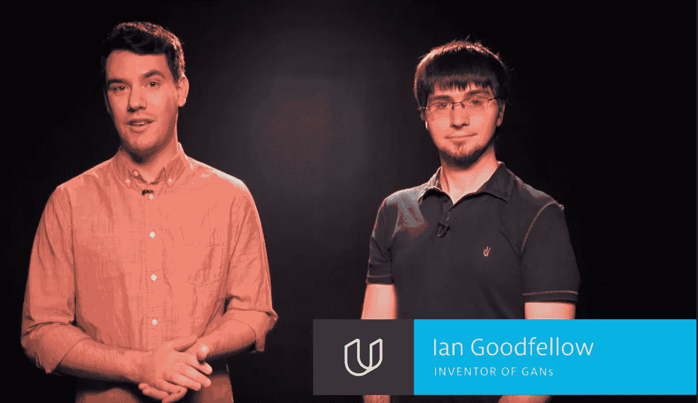
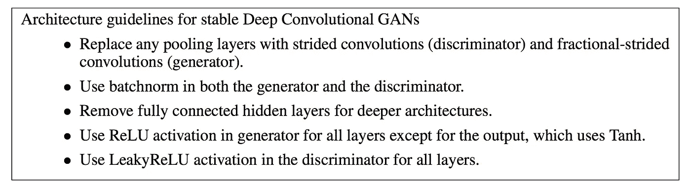
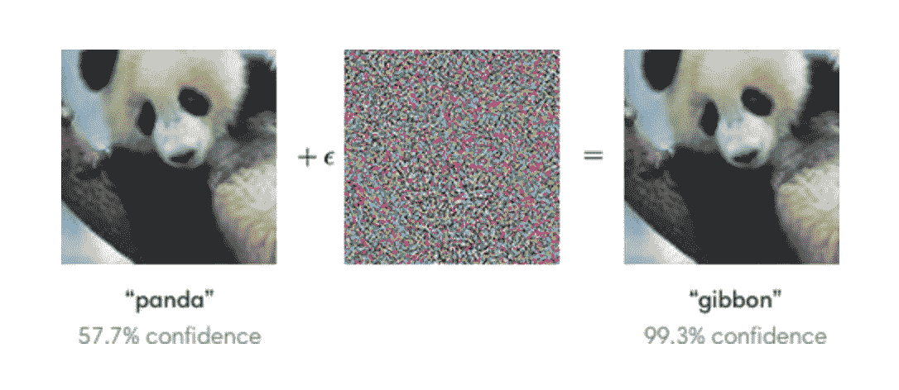
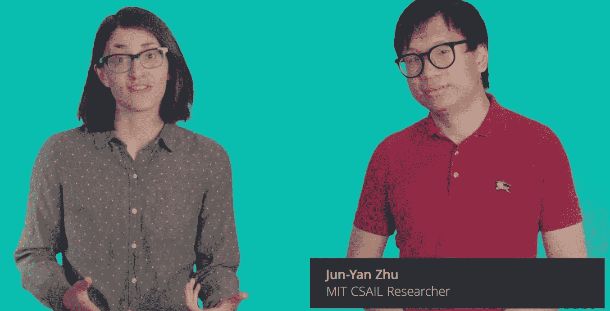
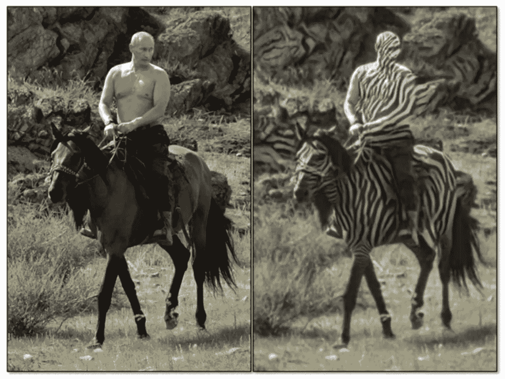
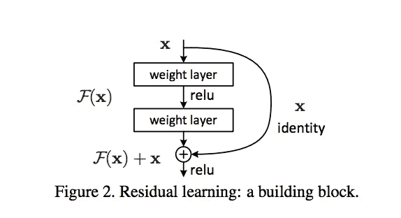
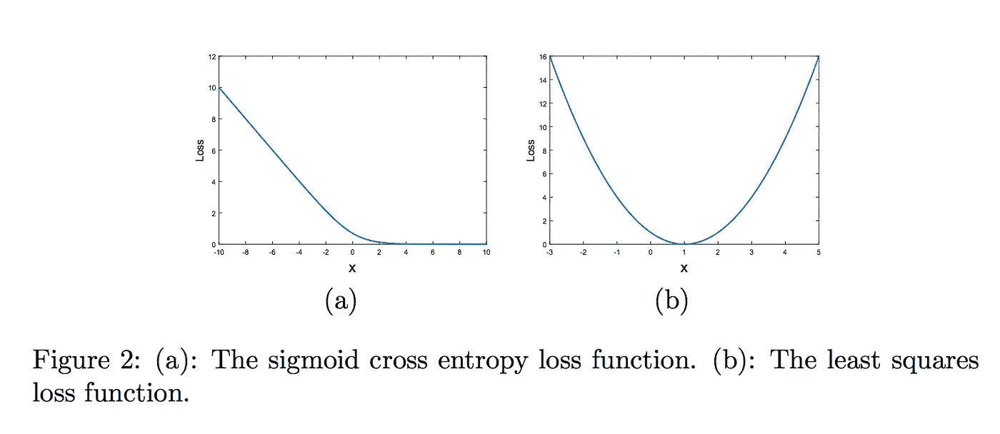
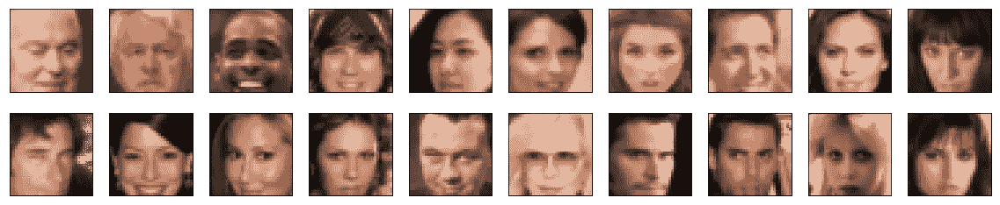
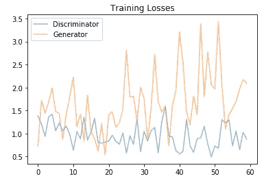
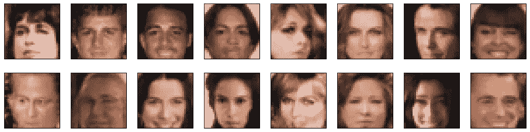

# PyTorch 深度学习纳米学位:生成性对抗网络

> 原文：<https://medium.datadriveninvestor.com/pytorch-deep-learning-nanodegree-generative-adversarial-networks-bc37e2b50a81?source=collection_archive---------0----------------------->

纳米尺度的第五部分:GAN

[简介](https://medium.com/@artgor/pytorch-deep-learning-nanodegree-introduction-161817c22384?source=post_page---------------------------)

[神经网络](https://medium.com/@artgor/pytorch-deep-learning-nanodegree-neural-nerworks-cf44a852be59?source=post_page---------------------------)

[卷积神经网络](https://medium.com/datadriveninvestor/pytorch-deep-learning-nano-degree-convolutional-neural-networks-b92ee1969bb7)

[递归神经网络](https://medium.com/@artgor/pytorch-deep-learning-nanodegree-recurrent-neural-networks-894fce63469b)

*生成性对抗网络*

[部署模型](https://medium.com/@artgor/pytorch-deep-learning-nanodegree-deploying-a-model-b2a7f0ac0685)

[这趟旅程的终点](https://medium.com/@artgor/pytorch-deep-learning-nanodegree-the-end-of-this-journey-5c1d6eeb0026)

# 一般

在这节课中，我们将学习各种类型的 GANs 以及如何实现它们。此外，我们将致力于第四个项目——生成人脸。

## 生成对抗网络



关于 GANs 的第一课由发明了 GANs 的 Ian Goodfellow 主讲！见到他真令人兴奋！

[介绍伊恩·古德菲勒](https://www.youtube.com/watch?v=0mlT7c_xAoc)


在接下来的课程中，他被描述成一个卡通人物！

[气体传感器的应用](https://www.youtube.com/watch?v=dW2puRa-yqo)

[GANs 如何工作](https://www.youtube.com/watch?v=MF0QCP1OC9I)

游戏和均衡

[训练 GANs 的技巧](https://www.youtube.com/watch?v=S9WDdySwcHc)

[生成假图像](https://www.youtube.com/watch?v=7KI4yITZLBk)

[甘](https://www.youtube.com/watch?v=g2CDYdc18Jg)

[甘笔记本&数据](https://www.youtube.com/watch?v=z7WnnnYyFo4)

[完整模型](https://www.youtube.com/watch?v=_6i1LjuPddg)

[发生器&鉴别器](https://www.youtube.com/watch?v=luR_wKhtIG8)

[超参数](https://www.youtube.com/watch?v=u8ntGzeK9Lw)

[真假损失](https://www.youtube.com/watch?v=andSglxiuik)

[优化策略，解决方案](https://www.youtube.com/watch?v=m5_f084E09A)

[训练两个网络](https://www.youtube.com/watch?v=pPdyFMnxNkA)

[培训解决方案](https://www.youtube.com/watch?v=uRNfacJ90bI)

Mnist GAN 笔记本在这里有:[https://github . com/uda city/deep-learning-v2-py torch/tree/master/GAN-mnist](https://github.com/udacity/deep-learning-v2-pytorch/tree/master/gan-mnist)

## 深度卷积 GANs

第二课是关于 DCGANs，包括一些额外的主题。

[深度卷积 GANs](https://www.youtube.com/watch?v=s_ZdpYxPayM)

[DCGAN，鉴别器](https://www.youtube.com/watch?v=5qVHECEB6H0)



[DCGAN 发生器](https://www.youtube.com/watch?v=2Nhg5VxbAdo)

**什么是批量规范化？**

Sergey Ioffe 和 Christian Szegedy 在 2015 年的论文[中介绍了批处理规范化:通过减少内部协变量转移](https://arxiv.org/pdf/1502.03167.pdf)来加速深度网络训练。这个想法是，我们不只是将网络的输入标准化，而是将网络中每一层*的输入标准化。*

它被称为“批处理”归一化，因为在训练期间，我们通过使用当前批处理中的值的平均值和标准偏差(或方差)来归一化每一层的输入。这些有时被称为批量统计。

除了直观的原因之外，还有很好的数学原因来激励批处理规范化。它有助于对抗作者所谓的内部协变量转移。

在这种情况下，内部协变量移位指的是不同层的输入分布的变化。事实证明，当每一层的输入分布相似时，训练网络的效率最高！

**批量规范化的好处**

批量归一化优化网络训练。已经证明它有几个好处:

1.  **网络训练更快**——由于额外的计算，每次训练*迭代*实际上会更慢，然而，它应该收敛得更快，因此训练总体上应该更快。
2.  **允许更高的学习速率** —梯度下降通常需要较小的学习速率来使网络收敛。使用批量标准化允许我们使用更高的学习率，这进一步提高了网络训练的速度。
3.  **使权重更容易初始化** —批量标准化似乎允许我们在选择初始权重时不那么小心。
4.  **使更多的激活功能变得可行**——一些激活功能在某些情况下效果不佳。Sigmoids 很快就会失去梯度，这意味着它们不能用于深层网络。ReLUs 经常在训练中消失，在那里他们完全停止学习，所以我们需要小心输入他们的值的范围。因为批量标准化调节进入每个激活函数的值，在深度网络中似乎不太好工作的非线性实际上又变得可行了。
5.  **简化更深层次网络的创建** —由于上面列出的前 4 项，当使用批量标准化时，更容易建立和更快地训练更深层次的神经网络。
6.  **提供一点规范化** —批量规范化会给你的网络增加一点噪音。在某些情况下，比如在初始模块中，批处理规范化已经被证明和删除一样有效。但是一般来说，将批量规范化视为一种额外的规范化，可能允许您减少一些可能添加到网络中的丢失。
7.  **总体上可能给出更好的结果** —一些测试似乎显示批量标准化实际上改善了训练结果。然而，它确实是一种帮助更快训练的优化，所以你不应该认为它是一种让你的网络变得更好的方法。

批量规格化笔记本在这里有:[https://github . com/uda city/deep-learning-v2-py torch/tree/master/batch-norm](https://github.com/udacity/deep-learning-v2-pytorch/tree/master/batch-norm)

[DCGAN 笔记本&数据](https://www.youtube.com/watch?v=4_OnTTDSFPo)

DCGAN 笔记本在这里有:[https://github . com/uda city/deep-learning-v2-py torch/tree/master/gan-mnist](https://github.com/udacity/deep-learning-v2-pytorch/tree/master/dcgan-svhn)

[缩放，解决方案](https://www.youtube.com/watch?v=Aqru1dIMLzU)

[鉴别器](https://www.youtube.com/watch?v=bBE-f30JT5I)

[鉴别器，溶液](https://www.youtube.com/watch?v=D3E0BDwb2pY)

[发电机](https://www.youtube.com/watch?v=zRajfkO-J7s)

[发电机，解决](https://www.youtube.com/watch?v=cznaE5TlKEo)

[优化策略](https://www.youtube.com/watch?v=US0HjU0alv4)

[优化方案&样本](https://www.youtube.com/watch?v=mJyeXSClnmw)

GANs 不仅用于图像生成，还用于发现现有的已训练模型中的弱点。生成器学习制作的对抗性例子可以被设计成*欺骗*一个预先训练好的模型。本质上，图像中的小扰动会导致分类器(如 AlexNet 或一个已知的图像分类器)非常惊人地失败！

> [*这篇 OpenAI 的博文*](https://blog.openai.com/adversarial-example-research/) *详细介绍了如何利用对抗性的例子来“攻击”现有的模型，并讨论了潜在的安全问题。下面可以看到导致错误分类的扰动的一个例子。*



**GANs 的其他应用**

**半监督学习**

[https://www.youtube.com/watch?v=_LRpHPxZaX0](https://www.youtube.com/watch?v=_LRpHPxZaX0)

[https://github.com/Sleepychord/ImprovedGAN-pytorch](https://github.com/Sleepychord/ImprovedGAN-pytorch)

**域不变性**

考虑[这个汽车分类例子](https://arxiv.org/abs/1709.02480)。从抽象上看，研究人员(Timnit Gebru 等。艾尔)想:

> *开发一个计算机视觉管道，通过单一来源的公开可视数据来预测收入、人均碳排放量、犯罪率和其他城市属性。我们首先在美国 200 个最大城市的 5000 万张图像中检测汽车，并使用检测到的汽车训练一个模型来预测人口统计属性。为了促进我们的工作，我们收集了迄今为止报道的最大和最具挑战性的细粒度数据集，包括超过 2600 类汽车，由来自谷歌街景和其他网络来源的图像组成，由汽车专家分类，以解释即使是最细微的视觉差异。*

值得注意的一件有趣的事情是，这些研究人员从其他来源获得了一些手动标记的街景数据*和*数据。我们称这些图像源为域。所以街景是一个领域和另一个来源，比如说 cars.com 是独立的领域。

然后，研究人员必须找到一种方法来结合他们从这些多种来源学到的东西！他们通过使用多分类器做到了这一点；不做*不做*的敌对网络包括一个生成器，只有两个分类器。

*   一个分类器正在学习识别汽车类型
*   另一个是学习分类一张汽车图片是来自谷歌街景【cars.com】还是*给定从图片中提取的特征*

因此，第一分类器的工作是正确地对汽车图像进行分类*和*到**欺骗第二分类器**，使得第二分类器不能辨别提取的图像特征是否指示来自街景或 cars.com 域的图像！

其思想是:如果第二个分类器不能辨别特征来自哪个域，那么这表明这些特征在两个域之间是共享的，并且您已经找到了**域不变的**特征。

领域不变性可以应用于许多应用程序，在这些应用程序中，您希望找到在两个不同领域之间不变的特征。这些域可以是图像域，也可以是基于不同人口统计数据的域等等。这有时也被称为[对抗性特征学习](https://arxiv.org/pdf/1705.11122.pdf)。

**伦理和艺术应用:进一步阅读**

*   甘的伦理含义以及“假”图像何时能给我们关于现实的信息。
*   [巴黎世家的机器人会做梦吗？](https://www.ssense.com/en-us/editorial/fashion/do-androids-dream-of-balenciaga-ss29)请注意，作者简要地谈到了具有艺术潜力而非伦理含义的生成模型，但这两者是相辅相成的。在这种情况下，发生器将再现它在时装秀上看到的东西；典型的又瘦又白的身材，不代表世界上人的多样性(甚至不代表买巴黎世家的人的多样性)。

## Pix2Pix 和 CycleGan

在这一课的讲师是朱俊彦谁是 CycleGAN 的创造者之一。



[介绍朱俊彦](https://www.youtube.com/watch?v=l8sCN1rMt6E)

图像到图像的翻译

[设计损失函数](https://www.youtube.com/watch?v=YL1kKWHr7Gc)

[甘斯，扼要重述](https://www.youtube.com/watch?v=MEKTiR1Xkjg)

[Pix2Pix 发生器](https://www.youtube.com/watch?v=94Kml3ekrUI)

[Pix2Pix 鉴别器](https://www.youtube.com/watch?v=3Khqf7WtCxY)

[周期信号&不成对数据](https://www.youtube.com/watch?v=-fbaRaXDqMY)

[循环一致性丧失](https://www.youtube.com/watch?v=pPbWXmVgY0k)

[为什么会这样？](https://www.youtube.com/watch?v=q7SP89u02L0)

**模型缺点**

与任何新配方一样，重要的是不仅要了解它的优点和能力，还要了解它的缺点。CycleGAN 有几个缺点:

*   即使有多个可能的输出，它也只会显示一个版本的转换输出。
*   一个简单的 CycleGAN 产生低分辨率图像，尽管有一些关于高分辨率 GAN 的研究
*   偶尔会失败！(一个这样的案例如下图所示。)



[超越周期](https://www.youtube.com/watch?v=jwbloZnZcv0)

## 实现一个循环

本课的笔记本可在此处获得:[https://github . com/uda city/deep-learning-v2-py torch/tree/master/cycle-gan](https://github.com/udacity/deep-learning-v2-pytorch/tree/master/cycle-gan)

[CycleGAN 笔记本&数据](https://www.youtube.com/watch?v=pVBu1aL8evA)

[DC 鉴别器](https://www.youtube.com/watch?v=93kh2l6C7Bw)

[DC 鉴别器，解决方案](https://www.youtube.com/watch?v=XaxOFzOpves)

[发电机&剩余块](https://www.youtube.com/watch?v=AYIq7cUjLMs)



更一般地，可以在*几个*层之间进行跳跃连接，以组合例如*更早的*层和更晚的层的输入。这些连接在图像分割任务中表现得尤为重要，在这些任务中，您需要随着时间的推移保留空间信息(即使您的输入已经通过了交错卷积层或池层)。一个这样的例子，是在[这篇论文](https://arxiv.org/abs/1608.04117)中关于跳过连接及其在医学图像分割中的作用。

[循环发电机组](https://www.youtube.com/watch?v=StfeBXCuaOI)

[闭锁&发电机，解](https://www.youtube.com/watch?v=IPKbiwLIcvA)

[对抗性&周期一致性损失](https://www.youtube.com/watch?v=-OO9pb8EyJI)

伊斯甘斯

最小二乘法可以部分解决训练深 GANs 的消失梯度问题。问题如下:对于负对数似然损失，当输入 x 相当大时，梯度可能接近零，并且对于训练目的变得没有意义。然而，对于平方损失项，梯度实际上会随着 x 的增大而增大，如下所示。



最小平方损耗只是 GAN 损耗的一种变体。还有更多的变种，如 [Wasserstein GAN loss](https://arxiv.org/abs/1701.07875) 等。这些损失变量有时可以帮助稳定训练并产生更好的结果。当您编写自己的代码时，我们鼓励您进行假设，尝试不同的损失函数，看看哪一个最适合您的情况！

[损失&优化，解决](https://www.youtube.com/watch?v=0H86-nQ3qSE)

[训练练习](https://www.youtube.com/watch?v=F5_tK9lo9y0)

[训练方案&生成样本](https://www.youtube.com/watch?v=Cl3oSLG9dpA)

## 项目:生成面

在这个项目中，我们的任务是使用名为 CelebA 的人脸数据集，并生成新的人脸。

在笔记本中，我们将面的大小调整为 32x32，它们看起来是这样的:



不太好，但这仍然是一个很好的练习。

我们将使用具有`tanh`激活功能的 GANs，因此第一步是重新调整图像的值:

```
def scale(x, feature_range=(-1, 1)):
    ''' Scale takes in an image x and returns that image, scaled
       with a feature_range of pixel values from -1 to 1\. 
       This function assumes that the input x is already scaled from 0-1.'''
    # assume x is scaled to (0, 1)
    # scale to feature_range and return scaled x
    low, high = feature_range
    x = x * (high - low) + low

    return x
```

为了使编写 net 架构更容易，我们有了这个助手函数:

```
def conv(in_channels, out_channels, kernel_size, stride=2, padding=1, batch_norm=True):
    """Creates a convolutional layer, with optional batch normalization.
    """
    layers = []
    conv_layer = nn.Conv2d(in_channels, out_channels, 
                           kernel_size, stride, padding, bias=False)
        layers.append(conv_layer)if batch_norm:
        layers.append(nn.BatchNorm2d(out_channels))
    return nn.Sequential(*layers)
```

允许轻松添加卷积和批量归一化层。以及用于升级的类似功能:

```
def deconv(in_channels, out_channels, kernel_size, stride=2, padding=1, batch_norm=True):
    """Creates a transposed-convolutional layer, with optional batch normalization.
    """
    # create a sequence of transpose + optional batch norm layers
    layers = []
    transpose_conv_layer = nn.ConvTranspose2d(in_channels, out_channels, kernel_size, stride, padding, bias=False)
    layers.append(transpose_conv_layer)
    if batch_norm:
        # append batchnorm layer
        layers.append(nn.BatchNorm2d(out_channels))

    return nn.Sequential(*layers)
```

经过几次尝试，我决定使用以下鉴别器:

```
class Discriminator(nn.Module): def __init__(self, conv_dim=32):
        super(Discriminator, self).__init__()# complete init function
        self.conv_dim = conv_dim# 32x32 input
        self.conv1 = conv(3, conv_dim, 4, batch_norm=False) # first layer, no batch_norm
        # 16x16 out
        self.conv2 = conv(conv_dim, conv_dim*2, 4)
        # 8x8 out
        self.conv3 = conv(conv_dim*2, conv_dim*4, 4)
        # 4x4 out
        self.conv4 = conv(conv_dim*4, conv_dim*8, 4)
        self.conv5 = conv(conv_dim*8, conv_dim*16, 2, 1, 0)

        # final, fully-connected layer
        self.fc = nn.Linear(conv_dim*4*4, 1)
        self.drop = nn.Dropout(0.1)def forward(self, x):
        # all hidden layers + leaky relu activation
        out = F.leaky_relu(self.conv1(x), 0.2)
        out = F.leaky_relu(self.conv2(out), 0.2)
        out = F.leaky_relu(self.conv3(out), 0.2)
        out = F.leaky_relu(self.conv4(out), 0.2)
        out = F.leaky_relu(self.conv5(out), 0.2)

        # flatten
        out = out.view(x.shape[0], self.conv_dim*4*4)

        # final output layer
        out = self.fc(self.drop(out))
        return out
```

这是我的发电机:

```
class Generator(nn.Module):

    def __init__(self, z_size, conv_dim=32):
        super(Generator, self).__init__()# complete init function

        self.conv_dim = conv_dim

        # first, fully-connected layer
        self.fc = nn.Linear(z_size, conv_dim*4*4*10)# transpose conv layers
        self.t_conv1 = deconv(self.conv_dim*10, conv_dim*8, 4, stride=1, padding=0)
        self.t_conv2 = deconv(conv_dim*8, conv_dim*4, 4)
        self.t_conv3 = deconv(conv_dim*4, conv_dim*2, 4)
        self.t_conv4 = deconv(conv_dim*2, conv_dim, 4, stride=1, padding=0)
        self.t_conv5 = deconv(conv_dim, 3, 4, batch_norm=False, stride=1, padding=1)
        self.drop = nn.Dropout(0.1)def forward(self, x):
        # print(x.shape)
        bs = x.shape[0]
        # fully-connected + reshape 
        out = self.fc(x)
        # print(out.shape)
        out = out.view(bs, self.conv_dim*10, 4, 4) # (batch_size, depth, 4, 4)

        # hidden transpose conv layers + relu
        out = F.leaky_relu(self.t_conv1(out), 0.19)
        out = F.leaky_relu(self.t_conv2(out), 0.18)
        out = F.leaky_relu(self.t_conv3(out), 0.17)
        out = F.leaky_relu(self.t_conv4(out), 0.16)

        # last layer + tanh activation
        out = self.t_conv5(out)
        out = F.tanh(out)

        return out
```

训练花了很多时间，有时候网根本不收敛，有时候停得太早。这是一个在一次训练中训练损失的例子。



这些是我最终能够生成的图像。



我们可以看到一些图像失真或不清晰。还有一些和训练数据太相似了。以下是一些改善结果的方法:

*   最明显的想法是使用更多样化的数据进行训练。我们可以尝试使用不同年龄、不同种族的人的图像。此外，简单地增加训练数据量可能会有所帮助；
*   目前，我们使用一个网络进行训练，这个网络不是很深。我们可以借鉴著名的 GAN 架构；
*   损耗对网的质量非常重要。我们可以试着用其他的损失。其中一个先进的理念是先训练一个损耗，然后再换一个损耗。此外，我们可以尝试使用一个时间表来逐渐降低(或改变)学习速度。

这是深度学习纳米学位的第四部分。我们学习了如何编写 GANs 的各种架构，研究了它们的应用，聆听了令人惊叹的人们。下一部分将是关于部署 AWS Sagemaker 的模型！